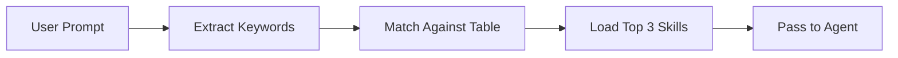

# Agent Reference

## Agent Catalog

### Implementation Agents

| Agent | Model | Description | Key Tools |
|-------|-------|-------------|-----------|
| **builder** | opus | Executes roadmap steps, writes clean functional code | Read, Glob, Grep, Edit, Write, Bash |
| **refactor-agent** | sonnet | Improves code structure while preserving behavior | Read, Glob, Grep, LSP, Edit, Write, Bash |

### Planning Agents

| Agent | Model | Description | Key Tools |
|-------|-------|-------------|-----------|
| **planner** | opus | Generates execution roadmaps with task-agent-skill assignments | Read, Glob, Grep, WebSearch, WebFetch |
| **architect** | opus | Designs features, creates detailed implementation plans | Read, Grep, Glob, Task(scout), Task(builder), LSP |
| **task-decomposer** | opus | Breaks complex tasks into optimal subtasks with dependencies | Read, Grep, Glob |

### Validation Agents

| Agent | Model | Description | Key Tools |
|-------|-------|-------------|-----------|
| **reviewer** | sonnet | Validates implementations for quality, security, correctness | Read, Grep, Glob, Bash |
| **code-quality** | opus | Detects code smells, SOLID violations, maintainability issues | Read, Glob, Grep, LSP, Bash |
| **security-auditor** | opus | OWASP Top 10, vulnerability detection, secrets scanning | Read, Grep, Glob, LSP |
| **test-watcher** | sonnet | Monitors test coverage, identifies missing tests | Read, Grep, Glob, Bash |

### Exploration Agents

| Agent | Model | Description | Key Tools |
|-------|-------|-------------|-----------|
| **scout** | sonnet | Read-only exploration, finds files, searches code, gathers context | Read, Grep, Glob, WebFetch, WebSearch |
| **command-loader** | sonnet | Loads commands and skills, expands @file references | Read, Glob, Bash |

### Analysis Agents

| Agent | Model | Description | Key Tools |
|-------|-------|-------------|-----------|
| **error-analyzer** | -- | Diagnoses failures, recommends recovery strategies (never implements fixes) | Read, Glob, Grep |
| **bug-documenter** | sonnet | Documents bugs, root causes, solutions in knowledge base | Read, Write, Grep, Edit |

### Operations Agents

| Agent | Model | Description | Key Tools |
|-------|-------|-------------|-----------|
| **merge-resolver** | sonnet | Resolves git merge conflicts intelligently | Bash, Read, Edit |
| **knowledge-sync** | sonnet | Keeps documentation in sync with actual code | Read, Write, Grep, Glob |

## Agent Permission Modes

| Mode | Meaning | Agents |
|------|---------|--------|
| **acceptEdits** | Can modify files with user approval | builder, refactor-agent, merge-resolver, knowledge-sync, bug-documenter |
| **plan** | Read-only analysis + recommendations | planner, architect, reviewer, code-quality, security-auditor, error-analyzer, task-decomposer |
| **default** | Standard permissions | scout, test-watcher |

## Agent Delegation

Agents are invoked by the Lead Orchestrator via `Task()`.

```
Task(subagent_type="builder", prompt="implement X")
Task(subagent_type="reviewer", prompt="review changes in Y")
Task(subagent_type="scout", prompt="find files related to Z")
```

### Parallelization Rules

| Parallel (same message) | Sequential (wait for result) |
|--------------------------|-------------------------------|
| scout + builder on different files | builder that needs scout output |
| 2+ builders on independent files | builder after planner |
| 2+ reviewers on independent modules | reviewer after builder on same file |
| planner + scout for context | any Task with data dependency |

## Skills Catalog

Skills are auto-loaded by keyword matching before delegation (max 3 per task).

### By Category

| Category | Skills | Trigger Keywords |
|----------|--------|-----------------|
| **Security** | security-review, anti-hallucination | auth, jwt, password, token, session |
| **Data** | database-patterns, config-validator | database, sql, drizzle, migration, config, env |
| **Testing** | testing-strategy | test, mock, tdd, coverage, unit |
| **API** | api-design, websocket-patterns | api, endpoint, route, rest, websocket, streaming |
| **TypeScript** | typescript-patterns, code-style-enforcer | typescript, async, promise, generic, interface |
| **Operations** | bun-best-practices, logging-strategy, retry-patterns, recovery-strategies | log, logging, error, retry, circuit, fallback |
| **Refactoring** | refactoring-patterns, code-quality | refactor, extract, SOLID, clean, simplify |
| **Meta** | prompt-engineer, expert-patterns, diagnostic-patterns | best practice, pattern, expert, compare |
| **Tooling** | create-agent, create-skill, lsp-operations, sync-claude, performance-review, playwright-browser | (manual load) |

### Skill Loading



## Routing Rules

### Prompt Scoring (5 Criteria)

| Criterion | 20 pts | 10 pts | 0 pts |
|-----------|--------|--------|-------|
| Clarity | Action verb + specific target | Generic verb | Vague |
| Context | Paths + tech + versions | Tech mentioned | No context |
| Structure | Organized, bullets/headers | Clear paragraphs | Wall of text |
| Success | Metrics (<100ms, >90%) | "better", "faster" | No criteria |
| Actionable | No open questions | 1-2 clarifications | Too vague |

Score < 70 triggers `prompt-engineer` skill for improvement.

### Complexity Routing

| Score | Routing |
|-------|---------|
| < 30 | builder direct |
| 30-60 | planner optional |
| > 60 | planner mandatory |
