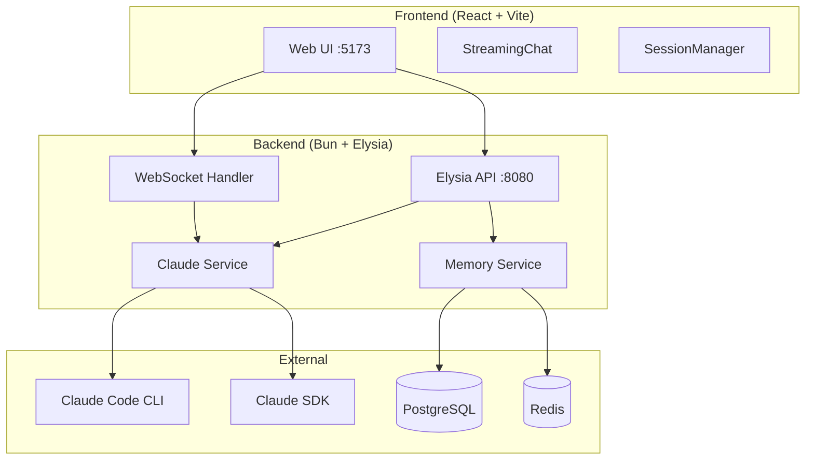
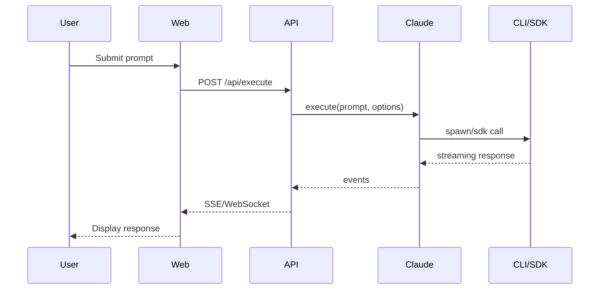

# Architecture

## Overview

Claude Code Poneglyph es un UI wrapper para Claude Code CLI con soporte para SDK y CLI spawn modes.

## System Diagram



## Components

### Frontend

| Componente | Responsabilidad |
|------------|-----------------|
| StreamingChat | UI de chat con streaming |
| SessionManager | Gestión de sesiones |
| AgentSelector | Selección de agentes |

### Backend

| Componente | Responsabilidad |
|------------|-----------------|
| Claude Service | Ejecutar Claude Code (SDK/CLI) |
| Memory Service | Búsqueda semántica en memoria |
| Session Store | Persistencia de sesiones |
| WebSocket Handler | Streaming en tiempo real |

## Data Flow

### Execute Request



## Directory Structure

```
claude-code-ui/
├── server/src/
│   ├── routes/       # Elysia routes
│   ├── services/     # Business logic
│   ├── config/       # Configuration
│   └── index.ts      # Entry point
├── web/src/
│   ├── components/   # React components
│   ├── hooks/        # Custom hooks
│   ├── stores/       # State management
│   └── main.tsx      # Entry point
└── shared/
    └── types.ts      # Shared types
```

## Key Decisions

| Decisión | Razón |
|----------|-------|
| Bun runtime | Performance, native TypeScript |
| Elysia framework | Type-safe, fast, Bun-native |
| React + Vite | DX, fast HMR |
| SDK + CLI modes | Flexibilidad según caso de uso |
