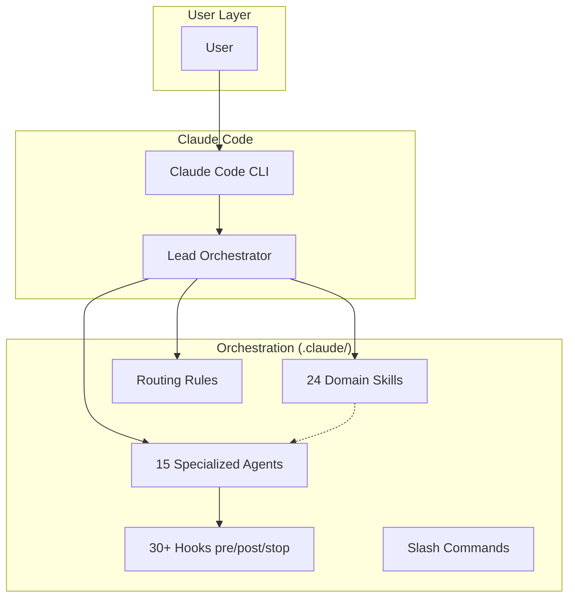
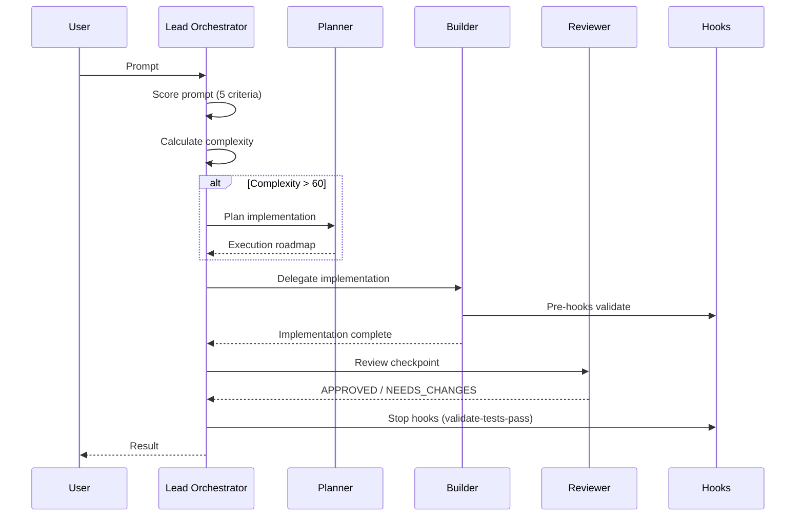

# Architecture

## Overview

Claude Code Poneglyph is a multi-agent orchestration system for Claude Code. It provides specialized agents, domain skills, automated hooks, and routing rules that enhance Claude Code sessions.

## System Diagram


```mermaid
graph TD
    subgraph "User Layer"
        U[User]
    end

    subgraph "Claude Code"
        CC[Claude Code CLI]
        Lead[Lead Orchestrator]
    end

    subgraph "Orchestration (.claude/)"
        direction TB
        Agents[15 Specialized Agents]
        Skills[24 Domain Skills]
        Hooks[30+ Hooks pre/post/stop]
        Rules[Routing Rules]
        Commands[Slash Commands]
    end

    U --> CC
    CC --> Lead
    Lead --> Agents
    Lead --> Skills
    Lead --> Rules
    Agents --> Hooks
    Skills -.-> Agents
```

## Orchestration Flow


```mermaid
sequenceDiagram
    participant U as User
    participant L as Lead Orchestrator
    participant P as Planner
    participant B as Builder
    participant R as Reviewer
    participant H as Hooks

    U->>L: Prompt
    L->>L: Score prompt (5 criteria)
    L->>L: Calculate complexity
    alt Complexity > 60
        L->>P: Plan implementation
        P-->>L: Execution roadmap
    end
    L->>B: Delegate implementation
    B->>H: Pre-hooks validate
    B-->>L: Implementation complete
    L->>R: Review checkpoint
    R-->>L: APPROVED / NEEDS_CHANGES
    L->>H: Stop hooks (validate-tests-pass)
    L-->>U: Result
```

## Components

### Lead Orchestrator

The Lead session acts as a pure orchestrator. It never executes code directly.

| Responsibility | Mechanism |
|----------------|-----------|
| Evaluate prompt quality | Prompt scoring (5 criteria, threshold 70) |
| Route by complexity | Complexity calculator (Low/Med/High) |
| Load domain context | Skill auto-matching by keywords |
| Delegate implementation | Task dispatch to specialized agents |
| Validate results | Reviewer checkpoints + hook validation |
| Handle errors | Error-analyzer diagnosis + retry |

### Agents

Specialized sub-agents delegated via `Task()`. Each has defined tools, model, and permission mode.

| Category | Agents |
|----------|--------|
| **Implementation** | builder, refactor-agent |
| **Planning** | planner, architect, task-decomposer |
| **Validation** | reviewer, code-quality, security-auditor, test-watcher |
| **Exploration** | scout, command-loader |
| **Analysis** | error-analyzer, bug-documenter |
| **Operations** | merge-resolver, knowledge-sync |

### Skills

Domain knowledge loaded automatically by keyword matching (max 3 per delegation).

| Category | Skills |
|----------|--------|
| **Code** | typescript-patterns, code-style-enforcer, code-quality, refactoring-patterns |
| **API** | api-design, websocket-patterns |
| **Data** | database-patterns, config-validator |
| **Security** | security-review, anti-hallucination |
| **Testing** | testing-strategy |
| **Operations** | bun-best-practices, logging-strategy, retry-patterns, recovery-strategies |
| **Meta** | prompt-engineer, create-agent, create-skill, expert-patterns, diagnostic-patterns |

### Hooks

Automated validators that run at lifecycle points.

| Type | When | Purpose |
|------|------|---------|
| **Pre** | Before tool execution | Validate inputs, check preconditions |
| **Post** | After tool execution | Verify outputs, enforce rules |
| **Stop** | Before session ends | Run tests, validate final state |

### Rules

Routing and behavior rules loaded into every session.

| Rule | Purpose |
|------|---------|
| prompt-scoring | Evaluate prompt quality before acting |
| complexity-routing | Route tasks by complexity score |
| skill-matching | Auto-load skills by keyword detection |
| lead-orchestrator | Enforce delegation-only behavior |
| performance | Maximize parallelization |
| code-review | Review standards |

## Directory Structure

```
.claude/
├── agents/           # 15 specialized agents (md frontmatter)
├── skills/           # 24 domain skills (directories)
├── hooks/            # Automated validators (TypeScript)
│   ├── validators/
│   │   ├── pre/      # Pre-tool hooks
│   │   ├── post/     # Post-tool hooks
│   │   └── stop/     # Stop hooks
│   └── *.test.ts     # Hook tests
├── rules/            # Routing and behavior rules (md)
├── commands/         # Slash commands
├── agent_docs/       # Extended documentation
└── agent-memory/     # Persistent agent memory
```

## Key Decisions

| Decision | Reason |
|----------|--------|
| Pure orchestration (no UI) | Anthropic Desktop handles UI; value is in orchestration |
| Lead never executes code | Separation of concerns, prevents direct tool misuse |
| Skill auto-matching | Reduces manual context loading, ensures domain knowledge |
| Hook-based validation | Automated quality gates without manual intervention |
| Agent specialization | Each agent has minimal tools for its role (principle of least privilege) |
