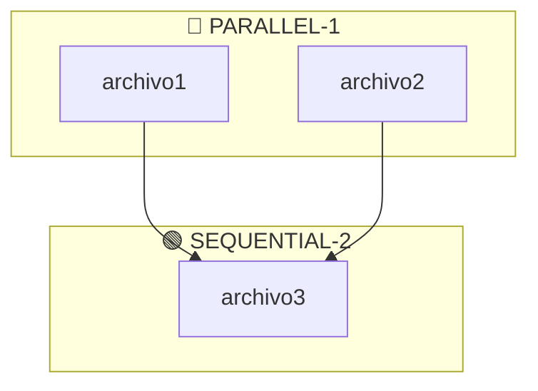
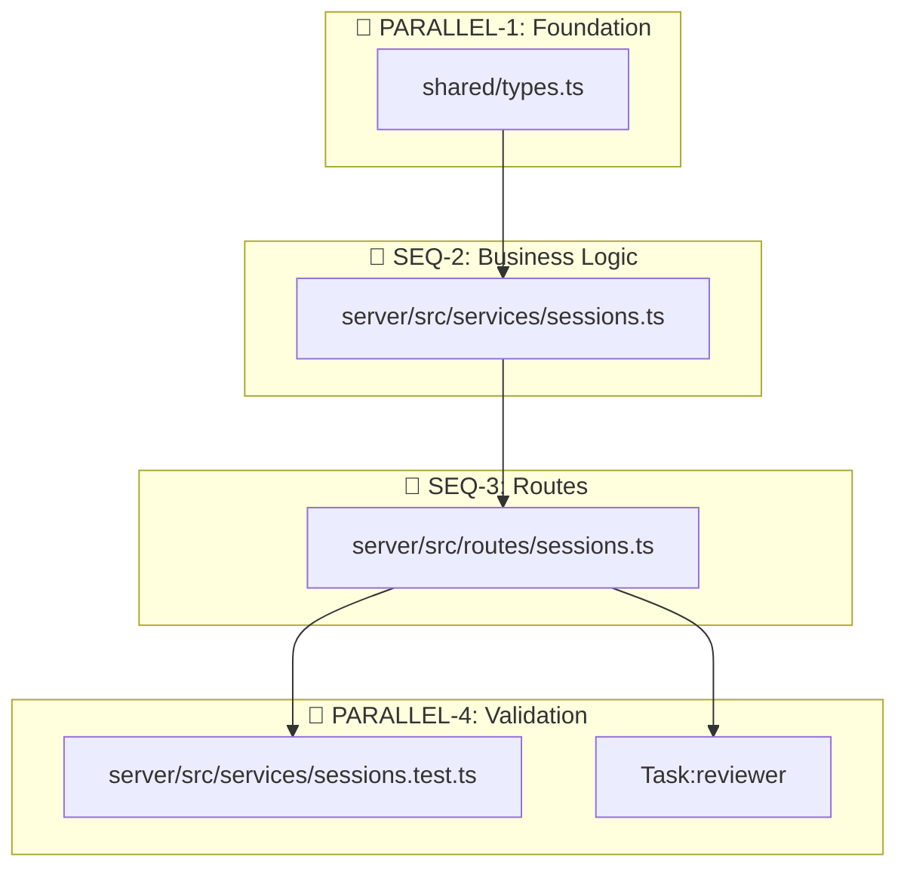

# /advanced-planner

## 0. METAS FUNDAMENTALES

Mantener activas durante TODA la planificación y ejecución:

| Meta | Regla |
|------|-------|
| **Certeza** | Verificar con Glob/Grep/Read ANTES de afirmar. Nunca asumir. |
| **Anti-Alucinación** | `Glob('path/file.ts')` antes de referenciarlo. Si no existe → "necesita crearse". |
| **Calidad** | Patterns del proyecto > shortcuts. Consultar Context7 si hay duda. |
| **Paralelización** | Múltiples tools independientes en UN mensaje. Batch operations. |
| **Tokens** | Cargar solo lo necesario, PERO gastar si mejora certeza/calidad. |
| **Claridad** | Cada paso ejecutable sin preguntas. Tablas > prosa. |
| **Trazabilidad** | Milestones definidos. Dependencias explícitas. |

### Carga de Contexto Automática

| Keywords detectados | Acción |
|---------------------|--------|
| elysia, backend, api, endpoint | Skill: `typescript-patterns` |
| react, frontend, component | Skill: `typescript-patterns` |
| bun, runtime, server | Skill: `bun-best-practices` |
| test, coverage, vitest | `/load-testing-strategy` |
| security, auth, jwt | `/load-security` |
| prompt, agent, orchestrator | Skill: `prompt-engineer` |
| config, env, settings | Skill: `config-validator` |
| refactor, clean, simplify | Agent: `refactor-agent` |

### Cuándo usar Sequential Thinking

```
mcp__sequential-thinking__sequentialthinking
```

| Usar SI | NO usar |
|---------|---------|
| Arquitectura nueva | Fix de una línea |
| Refactoring multi-archivo | Cambio de config simple |
| Decisiones de diseño | Tarea con solución obvia |
| Múltiples soluciones válidas | - |
| Debugging complejo | - |

**Config**: 10-15+ thoughts para tareas complejas. Habilitar revision si hay incertidumbre.

### Referencias Externas y MCPs

| Necesidad | Tool | Comando |
|-----------|------|---------|
| API desconocida | Context7 | `mcp__context7__get-library-docs` |
| Docs de Elysia/Bun | Context7 | `mcp__context7__get-library-docs` |
| Razonamiento complejo | Sequential Thinking | `mcp__sequential-thinking__sequentialthinking` |
| Pattern de diseño | WebSearch | Best practices, docs oficiales |
| Proyecto referencia | WebFetch | GitHub >1k stars |

### Validación Anti-Alucinación

| Antes de... | Usar |
|-------------|------|
| Referenciar archivo/función | `Glob('path')` o `/validate-claim path/file.ts:FunctionName` |
| Usar API de framework | `mcp__context7__get-library-docs` |
| Asumir estructura de proyecto | `Glob('**/pattern')` para verificar |

---

## 1. REGLAS DE SELECCIÓN DE HERRAMIENTAS

> **Listas actualizadas**:
> - Agents: `Glob('.claude/agents/*.md')`
> - Skills: `Glob('.claude/skills/*/SKILL.md')`
> - Commands: `Glob('.claude/commands/*.md')`

### Agents (usar con Task tool)

| Trigger | Agent | Model | Background? |
|---------|-------|-------|-------------|
| Diseño de feature | architect | opus | No |
| Documentar bug | bug-documenter | sonnet | No |
| Implementar código | builder | sonnet | No |
| Análisis de calidad | code-quality | opus | ✅ Sí |
| Refactoring | refactor-agent | sonnet | No |
| Code review | reviewer | sonnet | ✅ Sí |
| Explorar codebase | scout | sonnet | No |
| Descomponer tarea | task-decomposer | opus | No |
| **Explorar general** | **Explore** | sonnet | No |

### Cuándo usar Task:Explore vs Glob/Grep

| Situación | Usar |
|-----------|------|
| Buscar archivo por nombre exacto | `Glob('**/filename.ts')` |
| Buscar función/clase específica | `Grep('class MyClass')` |
| Entender estructura del codebase | `Task:Explore` |
| Búsqueda abierta, múltiples intentos | `Task:Explore` |
| Pregunta "cómo funciona X" | `Task:Explore` |

### Skills (auto-activación por keywords)

| Archivo/Keyword | Skill |
|-----------------|-------|
| *.ts, *.tsx, async, Promise | typescript-patterns |
| Bun, bun:test, runtime | bun-best-practices |
| prompt, agent, mejorar | prompt-engineer |
| .env, config, settings | config-validator |
| import, export, type | code-style-enforcer |
| log, logger, winston | logging-strategy |

---

## 2. WORKFLOW DE PLANIFICACIÓN

### Fase 0: Discovery (READ-ONLY)
```
1. Glob/Grep archivos relacionados
2. Identificar skills relevantes según keywords
3. Determinar agents necesarios según tipo de tarea
4. Crear Tool Inventory
```

### Fase 1: Dependency Analysis
```
1. Listar archivos a crear/modificar
2. Determinar dependencias (types → services → routes → tests)
3. Agrupar en PARALLEL vs SEQUENTIAL
4. Marcar nodos "Blocking"
```

### Fase 2: Execution Roadmap
```
1. Crear DAG (Mermaid)
2. Tabla de herramientas por archivo
3. Instrucciones de ejecución por grupo
4. Recovery para nodos blocking
```

---

## 3. REGLAS DE PARALELIZACIÓN

### ✅ PARALELO (mismo mensaje)
- Múltiples `Read`, `Glob`, `Grep` independientes
- Múltiples `Write` a archivos SIN dependencia entre ellos
- Múltiples `Task` agents independientes
- `WebSearch` + `Context7` simultáneos

### ❌ SECUENCIAL (esperar resultado)
- `Edit` después de `Read` del mismo archivo
- `Task` agent que necesita output del anterior
- `Bash` que usa archivo recién creado
- Nodo marcado "Blocking: Sí"

### Sintaxis en el plan
```
# PARALELO - EN MISMO MENSAJE:
Write(types.ts) + Write(utils.ts) + Task(agent1, background:true)

# SECUENCIAL - ESPERAR:
Write(services.ts)  # Depende de types.ts
→ ESPERAR resultado
Write(routes.ts)    # Depende de services.ts
```

#### Ejemplos Concretos de Sintaxis

**Lecturas paralelas:**
```
Read("/src/services/auth.ts") + Read("/src/types/user.ts") + Grep("login", "src/")
```

**Agentes paralelos independientes:**
```
Task(subagent_type="scout", prompt="find auth files") + Task(subagent_type="code-quality", prompt="analyze complexity", run_in_background=true)
```

**MCP servers paralelos:**
```
mcp__context7__get-library-docs(library="elysia") + WebSearch("elysia middleware best practices 2024")
```

**Writes independientes (sin dependencia mutua):**
```
Write("/src/types/session.ts", content1) + Write("/src/utils/validation.ts", content2)
```

### Parallel Efficiency Score

After completing a task, evaluate your parallelization:

| Score | Meaning | Action |
|-------|---------|--------|
| >80% | Excellent | Continue |
| 50-80% | Acceptable | Review missed opportunities |
| <50% | Poor | **STOP** - refactor approach |

**Calculate**: (parallel operations) / (total operations that COULD be parallel) x 100

Example:
- You did 5 Read operations
- 3 were independent (could be parallel)
- You ran 2 in parallel, 1 sequential
- Score: 2/3 = 67% (Acceptable, but could improve)

---

## 4. FORMATO OUTPUT OBLIGATORIO

### Tool Inventory

| Tipo | Herramienta | Uso en esta tarea |
|------|-------------|-------------------|
| Skill | [nombre] | [propósito] |
| Agent | [nombre] | [propósito] |
| MCP | [nombre] | [propósito] |

### Execution Roadmap

#### Grafo de Dependencias


#### Nodos de Ejecución

##### 🔵 PARALLEL-1: [Nombre del grupo]
**Deps**: Ninguna | **Paralelo**: ✅

| # | Archivo | Tool | Skills | Agent | MCP |
|---|---------|------|--------|-------|-----|
| 1.1 | path/file.ts | Write/Edit | skill1, skill2 | - | - |

**Ejecutar**: `Tool1(file1) + Tool2(file2)` EN MISMO MENSAJE

##### 🟢 SEQUENTIAL-2: [Nombre] [Blocking]
**Deps**: PARALLEL-1 | **Paralelo**: ❌

| # | Archivo | Tool | Skills | Agent | MCP |
|---|---------|------|--------|-------|-----|
| 2.1 | path/file.ts | Write | skill | Task:agent | Context7 |

**Ejecutar**: DESPUÉS de PARALLEL-1
**Recovery**: [Solo si Blocking - qué hacer si falla]

---

## 5. EJEMPLO COMPLETO

**Tarea**: "Añadir endpoint de exportación de sesiones"

> **Nota**: Este ejemplo usa la estructura REAL del proyecto. Antes de crear un plan,
> siempre verificar estructura con `Glob('claude-code-ui/server/src/**/*')`.

### Estructura del Proyecto (Referencia)

```
claude-code-ui/
├── shared/
│   └── types.ts              ← Types compartidos
└── server/src/
    ├── services/
    │   ├── sessions.ts       ← Lógica de negocio (clase SessionStore)
    │   └── sessions.test.ts  ← Tests junto al archivo
    ├── routes/
    │   ├── sessions.ts       ← Endpoints Elysia
    │   └── __tests__/        ← Tests alternativos
    └── config/               ← Configs específicos
```

### Tool Inventory

| Tipo | Herramienta | Uso | Config |
|------|-------------|-----|--------|
| Skill | typescript-patterns | Types y async patterns | Auto |
| Skill | bun-best-practices | Runtime Bun/Elysia | Auto |
| Skill | code-style-enforcer | Estilo y type hints | Auto |
| Agent | reviewer | Review final | sonnet, background: true |
| MCP | Context7 | Verificar API Elysia | On-demand |
| Command | /load-testing-strategy | Patterns de testing | Pre-tests |

### Execution Roadmap

#### Grafo de Dependencias


**Leyenda de colores**:
- 🔵 = Paralelo (sin dependencias mutuas)
- 🔴 = Secuencial/Blocking (requiere paso anterior)

#### 🔵 PARALLEL-1: Foundation (Types)
**Deps**: - | **Paralelo**: ✅

| # | Archivo | Tool | Skills | Contenido |
|---|---------|------|--------|-----------|
| 1.1 | `shared/types.ts` | Edit | typescript-patterns, code-style-enforcer | `ExportFormat`, `SessionExport` types |

**Anti-alucinación**: `Glob('shared/types.ts')` → Verificar existe antes de Edit
**Ejecutar**: `Read(shared/types.ts) → Edit(shared/types.ts)`

#### 🔴 SEQ-2: Business Logic [Blocking]
**Deps**: PARALLEL-1 ✅ | **Paralelo**: ❌

| # | Archivo | Tool | Skills | Contenido |
|---|---------|------|--------|-----------|
| 2.1 | `server/src/services/sessions.ts` | Edit | typescript-patterns, bun-best-practices | Método `export(id, format): SessionExport` |

**Pre**: Verificar types importan sin error TS
**Ejecutar**: `Read(services/sessions.ts) → Edit`
**Recovery**:
- TypeScript error → Verificar import path `../../../shared/types`
- Logic error → `Task:architect` para revisar diseño

#### 🔴 SEQ-3: Routes [Blocking]
**Deps**: SEQ-2 ✅ | **Paralelo**: ❌

| # | Archivo | Tool | Skills | Contenido |
|---|---------|------|--------|-----------|
| 3.1 | `server/src/routes/sessions.ts` | Edit | bun-best-practices | `.get('/sessions/:id/export', ...)` |

**MCP**: `mcp__context7__get-library-docs(library="elysia")` para response headers
**Ejecutar**: `Read(routes/sessions.ts) → Edit`

#### 🔵 PARALLEL-4: Validation
**Deps**: SEQ-3 ✅ | **Paralelo**: ✅ (tests + reviewer son independientes)

| # | Archivo | Tool | Agent |
|---|---------|------|-------|
| 4.1 | `server/src/services/sessions.test.ts` | Edit | - |
| 4.2 | - | Task | reviewer (sonnet, background: true) |

**Pre**: `/load-testing-strategy` antes de escribir tests
**Ejecutar**: `Edit(sessions.test.ts) + Task(reviewer, run_in_background:true)` EN MISMO MENSAJE
**Post**: `Bash: cd server && bun test src/services/sessions.test.ts`
**Recovery (tests)**:
- Assertion failed → Verificar expected vs actual values
- Import error → Check relative paths

---

## 6. ANTI-PATTERNS (NO HACER)

| ❌ No hacer | ✅ Hacer |
|-------------|---------|
| Ejecutar Write secuenciales sin dependencia | Agrupar en mismo mensaje (paralelo) |
| Olvidar qué skill se activa | Consultar tabla de skills |
| Lanzar agent sin especificar model | Usar model de la tabla |
| No verificar archivos existen | Glob antes de Edit |
| Recovery para todo | Solo para nodos Blocking |
| Subestimar complejidad | Siempre usar roadmap completo |

---

## 7. GESTIÓN DE SESIONES

Para tareas largas:

### Nombrar Sesión
```bash
/rename feature-sessions   # Nombrar sesión descriptivamente
```

### Reanudar Trabajo
```bash
claude --resume feature-sessions   # Desde terminal
/resume feature-sessions           # Desde REPL
```

### Workflow Recomendado
1. Iniciar tarea: `/rename <nombre-descriptivo>`
2. Si hay interrupción: `/compact` antes de cerrar
3. Reanudar: `claude --resume <nombre>`
4. Al finalizar: Verificar todos completados antes de commit

---

## Changelog

| Versión | Fecha | Cambios |
|---------|-------|---------|
| 3.1.0 | 2025-12-27 | Corregido ejemplo Fase 5: rutas actualizadas a estructura real del proyecto, grafo de dependencias corregido, reviewer movido a paso final (PARALLEL-4), añadido code-style-enforcer, recovery con acciones específicas, añadida leyenda de colores unificada |
| 3.0.0 | 2025-12-22 | Adaptado para claude-code-poneglyph (Bun/Elysia/React). Eliminadas referencias Django/Binora. Actualizados agents, skills y ejemplos. |
| 2.2.0 | 2025-12-20 | Eliminado haiku de tabla de agentes (no disponible en API). Todos los agentes usan sonnet por defecto |
| 2.1.0 | 2025-12-11 | Corregidos models de agents (opus/sonnet). Añadida sección Session Management |
| 2.0.0 | 2025-12-11 | Fusión plan-hard + advanced. Añadido: Metas, Sequential Thinking, Referencias externas, Anti-alucinación con `/validate-claim`, Task:Explore, Background agents, Versionado |
| 1.0.0 | 2025-12-11 | Versión inicial con Execution Roadmap |
