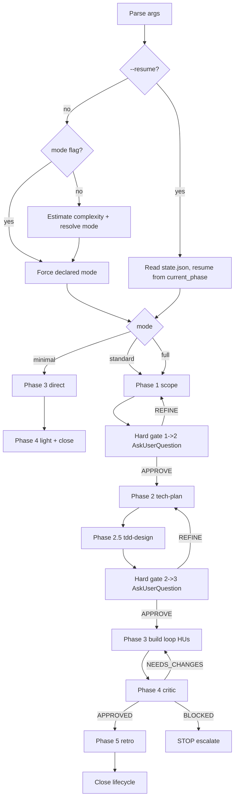

# /flow — 5-phase workflow orchestrator

End-to-end feature lifecycle: invokes the 6 phase skills (`scope`, `tech-plan`, `tdd-design`, `build`, `critic`, `retro`) in order with adaptive triage and human hard gates. Reads/writes `.claude/plans/{NNN}-{slug}/state.json` for resumability.

> **Scope distinction**: `/flow` orchestrates a FEATURE lifecycle (multi-turn, artefacts in `plans/`). The `orchestrator-protocol` skill orchestrates a Lead TURN (Triage → Complexity → Context → Delegate → Validate). They are complementary, not redundant.

## Arguments

| Form | Meaning |
|---|---|
| `/flow <task>` | Auto-triage complexity → resolve mode (minimal/standard/full) → execute |
| `/flow --minimal <task>` | Force minimal: Phase 3 direct (no spec/tasks/tests artefacts); Phase 4 light |
| `/flow --standard <task>` | Force standard: all 5 phases with hard gates 1→2 and 2→3 |
| `/flow --full <task>` | Force full: 5 phases with deep drillme + decision-stress-test in Phase 2 + reviewer agent in Phase 4 |
| `/flow --resume <slug>` | Read `.claude/plans/<slug>/state.json` and continue from `current_phase` |

## Lead workflow (executed by this command)



### Step 1 — Parse arguments

Extract from `$ARGUMENTS`:

| Pattern | Action |
|---|---|
| `--resume <slug>` | `mode = resume`, `slug = <slug>` — skip to Step 5 |
| `--minimal\|--standard\|--full <task>` | `mode = <flag>`, `task = <task>` |
| `<task>` (no flag) | `task = <task>`, mode resolved in Step 2 |

If `$ARGUMENTS` is empty → `AskUserQuestion`: "Qué feature quieres orquestar?"

### Step 2 — Triage (auto-mode resolution)

When no `--minimal|--standard|--full` flag was passed:

| Heuristic | Mode resolved |
|---|---|
| Task description ≤ 1 sentence + suggests 1 file + no architectural language | `minimal` |
| Task suggests 2-5 files OR involves a single domain | `standard` |
| Task mentions architecture, decisions, multiple domains, security/auth/payments, refactor of >5 files | `full` |

> **Research/audit feature** (deliverable = report/analysis, not code): even at `standard|full`, keep the upfront ceremony LIGHT — scope = problem + corpus + rubric, perspectives optional, produce substance (research) early and formalize incrementally. Heavy spec/tasks/perspectives before any finding is over-engineering (Commandment III; lesson from feature 002).

**Show the user**: `Triage: mode = <resolved> (reason: <one line>)`. The user can override with `--<mode>` flag if disagrees.

Declare mode in `state.json` (Step 4).

### Step 3 — Slug generation (skip in minimal)

For `standard|full`:

1. `Glob .claude/plans/*-*/spec.md` — find highest `NNN` (existing prefix).
2. `NNN = max + 1` (3 digits, zero-padded).
3. `slug = <NNN>-<kebab-case-of-task-summary>` (≤30 chars).
4. `Bash mkdir -p .claude/plans/<slug>/tasks` (creates plan dir).

### Step 4 — Initialize state.json (skip in minimal)

Write `.claude/plans/<slug>/state.json`:

```json
{
  "spec_slug": "<NNN>-<slug>",
  "mode": "<standard|full>",
  "current_phase": 1,
  "phases_completed": [],
  "gates_approved": {
    "1->2": false,
    "2->3": false
  },
  "us_completed": [],
  "us_pending": [],
  "feature_closed": false,
  "review_verdict": null,
  "retro_status": null,
  "started_at": "<YYYY-MM-DD>",
  "updated_at": "<YYYY-MM-DD>"
}
```

This is the **canonical schema** for `state.json` (referenced by all 6 phase skills).

### Step 5 — Resume (only if `--resume <slug>`)

1. Read `.claude/plans/<slug>/state.json`.
2. If file does not exist OR JSON malformed → fallback: `Glob .claude/plans/<slug>/{spec,tasks/index,tests,validations,review,retro}.md` to reconstruct phase from artefacts. Warn user.
3. Determine resume point from `current_phase` + `gates_approved`:
   - Phase 1 in progress → re-invoke `scope`
   - Phase 1 completed, gate 1→2 not approved → re-issue gate prompt
   - Phase 2 in progress → re-invoke `tech-plan`
   - ... (analogous for 2.5 / 3 / 4 / 5)

### Step 6 — Execute mode

#### Mode `minimal`

```
1. Skip Phases 1, 2, 2.5.
2. Invoke `build` skill with task description as the AC.
3. Invoke `critic` skill with --light flag.
4. Skip Phase 5 OR run /retro --light if friction emerged.
5. Report and exit.
```

No `state.json` or `plans/` artefacts in minimal mode. The user opted out of the full lifecycle.

#### Mode `standard` or `full`

##### Phase 1 — scope

Invoke `Skill('scope')` with the task description as input. Produces `spec.md`.

In mode `full`: scope auto-activates its 3-perspective product analysis (Outsider/User/Product) if its frontmatter conditions match.

##### Hard gate 1→2

```
AskUserQuestion:
  question: "¿Apruebas spec.md ({slug})?"
  options:
    - APPROVE: continúa Phase 2 (tech-plan)
    - REFINE: vuelve a Phase 1 (scope refina + re-emite)
    - BLOCK: detén la feature (escala motivo)
```

On APPROVE → `state.json.gates_approved["1->2"] = true`, `current_phase = 2`. Persist.
On REFINE → re-invoke `scope` with the user's refinement notes.
On BLOCK → STOP; do not continue; leave state.json as snapshot.

##### Phase 2 — tech-plan

Invoke `Skill('tech-plan')`. Reads `spec.md` + executes obligatory research (Context7 + WebFetch + Grep) + produces `tasks/index.md` + `tasks/US{N}.md`.

In mode `full`: tech-plan auto-loads its full reference set including `decision-stress-test` invocation for alternatives.

##### Phase 2.5 — tdd-design

Invoke `Skill('tdd-design')`. Reads `tasks/` + produces `tests.md` and/or `validations.md` per HU nature.

##### Hard gate 2→3

```
AskUserQuestion:
  question: "¿Apruebas tasks/ + tests.md/validations.md ({slug})?"
  options:
    - APPROVE: continúa Phase 3 (build loop HUs)
    - REFINE: vuelve a Phase 2 (tech-plan refina + Phase 2.5 re-ejecuta)
    - BLOCK: detén la feature
```

##### Phase 3 — build (loop HUs)

Iterate `state.json.us_pending` in DAG order (respect `depends_on`):

```
for HU in DAG-ordered-pending:
  invoke Skill('build') with US{id}
  on success → us_completed += [US{id}], us_pending -= [US{id}]
  on failure → diagnostic-patterns + retry per error-recovery.md
  on STOP-escalate → break loop + report
```

Parallel HUs (independent leaves of the DAG) → may invoke multiple `build` calls in the same Lead message if their `files` are disjoint AND no shared state. Standard rule applies (≥5 files OR architectural → delegate to `builder` agent from inside `build` skill).

> **Dynamic workflows engine (≥4 parallel HUs)** — when the DAG has **≥4 independent HUs** in a wave (the ≥4 agent-count rule), prefer the **Workflow tool** (GA since CC 2.1.154) over hand-spawned parallel `build` calls: it orchestrates the fan-out in the background, with `isolation: 'worktree'` per HU when files would collide, and `/workflows` to monitor. For 1-3 parallel HUs, the Lead runs `build` inline (spawning <4 agents is wasted cost). poneglyph first dogfooded this in feature 003. The Workflow tool requires explicit user opt-in (keyword "workflow" or direct request) — do NOT auto-launch it.

##### Phase 4 — critic

Invoke `Skill('critic')` once all HUs completed. Produces `review.md` with verdict.

| Verdict | Next |
|---|---|
| APPROVED / APPROVED_WITH_WARNINGS | continue Phase 5 |
| NEEDS_CHANGES | re-enter Phase 3 with the specific HUs flagged; loop until APPROVED or escalation |
| BLOCKED | STOP escalate; do not enter Phase 5 |

`state.json.review_verdict = <verdict>`.

##### Phase 5 — retro

Invoke `Skill('retro')`. Produces `retro.md`. Captures promotions (pending approval), living-spec deltas (pending approval), Commandments audit.

After user reviews retro.md:

- Approved promotions → Lead writes target file (default-allow) or delegates to `builder` if ≥5 files.
- Approved living-spec diff → patch `spec.md` with note "v2 — delta from retro <slug>".
- `state.json.retro_status = "approved"`, `feature_closed = true`.
- `spec.md` + `tasks/index.md` frontmatter `status: closed`.

### Step 7 — Final report

```
{✅|⏸️|❌} /flow {slug} — mode=<resolved>
- Phases completed: <list>
- Artefacts: spec.md, tasks/, tests.md|validations.md, review.md, retro.md (paths)
- HUs: <N completed>/<N total>
- Review verdict: <verdict>
- Retro status: <pending|approved>
- Feature closed: <yes|no>
- Living-spec delta proposed: <yes|no>
- Promotions pending approval: <N>

Next:
  → Approve promotions / living-spec diff (if pending)
  → /flow <new-task> for the next feature
```

## SIEMPRE rules

- Hard gates 1→2 and 2→3 are MANDATORY in standard/full modes — never skip via flag, never auto-approve.
- `state.json` updates ON EVERY phase transition (Phase 1 complete → write; gate approved → write; HU completed → write).
- Triage is transparent — show the user the resolved mode + reason; user can override.
- `--resume` reads state.json strictly; if corrupted, reconstruct from artefacts + warn (never silently guess).
- In standard/full, the slug is generated ONCE at Phase 1 start; subsequent phases honor it.
- Phase 4 verdict BLOCKED stops `/flow`; user decides whether to reopen or abandon.
- **Proactive multi-round questioning** (006): at hard gates + during scope/drillme, ask in rounds while genuine doubt remains — including lateral / improvement questions — instead of stopping at one round; converge and say so when no real doubt is left. Calibrated, anti-ceremony (Commandment III). Iteration mechanics via the `drillme` skill; principle in CLAUDE.md §Communication & Honesty Protocol.

## Adaptation per mode

| Mode | Phase 1 | Phase 2 | Phase 2.5 | Phase 3 | Phase 4 | Phase 5 |
|---|---|---|---|---|---|---|
| minimal | skip | skip | skip | direct | light | skip or light |
| standard | full | full | full | full | standard | standard |
| full | full + 3 perspectives | full + decision-stress-test | full + property-based opt-in | full + builder agent delegation per criterion | full + reviewer agent (Opus) + security-review | full + Commandments forensics if violation |

## Edge cases

- **Edge 1** — `/flow --resume <slug>` but `state.json` does not exist: fallback to `Glob .claude/plans/<slug>/*.md` and reconstruct `current_phase` from artefacts present (spec only → Phase 1 awaiting gate; spec+tasks → Phase 2 awaiting gate 2→3; etc.). Warn user.
- **Edge 2** — Gate 1→2 rejected by user: re-invoke `scope` with refinement notes. Multiple iterations allowed; counter in `state.json.gate_iterations`.
- **Edge 3** — Phase 4 verdict NEEDS_CHANGES with specific HUs: re-enter Phase 3 ONLY for those HUs (don't rebuild the whole DAG).
- **Edge 4** — User invokes `/flow` while another feature is mid-flight (active state.json elsewhere): `AskUserQuestion` "¿Reusar el slug actual o crear nuevo?" — never silently fork.
- **Edge 5** — Mode `minimal` produces a result the user later wants to formalize: invoke `/flow --standard` retroactively, point Phase 1 (scope) at the existing code as "reverse-engineer spec".
- **Edge 6** — Phase 3 loop encounters an HU whose `depends_on` are not closed: STOP; surface the DAG violation; usually means `state.json` is out of sync — Phase 5 would catch this in retro.

## Smell signals

- ⚠️ Triage always resolves `full` → the heuristic is mis-calibrated; review Step 2 thresholds.
- ⚠️ Gate 2→3 rejected in >50% runs → tech-plan is producing poorly-defined HUs; reopen tech-plan criteria.
- ⚠️ Phase 4 verdict NEEDS_CHANGES in >3 iterations on the same feature → spec.md or DAG is wrong; reopen Phase 1/2.
- ⚠️ `/flow` used <20% of feature work (vs auto-activation of individual skills) → the orchestrator's value-add is unclear; revisit.
- ⚠️ `state.json` files accumulate without `feature_closed: true` → workflows are abandoned mid-flight; usability problem.

## Anti-patterns

| Anti-pattern | Detection | Correction |
|---|---|---|
| Skip hard gate via auto-approve | `state.json.gates_approved["1->2"] = true` without an AskUserQuestion event | Reject — gates are human-only |
| Reuse slug across unrelated features | Two specs with different problem statements under same `<slug>` | Generate new `NNN+1-<slug>` |
| Hardcode mode in command body | `/flow` always resolves to `full` regardless of triage | Honor triage heuristic + flag override only |
| Run Phase 5 on BLOCKED verdict | retro.md produced after review.md verdict = BLOCKED | Phase 5 only runs on APPROVED/APPROVED_WITH_WARNINGS |
| Auto-edit spec.md from retro | spec.md mtime changes during /retro without user approval | Living-spec deltas are proposals; the Lead applies AFTER user approves |

## Verification (post-implementation of this command)

- Smoke `/flow "trivial typo fix"` → resolves minimal; no plans/ dir created.
- Smoke `/flow --standard "add validation hook"` → 5 phases with 2 hard gates; produces all artefacts.
- Smoke `/flow --resume 001-foo` → reads state.json + continues from `current_phase`.
- `state.json` schema validates against `templates/state.template.json` (when US1 creates it).
- `bun test ./.claude/hooks/` → 81/81 (this command is markdown — no hook test impact).

## Commandments cubiertos

| # | Cómo |
|---|---|
| I | Hard gates 1→2 and 2→3 are explicit human approval — colleague pattern, not bypass |
| III | Triage adaptive — minimal mode avoids ceremony for trivial tasks |
| IV | Gates 1→2 and 2→3 block until APPROVE; Phase 4 verdict blocks Phase 5 |
| V | Phase 1 (scope) before any technical work — understand before acting |
| VII | Parallel HU execution in Phase 3 when DAG allows; resumable workflows |
| X | `state.json` schema is canonical (used by 6 phase skills); workflow state visible end-to-end |

## Related

- `orchestrator-protocol` skill — turn-level Lead protocol (Triage / Complexity / Context / Delegate / Validate per Lead turn). Complementary to `/flow` (feature-level orchestration).
- 6 phase skills: `scope`, `tech-plan`, `tdd-design`, `build`, `critic`, `retro`.
- `drillme` skill — transversal Socratic check (invoked by phase skills + on-demand).
