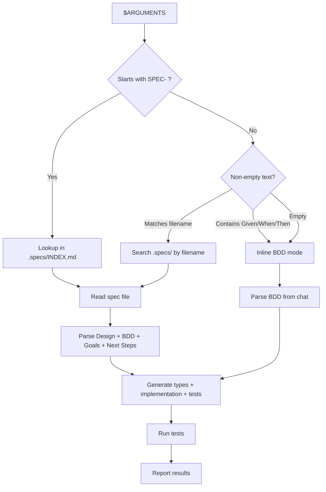
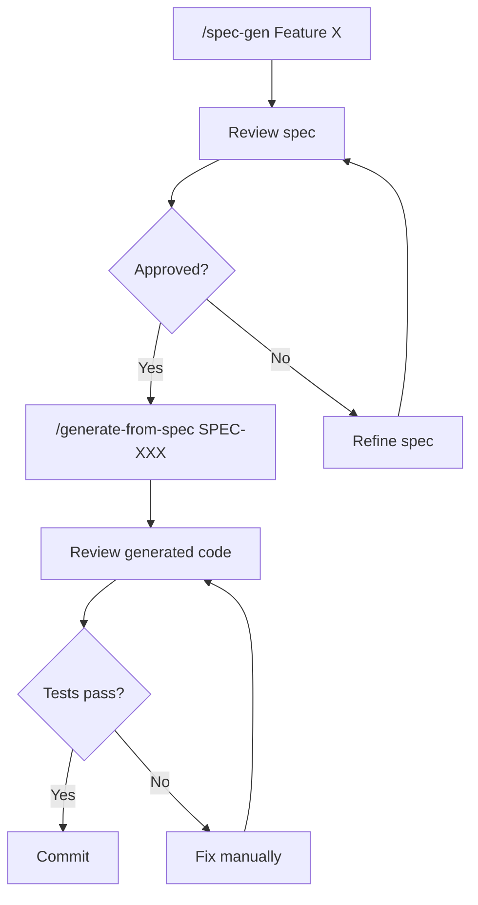

# Generate Code from Specification

**Generate tests and implementation from BDD specifications. Works with spec files or inline BDD text.**

## Usage

```
/generate-from-spec $ARGUMENTS
```

| Argument | Mode | Behavior |
|----------|------|----------|
| `SPEC-014` or spec filename | **Spec File** | Reads full spec from `.specs/`, extracts Design + BDD + Goals |
| Inline BDD text or empty | **Inline BDD** | Parses Given-When-Then scenarios from chat |

**Examples**:
```
/generate-from-spec SPEC-014
/generate-from-spec session-management
/generate-from-spec
```

---

## Argument Detection



### Spec File Discovery (when argument provided)

1. **Exact SPEC-ID**: `SPEC-014` -> lookup in `.specs/INDEX.md` -> resolve filename
2. **Filename match**: `session` -> `.specs/session-management-persistence.md`
3. **Fuzzy match**: `frontend` -> `.specs/frontend-architecture-refactor.md`

---

## Workflow

### Common Steps (Both Modes)

1. Parse BDD scenarios (from spec file section 6 or inline text)
2. Generate test file with all scenarios (Given-When-Then comments)
3. Generate implementation (TDD approach)
4. Run tests to verify correctness
5. Report results

### Additional Steps (Spec File Mode)

| Step | Source Section | Output |
|------|---------------|--------|
| Extract types/interfaces | `## 4. Design` | Type definitions |
| Read architecture patterns | `## 4. Design` | Implementation following spec patterns |
| Validate feature scope | `## 2. Goals` | Scope guard |
| Check dependencies | INDEX.md `Depends` column | Warn if unimplemented deps |
| Track progress | `## 9. Next Steps` | Mark completed items |

---

## Specification Format (Inline Mode)

```gherkin
Feature: [Feature Name]

Scenario: [Scenario Name]
  Given [initial context]
  And [additional context]
  When [action occurs]
  Then [expected result]
  And [additional expectation]
```

### Writing Good Specs

```gherkin
# BAD (vague):
Given user is logged in
Then user sees dashboard

# GOOD (specific):
Given user "john@example.com" is authenticated with valid session token
Then user is redirected to "/dashboard"
And dashboard displays: username, stats, recent activity
```

Always cover: success case, invalid input, unauthorized access, not found, error case.

---

## Spec File Requirements (Spec File Mode)

| Section | Required | Used For |
|---------|----------|----------|
| `## 4. Design` | Yes | Types, interfaces, implementation patterns |
| `## 6. Acceptance Criteria (BDD)` | Yes | Test generation |
| `## 2. Goals` | Optional | Feature scope validation |
| `## 9. Next Steps` | Optional | Task tracking |

---

## Generated File Structure

### Tests

```typescript
// tests/[feature]/[scenario].test.ts
import { describe, it, expect, beforeEach } from 'vitest';

describe('Feature Name', () => {
  beforeEach(() => {
    // Setup code
  });

  describe('Scenario 1', () => {
    it('description', async () => {
      // Given — setup
      // When — action
      // Then — assertions
      expect(...).toBe(...);
    });
  });
});
```

### Implementation

```typescript
// src/[feature]/[module].ts
export interface ResultType { /* from Design or inferred */ }

export async function featureName(
  param1: Type1,
  param2: Type2
): Promise<ResultType> {
  // Input validation
  // Business logic
  // Error handling
  // Return result
}
```

### Output Locations (Spec File Mode)

| Spec Type | Output Location |
|-----------|-----------------|
| Types/Interfaces | `src/types/` or adjacent to module |
| Services/Lib | `src/lib/` or `src/services/` |
| Hooks | `.claude/hooks/` |
| Agents/Skills/Rules | `.claude/{agents,skills,rules}/` |
| Tests | `*.test.ts` adjacent to implementation |

---

## Implementation Strategy (Spec File Mode)

### Phase 1: Parse Spec

```typescript
const spec = {
  id: 'SPEC-014',
  title: 'Feature Name',
  design: { types, api, modules, patterns },
  bdd: [/* Gherkin scenarios */],
  goals: [/* Feature goals */],
  nextSteps: [/* Implementation tasks */]
};
```

### Phase 2: Generate Types (from Design code blocks)

### Phase 3: Generate Implementation (from Design patterns + Next Steps)

### Phase 4: Generate Tests (from BDD Acceptance Criteria)

### Phase 5: Verify and Report

```
Types generated:     src/types/session.ts (45 lines)
Implementation:      src/store/sessionSlice.ts (120 lines)
Tests generated:     tests/store/session.test.ts (80 lines)
Tests passing:       5/5 scenarios

Next Steps updated:
  [x] Create SessionSlice interface
  [x] Implement session store
  [ ] Integrate with existing components
```

---

## Dependency Handling (Spec File Mode)

The command checks INDEX.md for dependencies and warns:

```
SPEC-012 depends on:
  - SPEC-011 (thread-metrics) - Not implemented
  - SPEC-014 (frontend-refactor) - Not implemented

Suggested order:
  1. /generate-from-spec SPEC-014 (no dependencies)
  2. /generate-from-spec SPEC-011 (depends on SPEC-014)
  3. /generate-from-spec SPEC-012 (depends on both)
```

---

## Flags

| Flag | Description |
|------|-------------|
| `--dry-run` | Show what would be generated without creating files |
| `--tests-only` | Only generate tests from BDD |
| `--types-only` | Only generate types from Design (spec file mode) |
| `--force` | Overwrite existing files |
| `--no-verify` | Skip test execution after generation |

```
/generate-from-spec SPEC-014 --dry-run
/generate-from-spec SPEC-019 --tests-only
```

---

## Examples

### Example 1: Inline BDD — Simple Feature

```
/generate-from-spec

Feature: Add to Cart

Scenario: Add product successfully
  Given product "iPhone 15" is in stock
  And user is on product page
  When user clicks "Add to Cart"
  Then product is added to cart
  And cart count increases by 1
```

### Example 2: Spec File — Hook Validators

```
/generate-from-spec SPEC-014
```

Reads `.specs/orchestration-hooks-refactor.md`, generates:
```
.claude/hooks/
  validators/
    stop/validate-tests-pass.ts    # From Design 4.2
    pre/validate-input.ts          # From Design 4.2
  validators.test.ts               # From BDD scenarios
```

### Example 3: Inline BDD — API Endpoint

```
/generate-from-spec

Feature: Get User Profile

Scenario: Authenticated user retrieves profile
  Given user is authenticated with token
  And user ID is "12345"
  When GET request to "/api/users/12345"
  Then response status is 200
  And response contains: id, name, email, createdAt

Scenario: Unauthorized access
  Given user is not authenticated
  When GET request to "/api/users/12345"
  Then response status is 401
  And response error is "Unauthorized"
```

---

## Integration with Workflow



| After | Run | Purpose |
|-------|-----|---------|
| `/spec-gen` | `/generate-from-spec SPEC-XXX` | Generate code from approved spec |
| `/generate-from-spec` | `bun test` | Verify implementation |
| `/generate-from-spec` | `/commit` | Commit generated code |

---

## Error Handling

| Error | Cause | Solution |
|-------|-------|----------|
| `Spec not found` | Wrong ID/name | Check `.specs/INDEX.md` for correct ID |
| `No Design section` | Incomplete spec | Add `## 4. Design` to spec |
| `No BDD section` | No Gherkin in spec or chat | Add Given-When-Then scenarios |
| `Dependency missing` | Unimplemented dependency | Implement dependencies first |
| `File exists` | Already generated | Use `--force` to overwrite |

---

## Success Metrics

| Metric | Target |
|--------|--------|
| Test pass rate (first gen) | >90% |
| Spec parsing accuracy | >95% |
| Generated code compiles | 100% |
| Manual fixes needed | <15% |

---

## Limitations

**Works well for**: CRUD operations, API endpoints, auth flows, form validation, database queries.

**Needs human review for**: Complex business logic, performance optimization, UI/UX design, legacy integration.

---

## Related

- `/spec-gen` — Create new specifications
- `.specs/INDEX.md` — Spec registry with dependencies and status

---

**Version**: 2.0.0
**Category**: implementation
**Replaces**: `/implement-spec` (merged into this command)
