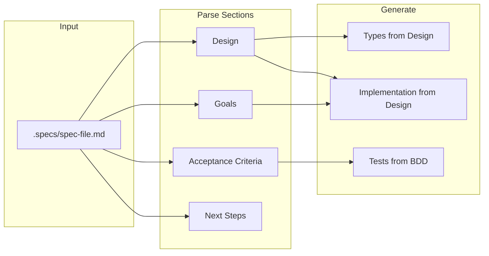
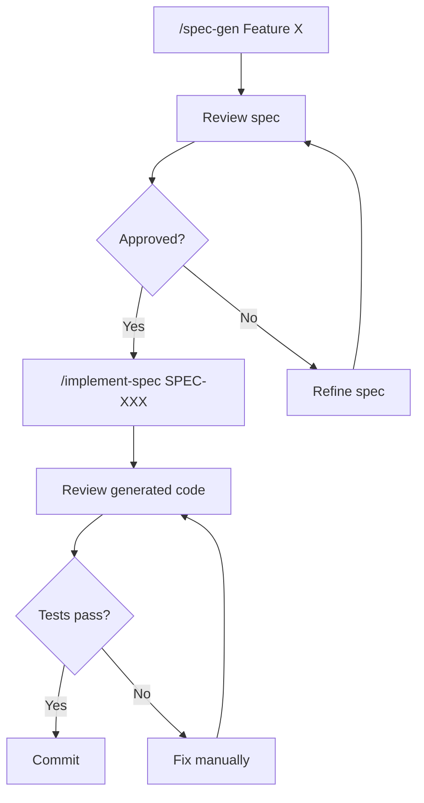

# Implement Specification

**Generate implementation from a complete spec document in `.specs/` directory.**

## Usage

```
/implement-spec <SPEC-ID or filename>
```

**Examples**:
```
/implement-spec SPEC-014
/implement-spec frontend-architecture-refactor
/implement-spec session-management
```

---

## What This Command Does

Extends `/generate-from-spec` to work with full specification documents:



**Workflow**:
1. Locate spec file in `.specs/` directory
2. Parse all sections (Design, Goals, BDD, Next Steps)
3. Extract technical requirements from Design section
4. Generate TypeScript types/interfaces from Design
5. Generate implementation following Design patterns
6. Generate tests from Acceptance Criteria (BDD)
7. Run tests to verify correctness
8. Mark completed items in Next Steps

---

## Spec File Requirements

The spec must contain these sections:

| Section | Required | Used For |
|---------|----------|----------|
| `## 4. Design` | ✅ Yes | Types, interfaces, implementation |
| `## 6. Acceptance Criteria (BDD)` | ✅ Yes | Test generation |
| `## 2. Goals` | Optional | Feature scope validation |
| `## 9. Next Steps` | Optional | Task tracking |

### Example Spec Structure

```markdown
# SPEC-XXX: Feature Name

## 4. Design

### 4.1 Types

\`\`\`typescript
interface User {
  id: string;
  email: string;
}
\`\`\`

### 4.2 API

| Endpoint | Method | Description |
|----------|--------|-------------|
| /api/users | GET | List users |

## 6. Acceptance Criteria (BDD)

\`\`\`gherkin
Feature: User Management

Scenario: List users successfully
  Given authenticated admin user
  When GET /api/users
  Then response status is 200
  And response contains array of users
\`\`\`

## 9. Next Steps

- [ ] Create User interface
- [ ] Implement GET /api/users endpoint
- [ ] Add tests
```

---

## Implementation Strategy

### Phase 1: Parse Spec

```typescript
// Extract from spec document
const spec = {
  id: 'SPEC-014',
  title: 'Frontend Architecture Refactor',
  design: {
    types: [...],      // TypeScript interfaces/types
    api: [...],        // Endpoints if any
    components: [...], // React components if any
    patterns: [...]    // Design patterns to follow
  },
  bdd: [...],          // Gherkin scenarios
  goals: [...],        // Feature goals
  nextSteps: [...]     // Implementation tasks
};
```

### Phase 2: Generate Types

From Design section code blocks:
```typescript
// Extract: ```typescript blocks from ## 4. Design
// Output: src/types/{feature}.ts
```

### Phase 3: Generate Implementation

Based on Design patterns and Next Steps:
```typescript
// For each component/service in Design:
// 1. Read existing code patterns in codebase
// 2. Generate following project conventions
// 3. Output to appropriate directory
```

### Phase 4: Generate Tests

From BDD Acceptance Criteria:
```typescript
// Parse: ```gherkin blocks from ## 6. Acceptance Criteria
// Output: tests/{feature}/*.test.ts
// Format: describe/it with Given-When-Then comments
```

### Phase 5: Verify & Report

```
✅ Types generated: src/types/session.ts (45 lines)
✅ Implementation: src/store/slices/sessionSlice.ts (120 lines)
✅ Tests generated: tests/store/session.test.ts (80 lines)
✅ Tests passing: 5/5 scenarios

📋 Next Steps updated:
  ✅ Create SessionSlice interface
  ✅ Implement session store
  ⬜ Integrate with existing components
```

---

## Spec Discovery

The command searches for specs in this order:

1. **Exact SPEC-ID**: `SPEC-014` → `.specs/frontend-architecture-refactor.md` (via INDEX.md lookup)
2. **Filename match**: `session` → `.specs/session-management-persistence.md`
3. **Fuzzy match**: `frontend` → `.specs/frontend-architecture-refactor.md`

### INDEX.md Integration

```markdown
<!-- From .specs/INDEX.md -->
| SPEC-014 | frontend-architecture-refactor.md | approved | 1.0 | high |
```

---

## Generated File Locations

| Spec Type | Output Location |
|-----------|-----------------|
| Types/Interfaces | `server/src/types/` or `web/src/types/` |
| Services | `server/src/services/` |
| Store slices | `web/src/store/slices/` |
| Components | `web/src/components/` |
| Hooks | `web/src/hooks/` |
| API routes | `server/src/routes/` |
| Tests | `tests/` or `*.test.ts` adjacent |

---

## Examples

### Example 1: Implement SPEC-014 (Zustand)

```
/implement-spec SPEC-014
```

**Reads**: `.specs/frontend-architecture-refactor.md`

**Generates**:
```
web/src/store/
├── index.ts              # Main store with slices
├── slices/
│   ├── sessionSlice.ts   # From Design 4.2
│   ├── chatSlice.ts      # From Design 4.2
│   ├── settingsSlice.ts  # From Design 4.2
│   └── ...
└── middleware/
    └── devtools.ts       # From Design 4.3

tests/store/
├── sessionSlice.test.ts  # From BDD scenarios
└── ...
```

---

### Example 2: Implement SPEC-019 (AI Logging)

```
/implement-spec SPEC-019
```

**Reads**: `.specs/ai-friendly-logging.md`

**Generates**:
```
server/src/lib/
├── ai-logger.ts          # AILogger class from Design 4.7
└── types/
    └── logging.ts        # AILog, TraceInfo, ErrorInfo from Design 4.1

tests/lib/
└── ai-logger.test.ts     # From BDD scenarios
```

---

### Example 3: Implement SPEC-016 (Error Recovery)

```
/implement-spec error-recovery
```

**Reads**: `.specs/error-recovery-resilience.md`

**Generates**:
```
server/src/lib/
├── circuit-breaker.ts    # From Design 4.1
├── retry.ts              # From Design 4.2
└── fallback.ts           # From Design 4.3

tests/lib/
├── circuit-breaker.test.ts
├── retry.test.ts
└── fallback.test.ts
```

---

## Dependency Handling

Specs may have dependencies. The command:

1. **Checks dependencies** from INDEX.md `Depends` column
2. **Warns if unimplemented** dependencies exist
3. **Suggests implementation order**

```
⚠️ SPEC-012 depends on:
  - SPEC-011 (thread-metrics-observability) - Not implemented
  - SPEC-014 (frontend-architecture-refactor) - Not implemented

💡 Suggested order:
  1. /implement-spec SPEC-014 (no dependencies)
  2. /implement-spec SPEC-011 (depends on SPEC-014)
  3. /implement-spec SPEC-012 (depends on both)
```

---

## Flags

| Flag | Description |
|------|-------------|
| `--dry-run` | Show what would be generated without creating files |
| `--tests-only` | Only generate tests from BDD |
| `--types-only` | Only generate types from Design |
| `--force` | Overwrite existing files |
| `--no-verify` | Skip test execution after generation |

**Examples**:
```
/implement-spec SPEC-014 --dry-run
/implement-spec SPEC-019 --tests-only
/implement-spec SPEC-016 --force
```

---

## Integration with Workflow

### Recommended Flow



### With Other Commands

| After | Run | Purpose |
|-------|-----|---------|
| `/spec-gen` | `/implement-spec` | Generate code from approved spec |
| `/implement-spec` | `bun test` | Verify implementation |
| `/implement-spec` | `/commit` | Commit generated code |

---

## Error Handling

| Error | Cause | Solution |
|-------|-------|----------|
| `Spec not found` | Wrong ID/name | Check `.specs/INDEX.md` for correct ID |
| `No Design section` | Incomplete spec | Add `## 4. Design` to spec |
| `No BDD section` | Incomplete spec | Add `## 6. Acceptance Criteria` |
| `Dependency missing` | Unimplemented dep | Implement dependencies first |
| `File exists` | Already generated | Use `--force` to overwrite |

---

## Comparison with /generate-from-spec

| Aspect | /generate-from-spec | /implement-spec |
|--------|---------------------|-----------------|
| Input | Pasted BDD text | Spec file path |
| Design info | None | Full Design section |
| Dependencies | None | Checks INDEX.md |
| Task tracking | None | Updates Next Steps |
| Scope | Single feature | Full spec document |

---

## Success Metrics

| Metric | Target |
|--------|--------|
| Spec parsing accuracy | >95% |
| Generated code compiles | 100% |
| Tests pass on first run | >85% |
| Manual fixes needed | <15% |

---

## Related

- `/spec-gen` - Create new specifications
- `/generate-from-spec` - Generate from pasted BDD only
- `.specs/INDEX.md` - Spec registry with dependencies

---

**Version**: 1.0.0
**Category**: implementation
**Extends**: /generate-from-spec
