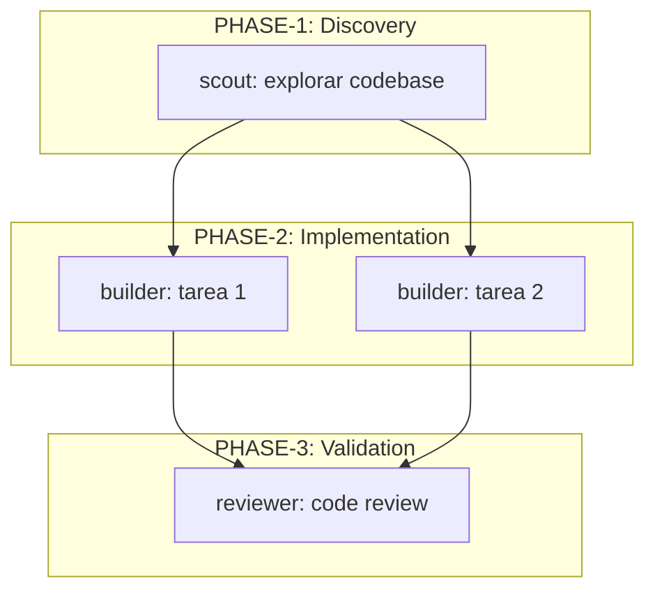

# /plan-with-team

Genera un plan de ejecucion completo con asignacion de equipos de agentes especializados, dependencias entre tareas, y plan de recuperacion.

---

## INPUT

```
$ARGUMENTS
```

---

## INSTRUCCIONES

Analiza la descripcion del trabajo proporcionada en `$ARGUMENTS` y genera un plan completo siguiendo TODOS los pasos a continuacion. No omitas ninguna seccion.

---

## PASO 1: ANALIZAR TRABAJO

1. Leer `$ARGUMENTS` y extraer:
   - Objetivo principal
   - Tecnologias involucradas (inferir del contexto si no se especifican)
   - Dominio (backend, frontend, infra, full-stack)
   - Archivos potencialmente afectados (usar Glob/Grep para verificar)

2. Calcular complejidad:

| Factor | Peso | Low (1) | Medium (2) | High (3) |
|--------|------|---------|------------|----------|
| Archivos | 20% | 1-2 | 3-5 | 6+ |
| Dominios | 20% | 1 | 2-3 | 4+ |
| Dependencias | 20% | 0-1 | 2-3 | 4+ |
| Seguridad | 20% | Ninguna | Data | Auth/Crypto |
| Integraciones | 20% | 0-1 | 2-3 | 4+ |

```
score = SUM(factor_value x peso x 20)
```

---

## PASO 2: ENSAMBLAR EQUIPO

Seleccionar agentes segun estas reglas:

| Agente | Condicion | Siempre/Condicional |
|--------|-----------|---------------------|
| `scout` | Exploracion previa del codebase | SIEMPRE |
| `builder` | Implementacion de codigo | SIEMPRE |
| `reviewer` | Validacion de calidad | SIEMPRE |
| `architect` | Complejidad > 40 | CONDICIONAL |
| `security-auditor` | Keywords: auth, token, password, jwt, api-key, data, encryption, sanitize | CONDICIONAL |
| `code-quality` | Keywords: refactor, cleanup, simplify O archivos > 5 | CONDICIONAL |

### Model Assignment

| Agente | Model por defecto | Cuando usar opus |
|--------|-------------------|------------------|
| `scout` | sonnet | Nunca |
| `builder` | sonnet | Arquitectura critica |
| `reviewer` | sonnet | Review de seguridad |
| `architect` | opus | Siempre |
| `security-auditor` | sonnet | Auth/crypto |
| `code-quality` | sonnet | Refactoring > 10 archivos |

### Skill Matching

Detectar keywords en `$ARGUMENTS` y asignar skills:

| Keywords | Skill |
|----------|-------|
| auth, jwt, password, security, token | `security-coding` |
| database, sql, drizzle, migration, query | `database-patterns` |
| test, mock, tdd, coverage | `testing-strategy` |
| api, endpoint, route, rest, openapi | `api-design` |
| typescript, async, promise, generic | `typescript-patterns` |
| websocket, realtime, ws, streaming | `websocket-patterns` |
| refactor, extract, SOLID, clean | `refactoring-patterns` |
| config, env, validation, settings | `config-validator` |
| bun, elysia, runtime, server | `bun-best-practices` |

---

## PASO 3: GENERAR PLAN

Producir un documento con TODAS las secciones siguientes. Cada seccion es OBLIGATORIA.

### Seccion 1: Objective

```markdown
## Objective

[1-3 frases describiendo que se quiere lograr y por que]

**Complejidad calculada**: [score]/60
**Archivos estimados**: [N]
**Riesgo**: [BAJO/MEDIO/ALTO]
```

### Seccion 2: Team Members

```markdown
## Team Members

| Agente | Rol en este plan | Model | Skills recomendadas | Background? |
|--------|------------------|-------|---------------------|-------------|
| scout | Explorar estructura y patterns existentes | sonnet | - | No |
| builder | Implementar codigo | sonnet | [skills] | No |
| reviewer | Validar calidad y correctitud | sonnet | code-style-enforcer | Si |
| ... | ... | ... | ... | ... |
```

### Seccion 3: Dependency Graph

```markdown
## Dependency Graph

(diagrama Mermaid obligatorio)
```



Usar esta leyenda:
- Nodos independientes en el mismo subgraph = ejecutar en PARALELO
- Flechas entre subgraphs = ejecutar SECUENCIAL
- Nodos con `[Blocking]` en label = requieren aprobacion

### Seccion 4: Tasks

Para CADA tarea, incluir TODOS estos campos:

```markdown
## Tasks

### Task 1: [Nombre descriptivo]
- **Agente**: [nombre]
- **Dependencias**: Ninguna | Task N
- **Prompt para el agente**:
  ```
  [Prompt exacto y completo que se le pasara al agente.
   Incluir contexto, archivos a tocar, patron a seguir,
   y criterio de completado.]
  ```
- **Criterio de completado**: [Condicion verificable]
- **Validation hook**: `bun typecheck` | `bun test [file]` | N/A

### Task 2: [Nombre descriptivo]
...
```

Reglas para los prompts de agentes:
- Ser especificos: incluir paths de archivos, nombres de funciones, patterns a seguir
- Incluir contexto: que existe, que se espera, como verificar
- Incluir criterio: como saber que esta terminado
- Para `builder`: incluir skill instructions si aplica
- Para `reviewer`: especificar que revisar y contra que criterios

### Seccion 5: Execution Instructions

```markdown
## Execution Instructions

### Grupo 1: Discovery (PARALELO)
Ejecutar simultaneamente:
- Task 1 (scout)

### Grupo 2: Implementation (PARALELO donde posible)
Ejecutar despues de Grupo 1:
- Task 2 (builder) + Task 3 (builder) [en paralelo si archivos independientes]
- Task 4 (builder) [secuencial, depende de Task 2]

### Grupo 3: Validation (PARALELO)
Ejecutar despues de Grupo 2:
- Task 5 (reviewer) + Task 6 (code-quality) [en paralelo]

### Env vars necesarias
| Variable | Requerida | Default |
|----------|-----------|---------|
| [var] | Si/No | [valor] |

### Pre-requisitos
- [ ] [Requisito antes de empezar]
```

### Seccion 6: Recovery Plan

```markdown
## Recovery Plan

| Escenario | Accion | Agente |
|-----------|--------|--------|
| Test falla | Analizar error, corregir, re-ejecutar test | builder |
| TypeScript error | Verificar types e imports, corregir | builder |
| NEEDS_CHANGES del reviewer | Aplicar feedback, re-submit a reviewer | builder -> reviewer |
| BLOCKED por dependencia externa | Escalar al Lead con contexto del bloqueo | Lead |
| Arquitectura inadecuada | Re-disenar con architect, re-implementar | architect -> builder |
| Fallo de seguridad detectado | security-auditor analiza, builder corrige | security-auditor -> builder |

### Loop de Correccion

(maximo 3 iteraciones antes de escalar al Lead)

1. builder implementa
2. reviewer evalua
3. Si NEEDS_CHANGES:
   a. builder corrige segun feedback
   b. reviewer re-evalua
   c. Si NEEDS_CHANGES de nuevo: repetir (max 3x)
   d. Si 3x fallidos: escalar al Lead con historial
4. Si APPROVED: marcar tarea como completada
```

---

## PASO 4: SELF-VALIDATION

Antes de finalizar, verificar que el plan contiene TODAS estas secciones:

| Seccion | Existe? |
|---------|---------|
| Objective | |
| Team Members | |
| Dependency Graph (Mermaid) | |
| Tasks (con prompts exactos) | |
| Execution Instructions | |
| Recovery Plan | |

Si falta alguna seccion, completarla antes de continuar.

---

## PASO 5: GUARDAR PLAN

1. Crear directorio `.specs/` si no existe:
   ```bash
   mkdir -p .specs
   ```

2. Slugificar el nombre del trabajo:
   - Lowercase
   - Espacios a guiones
   - Remover caracteres especiales
   - Max 50 caracteres

3. Guardar en `.specs/plan-{slug}.md`

4. Confirmar al usuario:
   ```
   Plan guardado en .specs/plan-{slug}.md

   Para ejecutar: delegar cada Task al agente correspondiente siguiendo
   el orden de Execution Instructions.
   ```

---

## EJEMPLO DE USO

```
/plan-with-team Implementar sistema de notificaciones real-time con WebSocket
```

Deberia generar un plan con:
- **Team**: scout + architect (complejidad > 40) + builder + reviewer
- **Skills**: websocket-patterns, typescript-patterns, bun-best-practices
- **Tasks**: scout explora ws existente, architect disena, builder implementa server + client, reviewer valida
- **Recovery**: fallback a polling si WS falla, loop builder-reviewer max 3x

---

## ANTI-PATTERNS

| NO hacer | SI hacer |
|----------|----------|
| Plan sin Mermaid | Siempre incluir Dependency Graph |
| Prompts vagos para agentes | Prompts con paths, funciones, patterns |
| Ignorar skills relevantes | Match keywords -> skills automatico |
| Team sin reviewer | Reviewer SIEMPRE presente |
| Sin recovery plan | Recovery con escenarios concretos |
| Guardar sin validar secciones | Self-validation ANTES de guardar |

---

**Version**: 1.0.0
**Category**: planning
**Related**: `/planner`, `/advanced-planner`, `/implement-spec`
