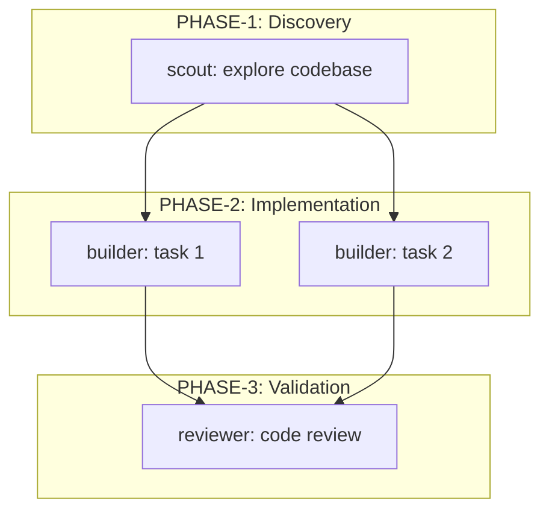

# /plan-with-team

Generates a complete execution plan with assignment of specialized agent teams, task dependencies, and a recovery plan.

---

## INPUT

```
$ARGUMENTS
```

---

## INSTRUCTIONS

Analyze the work description provided in `$ARGUMENTS` and generate a complete plan following ALL steps below. Do not omit any section.

---

## STEP 1: ANALYZE WORK

1. Read `$ARGUMENTS` and extract:
   - Main objective
   - Technologies involved (infer from context if not specified)
   - Domain (backend, frontend, infra, full-stack)
   - Potentially affected files (use Glob/Grep to verify)

2. Calculate complexity:

| Factor | Weight | Low (1) | Medium (2) | High (3) |
|--------|--------|---------|------------|----------|
| Files | 20% | 1-2 | 3-5 | 6+ |
| Domains | 20% | 1 | 2-3 | 4+ |
| Dependencies | 20% | 0-1 | 2-3 | 4+ |
| Security | 20% | None | Data | Auth/Crypto |
| Integrations | 20% | 0-1 | 2-3 | 4+ |

```
score = SUM(factor_value x weight x 20)
```

3. Evaluate execution mode:
   - If score > 60 AND independent domains >= 3 AND inter-domain communication needed:
     `execution_mode = team`
   - Otherwise: `execution_mode = subagents` (default)
   - See `complexity-routing.md` section "Execution Mode Decision" for full criteria

---

## STEP 2: ASSEMBLE TEAM

Select agents according to these rules:

| Agent | Condition | Always/Conditional |
|-------|-----------|-------------------|
| `scout` | Prior codebase exploration | ALWAYS |
| `builder` | Code implementation | ALWAYS |
| `reviewer` | Quality validation | ALWAYS |
| `architect` | Complexity > 40 | CONDITIONAL |
| `reviewer` | Keywords: auth, token, password, jwt, api-key, data, encryption, sanitize | CONDITIONAL |
| `reviewer` | Keywords: refactor, cleanup, simplify OR files > 5 | CONDITIONAL |

### Model Assignment

| Agent | Default model | When to use opus |
|-------|--------------|-----------------|
| `scout` | sonnet | Never |
| `builder` | sonnet | Critical architecture |
| `reviewer` | sonnet | Security review |
| `architect` | opus | Always |
| `reviewer` | sonnet | Auth/crypto |
| `reviewer` | sonnet | Refactoring > 10 files |

### Skill Matching

Detect keywords in `$ARGUMENTS` and assign skills:

| Keywords | Skill |
|----------|-------|
| auth, jwt, password, security, token | `security-review` |
| database, sql, drizzle, migration, query | `database-patterns` |
| test, mock, tdd, coverage | `testing-strategy` |
| api, endpoint, route, rest, openapi | `api-design` |
| typescript, async, promise, generic | `typescript-patterns` |
| websocket, realtime, ws, streaming | `websocket-patterns` |
| refactor, extract, SOLID, clean | `code-quality` (skill) |
| config, env, validation, settings | `config-validator` |
| bun, elysia, runtime, server | `bun-best-practices` |

---

## STEP 3: GENERATE PLAN

Produce a document with ALL the following sections. Each section is MANDATORY.

### Section 1: Objective

```markdown
## Objective

[1-3 sentences describing what is to be achieved and why]

**Calculated complexity**: [score]/60
**Estimated files**: [N]
**Risk**: [LOW/MEDIUM/HIGH]
**Execution mode**: subagents | team
```

### Section 2: Team Members

```markdown
## Team Members

| Agent | Role in this plan | Model | Recommended skills | Background? |
|-------|------------------|-------|--------------------|-------------|
| scout | Explore existing structure and patterns | sonnet | - | No |
| builder | Implement code | sonnet | [skills] | No |
| reviewer | Validate quality and correctness | sonnet | code-style-enforcer | Yes |
| ... | ... | ... | ... | ... |
```

### Section 3: Dependency Graph

```markdown
## Dependency Graph

(mandatory Mermaid diagram)
```


```mermaid
graph TD
  subgraph "PHASE-1: Discovery"
    S1[scout: explore codebase]
  end
  subgraph "PHASE-2: Implementation"
    B1[builder: task 1]
    B2[builder: task 2]
  end
  subgraph "PHASE-3: Validation"
    R1[reviewer: code review]
  end
  S1 --> B1
  S1 --> B2
  B1 --> R1
  B2 --> R1
```

Use this legend:
- Independent nodes in the same subgraph = execute in PARALLEL
- Arrows between subgraphs = execute SEQUENTIALLY
- Nodes with `[Blocking]` in label = require approval

### Section 4: Tasks

For EACH task, include ALL these fields:

```markdown
## Tasks

### Task 1: [Descriptive name]
- **Agent**: [name]
- **Dependencies**: None | Task N
- **Prompt for the agent**:
  ```
  [Exact and complete prompt that will be passed to the agent.
   Include context, files to touch, pattern to follow,
   and completion criteria.]
  ```
- **Completion criteria**: [Verifiable condition]
- **Validation hook**: `bun typecheck` | `bun test [file]` | N/A

### Task 2: [Descriptive name]
...
```

Rules for agent prompts:
- Be specific: include file paths, function names, patterns to follow
- Include context: what exists, what is expected, how to verify
- Include criteria: how to know it is done
- For `builder`: include skill instructions if applicable
- For `reviewer`: specify what to review and against which criteria

### Section 5: Execution Instructions

```markdown
## Execution Instructions

### Group 1: Discovery (PARALLEL)
Execute simultaneously:
- Task 1 (scout)

### Group 2: Implementation (PARALLEL where possible)
Execute after Group 1:
- Task 2 (builder) + Task 3 (builder) [in parallel if files are independent]
- Task 4 (builder) [sequential, depends on Task 2]

### Group 3: Validation (PARALLEL)
Execute after Group 2:
- Task 5 (reviewer) + Task 6 (reviewer) [in parallel]

### Required env vars
| Variable | Required | Default |
|----------|----------|---------|
| [var] | Yes/No | [value] |

### If Execution Mode = team

When the plan recommends `execution_mode = team`:

| Aspect | Behavior |
|--------|----------|
| Teammates | Each domain → one teammate (independent Claude Code process) |
| Config | Teammates automatically load `~/.claude/` (Poneglyph rules, skills, hooks) |
| Coordination | Via shared task list (TaskCreate/TaskUpdate/TaskList) |
| Monitoring | Lead monitors progress and handles final integration |
| Requirement | `CLAUDE_CODE_EXPERIMENTAL_AGENT_TEAMS=1` in settings.json |
| Fallback | If teammate fails 2x → extract domain → run as builder subagent |

### Prerequisites
- [ ] [Requirement before starting]
```

### Section 6: Recovery Plan

```markdown
## Recovery Plan

| Scenario | Action | Agent |
|----------|--------|-------|
| Test fails | Analyze error, fix, re-run test | builder |
| TypeScript error | Verify types and imports, fix | builder |
| NEEDS_CHANGES from reviewer | Apply feedback, re-submit to reviewer | builder -> reviewer |
| BLOCKED by external dependency | Escalate to Lead with block context | Lead |
| Inadequate architecture | Redesign with architect, re-implement | architect -> builder |
| Security failure detected | reviewer analyzes, builder fixes | reviewer -> builder |

### Correction Loop

(maximum 3 iterations before escalating to Lead)

1. builder implements
2. reviewer evaluates
3. If NEEDS_CHANGES:
   a. builder fixes according to feedback
   b. reviewer re-evaluates
   c. If NEEDS_CHANGES again: repeat (max 3x)
   d. If 3x failures: escalate to Lead with history
4. If APPROVED: mark task as complete
```

---

## STEP 4: SELF-VALIDATION

Before finishing, verify the plan contains ALL these sections:

| Section | Exists? |
|---------|---------|
| Objective | |
| Team Members | |
| Dependency Graph (Mermaid) | |
| Tasks (with exact prompts) | |
| Execution Instructions | |
| Recovery Plan | |

If any section is missing, complete it before continuing.

---

## STEP 5: SAVE PLAN

1. Create `.specs/` directory if it does not exist:
   ```bash
   mkdir -p .specs
   ```

2. Slugify the work name:
   - Lowercase
   - Spaces to hyphens
   - Remove special characters
   - Max 50 characters

3. Save to `.specs/plan-{slug}.md`

4. Confirm to the user:
   ```
   Plan saved to .specs/plan-{slug}.md

   To execute: delegate each Task to the corresponding agent following
   the order in Execution Instructions.
   ```

---

## USAGE EXAMPLE

```
/plan-with-team Implement real-time notification system with WebSocket
```

Should generate a plan with:
- **Team**: scout + architect (complexity > 40) + builder + reviewer
- **Skills**: websocket-patterns, typescript-patterns, bun-best-practices
- **Tasks**: scout explores existing ws, architect designs, builder implements server + client, reviewer validates
- **Recovery**: fallback to polling if WS fails, builder-reviewer loop max 3x

---

## ANTI-PATTERNS

| DO NOT | DO |
|--------|----|
| Plan without Mermaid | Always include Dependency Graph |
| Vague prompts for agents | Prompts with paths, functions, patterns |
| Ignore relevant skills | Auto-match keywords -> skills |
| Team without reviewer | Reviewer ALWAYS present |
| No recovery plan | Recovery with concrete scenarios |
| Save without validating sections | Self-validation BEFORE saving |

---

**Version**: 1.0.0
**Category**: planning
**Related**: `/planner`, `/advanced-planner`, `/implement-spec`
