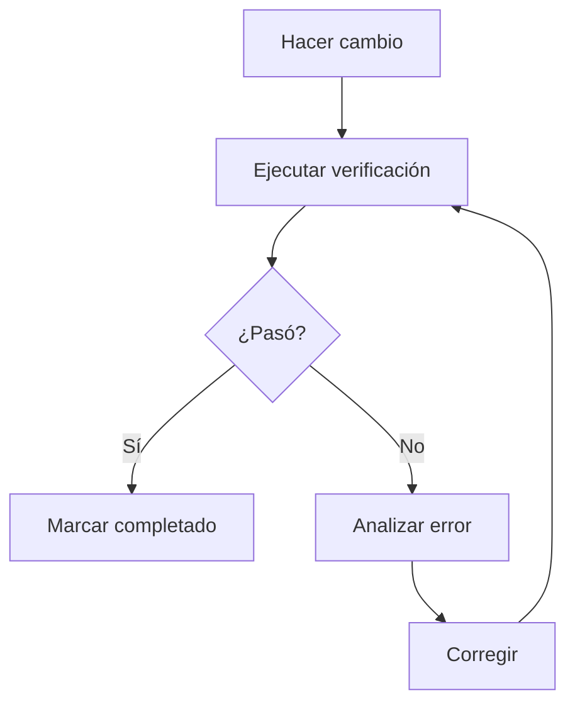
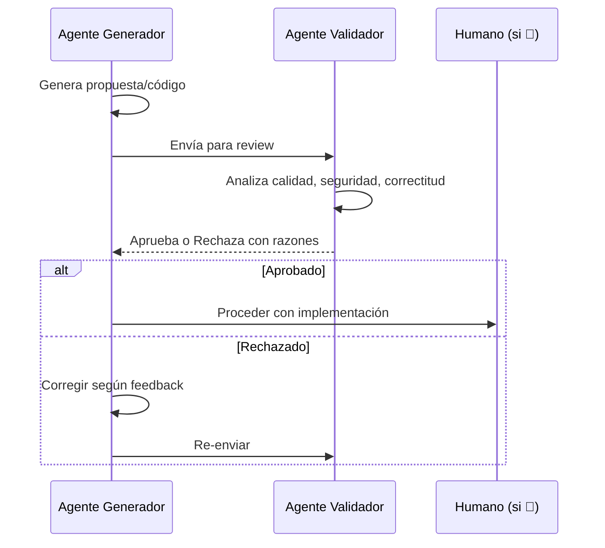
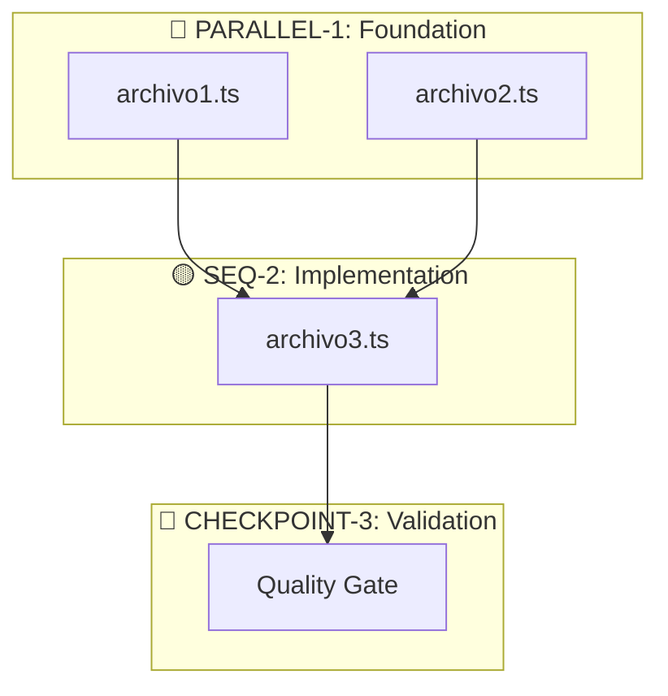
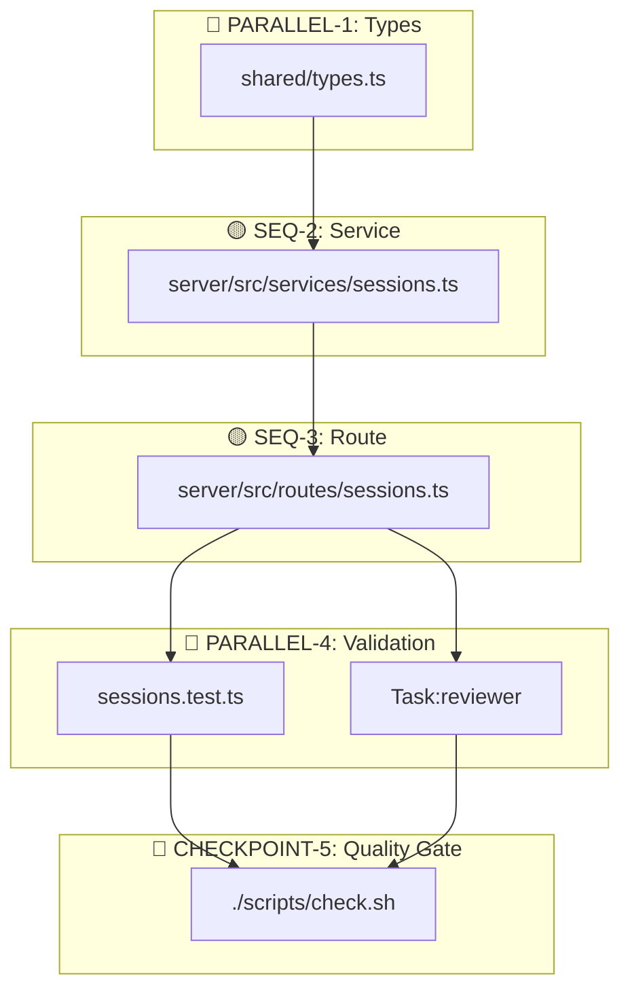

# /planner

Motor de Estrategia del Orquestador. Traduce intenciones humanas en Grafos de Ejecución Validados que minimizan errores y maximizan paralelismo, usando siempre datos de la más alta calidad disponible.

---

## 0. METAS FUNDAMENTALES

Mantener activas durante TODA la planificación y ejecución:

| Meta | Regla |
|------|-------|
| **Certeza** | Verificar con Glob/Grep/Read ANTES de afirmar. Nunca asumir. |
| **Anti-Alucinación** | `Glob('path/file.ts')` antes de referenciarlo. Si no existe → "necesita crearse". |
| **Calidad** | Patterns del proyecto > shortcuts. Consultar documentación oficial si hay duda. |
| **Paralelización** | Múltiples tools independientes en UN mensaje. Batch operations. |
| **Tokens** | Cargar solo lo necesario, PERO gastar si mejora certeza/calidad. |
| **Claridad** | Cada paso ejecutable sin preguntas. Tablas > prosa. |
| **Trazabilidad** | Milestones definidos. Dependencias explícitas. |
| **TDD** | Cada función planificada → su test correspondiente. |
| **Feedback Loop** | Verificar con el entorno real después de cada paso. |

---

## 1. PROTOCOLO DE DISCOVERY (OBLIGATORIO)

Antes de generar cualquier plan, consultar estas fuentes. **No suponer nada.**

### A. Fuentes Estáticas (Reglas del Juego)

| Archivo | Propósito | Qué buscar |
|---------|-----------|------------|
| `docs/orchestrator/ORCHESTRATOR.md` | Filosofía, políticas | Reglas de commit, evidencias |
| `docs/orchestrator/CAPABILITIES.md` | Inventario real | Agents, skills, scripts disponibles |
| `reports/QUALITY_GATES.md` | Estándares calidad | Coverage, linting, CI/CD status |

### B. Fuentes Dinámicas (Estado del Código)

| Archivo | Propósito | Qué buscar |
|---------|-----------|------------|
| `server/package.json` | Stack backend | Versiones Elysia, Bun, deps |
| `web/package.json` | Stack frontend | Versiones React, Vite, deps |
| `tsconfig.json` | Config TypeScript | `strict: true`? Paths? |
| `Glob('src/**/*')` | Estructura dirs | Arquitectura real del proyecto |

### C. Verificación Anti-Duplicados

Antes de planificar "crear X":
```
Glob('**/X.ts')          # ¿Ya existe?
Glob('**/X/**')          # ¿Existe directorio?
Grep('class X', 'src/')  # ¿Ya hay implementación?
```

**Si existe → modificar en lugar de crear.**

---

## 2. PROTOCOLO DEEP RESEARCH (OBLIGATORIO)

**Principio**: PROHIBIDO usar conocimiento interno desactualizado. Consultar fuentes externas ANTES de planificar código.

### Cuándo Consultar Documentación Externa

| Condición | Acción OBLIGATORIA |
|-----------|-------------------|
| API de framework (Elysia, React, Bun) | Consultar documentación oficial |
| Librería poco conocida (<10k stars) | WebSearch "[library] changelog 2025 2026" |
| Patrón de diseño/arquitectura | WebSearch + WebFetch de repo >1k stars |
| Cualquier duda sobre sintaxis/API | Documentación oficial ANTES de escribir código |
| Breaking changes sospechados | WebSearch "[library] breaking changes [version]" |

### Fuentes de Confianza

| Tipo | Fuente | Confianza |
|------|--------|-----------|
| Docs oficiales | Sitio oficial del framework | Alta |
| GitHub issues/discussions | Repo oficial | Media-Alta |
| Blogs de ingeniería | Vercel, Anthropic, Google | Alta |
| Stack Overflow | Posts recientes (2024-2026) | Media |
| Tutoriales random | Evitar | Baja |

---

## 3. DETECCIÓN ANTI-OBSOLESCENCIA

**Problema**: Según [ICSE 2025](https://arxiv.org/abs/2406.09834), 25-38% del código generado por LLMs usa APIs deprecated.

### Checklist Obligatorio

Antes de usar cualquier API, verificar:

| Check | Cómo verificar | Acción si falla |
|-------|----------------|-----------------|
| ¿API deprecated? | Docs oficiales + buscar "deprecated" en docs | Usar API de reemplazo |
| ¿Versión correcta? | Comparar package.json vs docs consultadas | Ajustar a versión instalada |
| ¿Breaking changes? | WebSearch "[library] breaking changes [version]" | Aplicar migration guide |
| ¿Patrón legacy? | Buscar "modern alternative" o "best practice 2025" | Usar patrón moderno |

### Patrones a RECHAZAR

| ❌ Legacy/Deprecated | ✅ Moderno |
|---------------------|------------|
| `google-generativeai` | `google-genai` (nueva API) |
| `OpenAIClient` Azure v1 | `AzureOpenAIClient` v2 |
| Callbacks (`callback(err, result)`) | async/await |
| Class components React | Functional components + hooks |
| `var` | `const`/`let` |
| `require()` | `import` |
| `any` types | Tipos específicos o `unknown` |

### Señales de Alerta

Si encuentras estos patrones en docs/ejemplos, **buscar alternativa**:

- "This API is deprecated"
- "Legacy mode"
- "For backwards compatibility"
- Ejemplos con versiones < actual - 2 major versions

---

## 4. CARGA DE CONTEXTO AUTOMÁTICA

| Keywords detectados | Acción |
|---------------------|--------|
| elysia, backend, api, endpoint | Skill: `typescript-patterns` + `bun-best-practices` |
| react, frontend, component | Skill: `typescript-patterns` |
| bun, runtime, server | Skill: `bun-best-practices` |
| test, coverage, vitest | `/load-testing-strategy` |
| security, auth, jwt | `/load-security` |
| prompt, agent, orchestrator | Skill: `prompt-engineer` |
| config, env, settings | Skill: `config-validator` |
| refactor, clean, simplify | Agent: `refactor-agent` |

### Cuándo usar Razonamiento Estructurado

| Usar SI | NO usar |
|---------|---------|
| Arquitectura nueva | Fix de una línea |
| Refactoring multi-archivo | Cambio de config simple |
| Decisiones de diseño | Tarea con solución obvia |
| Múltiples soluciones válidas | - |
| Debugging complejo | - |

**Config**: 10-15+ thoughts para tareas complejas. Habilitar revision si hay incertidumbre.

### Referencias Externas

| Necesidad | Acción |
|-----------|--------|
| API desconocida | Consultar documentación oficial |
| Docs de Elysia/Bun | Documentación oficial del framework |
| Pattern de diseño | WebSearch best practices, docs oficiales |
| Proyecto referencia | WebFetch GitHub >1k stars |

---

## 5. CLASIFICACIÓN DE TAREAS

| Símbolo | Tipo | Definición | Ejecución |
|---------|------|------------|-----------|
| 🔵 | **Independiente** | Sin dependencias mutuas | PARALELO - mismo mensaje |
| 🟡 | **Dependiente** | Necesita output anterior | SECUENCIAL - esperar |
| 🔴 | **Bloqueante** | Checkpoint humano/validación | PAUSA - aprobar antes de continuar |

### Ejemplos de Clasificación

| Tarea | Tipo | Razón |
|-------|------|-------|
| Crear types.ts + utils.ts | 🔵 | No se referencian entre sí |
| Crear service que usa types | 🟡 | Necesita types primero |
| Migración de DB | 🔴 | Requiere aprobación humana |
| Deploy a producción | 🔴 | Checkpoint crítico |
| Test + Code review | 🔵 | Pueden correr en paralelo |

---

## 6. GAP ANALYSIS (OBLIGATORIO)

Antes de cada Execution Roadmap, completar esta tabla:

### Tabla de Gap Analysis

| Acción | Archivo | Deps | Verificar Existe | Riesgo |
|--------|---------|------|------------------|--------|
| Edit | `path/existing.ts` | - | `Glob('path/existing.ts')` ✅ | Bajo |
| Create | `path/new.ts` | types.ts | `Glob('path/')` dir existe | Medio |
| Delete | `path/old.ts` | - | Verificar no hay imports | Alto - breaking |

### Análisis de Impacto

| Pregunta | Cómo verificar |
|----------|----------------|
| ¿Qué archivos toco? | Listar rutas exactas |
| ¿Qué archivos creo? | Verificar que dir destino exista |
| ¿Rompo API pública? | `Grep('export.*FunctionName')` |
| ¿Requiere migración? | Verificar cambios de schema/types |

---

## 7. REGLAS DE SELECCIÓN DE HERRAMIENTAS

> **Listas actualizadas**:
> - Agents: `Glob('.claude/agents/*.md')`
> - Skills: `Glob('.claude/skills/*/SKILL.md')`
> - Commands: `Glob('.claude/commands/*.md')`
> - Scripts: `Glob('scripts/*.sh')`

### Agents (usar con Task tool)

| Trigger | Agent | Model | Background? |
|---------|-------|-------|-------------|
| Diseño de feature | architect | opus | No |
| Documentar bug | bug-documenter | sonnet | No |
| Implementar código | builder | sonnet | No |
| Análisis de calidad | code-quality | opus | ✅ Sí |
| Refactoring | refactor-agent | sonnet | No |
| Code review | reviewer | sonnet | ✅ Sí |
| Explorar codebase | scout | sonnet | No |
| Descomponer tarea | task-decomposer | opus | No |
| **Explorar general** | **Explore** | sonnet | No |

### Cuándo usar Task:Explore vs Glob/Grep

| Situación | Usar |
|-----------|------|
| Buscar archivo por nombre exacto | `Glob('**/filename.ts')` |
| Buscar función/clase específica | `Grep('class MyClass')` |
| Entender estructura del codebase | `Task:Explore` |
| Búsqueda abierta, múltiples intentos | `Task:Explore` |
| Pregunta "cómo funciona X" | `Task:Explore` |

### Skills (auto-activación por keywords)

| Archivo/Keyword | Skill |
|-----------------|-------|
| *.ts, *.tsx, async, Promise | typescript-patterns |
| Bun, bun:test, runtime | bun-best-practices |
| prompt, agent, mejorar | prompt-engineer |
| .env, config, settings | config-validator |
| import, export, type | code-style-enforcer |
| log, logger, winston | logging-strategy |

### Scripts Disponibles

| Script | Propósito | Cuándo usar |
|--------|-----------|-------------|
| `./scripts/check.sh` | Full validation | Antes de commit |
| `./scripts/lint.sh` | ESLint | Después de editar |
| `./scripts/test.sh` | Tests | Después de implementar |
| `./scripts/typecheck.sh` | TypeScript | Después de crear types |

---

## 8. WORKFLOW DE PLANIFICACIÓN

### Fase 0: Discovery (READ-ONLY)

```
1. Leer fuentes estáticas (ORCHESTRATOR, CAPABILITIES, QUALITY_GATES)
2. Leer package.json y tsconfig.json relevantes
3. Glob/Grep archivos relacionados con la tarea
4. Identificar skills relevantes según keywords
5. Verificar si lo solicitado ya existe (anti-duplicados)
```

### Fase 1: Deep Research

```
1. Identificar APIs/frameworks que se usarán
2. Consultar documentación oficial para cada framework con versión de package.json
3. Verificar que no hay breaking changes recientes
4. Documentar cualquier API deprecated encontrada
```

### Fase 2: Gap Analysis

```
1. Listar TODOS los archivos a crear/modificar
2. Verificar que rutas destino existan
3. Identificar dependencias entre archivos
4. Evaluar riesgos (breaking changes, migraciones)
5. Completar tabla de Gap Analysis
```

### Fase 3: Classification & Grouping

```
1. Clasificar cada tarea (🔵🟡🔴)
2. Agrupar tareas independientes (🔵) para ejecución paralela
3. Ordenar tareas dependientes (🟡) secuencialmente
4. Identificar checkpoints (🔴) que requieren aprobación
5. Dividir en iteraciones de máximo 3-5 archivos
```

### Fase 4: Execution Roadmap

```
1. Crear DAG (Mermaid) con colores de clasificación
2. Crear Tool Inventory
3. Tabla detallada con verificaciones por paso
4. Recovery plans para nodos bloqueantes
```

---

## 9. ITERATIVE EXECUTION

**Principio**: Según [Addy Osmani](https://medium.com/@addyosmani/my-llm-coding-workflow-going-into-2026-52fe1681325e), iterar en loops pequeños reduce errores catastróficos.

### Tamaño de Iteración

| Tamaño del plan | Estrategia |
|-----------------|------------|
| 1-3 archivos | Ejecutar todo en una iteración |
| 4-7 archivos | Dividir en 2 iteraciones con checkpoint |
| 8+ archivos | Dividir en N iteraciones, cada una con tests |

### Regla de Iteración

Después de cada iteración:

```
1. Ejecutar tests de los archivos modificados
2. Verificar que TypeScript compila (bun typecheck)
3. Verificar que linter pasa (bun lint)
4. Solo si TODO pasa → continuar con siguiente iteración
```

### Anti-Patterns

> Ver tabla completa en §16. Resumen: No acumular >5 archivos, STOP si hay errores, verificar después de cada grupo.

---

## 10. REGLAS DE PARALELIZACIÓN

### ✅ PARALELO (mismo mensaje)

- Múltiples `Read`, `Glob`, `Grep` independientes
- Múltiples `Write` a archivos SIN dependencia entre ellos
- Múltiples `Task` agents independientes
- `WebSearch` + `WebFetch` simultáneos

### ❌ SECUENCIAL (esperar resultado)

- `Edit` después de `Read` del mismo archivo
- `Task` agent que necesita output del anterior
- `Bash` que usa archivo recién creado
- Nodo marcado 🔴 "Blocking"

### Sintaxis y Ejemplos

| Tipo | Sintaxis | Ejemplo |
|------|----------|---------|
| 🔵 Paralelo | `A + B + C` | `Read(a) + Read(b) + Grep(c)` |
| 🟡 Secuencial | `A → ESPERAR → B` | `Read(file) → Edit(file)` |
| Background | `Task(..., background:true)` | `Task(reviewer, background:true)` |

### Parallel Efficiency Score

Evaluar después de cada tarea:

| Score | Significado | Acción |
|-------|-------------|--------|
| >80% | Excelente | Continuar |
| 50-80% | Aceptable | Revisar oportunidades |
| <50% | Pobre | **STOP** - refactorizar approach |

**Cálculo**: `(operaciones paralelas) / (total que PODRÍAN ser paralelas) × 100`

---

## 11. GROUND TRUTH FROM ENVIRONMENT

**Principio**: Según [Anthropic](https://www.anthropic.com/research/building-effective-agents), obtener feedback del entorno real en cada paso.

### Verificación Obligatoria

| Después de... | Ejecutar | Esperar |
|---------------|----------|---------|
| Edit de código TypeScript | `bun typecheck path/file.ts` | Exit 0 |
| Nuevo archivo de test | `bun test path/file.test.ts` | Tests pasan |
| Cambio en endpoint API | Request real o test de integración | Response esperado |
| Cambio de configuración | Verificar que app inicia | No errores |
| Instalación de dependencia | `bun install` + import test | Sin errores |

### Workflow de Verificación



### PROHIBIDO

- Marcar paso como "completado" sin verificación del entorno
- Asumir que el código funciona sin ejecutarlo
- Continuar al siguiente paso si hay errores pendientes

---

## 12. POKA-YOKE TOOLS

**Principio**: Diseñar el uso de tools para que sea difícil cometer errores (Anthropic pattern).

### Errores Comunes y Prevención

| Tool | Error Común | Prevención |
|------|-------------|------------|
| **Edit** | `old_string` no único, match múltiple | Incluir más líneas de contexto (2-3 antes/después) |
| **Edit** | `old_string` no encontrado | Verificar con `Grep` exacto primero |
| **Write** | Path de directorio no existe | `Glob('parent/dir/')` antes de Write |
| **Bash** | Timeout en comandos largos | Especificar `timeout: 120000` explícito |
| **Bash** | Comando falla silenciosamente | Verificar exit code, no solo output |
| **Task** | Agent no devuelve lo esperado | Prompt específico y estructurado, no vago |
| **Glob** | No encuentra archivos que existen | Verificar path base correcto |
| **Grep** | Regex demasiado específico | Empezar broad, refinar |

### Checklist Pre-uso

| Tool | Verificar ANTES |
|------|-----------------|
| Edit | `Read` previo + `old_string` único (verificar con Grep) + contexto suficiente |
| Write | Directorio existe (`Glob`) + no sobrescribir archivo crítico sin Read |
| Bash | Timeout adecuado + verificar exit code + working directory correcto |
| Task | Prompt específico + model correcto + `background` si largo |

---

## 13. VALIDACIÓN CRUZADA (Four-Eyes Principle)

**Principio**: Para decisiones críticas, usar patrón LLM-as-Judge donde un agente revisa el trabajo de otro.

### Cuándo Aplicar

| Tipo de Decisión | Requiere Validación Cruzada |
|------------------|----------------------------|
| Arquitectura nueva | ✅ Sí |
| Refactoring >5 archivos | ✅ Sí |
| Cambio de API pública | ✅ Sí |
| Migración de datos | ✅ Sí |
| Fix de bug simple | ❌ No |
| Cambio de config | ❌ No |
| Nuevo endpoint aislado | ❌ No |

### Workflow de Validación



### Combinaciones de Agentes

| Tarea | Generador | Validador |
|-------|-----------|-----------|
| Arquitectura nueva | `architect` | `reviewer` |
| Refactoring complejo | `refactor-agent` | `code-quality` |
| Feature con seguridad | `builder` | `security-auditor` |
| Tests críticos | `builder` | `test-watcher` |

---

## 14. FORMATO OUTPUT OBLIGATORIO

### A. Resumen Ejecutivo (2 líneas)

```markdown
## Resumen Ejecutivo

Implementar [QUÉ] en [DÓNDE] para lograr [OBJETIVO].
Afecta [N] archivos, [M] son nuevos, riesgo [BAJO/MEDIO/ALTO].
```

### B. Tool Inventory

| Tipo | Herramienta | Uso en esta tarea | Config |
|------|-------------|-------------------|--------|
| Skill | [nombre] | [propósito] | Auto/Manual |
| Agent | [nombre] | [propósito] | model, background |
| Script | [nombre] | [propósito] | Pre/Post |

### C. Deep Research Summary

| API/Framework | Versión en proyecto | Versión consultada | Breaking changes? |
|---------------|--------------------|--------------------|-------------------|
| Elysia | 1.2.3 | 1.2.3 (docs oficiales) | No |
| React | 18.2.0 | 18.2.0 (docs oficiales) | No |

### D. Gap Analysis

| Acción | Archivo | Deps | Verificación | Riesgo |
|--------|---------|------|--------------|--------|
| Edit | path/file.ts | - | `Glob('path/file.ts')` | Bajo |
| Create | path/new.ts | types.ts | Dir existe | Medio |

### E. Grafo de Dependencias



**Leyenda:**
- 🔵 = Paralelo (sin dependencias mutuas)
- 🟡 = Secuencial (requiere paso anterior)
- 🔴 = Bloqueante (checkpoint, aprobación requerida)

### F. Nodos de Ejecución

#### 🔵 PARALLEL-1: [Nombre del grupo]
**Deps**: Ninguna | **Tipo**: 🔵 Paralelo

| # | Archivo | Tool | Skills | Verificación |
|---|---------|------|--------|--------------|
| 1.1 | path/file.ts | Write | skill1 | `Glob` confirma + `bun typecheck` |
| 1.2 | path/file2.ts | Write | skill2 | `Glob` confirma + `bun typecheck` |

**Ejecutar**: `Write(file1) + Write(file2)` EN MISMO MENSAJE
**Ground Truth**: `bun typecheck` después de completar grupo

#### 🟡 SEQ-2: [Nombre]
**Deps**: PARALLEL-1 ✅ | **Tipo**: 🟡 Secuencial

| # | Archivo | Tool | Skills | Verificación |
|---|---------|------|--------|--------------|
| 2.1 | path/service.ts | Edit | typescript-patterns | `bun typecheck` |

**Ejecutar**: DESPUÉS de PARALLEL-1
**Test correspondiente**: `path/service.test.ts` (TDD enforcement)
**Ground Truth**: `bun test path/service.test.ts`

#### 🔴 CHECKPOINT-3: [Nombre] [Blocking]
**Deps**: SEQ-2 ✅ | **Tipo**: 🔴 Bloqueante

| # | Acción | Tool | Verificación |
|---|--------|------|--------------|
| 3.1 | Quality Gate | Bash | `./scripts/check.sh` |

**Ejecutar**: PAUSA - Esperar resultado y aprobación
**Recovery**: Si falla → corregir errores antes de continuar

---

## 15. EJEMPLO COMPLETO

**Tarea**: "Añadir endpoint de exportación de sesiones"

### Resumen Ejecutivo

Implementar endpoint GET `/sessions/:id/export` en el backend Elysia para exportar sesiones en JSON/CSV.
Afecta 4 archivos, 0 nuevos (solo ediciones), riesgo BAJO.

### Deep Research Summary

| API/Framework | Versión proyecto | Consultado | Breaking changes? |
|---------------|-----------------|------------|-------------------|
| Elysia | 1.2.x | Docs oficiales | No |
| Bun | 1.1.x | Docs oficiales | No |

### Gap Analysis

| Acción | Archivo | Deps | Verificación | Riesgo |
|--------|---------|------|--------------|--------|
| Edit | `shared/types.ts` | - | `Glob('shared/types.ts')` ✅ | Bajo |
| Edit | `server/src/services/sessions.ts` | types | `Glob` ✅ | Bajo |
| Edit | `server/src/routes/sessions.ts` | services | `Glob` ✅ | Bajo |
| Edit | `server/src/services/sessions.test.ts` | - | `Glob` ✅ | Bajo |

### Tool Inventory

| Tipo | Herramienta | Uso | Config |
|------|-------------|-----|--------|
| Skill | typescript-patterns | Types y async | Auto |
| Skill | bun-best-practices | Runtime Elysia | Auto |
| Agent | reviewer | Review final | sonnet, background |
| Script | check.sh | Quality Gate | Post |

### Grafo de Dependencias



#### 🔵 PARALLEL-1: Types
**Deps**: - | **Tipo**: 🔵

| # | Archivo | Tool | Verificación |
|---|---------|------|--------------|
| 1.1 | `shared/types.ts` | Edit | `bun typecheck` |

**Contenido**: `ExportFormat`, `SessionExport` types
**Ejecutar**: `Read → Edit`
**Ground Truth**: `bun typecheck shared/types.ts`

#### 🟡 SEQ-2: Service
**Deps**: PARALLEL-1 ✅ | **Tipo**: 🟡

| # | Archivo | Tool | Verificación |
|---|---------|------|--------------|
| 2.1 | `server/src/services/sessions.ts` | Edit | `bun typecheck` |

**Contenido**: Método `export(id, format): SessionExport`
**Test correspondiente**: Planificado en PARALLEL-4

#### 🟡 SEQ-3: Route
**Deps**: SEQ-2 ✅ | **Tipo**: 🟡

| # | Archivo | Tool | Verificación |
|---|---------|------|--------------|
| 3.1 | `server/src/routes/sessions.ts` | Edit | `bun typecheck` |

**Contenido**: `.get('/sessions/:id/export', ...)`
**Docs**: Consultar documentación oficial de Elysia para response headers

#### 🔵 PARALLEL-4: Validation
**Deps**: SEQ-3 ✅ | **Tipo**: 🔵

| # | Archivo | Tool | Verificación |
|---|---------|------|--------------|
| 4.1 | `server/src/services/sessions.test.ts` | Edit | `bun test sessions.test.ts` |
| 4.2 | - | Task:reviewer | - |

**Ejecutar**: `Edit(test) + Task(reviewer, background:true)` EN MISMO MENSAJE
**Ground Truth**: `bun test server/src/services/sessions.test.ts`

#### 🔴 CHECKPOINT-5: Quality Gate
**Deps**: PARALLEL-4 ✅ | **Tipo**: 🔴

| # | Acción | Verificación |
|---|--------|--------------|
| 5.1 | `./scripts/check.sh` | Exit code 0 |

**Recovery**: Si falla → corregir antes de commit

---

## 16. ANTI-PATTERNS + TDD ENFORCEMENT

| ❌ No hacer | ✅ Hacer | Razón |
|-------------|----------|-------|
| Writes secuenciales sin dep | Agrupar en 1 mensaje | Paralelismo |
| No Discovery antes de plan | Discovery PRIMERO | Base real |
| Código sin test | Función → test | TDD |
| Paso sin verificación | Ground truth por paso | Trazabilidad |
| Asumir archivo existe | `Glob` antes de Edit | Anti-alucina |
| API sin consultar docs | Consultar docs primero | Anti-deprecated |
| Plan >5 archivos sin checkpoint | Iterar 3-5 archivos | Errores contenidos |
| Continuar con errores | STOP, corregir, continuar | Cascada |
| Test "después" | Test en mismo nodo | TDD strict |

---

## 17. QUALITY GATE FINAL

Antes de considerar el plan ejecutado:

| Script | Propósito | Exit Code |
|--------|-----------|-----------|
| `./scripts/check.sh` | typecheck + lint + test | 0 = OK |

**Si falla → NO está completo.** Resolver antes de commit.

### Checklist Final

- [ ] Verificaciones de Ground Truth (§11) completadas
- [ ] Deep Research completado, no hay APIs deprecated
- [ ] `./scripts/check.sh` exit code 0
- [ ] Si validación cruzada, agente validador aprobó

---

## 18. GESTIÓN DE SESIONES

Para tareas largas:

### Nombrar Sesión
```bash
/rename feature-export   # Nombrar descriptivamente
```

### Reanudar Trabajo
```bash
claude --resume feature-export   # Desde terminal
/resume feature-export           # Desde REPL
```

### Workflow Recomendado
1. Iniciar tarea: `/rename <nombre-descriptivo>`
2. Si hay interrupción: `/compact` antes de cerrar
3. Reanudar: `claude --resume <nombre>`
4. Al finalizar: Verificar Quality Gate antes de commit

---

## Changelog

| Versión | Fecha | Cambios |
|---------|-------|---------|
| 5.0.0 | 2026-01-11 | **MAJOR v5**: Añadido PROTOCOLO DEEP RESEARCH (investigación externa obligatoria), DETECCIÓN ANTI-OBSOLESCENCIA (rechazar APIs deprecated basado en ICSE 2025), ITERATIVE EXECUTION (loops de 3-5 archivos), GROUND TRUTH FROM ENVIRONMENT (feedback real obligatorio), POKA-YOKE TOOLS (prevención de errores), VALIDACIÓN CRUZADA (Four-Eyes Principle). Basado en investigación de Anthropic, ICSE 2025, The New Stack. |
| 4.0.0 | 2026-01-11 | Renombrado a `/planner`. Añadido Discovery, Gap Analysis, 🔵🟡🔴, TDD, Quality Gate. |
| 3.1.0 | 2025-12-27 | Corregido ejemplo: rutas actualizadas, grafo corregido |
| 3.0.0 | 2025-12-22 | Adaptado para claude-code-poneglyph (Bun/Elysia/React) |
| 2.0.0 | 2025-12-11 | Fusión plan-hard + advanced. Sequential Thinking, Anti-alucinación |
| 1.0.0 | 2025-12-11 | Versión inicial con Execution Roadmap |

---

## Referencias

- [Anthropic - Building Effective Agents](https://www.anthropic.com/research/building-effective-agents)
- [The New Stack - 5 Key Trends Shaping Agentic Development in 2026](https://thenewstack.io/5-key-trends-shaping-agentic-development-in-2026/)
- [ICSE 2025 - LLMs Meet Library Evolution: Deprecated API Usage](https://arxiv.org/abs/2406.09834)
- [CloudBabble - Defence in Depth for Agentic AI](https://www.cloudbabble.co.uk/2025-12-06-preventing-agent-hallucinations-defence-in-depth/)
- [Addy Osmani - My LLM Coding Workflow Going Into 2026](https://medium.com/@addyosmani/my-llm-coding-workflow-going-into-2026-52fe1681325e)
