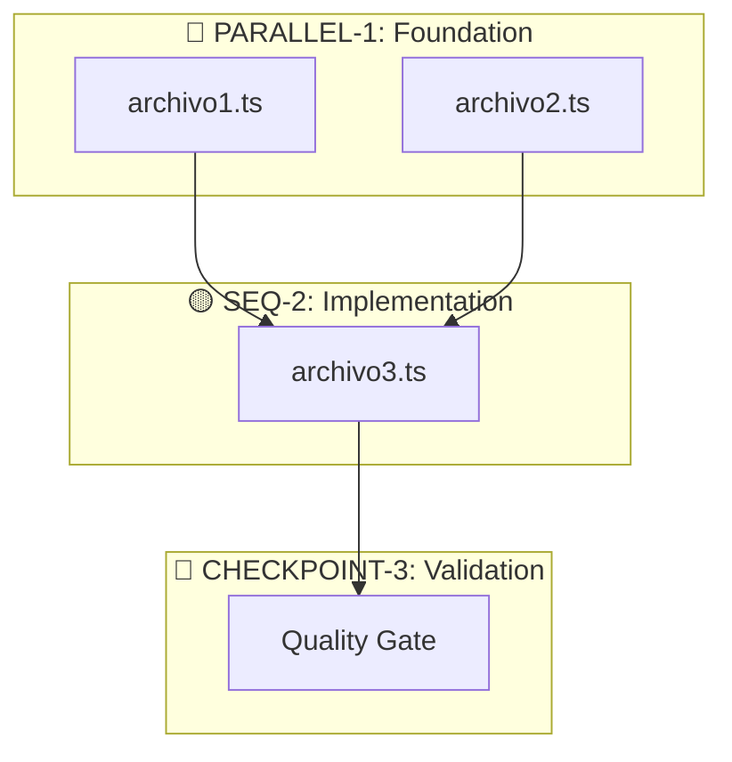
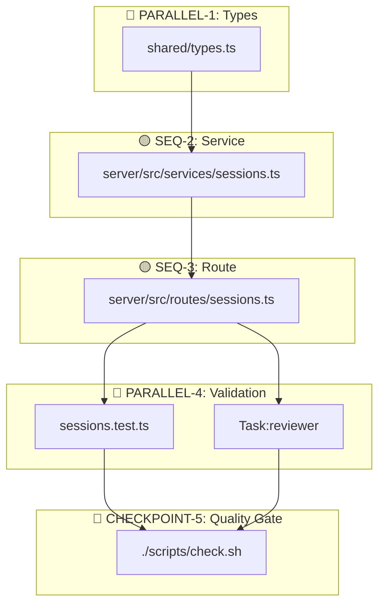

# /planner

Motor de Estrategia del Orquestador. Traduce intenciones humanas en Grafos de Ejecución Validados que minimizan errores y maximizan paralelismo.

---

## 0. METAS FUNDAMENTALES

Mantener activas durante TODA la planificación y ejecución:

| Meta | Regla |
|------|-------|
| **Certeza** | Verificar con Glob/Grep/Read ANTES de afirmar. Nunca asumir. |
| **Anti-Alucinación** | `Glob('path/file.ts')` antes de referenciarlo. Si no existe → "necesita crearse". |
| **Calidad** | Patterns del proyecto > shortcuts. Consultar Context7 si hay duda. |
| **Paralelización** | Múltiples tools independientes en UN mensaje. Batch operations. |
| **Tokens** | Cargar solo lo necesario, PERO gastar si mejora certeza/calidad. |
| **Claridad** | Cada paso ejecutable sin preguntas. Tablas > prosa. |
| **Trazabilidad** | Milestones definidos. Dependencias explícitas. |
| **TDD** | Cada función planificada → su test correspondiente. |

---

## 1. PROTOCOLO DE DISCOVERY (OBLIGATORIO)

Antes de generar cualquier plan, consultar estas fuentes. **No suponer nada.**

### A. Fuentes Estáticas (Reglas del Juego)

| Archivo | Propósito | Qué buscar |
|---------|-----------|------------|
| `docs/orchestrator/ORCHESTRATOR.md` | Filosofía, políticas | Reglas de commit, evidencias |
| `docs/orchestrator/CAPABILITIES.md` | Inventario real | Agents, skills, scripts disponibles |
| `reports/QUALITY_GATES.md` | Estándares calidad | Coverage, linting, CI/CD status |

### B. Fuentes Dinámicas (Estado del Código)

| Archivo | Propósito | Qué buscar |
|---------|-----------|------------|
| `server/package.json` | Stack backend | Versiones Elysia, Bun, deps |
| `web/package.json` | Stack frontend | Versiones React, Vite, deps |
| `tsconfig.json` | Config TypeScript | `strict: true`? Paths? |
| `Glob('src/**/*')` | Estructura dirs | Arquitectura real del proyecto |

### C. Verificación Anti-Duplicados

Antes de planificar "crear X":
```
Glob('**/X.ts')          # ¿Ya existe?
Glob('**/X/**')          # ¿Existe directorio?
Grep('class X', 'src/')  # ¿Ya hay implementación?
```

**Si existe → modificar en lugar de crear.**

---

## 2. CARGA DE CONTEXTO AUTOMÁTICA

| Keywords detectados | Acción |
|---------------------|--------|
| elysia, backend, api, endpoint | Skill: `typescript-patterns` + `bun-best-practices` |
| react, frontend, component | Skill: `typescript-patterns` |
| bun, runtime, server | Skill: `bun-best-practices` |
| test, coverage, vitest | `/load-testing-strategy` |
| security, auth, jwt | `/load-security` |
| prompt, agent, orchestrator | Skill: `prompt-engineer` |
| config, env, settings | Skill: `config-validator` |
| refactor, clean, simplify | Agent: `refactor-agent` |

### Cuándo usar Sequential Thinking

```
mcp__sequential-thinking__sequentialthinking
```

| Usar SI | NO usar |
|---------|---------|
| Arquitectura nueva | Fix de una línea |
| Refactoring multi-archivo | Cambio de config simple |
| Decisiones de diseño | Tarea con solución obvia |
| Múltiples soluciones válidas | - |
| Debugging complejo | - |

**Config**: 10-15+ thoughts para tareas complejas. Habilitar revision si hay incertidumbre.

### Referencias Externas y MCPs

| Necesidad | Tool | Comando |
|-----------|------|---------|
| API desconocida | Context7 | `mcp__context7__query-docs` |
| Docs de Elysia/Bun | Context7 | `mcp__context7__query-docs` |
| Razonamiento complejo | Sequential Thinking | `mcp__sequential-thinking__sequentialthinking` |
| Pattern de diseño | WebSearch | Best practices, docs oficiales |
| Proyecto referencia | WebFetch | GitHub >1k stars |

---

## 3. GAP ANALYSIS (OBLIGATORIO)

Antes de cada Execution Roadmap, completar esta tabla:

### Tabla de Gap Analysis

| Acción | Archivo | Deps | Verificar Existe | Riesgo |
|--------|---------|------|------------------|--------|
| Edit | `path/existing.ts` | - | `Glob('path/existing.ts')` ✅ | Bajo |
| Create | `path/new.ts` | types.ts | `Glob('path/')` dir existe | Medio |
| Delete | `path/old.ts` | - | Verificar no hay imports | Alto - breaking |

### Análisis de Impacto

| Pregunta | Cómo verificar |
|----------|----------------|
| ¿Qué archivos toco? | Listar rutas exactas |
| ¿Qué archivos creo? | Verificar que dir destino exista |
| ¿Rompo API pública? | `Grep('export.*FunctionName')` |
| ¿Requiere migración? | Verificar cambios de schema/types |

---

## 4. CLASIFICACIÓN DE TAREAS

| Símbolo | Tipo | Definición | Ejecución |
|---------|------|------------|-----------|
| 🔵 | **Independiente** | Sin dependencias mutuas | PARALELO - mismo mensaje |
| 🟡 | **Dependiente** | Necesita output anterior | SECUENCIAL - esperar |
| 🔴 | **Bloqueante** | Checkpoint humano/validación | PAUSA - aprobar antes de continuar |

### Ejemplos de Clasificación

| Tarea | Tipo | Razón |
|-------|------|-------|
| Crear types.ts + utils.ts | 🔵 | No se referencian entre sí |
| Crear service que usa types | 🟡 | Necesita types primero |
| Migración de DB | 🔴 | Requiere aprobación humana |
| Deploy a producción | 🔴 | Checkpoint crítico |
| Test + Code review | 🔵 | Pueden correr en paralelo |

---

## 5. REGLAS DE SELECCIÓN DE HERRAMIENTAS

> **Listas actualizadas**:
> - Agents: `Glob('.claude/agents/*.md')`
> - Skills: `Glob('.claude/skills/*/SKILL.md')`
> - Commands: `Glob('.claude/commands/*.md')`
> - Scripts: `Glob('scripts/*.sh')`

### Agents (usar con Task tool)

| Trigger | Agent | Model | Background? |
|---------|-------|-------|-------------|
| Diseño de feature | architect | opus | No |
| Documentar bug | bug-documenter | sonnet | No |
| Implementar código | builder | sonnet | No |
| Análisis de calidad | code-quality | opus | ✅ Sí |
| Refactoring | refactor-agent | sonnet | No |
| Code review | reviewer | sonnet | ✅ Sí |
| Explorar codebase | scout | sonnet | No |
| Descomponer tarea | task-decomposer | opus | No |
| **Explorar general** | **Explore** | sonnet | No |

### Cuándo usar Task:Explore vs Glob/Grep

| Situación | Usar |
|-----------|------|
| Buscar archivo por nombre exacto | `Glob('**/filename.ts')` |
| Buscar función/clase específica | `Grep('class MyClass')` |
| Entender estructura del codebase | `Task:Explore` |
| Búsqueda abierta, múltiples intentos | `Task:Explore` |
| Pregunta "cómo funciona X" | `Task:Explore` |

### Skills (auto-activación por keywords)

| Archivo/Keyword | Skill |
|-----------------|-------|
| *.ts, *.tsx, async, Promise | typescript-patterns |
| Bun, bun:test, runtime | bun-best-practices |
| prompt, agent, mejorar | prompt-engineer |
| .env, config, settings | config-validator |
| import, export, type | code-style-enforcer |
| log, logger, winston | logging-strategy |

### Scripts Disponibles

| Script | Propósito | Cuándo usar |
|--------|-----------|-------------|
| `./scripts/check.sh` | Full validation | Antes de commit |
| `./scripts/lint.sh` | ESLint | Después de editar |
| `./scripts/test.sh` | Tests | Después de implementar |
| `./scripts/typecheck.sh` | TypeScript | Después de crear types |

---

## 6. WORKFLOW DE PLANIFICACIÓN

### Fase 0: Discovery (READ-ONLY)

```
1. Leer fuentes estáticas (ORCHESTRATOR, CAPABILITIES, QUALITY_GATES)
2. Leer package.json y tsconfig.json relevantes
3. Glob/Grep archivos relacionados con la tarea
4. Identificar skills relevantes según keywords
5. Verificar si lo solicitado ya existe (anti-duplicados)
```

### Fase 1: Gap Analysis

```
1. Listar TODOS los archivos a crear/modificar
2. Verificar que rutas destino existan
3. Identificar dependencias entre archivos
4. Evaluar riesgos (breaking changes, migraciones)
5. Completar tabla de Gap Analysis
```

### Fase 2: Classification & Grouping

```
1. Clasificar cada tarea (🔵🟡🔴)
2. Agrupar tareas independientes (🔵) para ejecución paralela
3. Ordenar tareas dependientes (🟡) secuencialmente
4. Identificar checkpoints (🔴) que requieren aprobación
```

### Fase 3: Execution Roadmap

```
1. Crear DAG (Mermaid) con colores de clasificación
2. Crear Tool Inventory
3. Tabla detallada con verificaciones por paso
4. Recovery plans para nodos bloqueantes
```

---

## 7. REGLAS DE PARALELIZACIÓN

### ✅ PARALELO (mismo mensaje)

- Múltiples `Read`, `Glob`, `Grep` independientes
- Múltiples `Write` a archivos SIN dependencia entre ellos
- Múltiples `Task` agents independientes
- `WebSearch` + `Context7` simultáneos

### ❌ SECUENCIAL (esperar resultado)

- `Edit` después de `Read` del mismo archivo
- `Task` agent que necesita output del anterior
- `Bash` que usa archivo recién creado
- Nodo marcado 🔴 "Blocking"

### Sintaxis en el plan

```
# PARALELO - EN MISMO MENSAJE:
Write(types.ts) + Write(utils.ts) + Task(agent1, background:true)

# SECUENCIAL - ESPERAR:
Write(services.ts)  # Depende de types.ts
→ ESPERAR resultado
Write(routes.ts)    # Depende de services.ts
```

### Ejemplos Concretos

**Lecturas paralelas:**
```
Read("/src/services/auth.ts") + Read("/src/types/user.ts") + Grep("login", "src/")
```

**Agentes paralelos independientes:**
```
Task(subagent_type="scout", prompt="find auth files") + Task(subagent_type="code-quality", prompt="analyze complexity", run_in_background=true)
```

**MCP servers paralelos:**
```
mcp__context7__query-docs(library="elysia") + WebSearch("elysia middleware best practices 2025")
```

**Writes independientes (sin dependencia mutua):**
```
Write("/src/types/session.ts", content1) + Write("/src/utils/validation.ts", content2)
```

### Parallel Efficiency Score

Evaluar después de cada tarea:

| Score | Significado | Acción |
|-------|-------------|--------|
| >80% | Excelente | Continuar |
| 50-80% | Aceptable | Revisar oportunidades |
| <50% | Pobre | **STOP** - refactorizar approach |

**Cálculo**: `(operaciones paralelas) / (total que PODRÍAN ser paralelas) × 100`

---

## 8. FORMATO OUTPUT OBLIGATORIO

### A. Resumen Ejecutivo (2 líneas)

```markdown
## Resumen Ejecutivo

Implementar [QUÉ] en [DÓNDE] para lograr [OBJETIVO].
Afecta [N] archivos, [M] son nuevos, riesgo [BAJO/MEDIO/ALTO].
```

### B. Tool Inventory

| Tipo | Herramienta | Uso en esta tarea | Config |
|------|-------------|-------------------|--------|
| Skill | [nombre] | [propósito] | Auto/Manual |
| Agent | [nombre] | [propósito] | model, background |
| MCP | [nombre] | [propósito] | On-demand |
| Script | [nombre] | [propósito] | Pre/Post |

### C. Gap Analysis

| Acción | Archivo | Deps | Verificación | Riesgo |
|--------|---------|------|--------------|--------|
| Edit | path/file.ts | - | `Glob('path/file.ts')` | Bajo |
| Create | path/new.ts | types.ts | Dir existe | Medio |

### D. Grafo de Dependencias



**Leyenda:**
- 🔵 = Paralelo (sin dependencias mutuas)
- 🟡 = Secuencial (requiere paso anterior)
- 🔴 = Bloqueante (checkpoint, aprobación requerida)

### E. Nodos de Ejecución

#### 🔵 PARALLEL-1: [Nombre del grupo]
**Deps**: Ninguna | **Tipo**: 🔵 Paralelo

| # | Archivo | Tool | Skills | Verificación |
|---|---------|------|--------|--------------|
| 1.1 | path/file.ts | Write | skill1 | `Glob` confirma creación |
| 1.2 | path/file2.ts | Write | skill2 | `Glob` confirma creación |

**Ejecutar**: `Write(file1) + Write(file2)` EN MISMO MENSAJE

#### 🟡 SEQ-2: [Nombre]
**Deps**: PARALLEL-1 ✅ | **Tipo**: 🟡 Secuencial

| # | Archivo | Tool | Skills | Verificación |
|---|---------|------|--------|--------------|
| 2.1 | path/service.ts | Edit | typescript-patterns | `bun typecheck` |

**Ejecutar**: DESPUÉS de PARALLEL-1
**Test correspondiente**: `path/service.test.ts` (TDD enforcement)

#### 🔴 CHECKPOINT-3: [Nombre] [Blocking]
**Deps**: SEQ-2 ✅ | **Tipo**: 🔴 Bloqueante

| # | Acción | Tool | Verificación |
|---|--------|------|--------------|
| 3.1 | Quality Gate | Bash | `./scripts/check.sh` |

**Ejecutar**: PAUSA - Esperar resultado y aprobación
**Recovery**: Si falla → corregir errores antes de continuar

---

## 9. EJEMPLO COMPLETO

**Tarea**: "Añadir endpoint de exportación de sesiones"

### Resumen Ejecutivo

Implementar endpoint GET `/sessions/:id/export` en el backend Elysia para exportar sesiones en JSON/CSV.
Afecta 4 archivos, 0 nuevos (solo ediciones), riesgo BAJO.

### Gap Analysis

| Acción | Archivo | Deps | Verificación | Riesgo |
|--------|---------|------|--------------|--------|
| Edit | `shared/types.ts` | - | `Glob('shared/types.ts')` ✅ | Bajo |
| Edit | `server/src/services/sessions.ts` | types | `Glob` ✅ | Bajo |
| Edit | `server/src/routes/sessions.ts` | services | `Glob` ✅ | Bajo |
| Edit | `server/src/services/sessions.test.ts` | - | `Glob` ✅ | Bajo |

### Tool Inventory

| Tipo | Herramienta | Uso | Config |
|------|-------------|-----|--------|
| Skill | typescript-patterns | Types y async | Auto |
| Skill | bun-best-practices | Runtime Elysia | Auto |
| Agent | reviewer | Review final | sonnet, background |
| MCP | Context7 | Verificar API Elysia | On-demand |
| Script | check.sh | Quality Gate | Post |

### Grafo de Dependencias



#### 🔵 PARALLEL-1: Types
**Deps**: - | **Tipo**: 🔵

| # | Archivo | Tool | Verificación |
|---|---------|------|--------------|
| 1.1 | `shared/types.ts` | Edit | `bun typecheck` |

**Contenido**: `ExportFormat`, `SessionExport` types
**Ejecutar**: `Read → Edit`

#### 🟡 SEQ-2: Service
**Deps**: PARALLEL-1 ✅ | **Tipo**: 🟡

| # | Archivo | Tool | Verificación |
|---|---------|------|--------------|
| 2.1 | `server/src/services/sessions.ts` | Edit | `bun typecheck` |

**Contenido**: Método `export(id, format): SessionExport`
**Test correspondiente**: Planificado en PARALLEL-4

#### 🟡 SEQ-3: Route
**Deps**: SEQ-2 ✅ | **Tipo**: 🟡

| # | Archivo | Tool | Verificación |
|---|---------|------|--------------|
| 3.1 | `server/src/routes/sessions.ts` | Edit | `bun typecheck` |

**Contenido**: `.get('/sessions/:id/export', ...)`
**MCP**: `mcp__context7__query-docs(elysia)` para response headers

#### 🔵 PARALLEL-4: Validation
**Deps**: SEQ-3 ✅ | **Tipo**: 🔵

| # | Archivo | Tool | Verificación |
|---|---------|------|--------------|
| 4.1 | `server/src/services/sessions.test.ts` | Edit | `bun test sessions.test.ts` |
| 4.2 | - | Task:reviewer | - |

**Ejecutar**: `Edit(test) + Task(reviewer, background:true)` EN MISMO MENSAJE

#### 🔴 CHECKPOINT-5: Quality Gate
**Deps**: PARALLEL-4 ✅ | **Tipo**: 🔴

| # | Acción | Verificación |
|---|--------|--------------|
| 5.1 | `./scripts/check.sh` | Exit code 0 |

**Recovery**: Si falla → corregir antes de commit

---

## 10. ANTI-PATTERNS + TDD ENFORCEMENT

### ❌ No hacer

| Anti-Pattern | Consecuencia |
|--------------|--------------|
| Ejecutar Write secuenciales sin dependencia | Desperdicio de tokens/tiempo |
| No consultar Discovery antes de planificar | Alucinaciones, duplicados |
| Código sin test correspondiente | Violación TDD |
| Paso sin verificación | No se puede confirmar éxito |
| Recovery para nodos no-blocking | Overhead innecesario |
| Asumir archivo existe sin Glob | Errores en Edit |
| Asumir librería sin package.json | APIs inexistentes |

### ✅ Hacer

| Práctica | Beneficio |
|----------|-----------|
| Agrupar independientes en mismo mensaje | Máximo paralelismo |
| Discovery ANTES de planificar | Base en realidad |
| Cada función → su test | TDD enforcement |
| Verificación por paso | Trazabilidad |
| Glob antes de Edit | Anti-alucinación |
| package.json antes de usar API | Versiones correctas |

### TDD Enforcement

| ❌ PROHIBIDO | ✅ REQUERIDO |
|--------------|--------------|
| Planificar código sin test | Cada función → su test |
| Test "después" de implementar | Test en mismo nodo o inmediatamente después |
| Tests genéricos | Tests específicos para cada caso |

---

## 11. QUALITY GATE FINAL

Antes de considerar el plan ejecutado:

| Script | Propósito | Exit Code |
|--------|-----------|-----------|
| `./scripts/check.sh` | typecheck + lint + test | 0 = OK |

**Si falla → NO está completo.** Resolver antes de commit.

### Checklist Final

- [ ] Todos los archivos creados/modificados verificados con Glob
- [ ] Todos los tests pasan (`bun test`)
- [ ] TypeScript compila sin errores (`bun typecheck`)
- [ ] Linter sin errores (`bun lint`)
- [ ] `./scripts/check.sh` exit code 0

---

## 12. GESTIÓN DE SESIONES

Para tareas largas:

### Nombrar Sesión
```bash
/rename feature-export   # Nombrar descriptivamente
```

### Reanudar Trabajo
```bash
claude --resume feature-export   # Desde terminal
/resume feature-export           # Desde REPL
```

### Workflow Recomendado
1. Iniciar tarea: `/rename <nombre-descriptivo>`
2. Si hay interrupción: `/compact` antes de cerrar
3. Reanudar: `claude --resume <nombre>`
4. Al finalizar: Verificar Quality Gate antes de commit

---

## Changelog

| Versión | Fecha | Cambios |
|---------|-------|---------|
| 4.0.0 | 2026-01-11 | **MAJOR**: Renombrado a `/planner`. Añadido: Protocolo de Discovery obligatorio, Gap Analysis, clasificación 🔵🟡🔴, TDD enforcement, Quality Gate final, verificación por paso. Restructurado workflow en 4 fases. |
| 3.1.0 | 2025-12-27 | Corregido ejemplo: rutas actualizadas, grafo corregido, reviewer movido a paso final |
| 3.0.0 | 2025-12-22 | Adaptado para claude-code-poneglyph (Bun/Elysia/React) |
| 2.2.0 | 2025-12-20 | Eliminado haiku de agentes |
| 2.1.0 | 2025-12-11 | Corregidos models de agents. Añadida Session Management |
| 2.0.0 | 2025-12-11 | Fusión plan-hard + advanced. Añadido Sequential Thinking, Anti-alucinación |
| 1.0.0 | 2025-12-11 | Versión inicial con Execution Roadmap |
