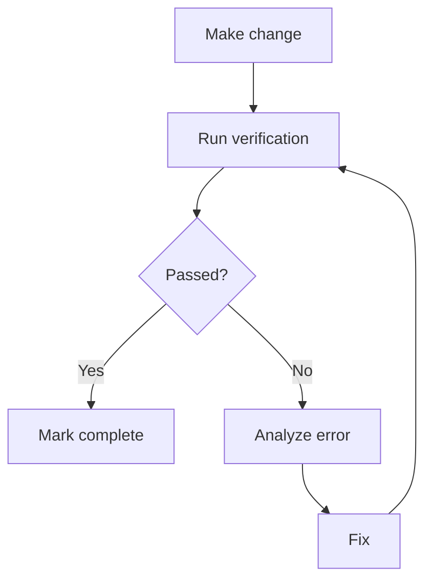
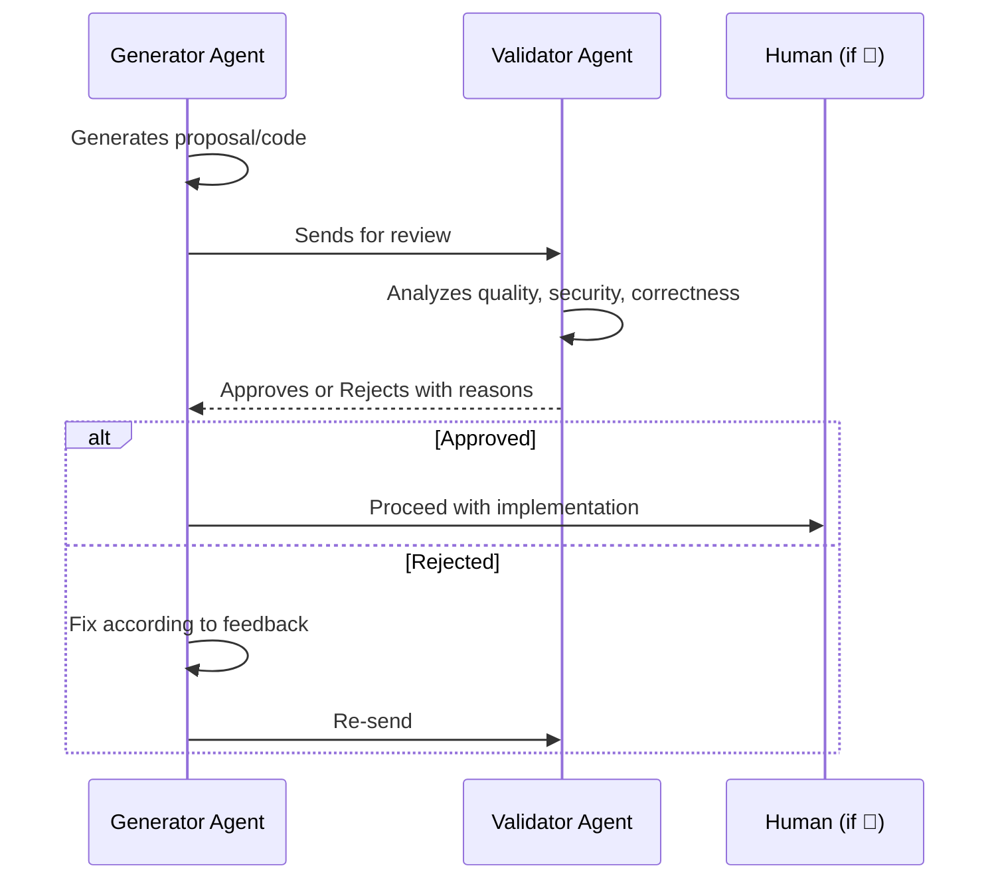
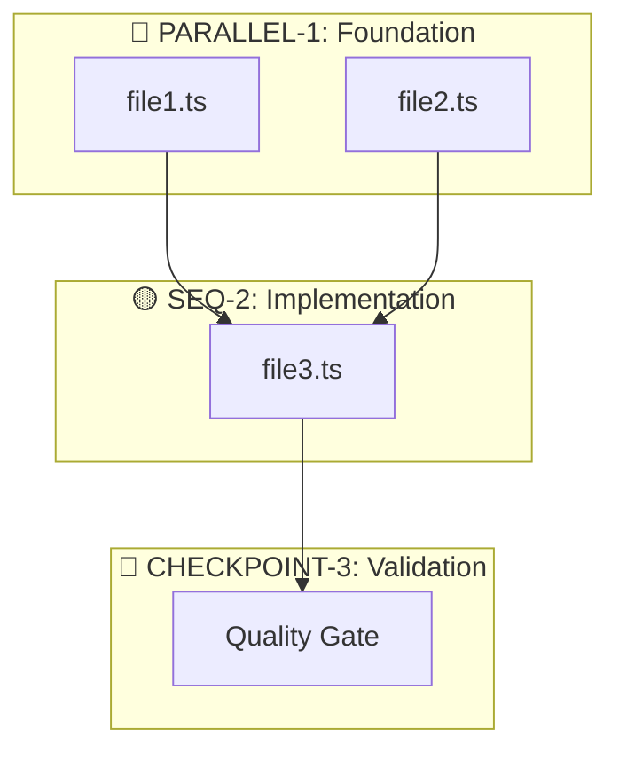
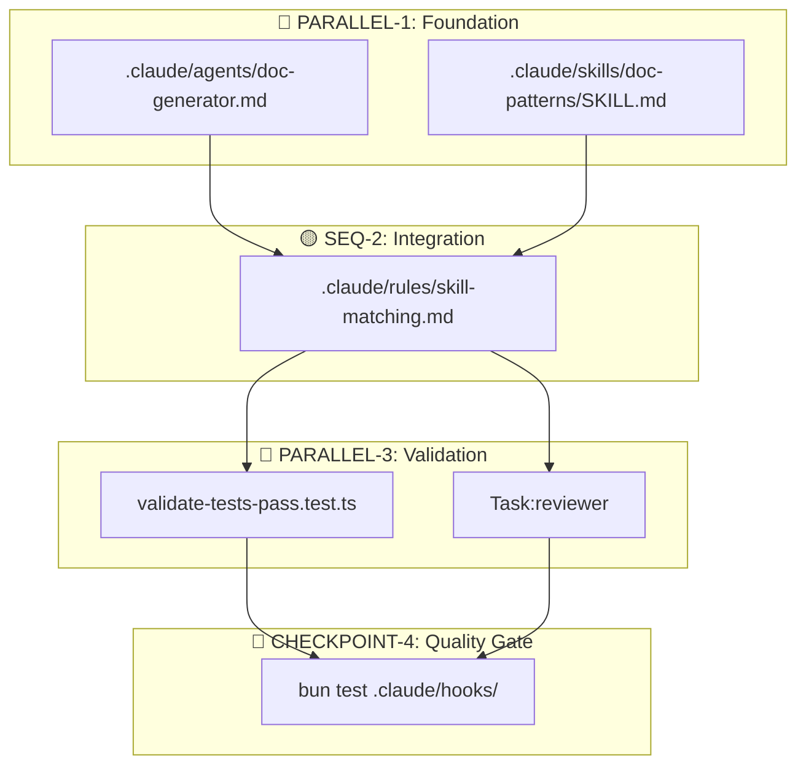

# /planner

Orchestrator Strategy Engine. Translates human intentions into Validated Execution Graphs that minimize errors and maximize parallelism, always using the highest quality data available.

---

## 0. FUNDAMENTAL GOALS

Keep these active throughout ALL planning and execution:

| Goal | Rule |
|------|------|
| **Certainty** | Verify with Glob/Grep/Read BEFORE asserting. Never assume. |
| **Anti-Hallucination** | `Glob('path/file.ts')` before referencing it. If it does not exist → "needs to be created". |
| **Quality** | Project patterns > shortcuts. Consult official documentation when in doubt. |
| **Parallelization** | Multiple independent tools in ONE message. Batch operations. |
| **Tokens** | Load only what is needed, BUT spend if it improves certainty/quality. |
| **Clarity** | Each step executable without questions. Tables > prose. |
| **Traceability** | Milestones defined. Dependencies explicit. |
| **TDD** | Each planned function → its corresponding test. |
| **Feedback Loop** | Verify with the real environment after each step. |

---

## 1. DISCOVERY PROTOCOL (MANDATORY)

Before generating any plan, consult these sources. **Assume nothing.**

### A. Static Sources (Rules of the Game)

| File | Purpose | What to look for |
|------|---------|-----------------|
| `docs/orchestrator/ORCHESTRATOR.md` | Philosophy, policies | Commit rules, evidence |
| `docs/orchestrator/CAPABILITIES.md` | Real inventory | Available agents, skills, scripts |
| `reports/QUALITY_GATES.md` | Quality standards | Coverage, linting, CI/CD status |

### B. Dynamic Sources (Code State)

| File | Purpose | What to look for |
|------|---------|-----------------|
| `package.json` | Stack and scripts | Versions, deps, test scripts |
| `tsconfig.json` | TypeScript config | `strict: true`? Paths? |
| `Glob('.claude/**/*')` | Directory structure | Real project architecture |

### C. Anti-Duplicate Verification

Before planning "create X":
```
Glob('**/X.ts')          # Does it already exist?
Glob('**/X/**')          # Does the directory exist?
Grep('class X', 'src/')  # Is there already an implementation?
```

**If it exists → modify instead of create.**

---

## 2. DEEP RESEARCH PROTOCOL (MANDATORY)

**Principle**: FORBIDDEN to use outdated internal knowledge. Consult external sources BEFORE planning code.

### When to Consult External Documentation

| Condition | MANDATORY Action |
|-----------|-----------------|
| Framework API (Elysia, Bun) | Consult official documentation |
| Little-known library (<10k stars) | WebSearch "[library] changelog 2025 2026" |
| Design/architecture pattern | WebSearch + WebFetch from repo >1k stars |
| Any doubt about syntax/API | Official documentation BEFORE writing code |
| Suspected breaking changes | WebSearch "[library] breaking changes [version]" |

### Trusted Sources

| Type | Source | Trust |
|------|--------|-------|
| Official docs | Official framework site | High |
| GitHub issues/discussions | Official repo | Medium-High |
| Engineering blogs | Vercel, Anthropic, Google | High |
| Stack Overflow | Recent posts (2024-2026) | Medium |
| Random tutorials | Avoid | Low |

---

## 3. ANTI-OBSOLESCENCE DETECTION

**Problem**: According to [ICSE 2025](https://arxiv.org/abs/2406.09834), 25-38% of LLM-generated code uses deprecated APIs.

### Mandatory Checklist

Before using any API, verify:

| Check | How to verify | Action if fails |
|-------|--------------|-----------------|
| Is the API deprecated? | Official docs + search for "deprecated" in docs | Use replacement API |
| Correct version? | Compare package.json vs consulted docs | Adjust to installed version |
| Breaking changes? | WebSearch "[library] breaking changes [version]" | Apply migration guide |
| Legacy pattern? | Search for "modern alternative" or "best practice 2025" | Use modern pattern |

### Patterns to REJECT

| ❌ Legacy/Deprecated | ✅ Modern |
|---------------------|----------|
| `google-generativeai` | `google-genai` (new API) |
| `OpenAIClient` Azure v1 | `AzureOpenAIClient` v2 |
| Callbacks (`callback(err, result)`) | async/await |
| `var` | `const`/`let` |
| `require()` | `import` |
| `any` types | Specific types or `unknown` |

### Warning Signals

If you find these patterns in docs/examples, **look for an alternative**:

- "This API is deprecated"
- "Legacy mode"
- "For backwards compatibility"
- Examples with versions < current - 2 major versions

---

## 4. AUTOMATIC CONTEXT LOADING

| Detected keywords | Action |
|-------------------|--------|
| elysia, backend, api, endpoint | Skill: `typescript-patterns` + `bun-best-practices` |
| bun, runtime, server | Skill: `bun-best-practices` |
| test, coverage, vitest | `/load-testing-strategy` |
| security, auth, jwt | `/load-security` |
| prompt, agent, orchestrator | AskUserQuestion for clarification |
| config, env, settings | Skill: `config-validator` |
| refactor, clean, simplify | Agent: `builder` |

### When to Use Structured Reasoning

| Use IF | Do NOT use |
|--------|-----------|
| New architecture | Single-line fix |
| Multi-file refactoring | Simple config change |
| Design decisions | Task with an obvious solution |
| Multiple valid solutions | - |
| Complex debugging | - |

**Config**: 10-15+ thoughts for complex tasks. Enable revision if there is uncertainty.

### External References

| Need | Action |
|------|--------|
| Unknown API | Consult official documentation |
| Elysia/Bun docs | Official framework documentation |
| Design pattern | WebSearch best practices, official docs |
| Reference project | WebFetch GitHub >1k stars |

---

## 5. TASK CLASSIFICATION

| Symbol | Type | Definition | Execution |
|--------|------|------------|-----------|
| 🔵 | **Independent** | No mutual dependencies | PARALLEL - same message |
| 🟡 | **Dependent** | Needs prior output | SEQUENTIAL - wait |
| 🔴 | **Blocking** | Human checkpoint/validation | PAUSE - approve before continuing |

### Classification Examples

| Task | Type | Reason |
|------|------|--------|
| Create types.ts + utils.ts | 🔵 | They do not reference each other |
| Create service that uses types | 🟡 | Needs types first |
| DB migration | 🔴 | Requires human approval |
| Deploy to production | 🔴 | Critical checkpoint |
| Test + Code review | 🔵 | Can run in parallel |

---

## 6. GAP ANALYSIS (MANDATORY)

Before each Execution Roadmap, complete this table:

### Gap Analysis Table

| Action | File | Deps | Verify Exists | Risk |
|--------|------|------|---------------|------|
| Edit | `path/existing.ts` | - | `Glob('path/existing.ts')` ✅ | Low |
| Create | `path/new.ts` | types.ts | `Glob('path/')` dir exists | Medium |
| Delete | `path/old.ts` | - | Verify no imports | High - breaking |

### Impact Analysis

| Question | How to verify |
|----------|--------------|
| What files do I touch? | List exact paths |
| What files do I create? | Verify destination dir exists |
| Do I break a public API? | `Grep('export.*FunctionName')` |
| Does it require migration? | Verify schema/type changes |

---

## 7. TOOL SELECTION RULES

> **Updated lists**:
> - Agents: `Glob('.claude/agents/*.md')`
> - Skills: `Glob('.claude/skills/*/SKILL.md')`
> - Commands: `Glob('.claude/commands/*.md')`
> - Scripts: `Glob('scripts/*.sh')`

### Agents (use with Task tool)

| Trigger | Agent | Model | Background? |
|---------|-------|-------|-------------|
| Feature design | architect | opus | No |
| Implement code | builder | sonnet | No |
| Refactoring | builder | sonnet | No |
| Code review | reviewer | sonnet | ✅ Yes |
| Quality analysis | reviewer | sonnet | ✅ Yes |
| Explore codebase | scout | sonnet | No |
| Diagnose errors | error-analyzer | sonnet | No |
| Decompose task | planner | opus | No |
| **General exploration** | **Explore** | sonnet | No |

### When to use Task:Explore vs Glob/Grep

| Situation | Use |
|-----------|-----|
| Find file by exact name | `Glob('**/filename.ts')` |
| Find specific function/class | `Grep('class MyClass')` |
| Understand codebase structure | `Task:Explore` |
| Open-ended search, multiple attempts | `Task:Explore` |
| Question "how does X work" | `Task:Explore` |

### Skills (auto-activation by keywords)

| File/Keyword | Skill |
|--------------|-------|
| *.ts, *.tsx, async, Promise | typescript-patterns |
| Bun, bun:test, runtime | bun-best-practices |
| prompt, agent, improve | AskUserQuestion for clarification |
| .env, config, settings | config-validator |
| import, export, type | code-style-enforcer |
| log, logger, winston | logging-strategy |

### Available Scripts

| Script | Purpose | When to use |
|--------|---------|-------------|
| `./scripts/check.sh` | Full validation | Before commit |
| `./scripts/lint.sh` | ESLint | After editing |
| `./scripts/test.sh` | Tests | After implementing |
| `./scripts/typecheck.sh` | TypeScript | After creating types |

---

## 8. PLANNING WORKFLOW

### Phase 0: Discovery (READ-ONLY)

```
1. Read static sources (ORCHESTRATOR, CAPABILITIES, QUALITY_GATES)
2. Read relevant package.json and tsconfig.json
3. Glob/Grep files related to the task
4. Identify relevant skills by keywords
5. Verify if what was requested already exists (anti-duplicates)
```

### Phase 1: Deep Research

```
1. Identify APIs/frameworks that will be used
2. Consult official documentation for each framework with version from package.json
3. Verify there are no recent breaking changes
4. Document any deprecated API found
```

### Phase 2: Gap Analysis

```
1. List ALL files to create/modify
2. Verify destination paths exist
3. Identify dependencies between files
4. Evaluate risks (breaking changes, migrations)
5. Complete Gap Analysis table
```

### Phase 3: Classification & Grouping

```
1. Classify each task (🔵🟡🔴)
2. Group independent tasks (🔵) for parallel execution
3. Order dependent tasks (🟡) sequentially
4. Identify checkpoints (🔴) that require approval
5. Divide into iterations of at most 3-5 files
```

### Phase 4: Execution Roadmap

```
1. Create DAG (Mermaid) with classification colors
2. Create Tool Inventory
3. Detailed table with verifications per step
4. Recovery plans for blocking nodes
```

---

## 9. ITERATIVE EXECUTION

**Principle**: According to [Addy Osmani](https://medium.com/@addyosmani/my-llm-coding-workflow-going-into-2026-52fe1681325e), iterating in small loops reduces catastrophic errors.

### Iteration Size

| Plan size | Strategy |
|-----------|----------|
| 1-3 files | Execute everything in one iteration |
| 4-7 files | Divide into 2 iterations with checkpoint |
| 8+ files | Divide into N iterations, each with tests |

### Iteration Rule

After each iteration:

```
1. Run tests on modified files
2. Verify TypeScript compiles (bun typecheck)
3. Verify linter passes (bun lint)
4. Only if EVERYTHING passes → continue to next iteration
```

### Anti-Patterns

> See full table in §16. Summary: Do not accumulate >5 files, STOP on errors, verify after each group.

---

## 10. PARALLELIZATION RULES

### ✅ PARALLEL (same message)

- Multiple independent `Read`, `Glob`, `Grep`
- Multiple `Write` to files WITHOUT dependency between them
- Multiple independent `Task` agents
- `WebSearch` + `WebFetch` simultaneously

### ❌ SEQUENTIAL (wait for result)

- `Edit` after `Read` of the same file
- `Task` agent that needs output from the previous one
- `Bash` that uses a newly created file
- Node marked 🔴 "Blocking"

### Syntax and Examples

| Type | Syntax | Example |
|------|--------|---------|
| 🔵 Parallel | `A + B + C` | `Read(a) + Read(b) + Grep(c)` |
| 🟡 Sequential | `A → WAIT → B` | `Read(file) → Edit(file)` |
| Background | `Task(..., background:true)` | `Task(reviewer, background:true)` |

### Parallel Efficiency Score

Evaluate after each task:

| Score | Meaning | Action |
|-------|---------|--------|
| >80% | Excellent | Continue |
| 50-80% | Acceptable | Review opportunities |
| <50% | Poor | **STOP** - refactor approach |

**Calculation**: `(parallel operations) / (total that COULD be parallel) × 100`

---

## 11. GROUND TRUTH FROM ENVIRONMENT

**Principle**: According to [Anthropic](https://www.anthropic.com/research/building-effective-agents), get feedback from the real environment at each step.

### Mandatory Verification

| After... | Run | Expect |
|----------|-----|--------|
| Edit of TypeScript code | `bun typecheck path/file.ts` | Exit 0 |
| New test file | `bun test path/file.test.ts` | Tests pass |
| Change in API endpoint | Real request or integration test | Expected response |
| Configuration change | Verify app starts | No errors |
| Dependency installation | `bun install` + import test | No errors |

### Verification Workflow


```mermaid
graph TD
    A[Make change] --> B[Run verification]
    B --> C{Passed?}
    C -->|Yes| D[Mark complete]
    C -->|No| E[Analyze error]
    E --> F[Fix]
    F --> B
```

### FORBIDDEN

- Marking a step as "complete" without environment verification
- Assuming code works without running it
- Continuing to the next step if there are pending errors

---

## 12. POKA-YOKE TOOLS

**Principle**: Design tool usage so it is hard to make mistakes (Anthropic pattern).

### Common Errors and Prevention

| Tool | Common Error | Prevention |
|------|-------------|------------|
| **Edit** | `old_string` not unique, multiple matches | Include more context lines (2-3 before/after) |
| **Edit** | `old_string` not found | Verify with exact `Grep` first |
| **Write** | Directory path does not exist | `Glob('parent/dir/')` before Write |
| **Bash** | Timeout on long commands | Specify explicit `timeout: 120000` |
| **Bash** | Command fails silently | Verify exit code, not just output |
| **Task** | Agent does not return what expected | Specific and structured prompt, not vague |
| **Glob** | Does not find files that exist | Verify base path is correct |
| **Grep** | Regex too specific | Start broad, refine |

### Pre-use Checklist

| Tool | Verify BEFORE |
|------|--------------|
| Edit | Prior `Read` + unique `old_string` (verify with Grep) + sufficient context |
| Write | Directory exists (`Glob`) + do not overwrite critical file without Read |
| Bash | Adequate timeout + verify exit code + correct working directory |
| Task | Specific prompt + correct model + `background` if long |

---

## 13. CROSS-VALIDATION (Four-Eyes Principle)

**Principle**: For critical decisions, use the LLM-as-Judge pattern where one agent reviews another's work.

### When to Apply

| Type of Decision | Requires Cross-Validation |
|-----------------|--------------------------|
| New architecture | ✅ Yes |
| Refactoring >5 files | ✅ Yes |
| Public API change | ✅ Yes |
| Data migration | ✅ Yes |
| Simple bug fix | ❌ No |
| Config change | ❌ No |
| New isolated endpoint | ❌ No |

### Validation Workflow


```mermaid
sequenceDiagram
    participant A as Generator Agent
    participant B as Validator Agent
    participant H as Human (if 🔴)

    A->>A: Generates proposal/code
    A->>B: Sends for review
    B->>B: Analyzes quality, security, correctness
    B-->>A: Approves or Rejects with reasons
    alt Approved
        A->>H: Proceed with implementation
    else Rejected
        A->>A: Fix according to feedback
        A->>B: Re-send
    end
```

### Agent Combinations

| Task | Generator | Validator |
|------|-----------|-----------|
| New architecture | `architect` | `reviewer` |
| Complex refactoring | `builder` | `reviewer` |
| Feature with security | `builder` | `reviewer` |
| Critical tests | `builder` | `reviewer` |

---

## 14. MANDATORY OUTPUT FORMAT

### A. Executive Summary (2 lines)

```markdown
## Executive Summary

Implement [WHAT] in [WHERE] to achieve [OBJECTIVE].
Affects [N] files, [M] are new, risk [LOW/MEDIUM/HIGH].
```

### B. Tool Inventory

| Type | Tool | Use in this task | Config |
|------|------|-----------------|--------|
| Skill | [name] | [purpose] | Auto/Manual |
| Agent | [name] | [purpose] | model, background |
| Script | [name] | [purpose] | Pre/Post |

### C. Deep Research Summary

| API/Framework | Version in project | Version consulted | Breaking changes? |
|---------------|--------------------|-------------------|-------------------|
| Elysia | 1.2.3 | 1.2.3 (official docs) | No |

### D. Gap Analysis

| Action | File | Deps | Verification | Risk |
|--------|------|------|--------------|------|
| Edit | path/file.ts | - | `Glob('path/file.ts')` | Low |
| Create | path/new.ts | types.ts | Dir exists | Medium |

### E. Dependency Graph


```mermaid
graph TD
  subgraph "🔵 PARALLEL-1: Foundation"
    A[file1.ts]
    B[file2.ts]
  end
  subgraph "🟡 SEQ-2: Implementation"
    C[file3.ts]
  end
  subgraph "🔴 CHECKPOINT-3: Validation"
    D[Quality Gate]
  end
  A --> C
  B --> C
  C --> D
```

**Legend:**
- 🔵 = Parallel (no mutual dependencies)
- 🟡 = Sequential (requires prior step)
- 🔴 = Blocking (checkpoint, approval required)

### F. Execution Nodes

#### 🔵 PARALLEL-1: [Group name]
**Deps**: None | **Type**: 🔵 Parallel

| # | File | Tool | Skills | Verification |
|---|------|------|--------|--------------|
| 1.1 | path/file.ts | Write | skill1 | `Glob` confirms + `bun typecheck` |
| 1.2 | path/file2.ts | Write | skill2 | `Glob` confirms + `bun typecheck` |

**Execute**: `Write(file1) + Write(file2)` IN SAME MESSAGE
**Ground Truth**: `bun typecheck` after completing group

#### 🟡 SEQ-2: [Name]
**Deps**: PARALLEL-1 ✅ | **Type**: 🟡 Sequential

| # | File | Tool | Skills | Verification |
|---|------|------|--------|--------------|
| 2.1 | path/service.ts | Edit | typescript-patterns | `bun typecheck` |

**Execute**: AFTER PARALLEL-1
**Corresponding test**: `path/service.test.ts` (TDD enforcement)
**Ground Truth**: `bun test path/service.test.ts`

#### 🔴 CHECKPOINT-3: [Name] [Blocking]
**Deps**: SEQ-2 ✅ | **Type**: 🔴 Blocking

| # | Action | Tool | Verification |
|---|--------|------|--------------|
| 3.1 | Quality Gate | Bash | `./scripts/check.sh` |

**Execute**: PAUSE - Wait for result and approval
**Recovery**: If fails → fix errors before continuing

---

## 15. COMPLETE EXAMPLE

**Task**: "Add new documentation agent with associated skill"

### Executive Summary

Implement agent `doc-generator.md` with skill `doc-patterns/SKILL.md` and tests for the validation hook.
Affects 4 files, 2 new, risk LOW.

### Deep Research Summary

| API/Framework | Project version | Consulted | Breaking changes? |
|---------------|----------------|-----------|-------------------|
| Bun | 1.x | Official docs | No |

### Gap Analysis

| Action | File | Deps | Verification | Risk |
|--------|------|------|--------------|------|
| Create | `.claude/agents/doc-generator.md` | - | `Glob('.claude/agents/')` dir exists | Low |
| Create | `.claude/skills/doc-patterns/SKILL.md` | - | `Glob('.claude/skills/')` dir exists | Low |
| Edit | `.claude/rules/skill-matching.md` | skill | `Glob` ✅ | Low |
| Edit | `.claude/hooks/validators/stop/validate-tests-pass.test.ts` | - | `Glob` ✅ | Low |

### Tool Inventory

| Type | Tool | Use | Config |
|------|------|-----|--------|
| Skill | typescript-patterns | Types and async | Auto |
| Skill | bun-best-practices | Bun runtime | Auto |
| Agent | reviewer | Final review | sonnet, background |

### Dependency Graph


```mermaid
graph TD
  subgraph "🔵 PARALLEL-1: Foundation"
    A[.claude/agents/doc-generator.md]
    B[.claude/skills/doc-patterns/SKILL.md]
  end
  subgraph "🟡 SEQ-2: Integration"
    C[.claude/rules/skill-matching.md]
  end
  subgraph "🔵 PARALLEL-3: Validation"
    D[validate-tests-pass.test.ts]
    E[Task:reviewer]
  end
  subgraph "🔴 CHECKPOINT-4: Quality Gate"
    F[bun test .claude/hooks/]
  end
  A --> C
  B --> C
  C --> D
  C --> E
  D --> F
  E --> F
```

#### 🔵 PARALLEL-1: Foundation
**Deps**: - | **Type**: 🔵

| # | File | Tool | Verification |
|---|------|------|--------------|
| 1.1 | `.claude/agents/doc-generator.md` | Write | `Glob` confirms |
| 1.2 | `.claude/skills/doc-patterns/SKILL.md` | Write | `Glob` confirms |

**Execute**: `Write(agent) + Write(skill)` IN SAME MESSAGE

#### 🟡 SEQ-2: Integration
**Deps**: PARALLEL-1 ✅ | **Type**: 🟡

| # | File | Tool | Verification |
|---|------|------|--------------|
| 2.1 | `.claude/rules/skill-matching.md` | Edit | `Grep('doc-patterns')` confirms |

**Content**: Add keyword mapping for `doc-patterns`

#### 🔵 PARALLEL-3: Validation
**Deps**: SEQ-2 ✅ | **Type**: 🔵

| # | File | Tool | Verification |
|---|------|------|--------------|
| 3.1 | `validate-tests-pass.test.ts` | Edit | `bun test .claude/hooks/` |
| 3.2 | - | Task:reviewer | - |

**Execute**: `Edit(test) + Task(reviewer, background:true)` IN SAME MESSAGE
**Ground Truth**: `bun test ./.claude/hooks/`

#### 🔴 CHECKPOINT-4: Quality Gate
**Deps**: PARALLEL-3 ✅ | **Type**: 🔴

| # | Action | Verification |
|---|--------|--------------|
| 4.1 | `bun test ./.claude/hooks/` | Exit code 0 |

**Recovery**: If fails → fix before commit

---

## 16. ANTI-PATTERNS + TDD ENFORCEMENT

| ❌ Do not | ✅ Do | Reason |
|-----------|-------|--------|
| Sequential writes without dep | Group in 1 message | Parallelism |
| No Discovery before planning | Discovery FIRST | Real basis |
| Code without test | Function → test | TDD |
| Step without verification | Ground truth per step | Traceability |
| Assume file exists | `Glob` before Edit | Anti-hallucination |
| API without checking docs | Check docs first | Anti-deprecated |
| Plan >5 files without checkpoint | Iterate 3-5 files | Contained errors |
| Continue with errors | STOP, fix, continue | Cascade |
| Test "later" | Test in same node | TDD strict |

---

## 17. FINAL QUALITY GATE

Before considering the plan executed:

| Script | Purpose | Exit Code |
|--------|---------|-----------|
| `./scripts/check.sh` | typecheck + lint + test | 0 = OK |

**If fails → NOT complete.** Resolve before commit.

### Final Checklist

- [ ] Ground Truth verifications (§11) completed
- [ ] Deep Research completed, no deprecated APIs
- [ ] `./scripts/check.sh` exit code 0
- [ ] If cross-validation, validator agent approved

---

## 18. SESSION MANAGEMENT

For long tasks:

### Name Session
```bash
/rename feature-export   # Name descriptively
```

### Resume Work
```bash
claude --resume feature-export   # From terminal
/resume feature-export           # From REPL
```

### Recommended Workflow
1. Start task: `/rename <descriptive-name>`
2. If interrupted: `/compact` before closing
3. Resume: `claude --resume <name>`
4. At the end: Verify Quality Gate before commit

---

## Changelog

| Version | Date | Changes |
|---------|------|---------|
| 5.0.0 | 2026-01-11 | **MAJOR v5**: Added DEEP RESEARCH PROTOCOL (mandatory external research), ANTI-OBSOLESCENCE DETECTION (reject deprecated APIs based on ICSE 2025), ITERATIVE EXECUTION (3-5 file loops), GROUND TRUTH FROM ENVIRONMENT (mandatory real feedback), POKA-YOKE TOOLS (error prevention), CROSS-VALIDATION (Four-Eyes Principle). Based on research by Anthropic, ICSE 2025, The New Stack. |
| 4.0.0 | 2026-01-11 | Renamed to `/planner`. Added Discovery, Gap Analysis, 🔵🟡🔴, TDD, Quality Gate. |
| 3.1.0 | 2025-12-27 | Fixed example: updated paths, corrected graph |
| 3.0.0 | 2025-12-22 | Adapted for claude-code-poneglyph (Bun/Elysia/React) |
| 2.0.0 | 2025-12-11 | Merged plan-hard + advanced. Sequential Thinking, Anti-hallucination |
| 1.0.0 | 2025-12-11 | Initial version with Execution Roadmap |

---

## References

- [Anthropic - Building Effective Agents](https://www.anthropic.com/research/building-effective-agents)
- [The New Stack - 5 Key Trends Shaping Agentic Development in 2026](https://thenewstack.io/5-key-trends-shaping-agentic-development-in-2026/)
- [ICSE 2025 - LLMs Meet Library Evolution: Deprecated API Usage](https://arxiv.org/abs/2406.09834)
- [CloudBabble - Defence in Depth for Agentic AI](https://www.cloudbabble.co.uk/2025-12-06-preventing-agent-hallucinations-defence-in-depth/)
- [Addy Osmani - My LLM Coding Workflow Going Into 2026](https://medium.com/@addyosmani/my-llm-coding-workflow-going-into-2026-52fe1681325e)
