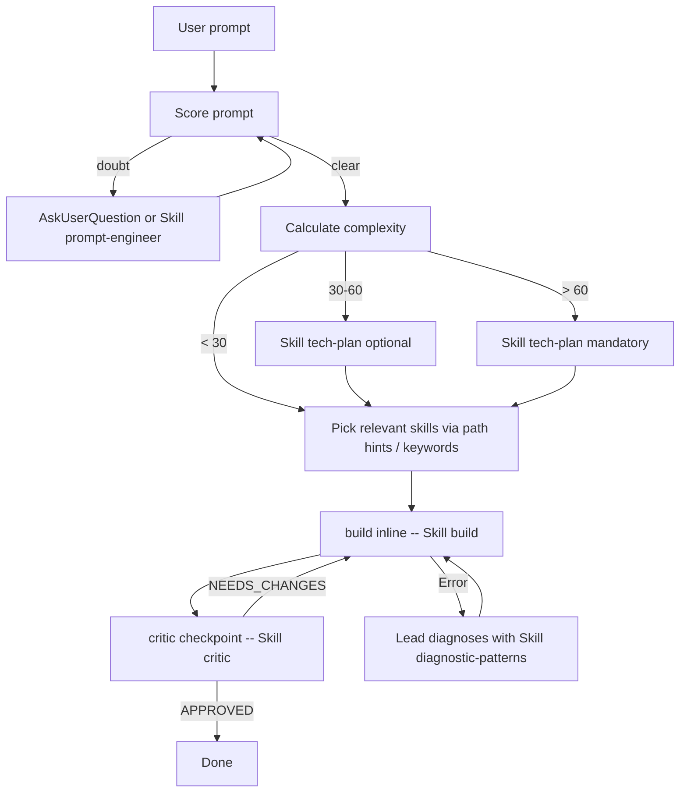

# System inventory & operational detail (evicted from CLAUDE.md — feature 017)

On-demand reference. CLAUDE.md keeps only always-needed behavior; everything here is data, history or detail recoverable with a Read. Last full update: 2026-06-10 (feature 017 in flight — W2 deletions/archive will change the directory map).

## Sync working model (full detail)

The intended normal case is working in **another** project while poneglyph runs underneath through `~/.claude/`. Install once per machine:

```bash
bun .claude/commands/sync-claude.ts --execute --backup --force
```

- Links `skills/commands/rules/docs/hooks/output-styles` into `~/.claude/` (junctions on Windows — no admin; symlinks on macOS/Linux) and regenerates `~/.claude/settings.json` = `settings.json` (committed base) deep-merged with `settings.machine.json` (gitignored, per-machine).
- **macOS**: also create `.claude/settings.machine.json` carrying that machine's `env.PATH` — the GUI app launches with a minimal PATH, so linking alone leaves hooks/statusline broken; the PATH overlay fixes it (separate cause from linking).
- **Duplicates only inside this repo**: the global (`~/.claude/skills`, link → repo) and the project (`./.claude/skills`, real) are the same files via two paths. Harmless for skills/commands (dedupe by name); but hooks (`security-gate`, `code-validator`) are declared in BOTH levels, so a maintenance session in this repo may **double-fire** them. Other projects never see this.
- Settings load at session start → a fresh sync takes effect on the NEXT session.
- **Windows**: `CLAUDE.md` is **copied**, not linked (junctions can't link files) → re-run the sync after editing it or the global copy goes stale. On macOS it is a symlink (verified 2026-06-10).

## Lead turn flow (was "Mandatory flow" mermaid)



Canonical per-turn checklist: `orchestrator-protocol` skill §1.

## Execution modes

| Mode | When | Cost |
|------|------|------|
| **Inline** (default) | ALL build/write work, any size — delegation doctrine (orchestrator-protocol §P8) | 1x |
| **Workflow read-only fan-out** | ≥4 independent read-only units (research sweeps, decision-review panels) | scales w/ agent count |
| **Workflow write fan-out** | explicit user opt-in only ("ultracode" / direct ask; "workflow" keyword no longer triggers since CC 2.1.160); per-unit `isolation: 'worktree'` on collision | scales |
| **Tiered** | Complexity 45-60 with 2-3 domains sharing interfaces — contracts inline via tech-plan Mode B | ~2x |
| **Team agents** (experimental) | Complexity >60, 3+ independent domains, interface negotiation, `CLAUDE_CODE_EXPERIMENTAL_AGENT_TEAMS=1` | 3-7x |

> **Background sessions / agent-view** (`claude agents`, CC ≥2.1.139 — version-specific, verify): orthogonal axis — runs whole **sessions** in the background with a dashboard for running/blocked/done. `claude --bg` / `←←` to background; `/resume` lists them. Operational tool, not a per-turn routing mode.

## Planner adaptive levels (tech-plan)

| Level | When | Refs loaded | Target cost |
|------|------|-------------|-------------|
| **Quick** | complexity <30 or clear scope (1-2 files, no external research) | ≤2 | ~3-5 min |
| **Standard** (default) | complexity 30-60 or some ambiguity about dependencies | 3-5 | ~10 min |
| **Full** | complexity >60, multi-domain, plan mode with architectural risk | all | ~20-30 min |

Escalation: Quick → Standard on uncertainty → Full on multi-domain/architectural risk. Level declared in the first line of planner output.

## /flow adaptation per mode

| Mode | Phases executed | When |
|---|---|---|
| `minimal` | Phase 3 direct + Phase 4 light | trivial task, 1-2 files, no design decisions |
| `standard` (default) | All 5 phases, drillme normal | feature 2-5 files OR single domain |
| `full` | All 5 phases + decision-stress-test in Phase 2 + fresh-context reviewer (critical-area focus; panels = decisions only, feature 019) in Phase 4 + Commandments forensics in Phase 5 | architectural / multi-domain / auth-payments-security |

## Skill loading into a Workflow agent (3 mechanisms)

1. **`skills:` frontmatter** preloads full SKILL.md at spawn — for a custom `agentType` that ALWAYS needs a skill.
2. **`Skill` tool** — an agent whose `tools:` include `Skill` self-invokes task-specific skills mid-task (CC ≥2.1.133 — verified in `.claude/plans/_research-skill-activation-2026-06-09.md`). Name the relevant skills in the task prose.
3. **Arch H — Lead-Directed Skill Reads** (fallback): embed up to 3 `Read .claude/skills/<name>/SKILL.md` instructions in the `[RELEVANT SKILLS FOR THIS TASK]` block. Lead-side `Skill()` does NOT propagate to spawned agents.

Full template and propagation model: `orchestrator-protocol/references/06-context-arch-h.md`.

## Key rules mapping (historical — old rule → current location)

| Old rule | Current location |
|---|---|
| `lead-orchestrator.md` | `.claude/skills/orchestrator-protocol/SKILL.md` |
| `orchestration-checklist.md` | `orchestrator-protocol/references/01-verification.md` |
| `prompt-scoring.md` | `prompt-engineer` skill (post-2026-05-28) |
| `complexity-routing.md` | `orchestrator-protocol/references/03-complexity-routing.md` |
| `agent-selection.md` | `orchestrator-protocol/references/04-agent-selection.md` |
| `context-management.md` | `orchestrator-protocol/references/06-context-arch-h.md` |
| `delegation-recovery.md` | `.claude/rules/error-recovery.md` |
| `output-style baseline` | `.claude/output-styles/poneglyph.md` |

## When to use rules vs skills (project level)

| Content type | Mechanism | Why |
|---|---|---|
| **Constraint** — violation blocks merge, must ALWAYS be visible | **Rule** (always-on) | e.g., "features cannot import from other features" |
| **Knowledge/guidance** — useful when relevant, not every prompt | **Skill** (on-demand) | e.g., naming conventions, function design patterns |

Test: "does the agent need this in EVERY prompt?" — no → skill.

## Component inventory

| Component | Audit baseline (early 2026) | Post-cleanup (2026-05-28) | Current | Detail |
|---|---|---|---|---|
| Agents | 7 + 1 meta | 3 | **0 custom** | builder/reviewer/scout cut in feature 008; work runs inline (delegation doctrine), read-only fan-out via Workflow/`Explore` |
| Skills | 28 | 14 | **21** | 6 phase skills + `drillme` + `skill-advisor` (012) + `html-report` (003); `planner-protocol` migrated-and-cut into `tech-plan/references/` |
| Hooks | 15+ | 6 | **4** | `auto-approve`, `post-compact`, `security-gate`, `validators/code-validator` (feature 017 may add more — see plan) |
| Slash commands | 10 | 4 | **5** | `decide`, `explain-changes`, `flow`, `sync-claude`, `role` |
| Rules | 7 | 2 + paths/ | **2 + paths/** | `error-recovery.md`, `test-policy.md` + `paths/{hooks,orchestration}.md` |
| Output-styles | 1 (caveman) | 1 | **1 (poneglyph)** | es-ES natural register since feature 017/US3 |

## Directory map (.claude/)

| Dir | Contents | Status |
|---|---|---|
| `skills/` (21), `commands/` (5), `rules/`, `hooks/`, `output-styles/`, `plans/` | Core system | documented above |
| `docs/` | This file + `arch-h-lead-directed-skill-reads.md` + `lead-mode-when-needed.md` | on-demand references |
| `workflows/` | `ultracode-audit.js` — saved Workflow script (worked example of find→verify pipeline) | live |
| `audits/` | Ad-hoc audit outputs (005, 009, 2026-06-10 general analysis) | archive-like |
| `config/` | `cost-budget.json` | live |
| `ccstatusline/` | Statusline module wired via settings | live |
| `data/`, `agent-memory/` | Telemetry remnants / empty dir | **deleted 2026-06-10 (017/US5)** |
| `plans/_archive/` | Closed/abandoned plans (gitignored, on disk only) | archive since 017/US6 |

## MCP servers (session-connected) — decision 2026-06-10 (017/US8)

All five stay default-on (user-ratified): **context7** (plugin, settings.json `enabledPlugins`), **claude-in-chrome** (extension), **Atlassian**, **binOra Desarrollo**, **binOra Producción** (claude.ai connectors — managed in the claude.ai UI, not in settings). Context cost is mitigated by ToolSearch deferred loading. Revisit if a server's tool list bloats context again.

Schema findings (017/US8, verified against schemastore 2026-06-10): `minimumVersion` EXISTS (version gate set to 2.1.160); `requiredMinimumVersion` and `fallbackModel` DO NOT EXIST — no fallback-model cascade is possible in settings.json (closest is `availableModels`, which restricts selection rather than degrading gracefully). Recorded per AC1; nothing invented.

Activation/observability hooks (017/US12, event verified in official hooks docs 2026-06-10): `skill-activation.ts` (UserPromptSubmit) injects explicit `Skill(<name>)` instructions on keyword match — deterministic layer under `skill-advisor`, best-effort per issue #17277. `instructions-loaded.ts` (InstructionsLoaded, async) logs every CLAUDE.md/rules load to `.claude/learned/instructions-loaded.log` — grep it to verify load layers instead of assuming.

## History

- **5-phase workflow refactor (W1-W5, 2026-05-28)**: W1 plan structure + 8 templates · W2 7 new skills (6 phase + drillme; planner-protocol MIGRATE-AND-CUT) · W3 `/flow` + orchestrator-protocol SIMPLIFY · W4 CLAUDE.md update · W5 dogfooding + retro. Detail: `.claude/plans/001-poneglyph-5phase-workflow/`.
- **Feature 006 (2026-06-08)**: always-on honesty layer + base role senior engineer-advisor + `/role` (13 roles).
- **Feature 008 (2026-06-05/09)**: builder/reviewer/scout agents cut; spawn decision tree canonical in orchestrator-protocol. The W2 KEEP-cond decisions for builder/reviewer were superseded here; `review-patterns` KEEP still holds.
- **Feature 012**: `skill-advisor` (turn-level propose→validate skill routing).
- **Feature 017 (2026-06-10, in flight)**: inline-first delegation doctrine (evidence-based), es-ES natural style, this eviction, hygiene waves.
- Audit trail: `.claude/plans/002-claude-config-deep-audit/report.md` + audit 011.
