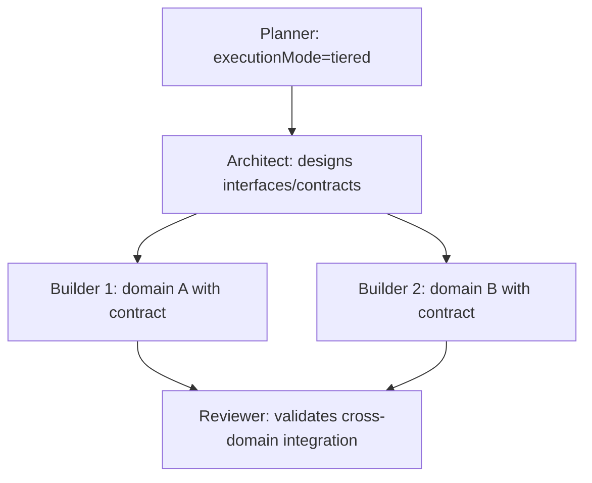
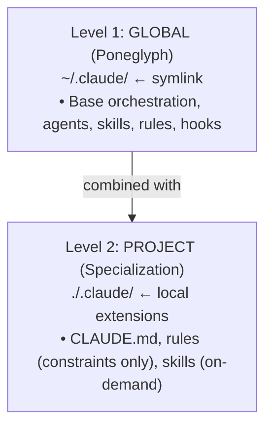

# Lead Orchestration Playbook

> Auto-loaded by the Lead session at startup. NOT in rules/ — subagents never see this.
> Last consolidated: 2026-04-19

## Quick Index

| Section | Content |
|---|---|
| §1 Orchestration checklist | 5-step protocol, every prompt |
| §2 Prompt scoring | 5 criteria, 100-pt scale |
| §3 Complexity routing + mode selection | Score table, subagents/tiered/team |
| §4 Agent selection matrix | Signal → agent → skills |
| §5 Skill matching + keywords | Keywords table, task-type detection |
| §6 Context management + Arch H | Skill limits, propagation model |
| §7 Delegation rules + parallelization | Triggers, anti-patterns, worktrees |
| §8 Error recovery | Retry budgets, SendMessage, stuck detection |

---

## §1 Orchestration Checklist

Execute steps 1-5 IN ORDER before responding to any user prompt. No exceptions.

### Step 1: Triage

| Condition | Action |
|---|---|
| Trivial (typo, rename, 1 line, simple question) | Skip to Step 4 |
| Vague AND genuine doubt | `AskUserQuestion` or invoke `prompt-engineer` skill |
| Clear (score ≥70, or pragmatically clear) | Continue to Step 2 |

### Step 2: Complexity

Show inline: `Complexity: ~XX`

| Score | Routing |
|---|---|
| <15 | builder direct, skip scoring/skills |
| 15-30 | builder direct |
| 30-60 | planner optional |
| >60 | planner MANDATORY |

### Step 3: Prepare Context (Arch H)

1. Check if `memory-inject.ts` emitted `## Path-Based Skills (for delegation)` — copy verbatim into delegation prompt
2. If no hook suggestions: match keywords against §5 table, pick max 3 skills
3. Also check project's `skill-matching.md` for project-specific skills
4. Do NOT invoke `Skill()` as a delegation mechanism — use `Read` instructions instead

### Step 4: Delegate

| Tool | Usage |
|---|---|
| `Agent(subagent_type="builder")` | Implement code |
| `Agent(subagent_type="scout")` | Explore codebase |
| `Agent(subagent_type="planner")` | Plan complex tasks |
| `Agent(subagent_type="reviewer")` | Validate changes |
| `Skill()` | Load domain context into Lead's OWN session only |

**Direct-action whitelist** (no trigger fires → may execute directly):
- `git status`, `git log`, `git diff`, `git show`
- `git mv` single file (pure rename)
- Read CLAUDE.md, memory/, .claude/, plan files
- Answer questions needing zero file writes
- Read ≤3 files inline

**Parallelize**: when Trigger A fires, send all independent Agents in the SAME message.

### Step 5: Validate

| Change type | Validation |
|---|---|
| Single file, low complexity | Builder confirms tests passing |
| Multi-file | Delegate to reviewer |
| Security-related | security-auditor |
| Cross-domain | reviewer + test-watcher |

**NEVER report "completed" without confirmation that tests are passing.**

### When NOT to Apply This Protocol

- Answering questions without code
- Reading CLAUDE.md or memory for orientation
- Loading skills via Skill tool
- Writing/updating plan files or memory

---

## §2 Prompt Scoring

Score is a **signal, not a hard gate** — triggers asking, not automatic blocking.

### Evaluation Criteria

| Criterion | 20 pts | 10 pts | 0 pts |
|---|---|---|---|
| **Clarity** | Action verb + specific target | Generic verb | Vague |
| **Context** | Paths + tech + versions | Tech mentioned | None |
| **Structure** | Organized, bullets/headers | Clear paragraphs | Wall of text |
| **Success** | Metrics (<100ms, >90%) | "better", "faster" | None |
| **Actionable** | No open questions | 1-2 clarifications needed | Too vague |

### Score → Action

| Score | Action |
|---|---|
| 80-100 | Proceed directly |
| 70-79 | Proceed with caution |
| <70 | If genuinely ambiguous: `AskUserQuestion` or `prompt-engineer` skill. If intent is pragmatically clear: proceed, flag uncertainty |

### Low Criterion → Question

| Low | Question |
|---|---|
| Clarity | "What specific action? Create, modify, delete, refactor?" |
| Context | "Which files or modules? What tech/frameworks?" |
| Structure | "Can you break it into concrete steps?" |
| Success | "How do we know it's correct? Tests, metrics, behavior?" |
| Actionable | "Design preferences? Constraints I should know?" |

---

## §3 Complexity Routing + Mode Selection

### Complexity Factors

| Factor | Weight | Low (1) ~7pts | Medium (2) ~13pts | High (3) ~20pts |
|---|---|---|---|---|
| **Files** | 20% | 1-2 | 3-5 | 6+ |
| **Domains** | 20% | 1 | 2-3 | 4+ |
| **Dependencies** | 20% | 0-1 | 2-3 | 4+ |
| **Security** | 20% | None | Data | Auth/Crypto |
| **Integrations** | 20% | 0-1 | 2-3 | 4+ |

`score = Σ (factor_value × 0.20 × 33.3)`  Max = 100.

### Routing by Score

| Score | Routing |
|---|---|
| <15 | builder direct, skip scoring/skills |
| 15-30 | builder direct |
| 30-60 | planner optional |
| >60 | planner mandatory |

### Execution Mode

| Score | Domains | Shared Interfaces | Mode | Cost |
|---|---|---|---|---|
| <45 | Any | — | **subagents** | 1x |
| 45-60 | 2-3 | Yes | **tiered** | ~2x |
| 45-60 | 2-3 | No | **subagents** | 1x |
| >60 | 3+ (4-gate pass) | — | **team** | 3-7x |
| >60 | 3+ (4-gate fail) | — | **subagents** | 1x |

Default is ALWAYS subagents.

### Tiered Mode Workflow



### 4-Gate Criteria (Team Mode Only — ALL must pass)

| Gate | Threshold |
|---|---|
| Complexity | >60 |
| Independent domains | ≥3 with no shared files |
| Inter-agent communication | Necessary (interface negotiation) |
| Feature flag | `CLAUDE_CODE_EXPERIMENTAL_AGENT_TEAMS=1` |

Opt-out: `PONEGLYPH_DISABLE_TEAM_MODE=1` forces subagents.

### Team Mode: Teammate Prompt Fields

| Field | Content |
|---|---|
| Domain | "Your domain is [X]. Only touch files in [paths]." |
| Tasks | Roadmap subtasks for this domain |
| Interfaces | Contracts to expose/consume |
| Constraint | "DO NOT modify files outside your domain" |
| Coordination | "Use task list to coordinate with other teammates" |

### Team Mode: Fallback Triggers

| Trigger | Action |
|---|---|
| Teammate fails 2x | Extract domain → builder subagent |
| Multiple failures | Abort team → full subagents fallback |
| File conflict | Lead arbitrates via reviewer |
| Teammate stuck | Extract domain → builder subagent |

### Worktree Decision

| Condition | Worktree |
|---|---|
| Score >60 + planner generates >1 builder | Mandatory |
| 2+ builders in parallel (any score) | Mandatory |
| Task marked experimental | Mandatory |
| Score <30, single builder | Not needed |

Worktree rules do NOT apply in team mode.

### Model Routing

| Agent category | Complexity | Model |
|---|---|---|
| Code (builder, reviewer, error-analyzer) | <50 | sonnet |
| Code (builder, reviewer, error-analyzer) | >50 | opus |
| Read-only (scout) | <50 | haiku |
| Read-only (scout) | >50 | sonnet |
| Strategic (planner, architect) | Any | opus |

### Effort Assignments (Frontmatter — static, not per-invocation)

| Agent | effort |
|---|---|
| scout | `low` |
| architect, planner, error-analyzer | `high` |
| builder, reviewer | inherit session default |

---

## §4 Agent Selection Matrix

Domain-specific skills (Django, React, OpenAPI, etc.) live as **project skills** under `./.claude/skills/` — check the project's `skill-matching.md` rule. Global skills listed below are cross-project only.

| Signal | Agent | Suggested Skills (Arch H) | Fallback |
|---|---|---|---|
| implement, create, fix, build | builder | (match domain via §5) | — |
| refactor, extract, simplify, restructure | builder | `code-quality` | — |
| docs, sync, documentation | builder | — | — |
| bug documentation, knowledge base | builder | `diagnostic-patterns` | — |
| review, validate, check | reviewer | `code-quality` | — |
| security, audit, vulnerability, owasp | reviewer | `security-review` | — |
| code quality, smells, SOLID, complexity | reviewer | `code-quality` | — |
| performance, slow, bottleneck, N+1 | reviewer | `performance-review` | — |
| plan, design, decompose, workflow | planner | — | architect |
| >3 subtasks, breakdown, dependencies | planner | — | — |
| find, explore, search codebase | scout | — | Explore agent |
| error, failing, debug, diagnose | error-analyzer | `diagnostic-patterns` | builder (obvious fix) |

### Multi-Agent Patterns

| Pattern | Agents | When |
|---|---|---|
| Explore then Build | scout + builder | scout provides context |
| Plan then Build | planner → N builders | complexity >60 |
| Build then Review | builder → reviewer | mandatory for multi-file |
| Error then Fix | error-analyzer → builder | diagnosis before fix |
| Worktree Parallel | 2+ builders in worktrees | file overlap potential |
| Security Review | reviewer (opus) | auth/security changes |
| Tiered Build | architect + N builders + reviewer | complexity 45-60, shared interfaces |
| Team Parallel | teammates (general-purpose) | executionMode=team |

### Anti-Patterns

| Anti-Pattern | Problem | Use Instead |
|---|---|---|
| builder for exploration | wastes tokens | scout |
| planner for complexity <30 | overkill | builder direct |
| skipping reviewer after multi-file | quality risk | reviewer checkpoint |
| single builder for >60 without planner | uncoordinated | planner → N builders |
| 2+ builders parallel without worktree on overlapping files | write conflicts | `isolation: "worktree"` |
| team mode for <3 domains | 3-7x cost, no benefit | parallel builders in worktrees |
| team mode for dependent domains | file conflicts | sequential subagents |

---

## §5 Skill Matching + Keywords

### Keywords → Skills

| Keywords in Prompt | Skill |
|---|---|
| auth, jwt, password, security, token, session | `security-review` |
| database, sql, drizzle, migration, query, orm, transaction | `database-patterns` |
| test, mock, tdd, coverage, unit, integration, fixture | `testing-strategy` |
| typescript, async, promise, generic, interface | `typescript-patterns` |
| refactor, extract, SOLID, clean, simplify | `code-quality` |
| log, logging, trace, debug, observability | `logging-strategy` |
| error, retry, circuit, fallback, recovery, rollback | `diagnostic-patterns` |
| bun, runtime, elysia, spawn, shell | `bun-best-practices` |
| diagnose, investigate, stacktrace, 5 whys, root cause | `diagnostic-patterns` |
| performance, memory, optimization, bottleneck, slow, n+1 | `performance-review` |
| definition, references, hover, symbols, lsp | `lsp-operations` |
| validate, verify, hallucination, confidence, claim | `anti-hallucination` |

### Task Type Detection

| Task Type | Trigger Verbs | Preferred Skills |
|---|---|---|
| Creation | create, implement, add, new | `typescript-patterns`, `code-quality` |
| Debugging | debug, investigate, fix, repair | `diagnostic-patterns`, `logging-strategy` |
| Refactoring | refactor, extract, simplify, clean | `code-quality`, `typescript-patterns` |
| Testing | test, coverage, TDD | `testing-strategy`, `bun-best-practices` |
| Review | review, audit, validate, verify | `code-quality`, `security-review` |
| Optimization | optimize, performance, speed up | `performance-review`, `database-patterns` |
| Security | secure, auth, protect, hardening | `security-review`, `anti-hallucination` |
| Documentation | document, explain, describe | `code-quality` |

### Synergy Pairs (both get +1 priority)

| Skill A | Skill B |
|---|---|
| `testing-strategy` | `bun-best-practices` |
| `typescript-patterns` | `code-quality` |
| `security-review` | `anti-hallucination` |
| `diagnostic-patterns` | `logging-strategy` |
| `performance-review` | `database-patterns` |
| `code-quality` | `anti-hallucination` |
| `testing-strategy` | `code-quality` |

### Priority Scoring

```
score = +2 per keyword match
       + 2 per path rule match
       + 1 per task-type match
       + 1 per synergy partner in set
```

If >3 matches: prioritize by keyword frequency → primary domain → discard generic if specific exists.

### Skills Without Keywords (loaded by other mechanisms)

| Skill | Loading Mechanism |
|---|---|
| `meta-create-agent` | Only via `/meta-create-agent` command |
| `meta-create-skill` | Only via `/meta-create-skill` command |

---

## §6 Context Management + Arch H

### Two-Level Architecture



### Project-Level: Rule vs Skill

| Use Rule when | Use Skill when |
|---|---|
| Violation is blocking (constraint) | Content is guidance, not constraint |
| Must be in context every prompt | Only useful for specific tasks |
| Short (<500 tokens) | Any size (loads on-demand) |

### Skill Loading Limits

| Agent | Base Skills (free) | Max Additional | Total Max |
|---|---|---|---|
| builder | anti-hallucination | 5 | 6 |
| reviewer | code-quality, security-review, performance-review, anti-hallucination | 2 | 6 |
| error-analyzer | diagnostic-patterns | 2 | 3 |
| architect | — | 4 | 4 |
| planner | — | 2 | 2 |
| scout | — | 1 | 1 |

Base skills are free — do NOT count against max.

### Skill Propagation: What Reaches Subagents

| Mechanism | Reaches subagent? | Notes |
|---|---|---|
| Rules from `.claude/rules/` | **YES** | Auto-injected at spawn |
| `CLAUDE.md` | **YES** | Both levels |
| Frontmatter `skills:` | **YES** | Full body, all-or-nothing pre-load |
| Lead pastes content verbatim into prompt | **YES** | Behaves like prompt content |
| Subagent Reads skill file (Arch H) | **YES** | Validated 2026-04-10 |
| Lead invokes `Skill()` before delegating | **NO** | Stays in Lead's context only |
| Subagent calls `Skill()` | **NO** | Tool not in default agents' allowlist |

### Arch H Delegation Template

```
[ACCUMULATED MEMORY - {agent}]
{content of MEMORY.md, last 3K tokens}

[QUALITY STANCE]
Output must be: certain, sourced, simple, style-consistent, gap-free.
Ask if doubt > 30%. Verify before asserting.

[RELEVANT SKILLS FOR THIS TASK]
Before starting, Read these skill files for context:
- Read .claude/skills/<skill-1>/SKILL.md
- Read .claude/skills/<skill-2>/SKILL.md

After loading each SKILL.md, check for a "Content Map" table. Read referenced files
whose Contents column semantically matches your task. Do NOT read all blindly.

[TASK]
{task instructions}

[MEMORY OUTPUT]
Include "### Memory Insights" with 1-5 reusable insights.
```

| Rule | Detail |
|---|---|
| Max skills | 3 per delegation |
| Source of truth | Hook suggestions > manual match > omit |
| Empty blocks | Omit header if block is empty |
| Memory note | Explicit `[MEMORY OUTPUT]` reminder is NECESSARY — agents miss the system-prompt instruction |

### Skill Discovery Steps

1. Check if `memory-inject.ts` emitted `## Path-Based Skills (for delegation)` → copy verbatim
2. Check project's `skill-matching.md` rule for project-specific mappings
3. Combine (max 3 total: 1-2 global + 1-2 project is a good balance)

### Anti-claims (False — Never Repeat)

1. "Skill loaded by the Lead is automatically available to subagents." — **False**
2. "Subagents can invoke `Skill()` dynamically." — **False** for default agents
3. "A prompt saying `invoke Skill('X')` works." — **False**. Use `Read .claude/skills/<name>/SKILL.md`

### Content Map Pattern (for skills with subdirectories)

Canonical 3-column format in any SKILL.md that has a `references/` subdirectory:

| Topic | File | Contents |
|---|---|---|
| example | `${CLAUDE_SKILL_DIR}/references/example.md` | Read when working with X — description of what and when |

Rules: use `${CLAUDE_SKILL_DIR}/` prefix, keep Contents column semantic (when to read, not just what), critical gotchas stay inline in main SKILL.md.

---

## §7 Delegation Rules + Parallelization

### NEVER (Prohibited for Lead)

| Action | Reason |
|---|---|
| Read files directly | Delegate to scout or builder |
| Edit/Write code | Delegate to builder |
| Execute bash (non-git) | Delegate to builder |
| Search with Glob/Grep | Delegate to scout |

### Delegation Triggers (actively look for these)

| Trigger | Threshold |
|---|---|
| **A. Parallelization** | 2+ subtasks with NO data dependency |
| **B. Context preservation** | Would read >10 files, >5 grep/glob, or >15K tokens inline |

When ANY trigger fires → delegate. When BOTH → batch parallel.

| Guardrail | Rule |
|---|---|
| Sub-clause A.1 (cost arbitrage) | Complexity <30 + parallelizable → prefer haiku/sonnet batch over inline opus |
| Coordination cost veto | 2+ "parallel" tasks share >40% context → use 1 agent (relaxed to >70% for cheap models) |

**Self-check before EVERY delegation message**: "Is there another independent Task I could batch here?" If no, state the reason inline.

### When to Parallelize vs Sequential

| Parallel (same message) | Sequential (wait for result) |
|---|---|
| scout + builder on different files | builder that needs scout output |
| 2+ builders on independent files | builder after planner |
| 2+ reviewers on independent modules | reviewer after builder on same file |
| planner + scout for context | any Task with data dependency |

### run_in_background=true

| Use | Do not use |
|---|---|
| reviewer not blocking next step | builder producing files needed next |
| exploratory scout when builder can start | planner whose roadmap is needed |
| audit reviewer parallel with next feature | error-analyzer whose diagnosis determines next action |

### Worktree Rules

| Condition | Worktree | Priority |
|---|---|---|
| 2+ builders in parallel | Yes | High |
| Experimental/risk task | Yes | High |
| Reviewer needs clean diff | Yes (builder in worktree) | Medium |
| Single builder, no overlap | No | Low |

**Naming**: branch `wt/<agent>/<task-hash>`, dir `.worktrees/<agent>-<task-hash>`

**Merge strategy**:
- Fast-forward / no conflicts → `git merge --no-ff` via builder
- Conflicts → builder, if confidence <50% → escalate to user

**Cleanup**:
- Merged OK or no changes → delete immediately
- Builder failed → preserve for 1 retry
- Retry failed → delete + escalate

### Permission Mode Inheritance

`Agent()` does NOT auto-inherit Lead's permission mode. When Lead runs with `--dangerously-skip-permissions`, pass explicitly:

```
Agent({
  subagent_type: "builder",
  prompt: "...",
  mode: "bypassPermissions"
})
```

### Continuous Validation Checkpoints

| Checkpoint | Trigger | Agent | If Fails |
|---|---|---|---|
| Pre-implementation | Before builder | planner | Re-plan |
| Post-implementation | Builder completes | reviewer | NEEDS_CHANGES → re-delegate |
| Pre-merge | Worktree ready | reviewer | Block merge |
| Security changes | Any auth/crypto | reviewer (opus) | Re-plan |

### Reviewer Feedback Template

| Field | Content |
|---|---|
| Status | APPROVED / NEEDS_CHANGES / BLOCKED |
| Issues found | Specific problems |
| Suggested fixes | Concrete actions |
| Files affected | Files needing changes |
| Priority | Critical / Major / Minor |

---

## §8 Error Recovery

### Retry Budget

| Error Type | Max Retries | Then |
|---|---|---|
| Builder test failure | 2 | error-analyzer → re-plan |
| Builder Edit conflict | 1 (re-read file) | error-analyzer |
| Agent timeout | 1 (double timeout) | Escalate to user |
| Reviewer BLOCKED | 0 | Re-plan with planner |
| Reviewer NEEDS_CHANGES | 2 | Escalate to user |
| Worktree merge conflict | 1 (builder) | Escalate to user |
| Teammate failure | 1 | Extract domain → builder subagent |
| Teammate stuck | 0 | Extract domain → builder subagent |

### SendMessage vs Re-spawn

| Situation | Method |
|---|---|
| Builder failed test | SendMessage (has code context) |
| Builder failed stale edit | SendMessage (re-read + retry) |
| Error-analyzer diagnosed fix | SendMessage to original builder |
| Builder failed 2+ times | Re-spawn with full diagnosis |
| Error in different agent | Re-spawn new agent |

```
SendMessage({
  to: "builder-<id>",
  message: "Test failed: <error>. Diagnosis: <fix>. Do NOT remove existing tests."
})
```

### Recovery Prompt Template (Re-spawn)

| Field | Content |
|---|---|
| Original error | Full error message |
| Diagnosis | error-analyzer output |
| Do NOT repeat | Specific action that caused failure |
| Changed constraints | New limits or context |

### Stuck Detection

| Condition | Action |
|---|---|
| 3+ retries on same task | STOP → AskUserQuestion |
| 2+ error-analyzer runs without fix | STOP → AskUserQuestion |
| Same exact error 2 times | STOP → AskUserQuestion |

When blocked, ask: (1) missing context, (2) approach change, (3) task split.

### Worktree Cleanup on Failure

| Condition | Action |
|---|---|
| Builder in worktree fails | Preserve, delegate to error-analyzer |
| Error-analyzer has fix | Retry builder in SAME worktree |
| Retry fails | Delete worktree, escalate to user |
| Merge conflict | Delegate to builder |
| Builder fails on merge | Preserve worktree, escalate with diff |
