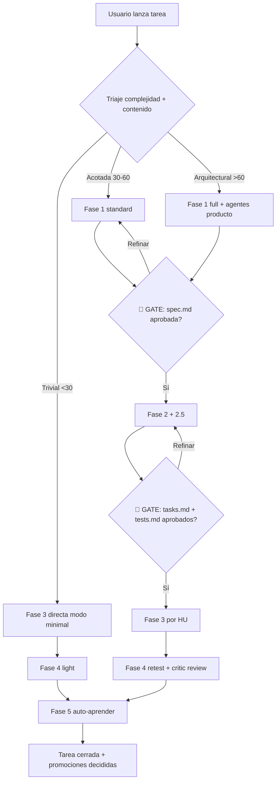

# Problema

Poneglyph fue diseñado contra el grano del harness Claude Code:

- **Premisa Arch H falsa**: el sistema afirma "Default subagents cannot invoke Skill()" — la documentación oficial dice lo contrario ([code.claude.com/docs/en/sub-agents](https://code.claude.com/docs/en/sub-agents) + GitHub issue #32910). El campo `skills:` solo controla preload, no acceso.
- **Agentes genéricos delegando**: Anthropic publica "build skills, not agents" ([engineering blog](https://www.anthropic.com/engineering/equipping-agents-for-the-real-world-with-agent-skills)). Ningún repo público con tracción (wshobson 36k, davila7 27k, VoltAgent 20k) usa "Lead orchestrator + builder genérico".
- **Coste tokens**: "3-agent team uses 7x more tokens" ([faros.ai](https://www.faros.ai/blog/claude-code-token-limits)). El usuario lo experimentó como "delegaba todo y gastaba muchos tokens".
- **Sin artefactos persistentes**: specs/tasks/tests/reviews/retros se pierden entre sesiones. No hay base para auto-aprendizaje.
- **Sin workflow producto-first**: todas las tareas empiezan en lo técnico, sin fase de "qué/por qué" antes de "cómo".
- **Counter-evidence ignorada**: METR RCT 2025 (-19% velocidad con AI en devs expertos), Apiiro (2.74x vulns con vibe-coding, +322% privilege escalation paths) — el sistema actual no gestiona estos riesgos.

# Resultado esperado

Workflow de 5 fases híbrido SDD-medio operacional como capa global poneglyph:

- **Capa global reutilizable** en cualquier proyecto Claude Code (vía symlink `~/.claude/`).
- **Adaptive por complejidad** (Commandment III honrado): triaje minimal/standard/full según calibre real de la petición.
- **Artefactos IA-friendly persistentes** en `.claude/plans/{NNN}-{slug}/`: spec.md, tasks.md, tests.md, review.md, retro.md, state.json.
- **Self-contained skills por fase** (no sub-skills compartidas salvo composición 100% automática).
- **Living-spec loop** (gap único no cubierto por ningún framework SDD existente).
- **Auto-aprendizaje en Fase 5** con promoción explícita global/local.

# Success criteria (medibles, Given/When/Then)

- **AC1** — Triaje full funciona: *Given* una tarea complejidad >60, *when* se invoca `/flow --full <task>`, *then* se crean los 5 archivos en `.claude/plans/{NNN}-{slug}/` y se ejecutan las 5 fases con 2 hard gates humanos (1→2 y 2→3).
- **AC2** — Triaje minimal respeta Commandment III: *Given* una tarea trivial (<30, 1-2 archivos, patrón conocido), *when* se invoca `/flow <task>` o flujo natural, *then* NO se crean artefactos persistentes y solo se ejecuta Fase 3 + Fase 4 light.
- **AC3** — Skills auto-activables: *Given* las 6 skills nuevas (`scope-definer`, `tech-planner`, `tdd-designer`, `story-executor`, `critic-reviewer`, `retro-learner`), *when* se invocan por keyword o por command, *then* cada una cumple los Commandments declarados de su fase.
- **AC4** — Dogfooding cierra el loop: *Given* este propio spec.md como primera aplicación, *when* se completa la implementación, *then* la `retro.md` identifica ≥1 fricción real y ≥1 promoción candidata.
- **AC5** — Anti-ceremonia: *Given* los Commandments + Golden Rule, *when* se ejecuta cualquier fase, *then* ninguna actividad viola III (over-engineering) ni I (radical honesty) — verificable en `retro.md` Commandments check.
- **AC6** — Tests no regresionan: *Given* el sistema actual con 81/81 tests pasando, *when* se completa la implementación, *then* `bun test ./.claude/hooks/` sigue 81/81.

# Out of scope (explícito)

- Empaquetar el workflow como plugin distribuible (patrón wshobson) — fase futura.
- Implementar `state.json` con persistencia compleja (file-watch, daemon, schema validation rigurosa) — JSON simple basta.
- Automatizar promoción a global vía PR — empezar con recomendación manual en retro.md.
- Cortar skills existentes que no encajan (`planner-protocol`, `review-patterns`) en este sprint — HU dedicada al final tras validación dogfooding.
- Implementar agentes paralelos producto background (Fase 1 modo full) en primera iteración — opcional, validar valor primero.
- Cambios a CLAUDE.md raíz reflejando el workflow — HU final tras dogfooding.
- Sincronización con `~/.claude/` global — cubierto por `/sync-claude` existente.
- Decisión final builder/reviewer agents (cortar o mantener) — HU dedicada con dogfooding como criterio.
- Heurística automática de detección de complejidad — empezar con estimación manual del Lead + override usuario `--minimal|--standard|--full`.

# Constraints

- **Stack**: Bun + TypeScript (hooks/scripts); Markdown (skills, templates, specs).
- **No regresión tests**: `bun test ./.claude/hooks/` mantiene 81/81.
- **No tocar code de runtime**: solo añadir skills + commands + templates + estructura `.claude/plans/`.
- **Reutilizar piezas válidas**: `anti-hallucination`, `decision-stress-test`, `diagnostic-patterns`, `lsp-operations`, `security-review`, `meta-create`, `meta-settings-cookbook`, `prompt-engineer`, `explain-changes` (transversales).
- **Cumplir Golden Rule + 10 Commandments** en cada fase implementada (mapping explícito al final).
- **IA-friendly**: artefactos densos en señal, no decorativos. Test: si una sección puede borrarse sin que el modelo decida peor en fases posteriores → fuera.
- **Self-contained skills**: cada SKILL.md autosuficiente; duplicación preferible a sub-skill manual.

# Stakeholders

- **Oriol Macias** — único usuario, decide los 2 hard gates humanos.
- **Claude Code Lead** (esta sesión y futuras) — ejecutor del workflow.
- **Subagents `builder`/`reviewer`/`scout`** — reusables solo cuando aporta context isolation real (reevaluar en HU dedicada).

# Open questions (a resolver en Fase 2 — descomposición en HUs)

1. Algoritmo exacto del triaje de complejidad (heurística vs estimación manual del Lead).
2. Schema completo de `state.json`.
3. Mecánica de "aprobación humana" en gates (`AskUserQuestion` vs Plan mode vs comment).
4. Templates como ficheros independientes en `.claude/plans/templates/` vs embebidos en cada SKILL.md.
5. Decisión final: `builder` y `reviewer` agents se cortan o se mantienen.
6. Coexistencia formal `/decide` y `/decision-stress-test` con `/flow`.
7. Updates a CLAUDE.md raíz reflejando el workflow.
8. Migración del trabajo en curso (commit `2349259` TDD-mode + `test-policy.md`) — integrar en `tdd-designer` Fase 2.5.
9. Cómo medir empíricamente si los templates son útiles vs decorativos.
10. Umbral de cobertura test en `review.md` — `test-policy.md` lo modula.
11. ¿Drillme vía `AskUserQuestion` al usuario o internamente solo? (probablemente ambos modos según necesidad).
12. Criterio formal de promoción global vs local en `retro.md`.

---

# Modelo conceptual completo (V2)

> El contenido siguiente es el modelo conceptual aprobado en sesión 2026-05-28 — base para Fase 2 (descomposición en HUs).

## Principios transversales (rigen todas las fases)

### 1. Golden Rule + 10 Commandments — el norte

Cada fase **declara explícitamente** qué Commandments cubre. Si alguna actividad de la fase no mapea a ≥1 Commandment, no pertenece allí.

### 2. Adaptación inteligente: "no siempre más es más"

La intensidad de cada fase se modula al contenido real de la petición:

| Señal en la petición | Intensidad de fase |
|---|---|
| Petición trivial (1-2 archivos, ya tienes el patrón) | Modo minimal: solo lo esencial, sin drillme largo |
| Petición acotada pero con incertidumbre | Modo standard: drillme corto, cuestionario focal |
| Petición arquitectural / multidominio | Modo full: drillme profundo + agentes producto/técnicos paralelos |

**Anti-pattern bloqueado**: aplicar las 5 fases iguales a cualquier petición → ceremonia + violación a Commandment III. El Lead detecta el calibre real y modula. Si duda, pregunta antes de inflar.

### 3. Artefactos IA-friendly (no burocráticos)

Cada documento producido contiene **solo señal aprovechable por el modelo**: tablas estructuradas, campos canónicos, IDs estables, dependencias explícitas. Prohibido: prosa decorativa, "context background" que no informa decisiones, secciones que nadie lee.

**Test**: si una sección puede borrarse sin que el modelo decida peor en fases posteriores → no debería estar.

### 4. Drillme pattern por fase

Cada fase incluye un **sub-protocolo "drillme"** que perfora en profundidad antes de cerrar. Inspirado en técnicas socráticas / 5-whys / first principles. Adaptativo: solo cuando hay incertidumbre detectada o complejidad lo justifica.

**Forma común**:
1. Lista 3-5 preguntas clave (qué/cómo/por qué/qué pasa si no).
2. Aplica al output de la fase: ¿la respuesta sobrevive?
3. Si no sobrevive → iterar. Si sí → cerrar.

### 5. Self-contained skills

Cada skill de fase es 100% self-contained. Aunque haya partes comunes, preferimos duplicación a sub-skill compartida — salvo composición 100% automática (descubrimiento por filesystem, sin invocación manual).

### 6. Empezar de cero (no reutilizar skills existentes para las 5 fases)

Las 5 skills nuevas tienen nombres acordes a fases. Las viejas (`planner-protocol`, `review-patterns`) se mantienen como utilidades invocables pero NO son la columna vertebral del workflow. Posibilidad de cortarlas si las nuevas las absorben en práctica.

## Overview visual



## Triaje adaptativo

| Complejidad | Modo | Fases ejecutadas | Artefactos persistidos |
|---|---|---|---|
| **<30** trivial | Minimal | 3 + 4-light + 5-corta | Ninguno |
| **30-60** acotada | Standard | 1 + 2 + 2.5 + 3 + 4 + 5 | spec, tasks, tests, review, retro |
| **>60** arquitectural | Full | 5 fases + agentes producto Fase 1 + decision-stress-test Fase 2 | Igual + state.json |

Override usuario: `/flow --minimal | --standard | --full <task>`.

**Adaptación intra-fase**: incluso en `standard`, si una fase detecta contenido autoexplicativo, salta sub-pasos y lo declara honestamente.

## Las 5 fases

### Fase 1 — Definir el alcance (producto, no técnico)

| Pieza | Detalle |
|---|---|
| **Skill** | `scope-definer` — auto-activable. Command: `/scope <brief>` |
| **Artefacto** | `spec.md` |
| **SIEMPRE** | Cuestionario intensivo (3-8 preguntas). Proactividad sobre gaps |
| **Drillme** | (1) ¿Problema raíz vs síntoma? (2) ¿Qué pasa si NO? (3) ¿Quién sufre hoy? (4) Mínimo viable? (5) ¿Qué NO está en alcance? |
| **Agentes paralelos (modo full)** | 2-3 perspectivas producto en background (Outsider, User, Product) |
| **Gate 1→2** | 🔴 HARD GATE HUMANO |
| **Commandments** | I, II, III, V, VIII |

### Fase 2 — Planificar técnicamente + atomizar HUs

| Pieza | Detalle |
|---|---|
| **Skill** | `tech-planner` — auto-activable. Command: `/plan` |
| **Artefacto** | `tasks.md` + DAG mermaid |
| **SIEMPRE** | Cuestionario cierre + cuestionario mejoras + Glob/Grep ejemplos del proyecto |
| **Drillme** | (1) Solución más simple? (2) ¿Reinvento algo? (3) HUs atómicas (≤1 sesión)? (4) Dependencias reales? (5) Si una HU falla, ¿bloquea todo? |
| **Investigación obligatoria** | Context7 + WebFetch + Grep proyecto |
| **decision-stress-test (modo full)** | Si 2+ soluciones razonables, stress-test |
| **Gate 2→3** | 🔴 HARD GATE HUMANO combinado con Fase 2.5 |
| **Commandments** | II, III, V, VII, VIII |

### Fase 2.5 — Diseño TDD

| Pieza | Detalle |
|---|---|
| **Skill** | `tdd-designer` — auto-activable. Command: `/tdd-design` |
| **Artefacto** | `tests.md` |
| **Respeta** | `test-policy.md` (TDD-first solo si business-critical/forced) |
| **Drillme** | (1) Cada HU happy + edge? (2) ¿HU no testeable = HU mal definida? (3) Property-based aporta? |
| **Property-based opt-in** | Para HUs con invariantes (+23-37% sobre TDD plano) |
| **Gate** | Combinado con Fase 2 |
| **Commandments** | II, IV, VIII |

### Fase 3 — Desarrollo / Construcción

| Pieza | Detalle |
|---|---|
| **Skill** | `story-executor` — auto-activable. Command: `/build [US{id}]` |
| **Artefacto** | Código + `state.json` |
| **Flujo por HU** | Read US+test → Glob ejemplos → red (si TDD forced) → green minimal → tests → mark completada |
| **SIEMPRE** | Si duda concreta → `AskUserQuestion`. Nunca improvisar |
| **Drillme intra-HU** | (1) Patrón ignorado? (2) Duplicación? (3) Sobre-ingeniería? (4) Nombres consistentes? |
| **Soft checkpoint** | Tests HU pasan antes de siguiente. Si fallan: `diagnostic-patterns` |
| **Commandments** | II, III, IV, V, VI, VIII |

### Fase 4 — Retest / Critic / Mejorar

| Pieza | Detalle |
|---|---|
| **Skill** | `critic-reviewer` — auto-activable al cerrar última HU. Command: `/critic` |
| **Artefacto** | `review.md` (checklist + findings + veredicto) |
| **Flujo** | Generar lista validaciones → ejecutar → si falla volver a Fase 3 → opcional reviewer agent (Opus) → reporte |
| **Drillme** | (1) ¿spec.md sigue describiendo lo entregado? (living-spec loop) (2) Happy path E2E? (3) Edge no probado? (4) Cobertura test-policy? |
| **SIEMPRE** | Preguntar/mencionar mejoras detectadas |
| **Commandments** | I, IV, VI, VII, IX |

### Fase 5 — Auto-aprender

| Pieza | Detalle |
|---|---|
| **Skill** | `retro-learner` — auto-activable al cerrar Fase 4. Command: `/retro` |
| **Artefacto** | `retro.md` |
| **Drillme** | (1) ¿Qué fase pesó más? (2) Fricción evitable? (3) Patrón reusable? (4) Promovible a global/local? (5) Commandment violado? |
| **Promoción** | Tabla candidate × scope × tipo × razón × propuesta concreta. Usuario aprueba |
| **Living-spec loop** | Si Fase 3-4 generó delta legítimo en spec.md → escribir delta |
| **SIEMPRE** | Honestidad sobre lo que NO funcionó (Commandment I) |
| **Commandments** | I, IX, X |

## Templates (descripción)

Ver `## Templates (descripción — no la implementación)` del plan V2 original. Incluyen:

- `spec.md` (Fase 1): id, problema, resultado, success criteria, out of scope, constraints, stakeholders, open questions
- `tasks.md` (Fase 2): DAG mermaid + HUs con role/action/benefit/AC/depends-on/files/TDD-mode/estimate/wave
- `tests.md` (Fase 2.5): test specs por HU con Pre/Action/Assert + falla esperada
- `review.md` (Fase 4): checklist Correctness/Quality/Security/Performance/Mantenibilidad + findings con severidad + veredicto
- `retro.md` (Fase 5): resumen, lecciones, proceso, promociones, living-spec deltas, commandments check, action items
- `state.json` (todas las fases standard/full): spec_id, current_phase, gates_approved, us_completed/pending

**Distinción crítica**: `tests.md` (oráculo binario por HU, ejecutable) ≠ `review.md` (checklist amplio sobre el conjunto).

## Agents — location strategy

**Decisión propuesta** (a ratificar en HU dedicada):

- `scout` agent: mantener en `.claude/agents/` (context isolation real demostrado, genérico).
- `builder` y `reviewer`: reevaluar — el research previo sugiere que no aportan suficiente; opciones: (a) cortar y skill lo hace directo, (b) mantener solo cuando context isolation real aporta (≥5 archivos, contexto contaminado).
- Agents específicos de una sola fase: considerar anidarlos en la skill (encapsulación).

**Regla general**: agents son la última opción, no la primera.

## Skills nuevas (empezar de cero)

| Fase | Skill | Command | Trigger keywords | Reemplaza |
|---|---|---|---|---|
| 1 | `scope-definer` | `/scope` | scope, idea, problema, alcance, quiero, necesito | (parcial) prompt-engineer F1 |
| 2 | `tech-planner` | `/plan` | plan, planifica, roadmap, tareas, HU | planner-protocol entero |
| 2.5 | `tdd-designer` | `/tdd-design` | TDD, tests, especifica tests | integrado en tech-planner |
| 3 | `story-executor` | `/build` | build, implementa, ejecuta, construye | (parcial) builder agent |
| 4 | `critic-reviewer` | `/critic` | revisa, valida, critica, review | (parcial) reviewer agent + review-patterns |
| 5 | `retro-learner` | `/retro` | retro, aprender, retrospectiva | nuevo |

Skills mantenidas (transversales): `anti-hallucination`, `decision-stress-test`, `diagnostic-patterns`, `lsp-operations`, `security-review`, `meta-create`, `meta-settings-cookbook`, `prompt-engineer`, `explain-changes`.

Skills posibles cortadas (reemplazadas): `planner-protocol`, `review-patterns`. `orchestrator-protocol` se revisa.

## Comandos

| Command | Función |
|---|---|
| `/flow [--minimal\|--standard\|--full] <task>` | Orquestador 5 fases |
| `/scope <brief>` | Fase 1 individual |
| `/plan` | Fase 2 individual |
| `/tdd-design` | Fase 2.5 individual |
| `/build [US{id}]` | Fase 3 |
| `/critic` | Fase 4 individual |
| `/retro` | Fase 5 individual |

Todas invocables sueltas O encadenadas por `/flow`.

## Estructura de archivos

```
.claude/plans/
└── {NNN}-{slug}/
    ├── spec.md       Fase 1
    ├── tasks.md      Fase 2
    ├── tests.md      Fase 2.5
    ├── review.md     Fase 4
    ├── retro.md      Fase 5
    └── state.json    Tracking (standard/full)
```

## Commandments — mapping fase × commandment

| Fase | I | II | III | IV | V | VI | VII | VIII | IX | X |
|---|---|---|---|---|---|---|---|---|---|---|
| 1 Scope | ✅ | ✅ | ✅ | — | ✅ | — | — | ✅ | — | — |
| 2 Plan | — | ✅ | ✅ | — | ✅ | — | ✅ | ✅ | — | — |
| 2.5 TDD | — | ✅ | — | ✅ | — | — | — | ✅ | — | — |
| 3 Build | — | ✅ | ✅ | ✅ | ✅ | ✅ | — | ✅ | — | — |
| 4 Critic | ✅ | — | — | ✅ | — | ✅ | ✅ | — | ✅ | — |
| 5 Retro | ✅ | — | — | — | — | — | — | — | ✅ | ✅ |

Todas las columnas tienen ≥1 ✅: ningún Commandment queda huérfano.

---

## Próximo paso

Esta `spec.md` es output formal de Fase 1 (dogfooding sobre el propio workflow). **Aprobación del usuario** (hard gate 1→2) requerida antes de entrar en Fase 2 (descomponer en HUs atómicas con DAG en `tasks.md`).
