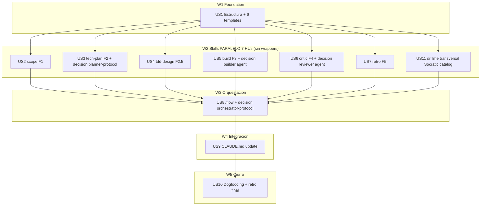

# Tasks index — 5-phase workflow refactor

## Resumen ejecutivo

Descomposición de `spec.md` aprobado en **11 HUs atómicas** (era 14 → 10 absorbiendo decisiones, +1 tras research 2026-05-28 sobre Socratic Method canon → drillme se centraliza como skill global transversal en lugar de duplicarse por fase). Organizadas en **5 waves**.

Cambio clave vs V1 del tasks: las decisiones arquitectónicas (cortar/mantener `builder` agent, `reviewer` agent, `planner-protocol`, `review-patterns`, `orchestrator-protocol`) **no son HUs independientes** — son ACs dentro de la HU que las requiere para funcionar coherentemente. Esto evita HU artificiales y mantiene atomicidad real.

**Crítica empírica adicional** (post-lectura de `review-patterns/SKILL.md`): NO se corta `review-patterns` — tiene 17+ references valiosas (SOLID, N+1, complexity, refactoring patterns). `critic-reviewer` la **invoca** como catálogo de patrones, no la sustituye. Decisión refinada en US6.

## Estimación de esfuerzo

| Wave | HUs | Esfuerzo | Naturaleza |
|---|---|---|---|
| W1 Foundation | US1 | 0.5 sesión | Estructura + 7 templates IA-friendly (combinados) |
| W2 Skills + commands | US2, US3, US4, US5, US6, US7, US11 | 2-3 sesiones | 7 skills self-contained, paralelizables (6 de fase + 1 transversal drillme) |
| W3 Orquestación | US8 | 0.5-1 sesión | `/flow` command + decisión orchestrator-protocol |
| W4 Integración | US9 | 0.3 sesión | CLAUDE.md update reflejando estado final |
| W5 Cierre | US10 | 0.5-1 sesión | Dogfooding + retro Fase 5 sobre el meta-refactor |

**Critical path**: ~4 sesiones standard.

## DAG



**Leyenda**: W2 íntegra es paralela (6 skills self-contained, sin cross-imports). Resto secuencial por dependencias reales.

## Tabla resumen

| # | HU | Fase del workflow | Wave | Estimate | TDD-mode | Decisión absorbida |
|---|---|---|---|---|---|---|
| US1 | Estructura + templates IA-friendly | Foundation | W1 | M | optional | — |
| US2 | `scope` skill (Fase 1) | Fase 1 | W2 | M | optional | — |
| US3 | `tech-plan` skill (Fase 2) | Fase 2 | W2 | L | optional | `planner-protocol` (cortar/simplificar) |
| US4 | `tdd-design` skill (Fase 2.5) | Fase 2.5 | W2 | M | optional | — |
| US5 | `build` skill (Fase 3) | Fase 3 | W2 | M | optional | `builder` agent (CUT/KEEP-cond/ABSORB) |
| US6 | `critic` skill (Fase 4) | Fase 4 | W2 | M | optional | `reviewer` agent + uso de `review-patterns` |
| US7 | `retro` skill (Fase 5) | Fase 5 | W2 | M | optional | — |
| US11 | `drillme` skill (Socratic catalog transversal) | Transversal | W2 | M | optional | — |
| US8 | `/flow` orquestador | Orquestación | W3 | M-L | optional | `orchestrator-protocol` (cortar/simplificar/keep) |
| US9 | Update CLAUDE.md raíz | Integración | W4 | S | optional | — |
| US10 | Dogfooding + retro final | Cierre | W5 | M | optional | — |

> **Naming convention (refined 2026-05-28)**: skills phase usan nombres cortos action-verb. Docs Anthropic confirman skills se invocan como `/<skill-name>` directo — NO se crean wrappers `commands/*.md`. Excepción `US3 tech-plan`: añadido sufijo `-tech` para evitar colisión con **modo plan oficial** de Claude Code.

## Cross-cutting decisions (absorbidas en HUs)

Decisiones que afectan a múltiples HUs pero **viven en una HU concreta** (no como HU separada):

| Decisión | Dónde se toma | HUs afectadas | Criterio |
|---|---|---|---|
| `planner-protocol` skill (cortar/simplificar) | US3 | US3 (tech-planner la reemplaza) | Si tech-planner cubre 100% → cortar; si quedan refs útiles → migrar lo bueno + cortar resto |
| `review-patterns` skill (cortar/mantener) | US6 | US6 (critic-reviewer la usa) | **NO cortar** (verificado: tiene 17+ refs únicas). critic-reviewer la INVOCA como catálogo |
| `builder` agent (CUT/KEEP-cond/ABSORB) | US5 | US5 (story-executor lo invoca o no) | CUT por default; KEEP-cond solo si ≥5 archivos o context isolation real demostrada |
| `reviewer` agent (CUT/KEEP-cond/ABSORB) | US6 | US6 (critic-reviewer lo invoca o no) | KEEP-cond por default (Opus aporta en reviews complejos); CUT si redundante con critic-reviewer en práctica |
| `orchestrator-protocol` skill (cortar/simplificar/keep) | US8 | US8 (/flow puede solapar) | Si `/flow` cubre orquestación → simplificar el SKILL.md a verificación + agent-selection; cortar references duplicadas |
| `scout` agent (mantener) | — | Decisión ya tomada en spec.md | KEEP — context isolation real demostrada (exploración masiva read-only) |

## Open questions (deferidas a Fase 3)

1. **Templates location**: confirmado `.claude/plans/templates/` en US1. Si cambia → impacto en US2-US7.
2. **`/flow` declarativo (.md) vs .ts**: decidir en US8 según necesidad real de orquestación condicional.
3. **Heurística complejidad para triaje**: empezar manual ("Lead estima"), automatizar si emerge patrón.
4. **`state.json` schema**: definir mínimo en US8 (spec_id, current_phase, phases_completed, gates_approved, us_completed, us_pending, mode).
5. **Hard gate UX**: `AskUserQuestion` 1 opción "approve" vs mensaje + espera. Empírico en US8.
6. **Drillme: interno vs elevado al usuario**: ambos modos según necesidad — interno produce preguntas que opcionalmente se elevan.
7. **Property-based tests opt-in**: criterio exacto en US4 (`tdd-designer`).
8. **Living-spec loop**: criterio "delta legítimo" en US7 (`retro-learner`).
9. **Reanudación de sesión via `/flow --resume <slug>`**: implementar en US8 si state.json existe.
10. **Promociones a global vía PR automático**: out-of-scope (manual por ahora).

## Anti-patterns mitigation

| Anti-pattern | Cómo se evita en este plan |
|---|---|
| HUs artificiales (decisión = HU) | Decisiones absorbidas como ACs en HU dueña |
| Over-specification del spec | 10 open questions deferidas, no inventadas |
| Spec theater | Promociones en US7 requieren aprobación usuario = acción obligada |
| Non-atomic tasks | Cada HU ≤1 sesión + deps explícitas + escape hatch documentado si decisión absorbida excede |
| Ceremonia uniforme | Adaptación intra-fase en cada skill + triaje en `/flow` (US8) |
| Sub-skills compartidas frágiles | Principio 5: self-contained; duplicación > orquestación manual. **Excepción aceptable** (US11 drillme): si el patrón es transversal y NO es gate (Commandment IV no aplica), la skill→skill probabilística es aceptable porque su fallo no rompe el output de fase — el Lead detecta y dispara manual |
| Premisas falsas (Arch H) | Asumido: subagents pueden invocar skills (corregido per docs oficiales) |
| Re-acumular complejidad | US3/US5/US6/US8 fuerzan poda condicional de viejas |

## Auxiliary skills matrix (canon — referenciado por cada SKILL.md)

> Fuente de verdad para qué skills auxiliares invoca cada phase skill. Cada SKILL.md de US2-US7 + US11 incluye un bloque "Auxiliary skills invoked" con la fila relevante de esta tabla (NO duplica la tabla completa).

### Catálogo de auxiliaries

| Auxiliary skill | Propósito | Disable-model-invocation |
|---|---|---|
| `anti-hallucination` | Verificar premisas factuales (Glob/Grep/LSP antes de afirmar) | false (auto) |
| `drillme` | Socratic check (4 categorías canónicas + complementarios) | false (auto) |
| `decision-stress-test` | 5-12 perspectives en paralelo + cross-debate + synthesis + vote | false |
| `diagnostic-patterns` | Debug, retry, recovery, 5-whys, circuit breaker, saga | false |
| `lsp-operations` | Semantic navigation: goToDefinition, findReferences, hover, call hierarchy | false |
| `review-patterns` | Quality (SOLID/DRY/complexity) + Performance (N+1/leaks/async) modes | false |
| `prompt-engineer` | Prompt quality (refinar / generar / review delegation / audit) | false |
| `explain-changes` | Educational walkthrough de cambios para entender / aprender | false |
| `meta-create` | Crear extensiones Claude Code (skills/commands/hooks/rules/MCP/plugin) | false |
| `meta-settings-cookbook` | Reference rápido para CLAUDE.md/settings.json/output styles/permissions | true (manual) |
| `security-review` (plugin) | Security audit del branch pendiente | (plugin) |
| `simplify` (plugin) | Review code for reuse/quality/efficiency + fix | (plugin) |

### Cruce: qué phase skill invoca a qué auxiliary

| Phase skill | anti-hallucination | drillme | decision-stress-test | diagnostic-patterns | lsp-operations | review-patterns | prompt-engineer | explain-changes | meta-create | meta-settings-cookbook | security-review | simplify |
|---|---|---|---|---|---|---|---|---|---|---|---|---|
| **scope** (F1) | ✅ premisas factuales del brief | ✅ cierre fase | ⚠️ modo full (perspectives producto) | — | — | — | ✅ brief vago → refinar | — | — | — | — | — |
| **tech-plan** (F2) | ✅ archivos/funciones/patrones del proyecto | ✅ cierre fase | ✅ modo full (2+ alternativas técnicas) | — | ✅ entender deps reales del código | — | ✅ review delegation prompts | — | ✅ si plan crea skills/hooks/rules | ✅ si plan toca CLAUDE.md/settings | — | — |
| **tdd-design** (F2.5) | ✅ funciones/módulos referenciados | ✅ cierre fase | — | — | — | — | — | — | — | — | — | — |
| **build** (F3) | ✅ cada Edit/Write previa verificación | ✅ intra-HU | — | ✅ tests fallan → 5-whys | ✅ findReferences/hover | ⚠️ opcional — quality durante escritura | — | — | ✅ si HU = crear extensión | ✅ si HU toca config | — | — |
| **critic** (F4) | ✅ findings antes de reportar | ✅ cierre fase | ⚠️ si revela decisión arquitectónica | ✅ tests fallan en ejecución | ✅ call hierarchy → impacto | ✅ modo quality/performance según contenido | — | ⚠️ si reviewer humano necesita walkthrough | — | — | ✅ auth/payments/secrets/credentials | ⚠️ refactor opcional |
| **retro** (F5) | ✅ promociones — paths existen | ✅ cierre feature | — | — | — | — | — | ⚠️ si retro produce doc educativo | ⚠️ si retro propone nueva skill/rule | ⚠️ si retro propone setting | — | — |
| **drillme** (transversal) | ✅ premisas en respuestas factuales | — | ✅ escalación cuando alcanza techo | — | — | — | — | — | — | — | — | — |

Leyenda: ✅ = invocación canónica esperada · ⚠️ = condicional según contexto · — = no aplica

### Patrón canónico del bloque "Auxiliary skills invoked" (a copiar en cada SKILL.md)

```markdown
## Auxiliary skills invoked

> Canonical matrix in `.claude/plans/001-poneglyph-5phase-workflow/tasks/index.md §Auxiliary skills matrix`. Row below is the literal subset that applies to this phase skill.

| Auxiliary skill | When this skill invokes it | Fallback if skill->skill fails |
|---|---|---|
| `<aux1>` | <when> | <manual recovery path> |
| ... | ... | ... |

> Skill-to-skill invocation is **probabilistic** per docs Anthropic + [issue #59968](https://github.com/anthropics/claude-code/issues/59968). Each row's fallback documents the Lead's manual recovery path. Critical auxiliaries (security-review) require the Lead to dispatch even if auto-fire succeeded — they are mandatory gates, not advisory.
```

## Próximo paso

`tasks/` status: `approved` (amended 2026-05-28 con rename US3-US7 + Auxiliary skills matrix). Implementación Phase 3 ya en curso: US1 ✅, US2 ✅ (scope), US11 ✅ (drillme), US3 ✅ (tech-plan + MIGRAR-Y-CUT planner-protocol), US4 ✅ (tdd-design dual-mode), US5 ✅ (build + AC7 ratificado KEEP-conditional). Siguiente: US6 `critic` (Phase 4) + decisión absorbida `reviewer` agent + uso de `review-patterns`.
