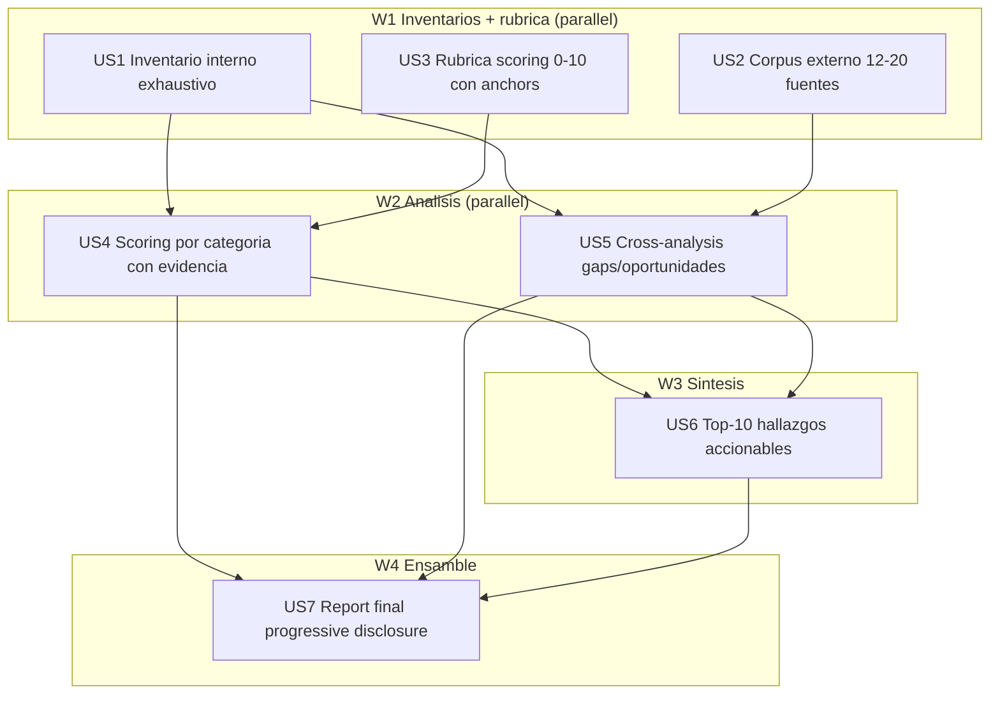

# Tasks index — Audit profundo Claude Code Poneglyph

**Level**: Full — modo forzado + complejidad >60 + auditoría multi-dominio (skills + commands + agents + hooks + rules + corpus externo).
**TDD-mode**: optional → **VALIDATIONS-MODE** por nature atípica (deliverable = markdown, no código). Todas las HUs producen artefactos markdown; oracle = checklists de calidad en `validations.md`.

## Resumen ejecutivo

7 HUs atómicas en 4 waves para producir un audit report profesional del sistema poneglyph post-refactor W1-W5. Cada HU produce un artefacto markdown intermedio en `.claude/plans/002-claude-config-deep-audit/build/` que se compone en `report.md` final (HU7).

Decisiones absorbidas del spec.md (ratificadas usuario):
- 14 categorías scoring híbridas (5 phases + 9 transversales)
- 12-20 fuentes corpus externo
- Audit-first (no dogfood-first)
- Mitigación meta-circular en capas 1-5 (critic + reviewer Opus + advisor() + perspectives + AC8 honestidad)

Refinamientos estructurales de las 3 perspectives ABSORBIDOS (no contradicen decisiones ratificadas):
- Progressive disclosure (AC6) → HU7 estructura el report con TOC + executive summary ≤5 bullets
- Anchors literales 0/5/10 (AC7) → HU3 los define ANTES del scoring
- Top-N con verb-first + effort + /flow sugerido (AC4) → HU6 estructura
- Disputa/rebuttal protocol → frontmatter del report.md con campo `disputed: []`

## Estimación de esfuerzo

| Wave | HUs | Esfuerzo | Naturaleza |
|---|---|---|---|
| W1 Inventarios + rúbrica | US1, US2, US3 | 3 sesiones paralelas | Research (internal + external) + design |
| W2 Análisis | US4, US5 | 2 sesiones paralelas | Scoring + cross-analysis |
| W3 Síntesis | US6 | 1 sesión | Priorización accionable |
| W4 Ensamble | US7 | 1 sesión | Composición report final |

**Critical path**: HU1 → HU4 → HU6 → HU7 = **~4 sesiones secuenciales** (Wave 1 más larga = HU2 corpus externo, posiblemente 2 sub-sesiones si excede tiempo por WebFetch budget).

**Parallel Efficiency Score**: 5 parallel ops / 7 total = **71%** ✅ (target ≥50%)

## DAG

## Tabla resumen

| # | HU | Fase | Wave | Estimate | TDD-mode | Decisión absorbida |
|---|---|---|---|---|---|---|
| US1 | Inventario interno exhaustivo | 3 build | W1 | M | validations | Catalogación completa 19+4+3+4+4+1+7+meta |
| US2 | Corpus externo 12-20 fuentes | 3 build | W1 | L | validations | Cap 12-20 ratificado usuario (BLOCKER asumido) |
| US3 | Rúbrica 0-10 anchors literales | 3 build | W1 | M | validations | Re-ejecutabilidad AC7 |
| US4 | Scoring 14 categorías | 3 build | W2 | L | validations | 14 cat ratificado usuario (BLOCKER asumido) |
| US5 | Cross-analysis gaps/oportunidades | 3 build | W2 | M | validations | Comparación interno↔externo |
| US6 | Top-10 accionables priorizados | 3 build | W3 | M | validations | AC4 + Quick-wins separados |
| US7 | Report final progressive disclosure | 3 build | W4 | M | validations | AC6+AC8 honestidad radical |

## Cross-cutting decisions

| Decisión | Dónde se toma | HUs afectadas | Criterio |
|---|---|---|---|
| Anchors 0/5/10 por categoría | US3 | US4 (consume) | Re-ejecutabilidad inter-audit (AC7) |
| Path interno cite format | US1 | US4, US5, US6 (consumen) | Windows path con backslash → forward slash en markdown |
| URL externa verification protocol | US2 | US5, US6, US7 (consumen) | WebFetch con HEAD-check; si 404 → marcar `[URL-DEAD]` + retry alternativa |
| Severity scale para hallazgos | US6 | US7 (consume) | BLOCKER / MAJOR / MINOR / NIT (alineado con critic skill) |
| Honestidad radical trigger | US6 | US7 (consume) | Si scoring promedio >8.0 sin negative finding → AC8 obliga buscar 1 finding crítico genuino |

## Open questions (deferidas a Fase 3)

1. **OQ-P3-1**: ¿Cuántas URLs Anthropic oficiales contar en el cap 12-20? Decisión en US2 según peso aportado.
2. **OQ-P3-2**: ¿Cross-analysis incluye fuentes adicionales si emergen durante scoring? Decisión en US5: SI emerge fuente crítica no anticipada, se añade pero se documenta como "post-spec addition" en US7.
3. **OQ-P3-3**: ¿Quick-wins máximo cuántos? Sugerido 5 (subset del top-10). Decisión final en US6.
4. **OQ-P3-4**: Si HU2 corpus excede tiempo en 1 sesión (>20 WebFetch) → split en US2a (top-10) + US2b (resto)? Decisión: continuar en mismo HU pero registrar split en state.json si ocurre.

## Anti-patterns mitigation

| Anti-pattern | Cómo se evita |
|---|---|
| Inventory drift (sistema cambia durante audit) | Snapshot HEAD commit en US1; declarar invariante |
| Apples-to-oranges en corpus (BLOCKER perspectives) | US2 cada fuente declara explícitamente "compare-context: personal-system" o "compare-context: enterprise-multi-user"; cross-analysis US5 honra esa label |
| Score paralysis con 14 dimensiones (BLOCKER perspectives) | US7 progressive disclosure: scoring NO está en executive summary; va detrás del top-10 priorizado |
| Hallucination URLs / star-counts | US2 anti-hallucination obligado: cada URL verified con WebFetch; cada star-count verified ese día de research |
| Self-congratulation pattern | US6+US7 AC8 trigger: scoring promedio >8.0 sin hallazgo negativo = re-analyze obligatorio |
| Hallazgos sin owner/effort = .md muerto | US6 formato canónico: `Hallazgo \| Tipo \| Severity \| Acción verb-first \| Effort S/M/L \| /flow sugerido` |
| Report ilegible >5000 palabras | US7 cap: report target 2500-4500 palabras; si excede, mover detalles a apéndice |

## Research sources (Phase 2)

| Source | Verified | Notes |
|---|---|---|
| `.claude/plans/templates/*.md` | Glob — 7 templates ✅ | spec/tasks/tasks-index/tests/validations/review/retro |
| `.claude/plans/001-poneglyph-5phase-workflow/retro.md` | Glob ✅ | review.md NO existe en 001 — usar retro.md como formato reference |
| `memory/project_audit_outcome_2026-05-25.md` | Glob ✅ | Audit propio previo (no es 5-phase audit, sino cleanup baseline) |
| `memory/project_cleanup_2026-05-25{b,c,d}.md` | Glob ✅ | Iteraciones de cleanup post-audit baseline |
| `memory/project_usage_measurement_2026-05-28.md` | Glob ✅ | Telemetry cut decisión — relevante para evaluar Observability category |
| Anthropic skills docs (`code.claude.com/docs/en/skills`) | WebFetch — defer a US2 | Cited en CLAUDE.md, verificar en HU2 |
| Anthropic sub-agents docs | WebFetch — defer a US2 | Cited en spec 001, verificar en HU2 |
| GitHub repos comparables (wshobson, davila7, VoltAgent, Cline, etc.) | WebFetch — defer a US2 | Star counts + structure verified en HU2 |
| Estudios empíricos (METR, Apiiro, faros.ai) | WebFetch — defer a US2 | Claims numéricos verified en HU2 |

## Próximo paso

Index draft. 7 US{N}.md a redactar a continuación. Después: invocar `tdd-design` Phase 2.5 → validations.md.

⏸️ Hard gate 2→3 pendiente tras Phase 2.5.
