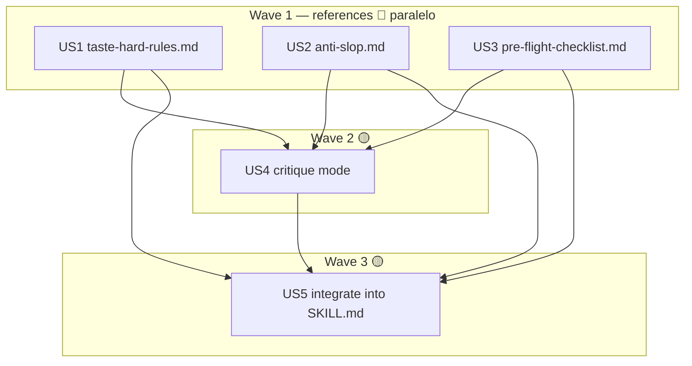

Level: Standard — single domain (skill doc/content), scope resolved (enhance html-report in-place), research pre-done in dossier (no Context7 re-run).
TDD-mode: optional — `.claude/rules/test-policy.md` = `auxiliary`; all HUs produce markdown (references/SKILL.md), no executable business logic. Phase 2.5 → `validations.md` (validation-mode), not `tests.md`.

# Resumen ejecutivo

Enriquecer la skill `html-report` (plan 003, ya existe) con una **capa de taste verificada por expertos** + un **modo crítica/audit**, sin crear skill nueva (OQ1 resuelta: enhance in-place, Cmd III).

El research está hecho (14 agentes → `_research-skill-evolution-2026-05-29.md` Part B). Esta fase descompone en 5 HUs: 3 references nuevas (reglas duras / anti-slop / pre-flight) construibles en paralelo, luego el modo crítica que las consume, y la integración final en `SKILL.md`. Charter estricto: capa visual para outputs PROPIOS de Claude Code, NO generación de UI arbitraria.

Discovery (anti-duplicate): `html-report/` tiene `SKILL.md` + `templates/{tokens.css, components.html, report/dashboard.template.html}`. **No existe `references/`** → se crea (no duplica). `tokens.css` es sacred (no se toca).

# Estimación de esfuerzo

| Wave | HUs | Paralelo | Estimate | Build method |
|---|---|---|---|---|
| 1 | US1, US2, US3 | 🔵 sí (3) | ~1 sesión | Lead inline (≤3 units, regla ≥4 → no spawn) |
| 2 | US4 | 🟡 dep | ~0.5 sesión | Lead inline |
| 3 | US5 | 🟡 dep | ~0.5 sesión | Lead inline |

Critical path: US1/US2/US3 → US4 → US5 ≈ 2 sesiones. Parallel Efficiency Score: **60%** (3 paralelo / 5 total) ≥50% ✅.

# DAG

# HUs

| HU | Title | Wave | Type | Depends | Files | TDD |
|---|---|---|---|---|---|---|
| US1 | Taste hard-rules reference | 1 | 🔵 | — | 1 | optional |
| US2 | Anti-slop bans + tells catalog | 1 | 🔵 | — | 1 | optional |
| US3 | Pre-flight checklist gate | 1 | 🔵 | — | 1 | optional |
| US4 | Critique/audit mode | 2 | 🟡 | US1,US2,US3 | 1-2 | optional |
| US5 | Integrate corpus into SKILL.md | 3 | 🟡 | US1-US4 | 1 | optional |

# Cross-cutting decisions

- **OQ1 RESUELTA** (human gate): enhance html-report in-place. No skill `design-taste` separada.
- **Cmd X guard**: cada reference AÑADE (reglas duras, fuentes, tells, crítica). NO reformula la doctrina ya en `SKILL.md` (no-purple, deep teal, serif) ni el builtin `frontend-design`. AC8 lo verifica en Phase 4.
- **Tamaño** (finding A7): `SKILL.md` <500 líneas; el peso vive en `references/` (carga on-demand, presupuesto 25K post-compaction).
- **Security**: patrones tomados de impeccable/taste-skill/emil = principios leídos a mano del dossier, no vendorizados.

# Open questions deferidas a Phase 3

- OQ2: ¿adoptar dials/register/named-verbs o solo bans+reglas+crítica? → bias Cmd III: empezar con bans+reglas+crítica; dials/verbs solo si aportan (decidir al construir US4).
- OQ3: modo crítica = sección en SKILL.md (markdown, sin JS) vs helper `.ts`. → bias Cmd III: markdown-mode (el modelo critica guiado por checklist). Si se añade helper → ese nodo pasa a `tdd: forced`.
- OQ4: corpus cubre solo render de reports (charter estricto). Confirmado en scope.

# Próximo paso

Phase 2.5 (`tdd-design`) → `validations.md` (todos los HUs son markdown → validation-mode). Luego hard gate 2→3.
