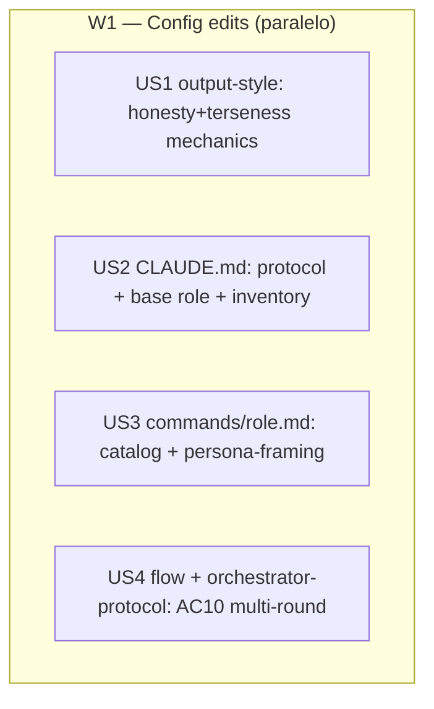

# Tasks index — Honesty layer + base role + /role command

**Level: Full** — meta-change al núcleo de gobierno (`CLAUDE.md` + output-style + comando nuevo + `orchestrator-protocol` + `/flow`); multi-fichero, arquitectónico.
**TDD-mode: optional** — política del repo `auxiliary` (`test-policy.md`); todas las HUs son markdown/config, validadas por lectura + no-regresión de hooks (`bun test ./.claude/hooks/`). Artefactos de Phase 2.5 = `validations.md` (validation-mode), no `tests.md`.

## Resumen ejecutivo

Feature 006 implementa dos goals del usuario sobre el meta-sistema poneglyph: (1) una **capa de honestidad always-on** (anti-pelota bilingüe, confidence labels default-seguro, discrepancia estructurada calibrada, verdad-primero, hold steelmanizado, auto-corrección) + terseness afinada; (2) un **rol base senior** always-on (refuerzo del modelo Lead + Commandment I, simbiosis intacta) + un **comando `/role <name>`** que compone skills existentes. Además codifica AC10 (**preguntar en rondas + laterales/mejoras proactivas**) en `/flow` y `orchestrator-protocol`.

Decisión arquitectónica clave (placement, resuelta sin decision-stress-test por estar constreñida por requisitos del usuario + Commandments X/III): **comportamiento/valores → `CLAUDE.md`** (always-on real, augmenta Commandment I/II sin duplicar); **mecánica/tono → `output-style`** (toggleable, para eso sirve); **catálogo de roles → `commands/role.md`** (fuera de CLAUDE.md, evita bloat); **rule nueva descartada** (output-style + CLAUDE.md ya cubren always-on).

4 HUs atómicas, todas en una wave (ficheros disjuntos → 100% paralelo). El único acoplamiento es consistencia de nombres canónicos (fijados abajo en Cross-cutting); Phase 4 critic verifica coherencia cross-file.

## Estimación de esfuerzo

| Wave | HUs | Esfuerzo | Naturaleza |
|---|---|---|---|
| W1 Config edits | US1, US2, US3, US4 | ~1 sesión | Edición de config markdown, paralela, disjunta |

**Critical path**: ~1 sesión (las 4 HUs son paralelas; el cuello es US2 = L).
**Parallel Efficiency Score**: 4/4 = 100% (genuino — ficheros disjuntos, sin output→input).

## DAG

Sin aristas: ninguna HU consume output de otra. Naming canónico fijado en Cross-cutting evita drift.

## Tabla resumen

| # | HU | Fase del workflow | Wave | Estimate | TDD-mode | Decisión absorbida |
|---|---|---|---|---|---|---|
| US1 | output-style: honesty + terseness mechanics | Fase 3 | W1 | M | optional | placement: mecánica→output-style |
| US2 | CLAUDE.md: honesty protocol + base role + inventory | Fase 3 | W1 | L | optional | placement: comportamiento→CLAUDE.md; rol base = refuerzo |
| US3 | `/role` command: catalog + persona-framing | Fase 3 | W1 | M | optional | placement: catálogo→command; no 10 skills |
| US4 | AC10 multi-round en `/flow` + `orchestrator-protocol` | Fase 3 | W1 | M | optional | placement: AC10→ambos |

## Cross-cutting decisions

| Decisión | Dónde se toma | HUs afectadas | Criterio |
|---|---|---|---|
| Nombres canónicos: comando = `/role`; labels = `[Seguro]`/`[Probable]`/`[Suposición]`; protocolo = "Communication & Honesty Protocol" | US2 (define), US1/US3/US4 (referencian) | todas | consistencia cross-file; critic Phase 4 verifica |
| Convención label **default-seguro**: prosa sin etiqueta = baseline verificada; solo se marca `[Probable]`/`[Suposición]` | US1 (mecánica) + US2 (principio) | US1, US2 | minimiza ruido (intención "agrupar" del usuario) |
| Catálogo roles (13, agrupado): Engineering (backend, frontend, devops, security, performance, debugging, architect, data, testing) + General (advisor, research, shopping, pc-optimizer) — cada uno **compone** skills existentes; persona-prompts diseñados con `prompt-engineer` ≥80 | US3 | US3 | no duplicar (Commandment X); poneglyph co-programmer-first, roles General = extensión ad-hoc; confirmado en gate 2→3 |
| Honesty layer **augmenta** Commandment I/II, no crea sección paralela | US2 | US2 | anti-duplicación (Commandment X) |

## Open questions (deferidas a Fase 3)

1. Wording exacto de los equivalentes EN del kill-list (US1) — se fija al redactar.
2. Catálogo `/role` (US3) — 13 roles confirmados; coherencia misión (co-programmer-first vs generalista) **confirmar framing en gate 2→3**.
3. ¿AC10 en `orchestrator-protocol` va en Step 1 Triage o como principio §nuevo? — se decide al editar (US4), preservando terseness del skill.

## Anti-patterns mitigation

| Anti-pattern | Cómo se evita |
|---|---|
| Drift entre 4 ediciones paralelas | Nombres canónicos fijados (Cross-cutting); Phase 4 critic = cross-file consistency check |
| Bloat de `CLAUDE.md` (choca con goal terseness) | Protocolo condensado inline + catálogo de roles FUERA (en command); rule nueva descartada |
| Duplicar Commandment I/II | US2 augmenta los commandments existentes, no añade sección paralela |
| Cargo-cult del brenzhills literal | AC3 (umbral discrepancia) + AC4 (hold steelmanizado) + AC2 (label default-seguro) calibran |
| Proliferación de componentes (10 skills) | 1 rol base + 1 comando; roles componen skills existentes |

## Próximo paso

`tasks/` completo (4 HUs draft). Phase 2.5 (`tdd-design`) produce `validations.md` (validation-mode, no executable tests). Luego hard gate 2→3 requiere aprobación de `tasks/` + `validations.md` antes de Phase 3 (build, vía `meta-create` para editar config).
