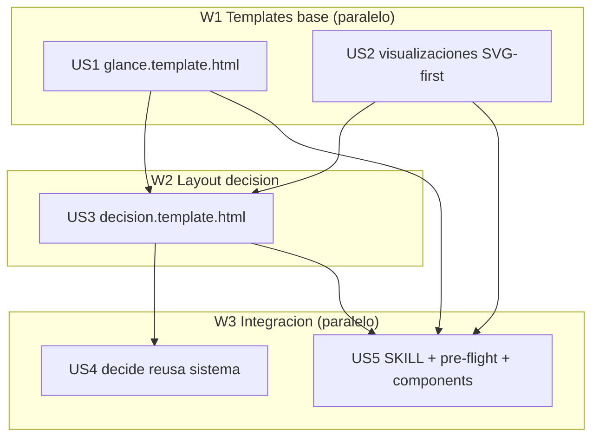

# Tasks index — Templates html-report v2 (vistazo · diagramas · decisión · cliente-ready)

`Level: Standard — single-domain (capa visual html-report) con 1 incógnita de entorno ya resuelta (mmdc) + reuso cross-skill (decide); no auth/security.`
`TDD-mode: optional — test-policy.md = auxiliary (templates HTML/markdown, no lógica de negocio). Validación = pre-flight + critique (markdown). Phase 2.5 produce validations.md, no tests.md.`

## Resumen ejecutivo

Evoluciona la capa visual `html-report` para cumplir la visión 007: documentos que se **leen de un vistazo**, con **diagramas/charts**, válidos para **reportes de desarrollo Y decisiones** (dev y no-dev), **cliente-ready sin retoques**. El **deliverable concreto son los nuevos templates** (recalcado por el usuario): `glance.template.html` (el estilo aprobado en plan 006 `report-glance-v2.html`, horneado a template oficial) y `decision.template.html` (nuevo layout opciones + scoring ponderado + recomendación), más una capa de **visualizaciones SVG-first** y la integración (decide reusa el sistema; SKILL/pre-flight documentan).

5 HUs en 3 waves. **Decisión de entorno verificada (2026-06-03)**: `mmdc/npx/bunx/node = NO disponibles` → no hay pipeline Mermaid→SVG automático. Estrategia híbrida resuelta: **SVG compuesto a mano** por el generador para flujos/comparativas/charts simples (patrón ya probado en el proyecto: gauge, sevbar), `mermaid.js` runtime (CDN/inline) solo ruta **opt-in declarada** para diagramas complejos. Open questions del spec resueltas: OQ1 = `decide` reusa el sistema (no memo aislado); OQ2 = nuevo layout `decision`; OQ3 = acotado a decisiones con opciones comparables.

## Estimación de esfuerzo

| Wave | HUs | Esfuerzo | Naturaleza |
|---|---|---|---|
| W1 Templates base | US1, US2 | ~2 sesiones | template HTML + patrones SVG (paralelo) |
| W2 Layout decisión | US3 | ~1 sesión | template HTML nuevo |
| W3 Integración | US4, US5 | ~1.5 sesiones | reuso decide + docs/gallery (paralelo) |

**Critical path**: US1 → US3 → US5 (≈3-4 sesiones standard). Secuencialidad **inherente** (base → decisión → integración), no cosmética.

## DAG

**Parallel Efficiency Score**: `(5 - 3 critical) / 5 = 40%` — **bajo el umbral 50%, declarado honestamente**: las dependencias son REALES, no false ordering (verificado: US3 reusa el componente matriz/chart de US2 → forzar paralelo duplicaría el componente, violando Cmd X; US4/US5 necesitan que `decision.template` exista). La cadena base→decisión→integración es intrínsecamente secuencial. Refactorizar a >50% exigiría duplicación o HUs no atómicas — peor. Paralelismo real explotado: W1 (2 HUs) + W3 (2 HUs) sí solapan.

## Tabla resumen

| # | HU | Fase | Wave | Estimate | TDD-mode | Decisión absorbida |
|---|---|---|---|---|---|---|
| US1 | `glance.template.html` (bake del estilo aprobado 006) | Build | W1 | M | optional | dark-token-block canónico |
| US2 | Visualizaciones SVG-first (diagram + chart) + ruta JS opt-in | Build | W1 | M | optional | híbrido SVG/JS |
| US3 | `decision.template.html` (opciones + scoring + recomendación) | Build | W2 | M | optional | OQ2 nuevo layout |
| US4 | `decide` reusa el sistema html-report | Build | W3 | S | optional | OQ1 no duplicar memo |
| US5 | SKILL.md + pre-flight + components.html (integración) | Build | W3 | M | optional | — |
| US6 | Galería componentes shadcn (badges/alert/separator/progress/skeleton/empty) | Build | extra | M | optional | scope-extra (deliverable=showcase) |
| US7 | Interactividad (tabs/tooltips CSS + command JS opt-in) | Build | extra | M | optional | scope-extra (deliverable=showcase) |

## Cross-cutting decisions

| Decisión | Dónde se toma | HUs afectadas | Criterio |
|---|---|---|---|
| Bloque de design-tokens dark (canónico) | US1 (inline en glance.template) | US1, US3 | US3 lo inlina **verbatim**; nunca re-autorar (Cmd X) — mismo contrato que `tokens.css`↔report.template |
| Estrategia diagramas híbrida (SVG-a-mano-first; JS opt-in) | US2 | US2, US3, US5 | mmdc ausente → SVG a mano para simples; mermaid.js runtime solo complejos, dependencia declarada |

## Open questions (deferidas a Fase 3)

1. ¿`decide/memo.html` se borra o se conserva como fallback offline? — decidir en US4 al ver el encaje real.
2. Límite práctico de complejidad de un diagrama SVG-a-mano antes de saltar a la ruta JS — calibrar en US2 con ejemplos reales.

## Anti-patterns mitigation

| Anti-pattern | Cómo se evita |
|---|---|
| Doctrina duplicada (Cmd X) | decide reusa el sistema (US4); tokens/anti-slop viven una vez; US5 documenta sin reformular el corpus 004 |
| Paralelismo falso para inflar score | Score real 40% declarado + justificado; no se fuerzan HUs no atómicas |
| Romper layouts actuales (regresión) | glance/decision son templates NUEVOS; report/dashboard intactos (AC5) |

## Próximo paso

Phase 2.5 (`tdd-design`) produce `validations.md` (modo validación, no TDD — son templates HTML). Luego hard gate 2→3 para tu aprobación antes de Phase 3 (build).
