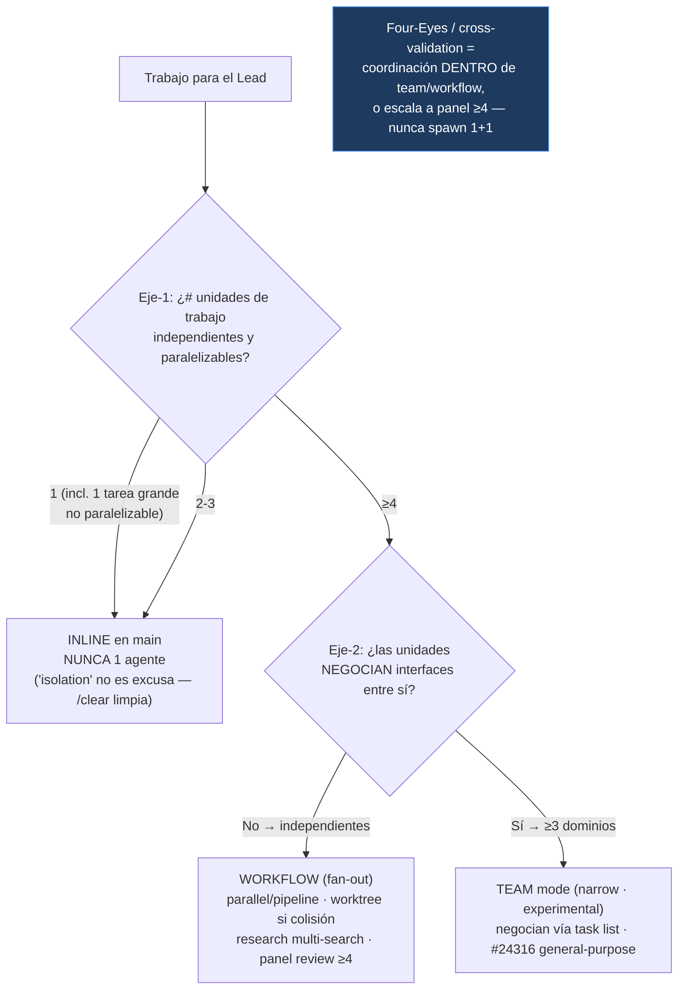

# Problema

El sistema delega mal en **dos direcciones opuestas**, ambas con la misma raíz (criterio de spawn duplicado y contradictorio, sin punto de verdad único):

1. **Sobre-delega a 1 agente** — `Trigger A` (≥5 files OR architectural → `builder` **"for context isolation"**) licencia lanzar 1 solo agente; `Trigger C` (regla ≥4) lo prohíbe. La contradicción costó **112k tok / 0 paralelismo** en el plan 007.
2. **Infra-aprovecha el paralelismo real** — los **workflows** (fan-out de tareas independientes, req v2.1.154+) están infradocumentados (cero playbook de *cuándo* usarlos), y la doc de **team mode** (comunicación inter-agente) está **obsoleta** (referencia el agente `planner` que ya no existe) y contiene patrones que contradicen la política (`Four-Eyes` descrito como spawn 1+1).

Resultado: el Lead ni evita el gasto inútil de 1 agente, ni sabe cuándo escalar a "muchas tareas pequeñas en paralelo".

# Resultado esperado

- **Un único árbol de decisión** de spawn con dos ejes: (eje-1 cantidad) 1 = prohibido, 1-3 = inline, ≥4 = delegar; (eje-2 naturaleza, solo en la rama ≥4) independientes → **Workflow**, negocian interfaces → **Team**.
- La licencia **"for context isolation"** desaparece de toda la superficie de spawn (~7 ubicaciones).
- **Workflows aprovechables**: doc de *wiring* (cuándo alcanzarlos, umbral, fork team-vs-workflow) que **apunta** al catálogo de la Workflow tool sin copiarlo.
- **Team mode corregido y acotado**: refs obsoletas eliminadas (`planner`→`tech-plan`), `Four-Eyes` reenmarcado (coordinación intra-team / escala a panel ≥4, nunca spawn 1+1), "cuándo" estrechado; **no** se promueve a first-class (sigue experimental).
- Las propias skills dejan de violar la regla (`scope`/`decide`/`critic` ya no spawnean 3 perspectives sub-≥4).

# Success criteria (medibles, Given/When/Then)

- **AC1**: Given la superficie de spawn, when `Grep "context isolation|for isolation"` sobre triggers vivos (`skills/`, `commands/`, `docs/`, `CLAUDE.md`), then **0 ocurrencias** que justifiquen 1 agente (menciones en `plans/` histórico = registro, no regla).
- **AC2**: Given un árbol canónico en ubicación única (ej. `orchestrator-protocol`), when otra skill/doc/CLAUDE.md referencia el criterio de spawn, then **apunta a ese árbol** sin redefinir umbrales propios.
- **AC3**: Given el árbol, when "1 HU toca ≥5 files", then la decisión es **inline en main** y "≥5 files" deja de ser per-se trigger de spawn.
- **AC4**: Given el eje-2 del árbol, when hay ≥4 unidades, then queda explícito: **independientes → Workflow**; **≥3 dominios que negocian interfaces → Team**. El doc de Workflow documenta el *wiring* y **enlaza** a la tool (no transcribe pipeline/parallel/quality-patterns).
- **AC5**: Given `05-team-mode.md`, when se audita, then **0 referencias** al agente inexistente `planner`, y `Four-Eyes`/cross-validation está reenmarcado como coordinación dentro de team/workflow o escala a panel ≥4 — **nunca** spawn standalone 1+1.
- **AC6**: Given `scope`/`decide`/`critic` en modo full, when se invoca su análisis multi-perspectiva, then corre **inline** (1-3 perspectivas) o escala a **≥4 vía Workflow** — nunca spawn de 1-3 agentes.
- **AC7**: Given research web / review independiente, when requieren delegación, then se resuelven con **≥4 agentes en paralelo** (multi-search haiku/sonnet; panel de ≥4 enfoques), no con 1 agente-excepción.
- **AC8**: Given `bun test ./.claude/hooks/`, when corre tras los cambios, then sigue **verde** (feature = edición markdown/config; no toca runtime).
- **AC9**: Given los claims version-specific, when se documenta workflows/teams en el repo, then refleja el estado **verificado (junio 2026)**: workflows = "req v2.1.154+" (no "GA" sin matiz); teams = experimental con limitaciones `general-purpose`/`#24316` + `#31977` (no-spawn) citadas — sin claims sin verificar.

# Out of scope (explícito)

- **Hooks de enforcement** (PreToolUse sobre `Agent`): descartado — no fiable (#6305) + el usuario eligió "solo reconciliar docs". Sin maquinaria.
- **Checklists obligatorios pre-spawn**: descartado — borrado, no fricción nueva.
- **Promover team mode a first-class / rediseñarlo**: el REFINE **corrige y acota** team mode (refs obsoletas + alinear ≥4 + reframe Four-Eyes), pero **NO** lo rediseña, ni lo saca de experimental, ni resuelve la limitación `general-purpose` (#24316, upstream).
- **Transcribir el catálogo de patrones de la Workflow tool** al repo: se **enlaza**, no se copia (evita doc que se pudre — Cmd X).
- **Eliminar/refundir `builder`/`reviewer`/`scout`**: pierden su justificación "1 agente por isolation", pero decidir su destino (cortar vs. válidos solo dentro de fan-out ≥4) es Phase 2.
- **Reescribir `plans/` histórico**: registro inmutable.

# Constraints

- **Técnico**: solo edición markdown/config (`.claude/**/*.md`, `CLAUDE.md`). No toca código de hooks ni runtime.
- **Compatibilidad**: `bun test ./.claude/hooks/` verde (sin regresión).
- **Cmd III (simple)**: fix = **borrado + colapso a un árbol + enlazar** (no copiar/no maquinaria). Solución que añade componentes = solución equivocada.
- **Cmd X (mantenibilidad)**: un único punto de verdad para el criterio de spawn; el resto referencia. El know-how de patrones de workflow vive en la tool, no duplicado.
- **Dogfooding**: este feature se ejecuta **inline en main, sin spawnear agentes** — diseñar "no lances agentes" lanzando agentes sería auto-refutante.

# Stakeholders

- **Oriol** — sufre el coste (112k tok, 007), decide el gate, ratifica la política.
- **El Lead (sesiones futuras)** — consumidor del árbol canónico + el doc de wiring; su adherencia es el enforcement (advisory por diseño, D1).

# Open questions

- **OQ1** (→ Phase 2): destino de `builder`/`reviewer` agents una vez muere "1 agente por isolation" — ¿cortar, o reespecificar como válidos solo dentro de fan-out ≥4 (4 builders worktree / panel de 4 reviewers)?
- **OQ2** (→ Phase 2): corrección de `scope`/`decide`/`critic` — ¿bajar las 3 perspectivas a inline, o subirlas a ≥4 vía Workflow? (criterio: coste/valor de fase).
- **OQ3** (→ Phase 2): forma canónica del review independiente como "panel de ≥4 enfoques" — ¿se materializa en `critic`, o queda como patrón documentado on-demand?
- **OQ4** (→ Phase 2): ubicación del doc de wiring de workflows — ¿sección en `orchestrator-protocol`, reference nueva, o ampliar `complexity-routing`? Y coherencia numérica `team mode` ("3+ dominios") vs umbral ≥4.

# Modelo conceptual / Detalle técnico

## Árbol de decisión canónico (único punto de verdad — dos ejes)

## Las dos rutas del paralelismo (rama ≥4)

| Ruta | Cuándo | Naturaleza | Coste | Acción en este feature |
|---|---|---|---|---|
| **Workflow** | ≥4 unidades independientes | fan-out, **no** se comunican | escala con #agentes | **INVERTIR**: doc de wiring (cuándo/umbral/fork) — enlaza a la tool, no copia |
| **Team** | ≥3 dominios que **negocian** interfaces | comunicación inter-agente | 3-7x, experimental | **CORREGIR+ACOTAR**: borrar `planner` muerto, reframe Four-Eyes, alinear ≥4 |

> **Verificación version-specific (web, junio 2026 — Cmd II)**: Agent teams = experimental/research-preview (Opus 4.6, feb 2026, `CLAUDE_CODE_EXPERIMENTAL_AGENT_TEAMS=1`, req v2.1.32+); *"use a lot of tokens"* (B. Cherny). Limitaciones vigentes: teammates siempre `general-purpose` sin tool-isolation ([#24316](https://github.com/anthropics/claude-code/issues/24316) ABIERTO) y **no pueden spawnear subagentes** ([#31977](https://github.com/anthropics/claude-code/issues/31977) ABIERTO). Workflows = req v2.1.154+ (research preview 28-may-2026; el repo dice "GA" → **corregir wording** en CLAUDE.md/complexity-routing). Los datos **confirman** la asimetría (Workflow=invertir, Team=acotar): teams experimental + limitado + caro refuerza "no first-class". Implica un AC extra (ver AC9).

## Principios (ratificados con el usuario)

| # | Principio | Decisión |
|---|---|---|
| P1 | **1 agente = PROHIBIDO absoluto** | Sin excepciones. No paraleliza; solo aísla contexto (que el usuario limpia con `/clear`); encarece sin retorno. |
| P2 | **"isolation" NO es excusa** | El main actúa y se ensucia antes que pagar 1 agente. "≥5 files" deja de ser trigger de spawn. |
| P3 | **Umbral ≥4 absoluto** | 1-3 → inline. ≥4 → delegar (Workflow o Team según eje-2). |
| P4 | **Research/review no son excepciones de 1-agente** | Si se delegan → ≥4 paralelo (search barato; review = panel ≥4 enfoques). Si <4 → inline. |
| P5 | **Un único árbol** | El resto referencia, no redefine (causa raíz de la contradicción). |
| P6 | **Fix = borrado + enlazar, no maquinaria** | Reconciliar docs; sin hooks/checklists; patrones de workflow se enlazan a la tool. |
| P7 | **Spawn-decision ≠ intra-orchestration** | ≥4 gobierna la DECISIÓN de spawnear. Agentes coordinándose dentro de un team/workflow ya spawneado no son un nuevo spawn. |

## Superficie a reconciliar (inventario verificado en Phase 1)

| Ubicación | Trigger / problema actual | Acción |
|---|---|---|
| `orchestrator-protocol/SKILL.md:59` (Trigger A) | ≥5 files OR architectural → builder | Reescribir → árbol canónico |
| `orchestrator-protocol/SKILL.md:61` (Trigger C) | regla ≥4 | Promover a árbol canónico (+ eje-2) |
| `build` skill (desc + body) | ≥5 files → builder "for context isolation" | Borrar licencia isolation |
| `CLAUDE.md` (§When to delegate, Trigger A) | ≥5 files → builder | Alinear al árbol |
| `commands/flow.md:196,218` | ≥5 files → builder | Alinear |
| `skills/retro/SKILL.md:271,347` | promo ≥5 files → builder | Alinear |
| `skills/meta-create/SKILL.md:7,27,62,87,136` | ≥5 files → builder | Alinear |
| `docs/lead-mode-when-needed.md:26,77` | ≥5 files → builder | Alinear |
| `skills/scope` Step 3 / `skills/decide` / `critic:267` | spawn 3 perspectives (sub-≥4) | Corregir (OQ2) |
| `tech-plan/references/05-team-mode.md` | `planner` agent muerto (L49/69/111); Four-Eyes ambiguo | Borrar refs muertas + reframe Four-Eyes (AC5) |
| (nuevo) doc de wiring de Workflow | inexistente | Crear, enlazando a la tool (OQ4) |
| memory `agent-usage-minimalism` | ≥4-5 | Verificar wording; alinear |

> Inventario para scope; atomización en HUs + destino de agentes = Phase 2.
