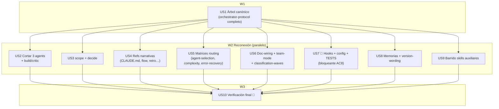

# Tasks index — Política de spawn de agentes (reconciliación + aprovechamiento)

`Level: Full — refactor multi-archivo (~30 ficheros) del meta-sistema; arquitectural (mata 1 trigger, corta 3 agentes, reconecta TODOS sus invocadores incl. hooks/tests/config/memorias).`
`TDD-mode: optional — test-policy.md = auxiliary; feature markdown/config + 1 hook .ts + su test. Phase 2.5 = validations.md.`

## Resumen ejecutivo

El spec reconcilia la contradicción de spawn colapsándola a **un único árbol** y documenta cómo aprovechar workflows/teams. Decisiones de Phase 2 (ratificadas): **cortar los 3 agentes custom** (`builder`/`reviewer`/`scout`); exploración masiva read-only = `Explore` (Haiku built-in, no-prohibido).

**Censo completo (corregido tras advisor)**: el inventario inicial fue un *proxy-grep* (buscó "isolation"/"≥5 files" en `**/*.md`) y perdió ~13 ficheros — incluido el **bloqueante**: `hooks/post-compact.ts` inyecta los nombres de los agentes y `__tests__/post-compact.test.ts` los **asertan** (cortar los agentes sin tocar el test → `bun test` rojo). El censo real (`Grep "\b(builder|reviewer|scout)\b"` repo-wide, sin filtro) eleva el alcance a **10 HUs / ~30 ficheros**.

10 HUs en 3 waves. **US1 fundacional** (árbol canónico = único punto de verdad); W2 = 8 ramas independientes que reconectan cada zona; **US10 verifica**. Ejecución **inline en main** (dogfooding + los edits negocian un wording coherente cross-file = coordinación, no fan-out). **US7 (hooks) es la HU de mayor riesgo** — toca el único oracle ejecutable (`bun test`).

## Estimación de esfuerzo

| Wave | HUs | Esfuerzo | Naturaleza |
|---|---|---|---|
| W1 Fundación | US1 | M | Árbol canónico + todo `orchestrator-protocol/SKILL.md` |
| W2 Reconexión | US2-US9 (8) | XL | Cortar agentes; reconectar skills/docs/matrices/hooks/memorias/barrido |
| W3 Verificación | US10 | S | Greps AC + `bun test` + coherencia |

**Critical path**: US1 → (cualquiera W2, US7 la más crítica) → US10 ≈ **4-5 sesiones** (inline secuencial).

## DAG

**Parallel Efficiency Score**: 8 paralelas / 10 = **80%** (>50% ✓).

## Tabla resumen

| # | HU | Wave | Estimate | TDD | Files clave | Decisión |
|---|---|---|---|---|---|---|
| US1 | Árbol canónico + orchestrator-protocol completo | W1 | M | optional | `orchestrator-protocol/SKILL.md` | árbol 2-ejes; P1-P7 |
| US2 | Cortar 3 agents + build/critic | W2 | M | optional | `agents/*` (del), `build`, `critic` | OQ1a; OQ3 |
| US3 | scope + decide (3-persp) | W2 | S | optional | `scope`, `decide` | OQ2 |
| US4 | Refs narrativas Trigger A | W2 | M | optional | `CLAUDE.md`, `flow`, `retro`, `meta-create`, `lead-mode` | — |
| US5 | Matrices routing | W2 | M | optional | `agent-selection`, `complexity-routing`, `error-recovery` | OQ1b |
| US6 | Doc-wiring + team-mode + classification-waves | W2 | M | optional | doc-wiring(nuevo), `05-team-mode`, `04-classification-waves`, `tech-plan/SKILL` | OQ4; panel-≥4 |
| US7 | **Hooks + config + tests** 🩻 | W2 | M | optional→**test** | `post-compact.ts`, `post-compact.test.ts`, `cost-budget.json` | bloqueante AC8 |
| US8 | Memorias + version-wording | W2 | S | optional | `independent-reviewer…md`, `agent-usage…md`, `MEMORY.md` | AC9; condición-dura |
| US9 | Barrido skills auxiliares (refs triviales) | W2 | S | optional | `explain-changes`(+ref), `diagnostic-patterns`, `review-patterns`, `security-review`, `prompt-engineer`, `html-report` | — |
| US10 | Verificación final | W3 | S | optional | (greps + bun test) | — |

## Cross-cutting decisions

| Decisión | Dónde | HUs afectadas | Criterio |
|---|---|---|---|
| Árbol canónico = único punto de verdad | US1 | todas | Cmd X — causa raíz fue duplicación |
| Cortar los 3 agentes | US2 | US4, US5, US6, US7, US9 | Simplicidad + mata atractor (ratificado) |
| Patrón "panel review ≥4" reemplaza reviewer | US6 | US2, US8 | Condición dura (lección 002) |
| `post-compact.test.ts` debe actualizarse con el hook | US7 | US7 | Si no → `bun test` rojo (AC8) |
| Reconciliar memoria `independent-reviewer` | US8 | — | Endorsa el reviewer que cortamos → contradicción |
| Ejecución inline (no Workflow) pese a 8 HUs ≥4 | index | todas | Edits negocian wording coherente = coordinación, no fan-out indep.; + dogfooding; + criticidad meta |

## Falsos positivos exentos (NO tocar — verificado en censo)

| Match | Por qué exento |
|---|---|
| `diagnostic-patterns/references/pattern-saga.md` "Builder pattern" | Patrón de diseño fluent, no el agente |
| `decision-stress-test/prompts/karpathy-agent.md` "builder of small clear things" | Inglés natural |
| `meta-create/templates/agent/{reader,builder,executor,researcher}.md` + `references/agent/*` | Arquetipos genéricos de tipos-de-agente, NO `builder.md`/etc. del sistema |
| `drillme/references/03-phase-questions.md` "scope-definer/critic-reviewer/…" | Nombres legacy de skill-roles, no agentes |
| `plans/**` histórico | Registro inmutable |

## Open questions (deferidas a Fase 3)

1. Ubicación doc-wiring (US6): inline en `orchestrator-protocol` si ≤40 líneas, si no `references/07-workflow-wiring.md`.
2. Coherencia team-mode "3+ dominios" vs ≥4 (US6): declarar ortogonal (team = negociación, no conteo).
3. `cost-budget.json` (US7): ¿el mapa modelo-por-agente se borra entero o se reescribe para tiers de Workflow? Resolver al ver si algún hook lo consume.

## Anti-patterns mitigation

| Anti-pattern | Cómo se evita |
|---|---|
| Inventario proxy (perder refs no-md) | Censo `Grep "\b(builder\|reviewer\|scout)\b"` repo-wide ejecutado; 10 HUs cubren todo |
| Romper `bun test` al cortar agentes | US7 actualiza hook **y** su test juntos (bloqueante explícito) |
| Editar mismo archivo en 2 HUs | Cada fichero en 1 sola HU; verificado en tabla |
| Borrar capacidad reviewer sin reemplazo | US6 panel-≥4 + US8 reconcilia memoria |
| Tocar falsos positivos | Tabla de exentos explícita para US10 |

## Próximo paso

Index actualizado (10 HUs). US7.md→US10.md (verificación) + US7/US8/US9 nuevos + US1/US6 ampliados pendientes de escribir tras ratificación de scope. Phase 2.5 (`validations.md`) se extiende a las nuevas HUs. Luego hard gate 2→3.
