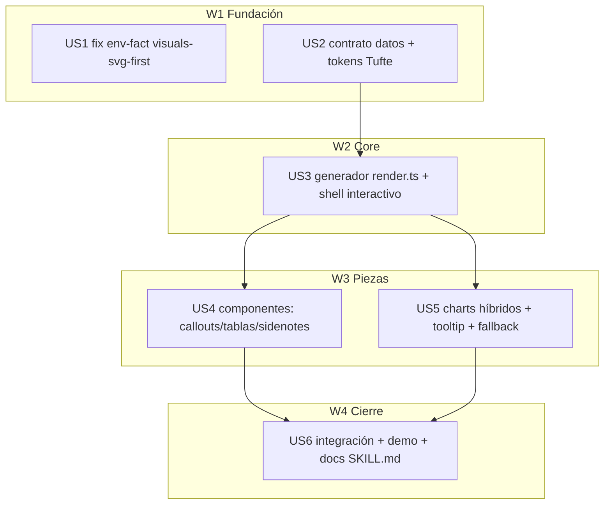

# Tasks index — modo "informe dinámico" de html-report (vía generador)

`Level: Full — decisión arquitectónica (generador vs a mano) + multi-componente (shell + componentes + charts).`
`TDD-mode: optional (test-policy=auxiliary) — override forced en US3 y US5 (lógica no trivial: render + escalas de charts).`

## Resumen ejecutivo

Construye un **modo dinámico** para `html-report` mediante un **generador determinista** (Opción B del stress-test): un script bun toma **datos JSON** + tokens/plantilla y emite **1 HTML self-contained** (CSS+JS inline, dark/light, responsive PC+móvil, fallback estático). Esto ataca la causa raíz del "se ve pobre" — la generación a mano reinventa y diverge — y baja el coste de tokens (Claude emite datos, no ~700 líneas de HTML).

Las 6 HUs: corregir el fact obsoleto del entorno (US1), fijar el contrato de datos + tokens de diseño con jerarquía editorial Tufte (US2), el generador core con shell interactivo (US3), los componentes de contenido (US4, callouts/tablas filtrables/sidenotes) y los charts híbridos con tooltip (US5), y la integración + informe demo + docs (US6). "Mezcla nuevo + evolución" (petición del usuario): el generador es nuevo; reusa tokens/anti-slop del skill existente.

## Estimación de esfuerzo

| Wave | HUs | Esfuerzo | Naturaleza |
|---|---|---|---|
| W1 Fundación | US1, US2 | ~1.5 sesiones | doc-fix + contrato/tokens (paralelo) |
| W2 Core | US3 | ~1.5 sesiones | generador render.ts (tdd forced) |
| W3 Piezas | US4, US5 | ~2 sesiones | componentes + charts (paralelo) |
| W4 Cierre | US6 | ~1 sesión | integración + demo + docs |

**Critical path**: US2 → US3 → US5 → US6 ≈ 4 sesiones. **Parallel Efficiency**: 4/6 paralelizables ≈ **67%** (≥50% ✅).

## DAG

## Tabla resumen

| # | HU | Fase | Wave | Estimate | TDD-mode | Decisión absorbida |
|---|---|---|---|---|---|---|
| US1 | Fix env-fact en visuals-svg-first.md | 3 | W1 | S | skip: doc-only, no testable behavior | — |
| US2 | Contrato de datos JSON + tokens de diseño | 3 | W1 | M | optional | — |
| US3 | Generador core `render.ts` + shell interactivo | 3 | W2 | L | forced | generador-determinista (Opción B) |
| US4 | Componentes: callouts/tablas filtrables/sidenotes | 3 | W3 | M | optional | — |
| US5 | Charts híbridos + tooltip + fallback | 3 | W3 | M | forced | charts-híbrido (Plot opt + a mano) |
| US6 | Integración + informe demo + docs | 3 | W4 | M | optional | — |

## Cross-cutting decisions

| Decisión | Dónde | HUs afectadas | Criterio |
|---|---|---|---|
| Generador determinista (datos JSON → HTML) vs HTML a mano | US3 | todas | Stress-test (5 lentes): B gana en tokens + consistencia; artefacto sigue 1 fichero self-contained |
| Charts híbrido: SVG a mano por defecto, Observable Plot si `npx` disponible | US5 | US5, US6 | Constraint dura (self-contained garantizado) → fallback a mano siempre; Plot = mejora opcional |
| "Mezcla nuevo + evolución" | US2, US3 | — | Generador nuevo; reusa tokens/anti-slop del skill existente (no rehace report/dashboard/glance) |

## Open questions (deferidas a Fase 3)

1. Theme toggle claro/oscuro: incluir en US3 si no añade coste desproporcionado (el shell ya define ambos tokens) — decisión en build.
2. Umbral exacto del híbrido de charts (cuándo merece Plot vs a mano) — calibrar en US5 con un caso real.
3. Nombre/ubicación del modo en el SKILL.md (¿`dynamic` como 5º modo?) — fijar en US6.

## Próximo paso

Index + 6 US en `status: draft`. Pendiente: Phase 2.5 (`tdd-design` → tests.md/validations.md) y hard gate 2→3.
