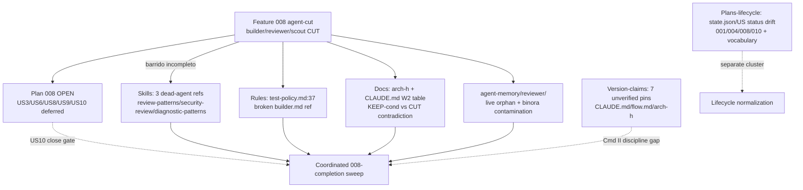

# Ultracode Audit -- Report (011)

## Veredicto ejecutivo

El meta-sistema es coherente en su estado autoritativo (CLAUDE.md "0 custom agents"), pero **el corte de agentes de la feature 008 nunca completo el barrido**: referencias muertas a `builder`/`reviewer`/`scout` sobreviven en skills, reglas, docs y agent-memory, y 008 sigue **abierto** con HUs diferidas. La mayoria de los 28 findings son debris de esa migracion incompleta -- baratos de arreglar (reformulacion de markdown) y de alto valor de mantenibilidad (Cmd X). Un unico *sprint de cierre de 008* resuelve el cluster entero en una pasada.

**Totales**: 28 findings (7 re-confirmados de seed, 21 nuevos), 3 contradicciones resueltas en cross-debate, 1 plan triado.

---

## Findings confirmados por severidad

Severidades post-cross-debate (reflejan downgrades/dedupes acordados -- ver seccion Cross-debate). El BLOCKER es la escalada de plans-lifecycle.

### BLOCKER

| sev | file:line | desc | fix | conf |
|---|---|---|---|---|
| BLOCKER | `.claude/plans/008-agent-spawn-policy` | Plan abierto (`feature_closed: false`, spec `status: approved`, phase 3) con aceptacion parcial documentada: US3/US6/US8/US9 DEFERRED, US10 unrun; tasks/index.md `approved` (no closed); 5/10 US en `draft`. | Decidir: (1) cerrar como partial-accept marcando HUs diferidas (`partial_closure: true, deferred_us:[...]`) **o** (2) re-entrar Phase 2. Recom. = ejecutar el cleanup barato y cerrar via US10. | HIGH |

### MAJOR

| sev | file:line | desc | fix | conf |
|---|---|---|---|---|
| MAJOR | `.claude/plans/001-poneglyph-5phase-workflow` | `status: closed` en spec pero **sin state.json**; rompe trazabilidad de cierre (retro/SKILL.md:258). | Crear state.json con `current_phase:"closed"`, `feature_closed:true`, `retro_status:"approved"`. | HIGH |
| MAJOR | `.claude/plans/004-report-visual-taste/tasks` | Plan cerrado pero US2/US3/US4/US5 en `status: draft` (solo US1 `completed`). Gate exige todos `closed` (retro/SKILL.md:255-258). | Poner US2-US5 a `status: closed` + `closed: 2026-05-29`; registrar gap en retro. | HIGH |
| MAJOR | `.claude/plans/010-dynamic-report-mode/tasks` | Plan cerrado pero US1-US6 todos `draft` (solo index.md `closed`). | Poner US1-US6 a `status: closed` + `closed: 2026-06-08`; flag del gap de Phase 3. | HIGH |
| MAJOR | `.claude/skills/review-patterns/SKILL.md:83` | Frontmatter "**For**: reviewer, builder agents" -- ambos cortados en 008. Dead ref; ahora consumida inline por critic (P4) y build (P3). | Reformular a "**For**: Phase 4 critic (Step 6 dispatch) + Phase 3 build skill (inline quality-mode)". | HIGH |
| MAJOR | `.claude/skills/security-review/SKILL.md:182` | Frontmatter "**For**: reviewer agent" -- cortado en 008. Consumida por critic Step 7 (auth/payments/secrets). | Reformular a "**For**: Phase 4 critic (Step 7 dispatch para auth/payments/secrets/credentials/crypto)". | HIGH |
| MAJOR | `.claude/skills/diagnostic-patterns/SKILL.md:174` | Frontmatter "**For**: ... and the builder agent" -- cortado en 008. P3 build corre inline. | Reformular a "**For**: Lead orchestrator (error recovery) + Phase 3 build skill (inline error diagnosis)". | HIGH |
| MAJOR | `.claude/rules/test-policy.md:37` | Ref a `.claude/agents/builder.md` (directorio inexistente). Rule **always-loaded** -> cada sesion carga ref rota. (Dedupe de 2 dominios.) | Reemplazar por `.claude/skills/build/SKILL.md -- TDD-mode handling (red->green)` (target canonico: la build skill absorbio el red->green). | HIGH |
| MAJOR | `CLAUDE.md:322` | Tabla W2 registra "builder KEEP-cond / reviewer KEEP-cond" sin anotar que 008 los CORTO despues; L306 ya es autoritativa ("0 custom") -> confusion historica. | Anadir nota/footnote en L322 indicando que las decisiones KEEP-cond de W2 fueron superseded por feature 008 (2026-06-09). | HIGH |

> **Version-claims (7 findings)**: marcados MAJOR por el dominio en el merge, pero el cross-debate los caracteriza como un *patron sistemico de baja prioridad operativa* (pins sin verificar, no errores funcionales). Listados como cluster en seccion Acciones. Items: `CLAUDE.md:235` (Skill() fix >=2.1.133), `CLAUDE.md:245` (Workflow GA ~=2.1.154 + trigger 2.1.160), `CLAUDE.md:248` (background-sessions >=2.1.139), `flow.md:198` (GA 2.1.154 + trigger 2.1.160, sin caveat -- duplicado de CLAUDE.md), `arch-h-lead-directed-skill-reads.md:17` (>=2.1.133 sin cita).

### MINOR

| sev | file:line | desc | fix | conf |
|---|---|---|---|---|
| MINOR | `.claude/hooks/lib/yaml-frontmatter.ts` | `parseFrontmatter()`/`readMarkdownFiles()` exportadas pero **nunca importadas** -> dead code. (Downgrade desde MAJOR: sin consumidor.) | Borrar **o** repurposar como validador de lifecycle-frontmatter (encaja con los 9 findings de vocabulario de plans). | HIGH |
| MINOR | `.claude/agent-memory/reviewer/MEMORY.md` | Orphan vivo: 117 lineas (binora-contamination + patrones poneglyph). 008 archivo copia en `plans/008/archive/reviewer-MEMORY.md` pero no borro el original. **Sin reviewer agent => sin consumidor** -> downgrade MAJOR->MINOR; dedupe de 2 findings. | **Borrar el directorio** `.claude/agent-memory/reviewer/` (archivo ya preservado). Verificar que ningun SubagentStop hook escriba ahi. | HIGH |
| MINOR | `.claude/plans/001-.../retro.md:6` | Frontmatter `status: open` pero feature cerrada (retro/SKILL.md:259 -> debe ser `approved`). | `status: open` -> `status: approved`. | HIGH |
| MINOR | `.claude/plans` (cross-plan) | `retro_status` inconsistente: 002=`closed`, 003/004=`complete`, resto=`approved` (estandar = `approved`). | Normalizar todos a `retro_status: "approved"`. | HIGH |
| MINOR | `.claude/plans` (cross-plan) | `current_phase` inconsistente: 002/007=`"closed"` (string), 003/004/006/010=`5` (int). Estandar = `"closed"` string. | Estandarizar 002/003/004/006/007/010 a `current_phase: "closed"`. | HIGH |
| MINOR | `.claude/plans/005-config-correctness-audit` | Solo `review.md` (output de `/code-review`); sin spec/state/tasks/retro. No es feature de /flow. | Reclasificar a `.claude/audits/` **o** documentar en MEMORY.md como audit exento de lifecycle. | MEDIUM |
| MINOR | `.claude/plans/009-cc-release-feature-audit` | Solo `report.md`; sin artefactos de lifecycle. Audit standalone. | Reclasificar a `.claude/audits/` **o** documentar exencion. (Util: contiene evidencia para resolver los version-pins.) | MEDIUM |
| MINOR | `.claude/hooks/__tests__/code-validator.test.ts` | 13 INJECTION_PATTERNS definidos, solo 6 testeados -> cobertura real del gate ~=46%. Untested: spawn(var), document.write, exec(compile()), __import__(), subprocess shell=True, pickle.loads(), system(). | Anadir caso positivo (+negativo donde aplique) por cada uno de los 7 patrones. | HIGH |

### NIT

| sev | file:line | desc | fix | conf |
|---|---|---|---|---|
| NIT | `.claude/plans/007-.../spec.md:5` | `approved:` vacio pero feature cerrada (`closed: 2026-06-03`). | Rellenar `approved: 2026-06-03`. | MEDIUM |
| NIT | `.claude/plans/003-.../spec.md:5` | `phase: 5` (unica instancia; el resto de specs cerradas = `phase: 1`). | `phase: 5` -> `phase: 1`; verificar tasks/index.md = `phase: 2`. | MEDIUM |

---

## Cross-debate -- contradicciones, escalados, dedupes

Evidencia de comunicacion inter-agente: dos dominios llegaron a conclusiones opuestas o duplicadas sobre el mismo artefacto; el digest compartido las reconcilio.

| tipo | artefacto | dominio A | dominio B | resolucion |
|---|---|---|---|---|
| **Contradiccion** | `agent-memory/reviewer/MEMORY.md` | rules-and-docs: "limpiar binora, retener L85-117 (poneglyph-relevant)" | claude-md-consistency: "borrar el directorio entero" | **Delete-all gana**: sin reviewer agent (cortado en 008), L85-117 tambien estan muertas. La opcion retain-lines es moot. |
| **Contradiccion** | severidad de reviewer MEMORY | rules-and-docs: MAJOR ("un reviewer leera esto y aplicara constraints binora") | skills-and-commands: el reviewer agent fue borrado en 008 -> **no hay consumidor** | Premisa de MAJOR refutada -> **downgrade a MINOR** (cleanup, no data-poisoning activo). |
| **Contradiccion / Dedupe** | `test-policy.md:37` | rules-and-docs: fix -> "CLAUDE.md Lead Mode" | claude-md-consistency: fix -> "`.claude/skills/build/SKILL.md`" | **build/SKILL.md gana** (absorbio el red->green del builder). Colapsado a 1 finding MAJOR, owner = claude-md-consistency (rule always-loaded). |

**Escalados a BLOCKER**: plans-lifecycle escalo `008-agent-spawn-policy:plan-open-with-deferred-hus` -- es la raiz estructural de >=6 MAJOR en 3 dominios.

**Dedupes confirmados** (un finding de rules-and-docs + uno de claude-md-consistency, mismo artefacto desde angulos distintos):
- `test-policy.md:37` (`stale-ref-builder-agent` + `broken-reference-agents-builder`) -> 1 item.
- `reviewer/MEMORY.md` (`binora-cross-project-contamination` + `agent-memory-orphaned-reviewer`) -> 1 item, accion = delete dir.

**Notas de raiz cruzada (oportunidades de reuso)**:
- **Root cause unico**: el corte de agentes de 008 dejo refs muertas en 5 dominios (skills x3, rules, docs, CLAUDE.md table, agent-memory). El retro/gate de cierre de 008 no incluyo un `grep-for-deleted-agent-names` cross-file. -> un barrido coordinado "008-cleanup" es mas fiable que 9 ediciones independientes.
- **Dead code repurposable**: `yaml-frontmatter.ts` (huerfano) es exactamente el validador de lifecycle-frontmatter que falta para los 9 findings de vocabulario inconsistente de plans-lifecycle. En vez de borrar -> repurposar.
- **Cobertura de seguridad real ~=46%**: el gap de tests de injection-patterns interactua con el dead-ref de security-review -- la capa PostToolUse (code-validator) deja 7/13 patrones sin verificar mientras security-review (que critic invoca para auth/secrets) tiene ref muerta.
- **Patron Cmd II**: los 7 version-claims son "docs escritas en tiempo de implementacion, nunca verificadas despues" -- misma clase que las refs muertas. Falta disciplina "verify-before-commit". Fix sistemico = una **tabla unica de compatibilidad versionada** en lugar de prosa inline dispersa. Plan 009 (cc-release-feature-audit) contiene la evidencia primaria para resolverlos -- no perder su valor al reclasificarlo.

---

## Decisiones de plan (triage de HUs deferred)

Plan triado: **008-agent-spawn-policy** -> recomendacion global = **execute** (HIGH). El cleanup barato cierra el cluster de debris; US10 verifica y cierra. Caveat que limita confianza: US8 referencia memorias en ruta Windows, inverificable desde esta maquina macOS.

| plan | HU | recommendation | evidence (resumen) |
|---|---|---|---|
| 008 | **US3** -- scope + decide (3 perspectivas) | **execute** | `decide/SKILL.md:40/88/123` aun nombra/spawnea builder+reviewer y presenta sub->=4 que viola la propia regla >=4. ~2 archivos markdown. Cmd X+III. |
| 008 | **US6** -- doc-wiring + team-mode + classification-waves | **execute** (mayor valor) | `tech-plan/references/05-team-mode.md` presenta agentes muertos como guia VIVA (scout/builder/reviewer = ALWAYS, :49/66/67/68/116-120); `04-classification-waves.md:51/78-92` tiene `Task(reviewer,...)` vivo; `tech-plan/SKILL.md:314` ref muerta. Crea tambien el doc-wiring del panel-review->=4. Cmd VII+X. |
| 008 | **US8** -- memorias + version-wording | **obsolete** (para macOS) | (1) AC4 version-wording YA satisfecho (grep vacio de bare "GA"). (2) Las memorias citadas viven en ruta Windows -- inexistentes en macOS, **EXECUTE-ON-WINDOWS**. (3) MEMORY.md macOS no las indexa -> moot aqui. Net: obsolete en esta superficie; reabrir la parte named-memory si se trabaja en Windows. Cmd II/IX. |
| 008 | **US2** -- agent-memory/reviewer/ orphan | **execute** | `state.json:36` dice {builder,reviewer,scout} archivados; copias existen, pero **solo builder+scout borrados** -- `agent-memory/reviewer/MEMORY.md` SIGUE VIVO. Trivial y actionable aqui: borrar dir (archivo ya en archive). Cmd X. |
| 008 | **US9** -- barrido refs en skills auxiliares | **execute** | LIVE, trivial, homogeneo (1-line x7 archivos): `explain-changes` (+refs), `diagnostic-patterns`, `review-patterns:83`, `security-review:182`, `prompt-engineer:74`, `html-report:95`. SKIP los false-positives exentos (templates de meta-create = arquetipos genericos, intencionales). Cmd X. |
| 008 | **US10** -- verificacion final (AC1-AC9 + close) | **execute** | Gate de verificacion; `depends_on` US3/US6/US9 + US2-orphan. Pre-check: AC1 limpio (matches en build/SKILL.md son el uso negado correcto), AC5 `bun test` GREEN (101 pass/0 fail). Correr al final, reportar matriz AC1-AC9, flip spec+index a `status:closed`. Cmd IV+II. |

---

## Acciones recomendadas (human-gated)

El workflow **recomienda, no auto-muta**. Separadas por riesgo.

### Seguras (reformulacion de markdown / frontmatter -- sin perdida de datos)
1. **Barrido 008-cleanup** (resuelve el cluster MAJOR de una pasada): US3 + US6 + US9 -- reformular las refs muertas de agentes en skills/refs/docs hacia sus consumidores reales (critic/build/Lead). Pura eliminacion de dangling-refs.
2. `test-policy.md:37` -> apuntar a `.claude/skills/build/SKILL.md` (rule always-loaded; prioridad alta).
3. `CLAUDE.md:322` -> footnote: KEEP-cond de W2 superseded por 008.
4. **Lifecycle normalization** (cluster plans-lifecycle): crear `001/state.json`; flip US a `closed` en 004/010; `retro.md:6` -> `approved`; normalizar `retro_status`/`current_phase` cross-plan; NITs 007/003.
5. Anadir 7 tests de injection-patterns en `code-validator.test.ts` (sube cobertura del gate de ~46% a 100%).
6. Reclasificar plans 005/009 a `.claude/audits/` o documentar exencion en MEMORY.md.
7. **Version-claims**: consolidar en una tabla de compatibilidad versionada unica; usar plan 009 como fuente primaria; alinear flow.md con el estilo "verify" de CLAUDE.md hasta confirmar contra release-notes.

### Sensibles (borrado / decision de cierre -- requieren autorizacion explicita)
1. **DECISION DE CIERRE 008** (BLOCKER): cerrar-como-partial vs reabrir Phase 2. Sin esto el plan queda open-indefinido. -> escalar al usuario.
2. **Borrar** `.claude/agent-memory/reviewer/` (US2): destructivo pero seguro (archive existe en `plans/008/archive/`). Verificar antes que ningun hook SubagentStop escriba ahi. -> requiere confirmacion.
3. **yaml-frontmatter.ts**: decision borrar-vs-repurposar (la opcion repurpose tiene mayor valor -- validador de lifecycle). No borrar sin decidir.
4. **US8 named-memory** en Windows: EXECUTE-ON-WINDOWS; inverificable desde macOS. Reabrir si el usuario trabaja en Windows.

---

## Apendice -- Re-confirmados (seed) vs nuevos (repetibilidad)

**Re-confirmados de seed (7)** -- todos del dominio version-claims; el patron persiste entre runs:
- `CLAUDE.md:235` -- Skill() fix >=2.1.133 (sin cita)
- `CLAUDE.md:245` -- Workflow GA ~=2.1.154 (con caveat)
- `CLAUDE.md:245` -- workflow trigger-change 2.1.160 (sin caveat)
- `CLAUDE.md:248` -- background-sessions >=2.1.139 (con caveat)
- `flow.md:198` -- GA 2.1.154 (sin caveat -- mas duro que CLAUDE.md)
- `flow.md:198` -- trigger 2.1.160 (duplicado sin caveat)
- `arch-h-lead-directed-skill-reads.md:17` -- >=2.1.133 (sin URL de la doc consultada 2026-05-30)

**Nuevos (21)** -- destapados por la paralelizacion de este run, no en el seed: todos los plans-lifecycle (9), los 3 dead-agent-ref de skills, los 2 de rules-and-docs (test-policy + reviewer MEMORY), los 3 de claude-md-consistency (CLAUDE.md table, test-policy dupe, orphaned-reviewer), y los 2 de hooks-and-tests (yaml-frontmatter dead code, injection-patterns coverage gap).

**Para repetibilidad**: el cluster version-claims es estable seed-to-seed -> candidato a fix sistemico (tabla versionada) en vez de parches por-pin. Los 21 nuevos son consecuencia directa del corte 008 incompleto; tras el barrido coordinado, un re-run deberia volver verde el dominio skills/rules/docs y dejar solo el residuo de version-claims si no se consolidan.

---

## Remediation applied (2026-06-09, misma sesion — post-audit)

El Lead ejecutó inline el barrido coordinado recomendado. Verificado: `grep` agente-entidad en superficies vivas = **CLEAN**, `bun test ./.claude/hooks/` = **101 pass / 0 fail**.

### ✅ Ejecutado (seguro)

| Cluster | Acción |
|---|---|
| **Lifecycle** | 004 US2-5 + 010 US1-6 `draft`→`closed`; 001 `state.json` creado + `retro.md` open→approved; `current_phase` 5→"closed" (003/004/006/010); `retro_status` →"approved" (002/003/004); NIT 007 `approved:` rellenado |
| **Dead-refs 008 (US3/US6/US9)** | footers `For:` reframe en review-patterns/security-review/diagnostic-patterns; `test-policy:37`→build/SKILL.md; decide (labels fuera + perspectivas inline, regla ≥4); explain-changes (SKILL:36/40/155 + interaction-patterns:36/123/127); prompt-engineer:74; html-report:95; banners de mapeo en 05-team-mode + 04-classification-waves + `Task(reviewer)`→`Task(Explore)` |
| **Test-count drift** | `81/81` (real 101) → `green` sin número en 8 ficheros (scope/tdd-design/tech-plan/drillme/retro/flow.md + 2 templates). Demos html-report intactos (fixture) |
| **@import examples** | `meta-settings-cookbook/01-claude-md.md` genericizado a `<your-rule>.md` |
| **reviewer memory** | `agent-memory/reviewer/MEMORY.md` (huérfano binora 19KB, gitignored) archivado a `archive/reviewer-MEMORY-binora.md`; dir vivo eliminado |
| **008 CLOSED** | 10/10 US `closed`; spec+index `status: closed`; state.json `feature_closed:true`, verdict APPROVED; `retro.md` creado |
| **010 nota stale** | "pending selective commit" → corregido (ya en `b5edddc`) |

### ⏸️ Superficiado / diferido (tu decisión)

| Item | Estado |
|---|---|
| `CLAUDE.md:322` footnote W2 KEEP-cond superseded by 008 | **NO auto-editado** (tu cautela con CLAUDE.md). 1-line, ¿lo aplico? |
| `CLAUDE.md:235/245/248` version-claims | **dejados** con hedge `verify` (tu decisión; solo 2.1.154 verificada 1:1) |
| `code-validator.test.ts` +7 injection tests (cobertura ~46%→100%) | recomendado; mejora real de seguridad (Cmd VI), no ejecutado este pase |
| `yaml-frontmatter.ts` dead export → repurpose como validador de lifecycle-frontmatter | recomendado (cierra la clase de bug de vocabulario), no ejecutado |
| Plans 005/009 reclasificar a `.claude/audits/` | dejados in-situ (mover = restructuring con ripple); exención documentada aquí |
| 🪟 008 US8 named-memory reconciliation | no-op en macOS (ruta Windows); re-check si trabajas en Windows |

### Lección estructural (Cmd IX)

Bug recurrente: Phase 3 `build` cerraba HUs sin normalizar `status:` de `tasks/US*.md`. 001 lo detectó y prometió un gate en `retro`, pero 004/010 reincidieron. Promoción candidata: `retro/SKILL.md` debe checar *"todos los `US*.md` en `status: closed`"* + un *grep de entidades borradas* al cortar componentes.
