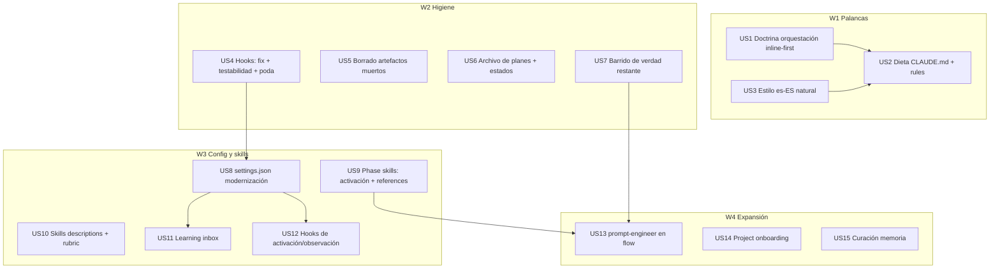

# Tasks index — Personal optimization (slim + truth + doctrine + style)

Level: Full — multi-domain meta-system change with architectural risk in the orchestration doctrine.
TDD-mode: optional — project policy `auxiliary` (test-policy.md); US4/US11/US12 carry `tdd: forced` (hook logic warrants red→green).

## Resumen ejecutivo

15 HUs in 4 waves. W1 lands the three highest-leverage units first (orchestration doctrine rewrite, es-ES style, always-loaded diet) because they touch every future session; CLAUDE.md has a single writer (US2) consuming US1/US3 outputs to avoid coordinated-edit conflicts. W2 is one-time hygiene (hooks fix+prune, dead artifacts, plans archive, truth sweep) — 4 independent HUs. W3 modernizes config and skills (settings, phase-skill activation control, skills audit, learning inbox, activation hooks).

Execution is **inline by design** (user doctrine: agents only for parallel read-only work; this feature is all writes). The DAG's parallelism is informational — it orders the work and bounds blast radius, not agent fan-out. Evidence base: 3-agent audit (42 findings), CC v2.1.170 digest, official-docs/community report, 20-action ranking — all in spec.md §Evidence base.

Decisión absorbida (stress-test inline, 2 alternativas): closed-plans archive lives at `.claude/plans/_archive/` **gitignored** — zero `/flow` surgery (active-plan paths unchanged), satisfies "out of accidental read reach" (not committed, never globbed by phase skills). Outside-repo (`~/.claude-plans/`) gave stronger isolation but required touching `/flow` + 6 phase skills (Commandment III: more than the problem asks).

## Estimación de esfuerzo

| Wave | HUs | Esfuerzo | Naturaleza |
|---|---|---|---|
| W1 Palancas | US1, US3 → US2 | ~1.5 sesiones | Rewrite doctrina + estilo + dieta CLAUDE.md |
| W2 Higiene | US4, US5, US6, US7 | ~1.5 sesiones | Fix hooks + borrado + archivo + barrido de verdad |
| W3 Config y skills | US8 → (US11, US12); US9, US10 | ~2 sesiones | settings, skills audit, hooks nuevos |
| W4 Expansión | US13, US14, US15 | ~1.5 sesiones | flow wiring, project onboarding, curación memoria |

**Critical path**: US1/US3 → US2 → US8 → US12 → W4 ≈ 5-6 sesiones (ejecución inline secuencial).

**Notas operativas de build**: (1) arrancar Fase 3 desde una rama nueva creada desde `main` — la sesión actual está en `html-report-palette-md-charts`; (2) tras US2/US8, re-ejecutar `bun .claude/commands/sync-claude.ts --execute --backup` y recordar que Windows copia CLAUDE.md (re-sync allí); (3) US15 corre tras W1-W3 (sus veredictos dependen del estado post-cambios).

## DAG

## Tabla resumen

| # | HU | Wave | Estimate | TDD-mode | Decisión absorbida |
|---|---|---|---|---|---|
| US1 | Doctrina orquestación inline-first (orchestrator-protocol) | W1 | M | optional | agentes = solo paralelización lectura |
| US3 | Estilo es-ES natural (output-style) | W1 | S | optional | mantener etiquetas+tablas |
| US2 | Dieta always-loaded (CLAUDE.md ≤200 + error-recovery) | W1 | M | optional | inventario → docs/ on-demand; quitar ref agent-memory |
| US4 | Hooks: fix auto-approve + exports + poda tests | W2 | M | **forced** (fix) | gate Stop de tests: ratificar en build |
| US5 | Borrado: HTML raíz + .claude/data/ + dirs vacíos | W2 | S | skip: deletion-only, no testable behavior | — |
| US6 | Archivo de planes: _archive/ gitignored + estados | W2 | M | skip: file moves + json edits, verified by AC | archive in-repo gitignored |
| US7 | Barrido de verdad: refs fantasma + citas versión | W2 | S | skip: doc-only change, no testable behavior | — |
| US8 | settings.json: version gate + fallback + MCP review | W3 | S | optional | verificar schema antes de escribir |
| US9 | Phase skills: disable-model-invocation + extraer refs | W3 | M | optional | verificar campo frontmatter |
| US10 | Skills descriptions audit + rubric en meta-create | W3 | M | optional | — |
| US11 | Learning inbox (hook captura → retro consume) | W3 | M | **forced** | gated: humano ratifica promociones |
| US12 | Hooks UserPromptSubmit activación + InstructionsLoaded | W3 | S | **forced** | verificar eventos disponibles |
| US13 | prompt-engineer cableado en tech-plan/build/flow | W4 | S | optional | US = prompt de ejecución, permanente |
| US14 | Project onboarding (`project-onboard` skill) | W4 | L | optional | apuesta +50%: valor en repos de trabajo |
| US15 | Curación de memoria persistente (21 entradas) | W4 | S | skip: curation of memory files, no testable behavior | gap urgente detectado en revisión |

## Cross-cutting decisions

| Decisión | Dónde se toma | HUs afectadas | Criterio |
|---|---|---|---|
| CLAUDE.md single-writer | US2 | US1, US3 | US1/US3 producen contenido; solo US2 edita CLAUDE.md (evita ediciones coordinadas) |
| settings.json single-writer por ola | US8 | US4, US11, US12 | US4 escribe hook files; registraciones en settings van con US8/US11/US12 en orden DAG |
| Restaurar Stop test-gate | US4 | US4, US8 | Usuario ratifica en build (tensión: quiere menos tests pero Mandamiento IV pide gates mecánicos) |
| Borrar .claude/data/*.json (telemetría cortada) | US5 | US5 | Usuario aprobó solo HTML; confirmar json en build via AskUserQuestion |

## Open questions (deferidas a Fase 3)

1. Subset exacto de asserts que sobreviven la poda de tests (US4 decide por fichero con criterio: protege-de-fallo-silencioso = vive).
2. Nombres exactos de campos settings (`requiredMinimumVersion`, `fallbackModel`) — verificar contra schema/docs en US8 antes de escribir [Probable, reportado por agente].
3. Disponibilidad real de eventos `InstructionsLoaded` y patrón UserPromptSubmit — verificar release notes en US12.
4. Campo `disable-model-invocation` en skill frontmatter — verificar docs en US9 antes de aplicarlo a 6 skills.

## Anti-patterns mitigation

| Anti-pattern | Cómo se evita |
|---|---|
| Feature "optimízalo todo" que nunca cierra | 3 olas con cierre por ola; W1 entrega el 60% del valor; gates intermedios |
| Estilo es-ES degenera en verbosidad | US3 incluye counter-examples explícitos; validación conductual en sesión siguiente (constraint del spec) |
| Ediciones coordinadas sobre CLAUDE.md/settings | Single-writer por fichero (cross-cutting decisions) |
| Borrado irreversible sin confirmación | US5/US6 listan targets exactos; json de data/ y cierre de planes se confirman con AskUserQuestion en build |

## Próximo paso

Index completo, 12 US en `tasks/`. Pendiente: validations.md (Fase 2.5) + hard gate 2→3.
