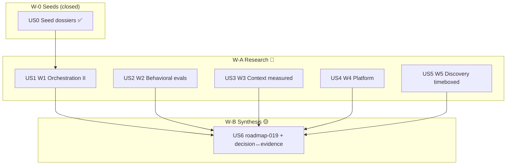

# Tasks index — Evidence Roadmap (research program)

Level: Full — multi-domain evidence program, mode `full` per spec; research-feature rule applies (light ceremony, substance early — lesson 002).
TDD-mode: optional — project policy `auxiliary` (test-policy.md); ALL HUs produce markdown → validation-mode in Phase 2.5 (rigor checklist per dossier, no executable tests).

Honest skips declared: Context7 skipped (no external APIs — the research corpus IS the web, verified per-claim by the rigor method); gap-analysis adapted (ground truth = seed dossiers + repo inventory, both verified this session).

## Resumen ejecutivo

7 HUs: US0 (seeds — **already closed in Phase 1**, artefacts verified in `evidence/`), US1-US5 = one research workstream each (🔵 mutually independent), US6 = synthesis (🟡 needs all five memos). Each research HU runs the same engine: 2-3 finder agents with distinct angles + 1 refuter pass over decision-changing claims (cap: ≤4 agents/HU), producing `evidence/W{n}.md` + `decision-memo-W{n}.md` under the spec's rigor method (tiers A-D, ≥1 A/B to ground design, counter-evidence mandatory, UNVERIFIED explicit).

Execution: read-only fan-out via Agent tool — the one orchestration mode validated by the seeds themselves; `Workflow` only on explicit "ultracode" opt-in. US6 runs **inline, no agents** (synthesis needs full cross-memo context — Cognition share-context principle, Tier D but uncontested). 018 writes only under its own plan dir: zero conflict with 017's pending USs; lifecycles interleave freely.

Decisiones absorbidas (stress-test light inline, 2 alternativas reales):
1. **One program vs 5 separate features** → one program: shared rigor method, single synthesis, 1 lifecycle of overhead instead of 5. Never-closes risk mitigated: each WS closes independently + W5 timeboxed.
2. **Custom fan-out vs `/deep-research` per WS** → custom fan-out (user-ratified at scope): tighter prompts per workstream, reuse only the adversarial-verify pattern; the generic harness adds weight without adding rigor here.

## Estimación de esfuerzo

| Wave | HUs | Esfuerzo | Naturaleza |
|---|---|---|---|
| W-0 Seeds | US0 | ✅ done (Phase 1) | Persist 3 session dossiers |
| W-A Research | US1, US2, US3, US4, US5 | ~2 sesiones (1-2 HUs/turno, fan-out paralelo intra-HU) | Read-only web research + adversarial verify + memos |
| W-B Synthesis | US6 | ~0.5 sesión | Inline cross-memo synthesis → roadmap-019.md |

**Critical path**: ~2.5 sesiones (W-A internally parallel; W-B waits for all of W-A).

## DAG

> `US0 --> US1` is the only seed dependency that matters operationally (W1 extends the seeds directly); US2-US5 consult seeds as context. Parallel Efficiency Score: 5 parallel / 6 open = **83%** (≥50% ✅).

## Tabla resumen

| # | HU | Wave | Estimate | TDD-mode | Decisión absorbida |
|---|---|---|---|---|---|
| US0 | Persist seed dossiers (anthropic/academic/industry) | W-0 | S | skip: artefact copy, verified by existence | — |
| US1 | W1 Orchestration II: best-of-N, bg-sessions data, effort heuristics | W-A | M | optional (validation-mode) | METR-lite = proposal only, impl 019+ |
| US2 | W2 Behavioral evals: config regression testing measured practice | W-A | M | optional (validation-mode) | harness design constraints only, impl 019+ |
| US3 | W3 Context measured: degradation data + mitigation comparisons + code-graph layer (graphify) | W-A | M | optional (validation-mode) | flag model-era transferability per claim; graphify verdict required (seed scouted 2026-06-10) |
| US4 | W4 Platform: dotfile release patterns, memory evals, sandboxing data | W-A | M | optional (validation-mode) | sync v2 / harvest / security = direction, impl 019+ |
| US5 | W5 Discovery: capabilities poneglyph lacks (timeboxed) | W-A | M | optional (validation-mode) | inclusion rubric fixed in US5 (Phase 2 resolution) |
| US6 | Synthesis: roadmap-019.md + decision↔evidence table | W-B | M | optional (validation-mode) | inline, no agents (share-context principle) |

## Cross-cutting decisions

| Decisión | Dónde se toma | HUs afectadas | Criterio |
|---|---|---|---|
| Rigor method (tiers, ≥1 A/B, refuter, counter-evidence, UNVERIFIED) | spec §Modelo conceptual | US1-US6 | Every claim format-checked by validations.md |
| Agent cap ≤4 per HU (2-3 finders + 1 refuter); US3 exception: ≤5 (graphify angle added at gate REFINE) | this index | US1-US5 | Cost control; matches Anthropic effort-scaling band for "direct comparisons" |
| Extend, don't repeat seeds | spec Out-of-scope | US1-US5 | Finder prompts MUST list seed coverage as known ground |
| Date-stamp every claim | spec rigor method | US1-US6 | Evidence rots; 019+ consumers need recency signal |
| W5 inclusion rubric | US5 | US5, US6 | Public artefacts + reported outcomes + maintained ≤6mo + single-user-CC applicable; capability needs ≥1 A/B or official CC doc, else watchlist |

## Drillme — Phase 2

1. `[approach]` **Simpler option?** Yes, considered: single mega-research turn without lifecycle. Rejected: 5 domains × rigor method needs per-WS closure + audit; the lifecycle IS the quality gate (Commandment IV). Ceremony kept research-light.
2. `[context]` **Reinventing wheel?** Seeds exist and are explicitly "extend, don't repeat"; `/deep-research` harness considered and consciously not used (decisión absorbida 2); `html-report-inspiration-research` memory checked — different scope (visual skill referents).
3. `[approach]` **Truly atomic?** Each US = one workstream closable in ≤1 session (fan-out + verify + memo). US6 is half a session.
4. `[context]` **Real deps?** US6→all five is functional (synthesis consumes memos). US0→US1 functional (extends seeds). No cosmetic edges.
5. `[failure]` **Failure tolerance?** Any W-A HU can fail/defer independently; US6 degrades gracefully (synthesizes available memos, lists gaps). DAG survives partial completion.
6. `[location]` **Right location?** All artefacts under `.claude/plans/018-evidence-roadmap/` per /flow convention; nothing touches live config (that is 019+).

Coverage: 4/4 canonical Socratic categories.

## Open questions (deferidas a Fase 3)

1. Per-WS source lists will grow during fan-out — bounded by the ≤4-agent cap, not by pre-enumeration.
2. W3: which degradation benchmarks have Fable-5-era results — finders must flag model generation per claim; if none exist, the memo says so rather than extrapolating.
3. US5 watchlist size — unbounded discovery goes to appendix, only rubric-passing candidates enter the memo.

## Anti-patterns mitigation

| Anti-pattern | Cómo se evita |
|---|---|
| Research never closes | Independent closable WS + W5 timebox (1 fan-out + 1 verify round) |
| Confirmation bias (research as marketing) | Refuter agent on decision-changing claims + mandatory counter-evidence section |
| Cost explosion | ≤4 agents/HU; US6 inline with zero agents |
| Stale evidence | Date on every claim; recency preferred in finder prompts |
| Synthetic AC | Every US AC traces to spec AC1-AC5 |

## Próximo paso

Index complete, 7 US files in `tasks/`. Pendiente: `validations.md` (Fase 2.5) + hard gate 2→3.
