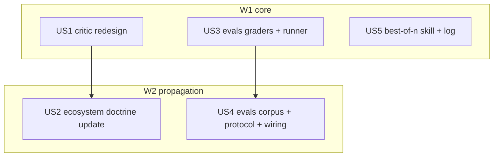

# Tasks index — quality gates (critic redesign + evals harness + best-of-N pilot)

Level: Standard — 3 domains (review architecture, eval infra, execution pattern) but zero external-API research debt: the evidence corpus was delivered by feature 018 (decision-memo-W1/W2). Skipped: Context7 (no external libraries; `claude -p` flags verified Tier B in 018), closure questionnaire (spec + gate-entry ratification cover it), decision-stress-test (alternatives were stress-tested by 018's finder+refuter waves).
TDD-mode: optional — project policy `auxiliary` (.claude/rules/test-policy.md). US3 opts in `tdd: forced` (graders are pure functions with non-trivial logic — red→green is cheap and binding).

## Resumen ejecutivo

Five HUs in two waves implement the three ratified roadmap entries. US1 redesigns `critic` Phase 4 for code: runnable mechanical checks + ONE fresh-context reviewer (correctness/requirements only) as default; the ≥4 deliberative panel is demoted to decision-review only (decision-stress-test territory). US2 propagates that doctrine across the ecosystem (orchestrator-protocol P4/decision-tree, flow.md, system-inventory). US3+US4 build `.claude/evals/`: deterministic bun graders + runner first, then ~20 golden cases harvested from real documented failures plus the run-per-meta-config-change protocol. US5 names the best-of-N pattern as a skill with a persistent outcome log — the pilot that generates the evidence W1 declared missing.

Cross-cutting decision absorbed in US1: the spawn-tree rule "1 agent is forbidden" gains an explicit, evidence-cited exception — ONE fresh-context read-only reviewer is the strong form for code review (W1 D1/D3, W2 D1); panels were the weak form being protected by that rule. User ratified the demotion completely (gate-entry questionnaire, 2026-06-10).

## Estimación de esfuerzo

| Wave | HUs | Esfuerzo | Naturaleza |
|---|---|---|---|
| W1 core | US1, US3, US5 | ~1.5 sesiones | Skill redesign (md) + grader code (ts, TDD) + new skill (md) |
| W2 propagation | US2, US4 | ~1 sesión | Reference updates (md) + corpus harvest + protocol doc |

**Critical path**: US1→US2 and US3→US4 (~2 sesiones standard).

## DAG

## Tabla resumen

| # | HU | Fase del workflow | Wave | Estimate | TDD-mode | Decisión absorbida |
|---|---|---|---|---|---|---|
| US1 | Critic redesign: checks + ONE fresh reviewer; panel → decisions only | Fase 3 | W1 | M | optional | P1 exception: 1 fresh-context read-only reviewer |
| US2 | Propagate doctrine: orchestrator-protocol, flow.md, system-inventory | Fase 3 | W2 | S | optional | — |
| US3 | Evals harness: deterministic graders (bun) + runner skeleton | Fase 3 | W1 | M | **forced** | — |
| US4 | Evals corpus ~20 real-failure cases + README protocol + wiring | Fase 3 | W2 | M | optional | — |
| US5 | best-of-n skill (claude -p --worktree ×2-3) + outcome log | Fase 3 | W1 | S | optional | — |

🔵 US1, US3, US5 (independent — disjoint files). 🟡 US2 (needs US1's final wording), US4 (needs US3's case schema). Parallel Efficiency Score: 60%.

## Research

| Source | What it grounds |
|---|---|
| `.claude/plans/018-evidence-roadmap/decision-memo-W1.md` D1/D3 | Best-of-N constraints (N=2-3, tests-as-selector, no LLM judge, cleanup step); verifier gap → mechanical checks + fresh reviewer |
| `.claude/plans/018-evidence-roadmap/decision-memo-W2.md` D1/D2/D4 | Harness shape (20-50 clustered real cases, deterministic-first grading, run-per-change, suspect-the-eval-first, pass^k 2-3 trials, `claude -p --output-format stream-json` runner); eval targets (skill-trigger, style/register, CLAUDE.md efficiency) |
| Grep `panel` across `.claude/` (2026-06-10) | Blast radius for US2: orchestrator-protocol SKILL.md (4 sites) + references/04 (3 sites), flow.md, system-inventory.md (2 sites) |
| `Glob .claude/evals` → absent; `ls .claude/hooks/__tests__/` | No collision; bun-test conventions to mirror |

## Cross-cutting decisions

| Decisión | Dónde se toma | HUs afectadas | Criterio |
|---|---|---|---|
| P1 spawn-tree exception: ONE fresh-context read-only reviewer allowed (code review default) | US1 | US1, US2 | Evidence-strong form (W1 D1/D3, W2 D1); panel stays forbidden-as-default for code, reserved for decisions |
| Verdict contract unchanged (APPROVED/WITH_WARNINGS/NEEDS_CHANGES/BLOCKED) | US1 | US1, US2 | spec constraint — /flow Phase 4 wiring must not break |
| Eval case schema (JSONL: id, prompt, type, grader, expected, trials) | US3 | US3, US4 | US4 authors cases against US3's schema |

## Open questions (deferidas a Fase 3)

1. US4 — exact harvest yield: if real documented failures yield <20 distinct clustered cases, ship fewer honestly (no synthetic filler — spec out-of-scope); declare the count.
2. US5 — `claude -p` worktree flag surface may have evolved; verify `claude --help` output at build time before writing the skill's literal commands.

## Anti-patterns mitigation

| Anti-pattern | Cómo se evita |
|---|---|
| Silent doctrine drift (panel removed but refs still preach it) | US2 greps `panel` repo-wide post-edit; zero stale code-review-panel references allowed |
| Synthetic AC / filler eval cases | US4 cases must each cite their real-failure source (memory file, retro, inbox entry) |
| LLM-judge creep in graders | US3 graders are pure TS functions; runner has no judge path (W2 D4) |

## Próximo paso

Phase 2.5 (tdd-design) produce tests.md/validations.md per HU; luego hard gate 2→3.
