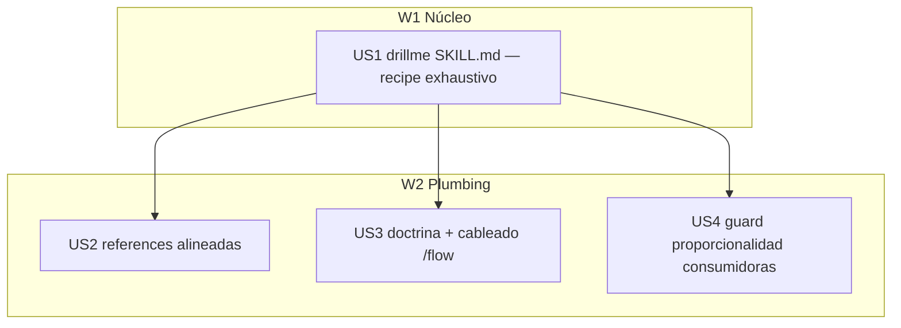

# Tasks index — drillme exhaustivo (activación híbrida hasta saturación)

Level: **Full** — cambio multi-fichero coordinado sobre la skill drillme + su activación + doctrina (mode `--full` forzado).
TDD-mode: **optional** — `test-policy.md` = `auxiliary`; todas las HUs son markdown (skill/doctrina), validación conductual en Phase 2.5 (`validations.md`), no `tests.md`. Ningún nodo toca `skill-activation.ts` (la activación fácil se logra vía keywords + doctrina, no código — ver Research).

## Resumen ejecutivo

El feature reescribe `drillme` de una skill **ligera y graduada** (3-7 preguntas, ">10 = over-engineering", "the 10% tool") a una skill **exhaustiva con activación híbrida**: se activa donde detecta gaps/dudas/ambigüedad (information gain), barre las preguntas necesarias hasta cerrar todos los gaps, y produce **0 preguntas donde no hay nada que desambiguar** (cero ceremonia en lo trivial). La contradicción raíz es que la doctrina de CLAUDE.md ya ordena "preguntar hasta cero gaps" pero la skill se calibra al revés.

**El núcleo es US1** (drillme SKILL.md): debe escribirse como **recipe operacional generation-executable** — coverage checklist de categorías + funnel de rondas + bake-loop + un worked example de batería grande — NO como un manifiesto con un criterio de parada auto-referencial ("ask until saturated") que el modelo asentiría e ignoraría (lecciones `rules-must-be-generation-executable`, `skill-wiring-over-autotrigger`). US2 (references), US3 (doctrina + cableado /flow) y US4 (guard de proporcionalidad en consumidoras) son plumbing alrededor de US1.

Decisiones tomadas con el usuario en scope (4 rondas + research): activación **híbrida gated por gaps**, parada por **saturación + anti-padding**, freno **flojo** (degradación), **bakeo** de respuestas al artefacto (patrón `/speckit.clarify`), boundary **separado** de `decision-stress-test` con escalado, `/flow` cablea drillme en **scope + ambos hard gates**.

## Estimación de esfuerzo

| Wave | HUs | Esfuerzo | Naturaleza |
|---|---|---|---|
| W1 Núcleo | US1 | L | Reescritura del SKILL.md como recipe operacional + worked example |
| W2 Plumbing | US2, US3, US4 | M | References alineadas, doctrina + cableado /flow, guard de proporcionalidad |

**Critical path**: US1 → W2. Todo build es **inline secuencial** (un Lead editando); el DAG ordena dependencias, no paraleliza ejecución.

## DAG

## Tabla resumen

| # | HU | Fase del workflow | Wave | Estimate | TDD-mode | Decisión absorbida |
|---|---|---|---|---|---|---|
| US1 | drillme SKILL.md → recipe exhaustivo + activación híbrida | Transversal (skill) | W1 | L | optional | modelo conceptual completo |
| US2 | references (01/02/03/04) alineadas al nuevo modelo | Transversal (skill) | W2 | M | optional | — |
| US3 | doctrina (CLAUDE.md) + cableado /flow (scope + 2 gates) | Transversal | W2 | S | optional | — |
| US4 | guard de proporcionalidad en skills consumidoras | Transversal | W2 | S | optional | bounds → information-gain gating |

## Cross-cutting decisions

| Decisión | Dónde se toma | HUs afectadas | Criterio |
|---|---|---|---|
| Criterio de parada = coverage-checklist + funnel + bake-loop (NO "ask until saturated" suelto) | US1 | US2, US4 | Generation-executable: barre categorías, pregunta donde hay gap |
| Activación = híbrida gated por information-gain (0 en trivial) | US1 | US3, US4 | Reconcilia "activación fácil" con Commandment III |
| Bakeo standalone (fuera de /flow) = reporte inline / sección scratch, no asume spec.md | US1 | — | AC3 definido también fuera del flow |
| Consumidoras dejan de hardcodear nº de preguntas; invocan drillme + gating | US4 | — | Guard de proporcionalidad (mismo riesgo que overfire de binora) |

## Open questions (deferidas a Fase 3)

1. La redacción exacta de las keywords ampliadas de drillme (activación fácil) se afina al escribir US1 — equilibrio entre cobertura y no robar los 2 slots del hook a otras skills.

## Anti-patterns mitigation

| Anti-pattern | Cómo se evita |
|---|---|
| Manifiesto no ejecutable ("ask until saturated") | US1 se escribe como recipe (checklist + worked example + funnel) |
| Synthetic coverage (inventar preguntas para una cuota) | Se conserva el anti-pattern explícito; cada pregunta exige information gain |
| Always-on molesto (overfire estilo binora) | Activación híbrida gated por gaps; 0 preguntas en trivial; freno flojo por degradación |
| Validación por grep/presencia | Phase 2.5 define escenarios conductuales (oracle), no checks de inspección |

## Próximo paso

Phase 2.5 (`tdd-design`) produce `validations.md` con los escenarios conductuales (oracle). Tras ello, hard gate 2→3 para aprobación del usuario antes de build.
