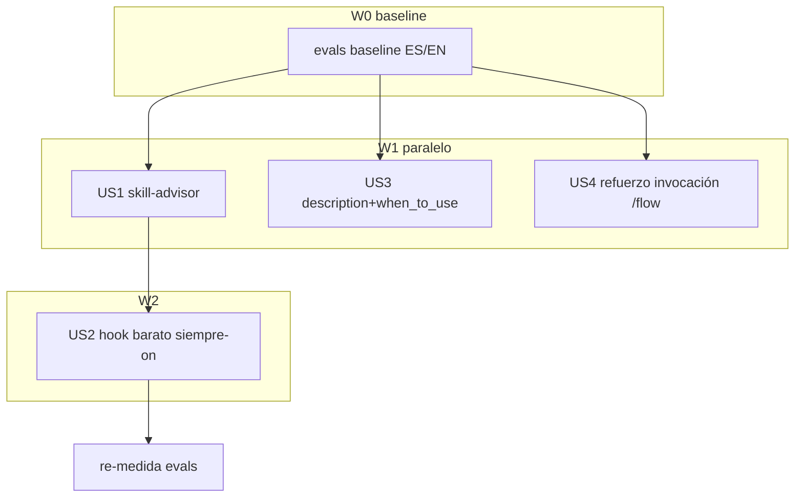

# Tasks index — Activación fiable de skills

Level: Standard — single domain (meta-config: hooks + skills + commands), multi-file, sin research externo pendiente (ya hecho: 29-agentes + 99-agentes + WebFetch doc oficial 2026-06-23).
TDD-mode: optional (test-policy `auxiliary`) — US1 y US2 opt-in `tdd: forced` (lógica determinista testeable: ranking de skill-advisor + processPayload del hook).

## Resumen ejecutivo

Cuatro HUs cierran el problema raíz (el Lead no usa skills de forma fiable) atacando las dos palancas verificadas: **selección** (US3: `description`+`when_to_use`) e **invocación determinista** (US1 skill-advisor como ratify gate, US2 hook barato siempre-on, US4 refuerzo de invocación de fase en `/flow`). Ninguna intenta *forzar* auto-invocación (imposible por diseño) — la garantía es consideración determinista + ratify + cableado por fase.

W1 ejecuta tres HUs independientes en paralelo (US1, US3, US4). W2 ejecuta US2 (el hook nombra `skill-advisor`, así que la skill debe existir primero). Verificación transversal: baseline de activación ES/EN con el harness `.claude/evals/` ANTES de W1, re-medida tras W2 (AC2).

## Estimación de esfuerzo

| Wave | HUs | Esfuerzo | Naturaleza |
|---|---|---|---|
| W0 baseline | (pre-step) | XS | Capturar baseline de activación ES/EN con evals antes de tocar nada |
| W1 paralelo | US1, US3, US4 | M+S+S | Crear skill nueva + pasada de frontmatter + refuerzo markdown |
| W2 | US2 | M | Hook determinista + tests + re-medida |

**Critical path**: W0 → US1 → US2 ≈ ~2-3 sesiones standard (US3/US4 caben en paralelo a US1).

## DAG

## Tabla resumen

| # | HU | Fase del workflow | Wave | Estimate | TDD-mode | Decisión absorbida |
|---|---|---|---|---|---|---|
| US1 | Reinstaurar skill-advisor (propone→ratifica) | meta-create | W1 | M | forced | — |
| US2 | Hook skill-activation barato siempre-on | meta-create | W2 | M | forced | — |
| US3 | description + when_to_use en todas las skills (~23) | polish | W1 | M | optional | — |
| US4 | Reforzar invocación de skill de fase en /flow + orchestrator-protocol | polish | W1 | S | optional | — |

## Cross-cutting decisions

| Decisión | Dónde se toma | HUs afectadas | Criterio |
|---|---|---|---|
| Nombre literal `skill-advisor` que el hook inyecta | US1 | US2 | US2 referencia el string; US1 fija el slug de la skill |
| Formato canónico de `description`+`when_to_use` | US3 | US1 (su propia desc) | US1 escribe su frontmatter siguiendo el patrón de US3 |

## Open questions (deferidas a Fase 3)

1. ¿Dónde aterriza el hint inyectado y por qué el Lead lo trata como advisory? (US2, paso 1 — verificación mecánica; condiciona el phrasing del shortlist).
2. ¿`when_to_use` funciona en la versión CC instalada? (US3, paso 1 — verificar antes de aplicar a las 23).

## Anti-patterns mitigation

| Anti-pattern | Cómo se evita |
|---|---|
| Forzar auto-invocación (imposible) | Diseño explícito: consideración determinista, no forzado |
| Inflar las 23 descriptions → overflow de presupuesto | US3 pushy-pero-lean + `/doctor` + `skillOverrides: name-only` para low-priority |
| skill-advisor re-implementa matching | US1 razona sobre el listing en contexto + disco, no construye índice |
| Hook caro | US2 sin LLM, solo lectura de heads (como hoy) |

## Próximo paso

Index + 4 US listos. Falta Phase 2.5 (`tdd-design` → tests.md para US1/US2 + validations.md para US3/US4) y hard gate 2→3.
