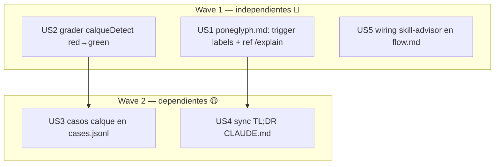

# Tech-plan — 024 revisión del estilo Poneglyph

Level: **Standard** — audit de markdown/JSONL + 1 grader nuevo; sin APIs externas (research ya cerrado en `research.md`).
TDD-mode: **optional** (proyecto `auxiliary`) — excepto US2 (grader nuevo con lógica) → `tdd: forced` red→green.

## Resumen ejecutivo

El estilo se aplica desigual no por carga (verificado activo) sino por spec+cobertura. El plan ataca tres niveles: (1) reforzar la spec donde el trigger es débil — sobre todo confidence labels, prioridad del usuario; (2) cerrar el gap de cobertura nº1 (calques, motivo raíz de 017) con un grader determinista; (3) sincronizar el puntero de CLAUDE.md y cablear `skill-advisor` en `/flow`. Gaps no-cubribles se declaran honestamente, no se inflan con graders frágiles.

## Pre-build (no es HU): baseline live

Antes de tocar nada, correr `PATH="$HOME/.local/bin:$PATH" bun .claude/evals/run.ts` (live) → guardar el baseline en `research.md`. Post-cambio se re-corre y se compara (AC3 + AC del estilo no regresionan).

## DAG

Parallel Efficiency: 3/5 = 60% (≥50% ✅).

## HUs

| US | Título | Wave | depends_on | tdd | files |
|---|---|---|---|---|---|
| US1 | poneglyph.md: reforzar trigger confidence labels + fix ref `/explain` | 1 | — | optional | poneglyph.md |
| US2 | grader `calqueDetect` + registro (red→green) | 1 | — | forced | graders.ts, __tests__/graders.test.ts |
| US3 | casos eval calque en cases.jsonl | 2 | US2 | optional | cases.jsonl |
| US4 | sync TL;DR estilo en CLAUDE.md ↔ canon | 2 | US1 | optional | CLAUDE.md |
| US5 | cablear skill-advisor en fronteras de fase de /flow | 1 | — | optional | commands/flow.md |

## Decisión de diseño absorbida (sin stress-test, razonada)

**¿Qué normas reciben grader nuevo?** Solo **calque** (US2/US3). Telegráfico y "label-no-prompted" se DESCARTAN como casos: no hay grader determinista fiable (telegráfico = heurística frágil; label-no-prompted forzaría presencia donde no toca → falsos positivos). Se declaran gaps conscientes en `research.md §6`. Esto respeta el cap anti-filler de la suite (README) y `feedback-rules-must-be-generation-executable`.

## Open questions → Phase 3

- El `calqueDetect` se construye con phrase-list de anclas multi-palabra de los propios ejemplos del spec (bajo FP). Si el baseline live revela que ya hay calques en producción, el caso nace en rojo → se documenta y el fix es de spec, no de grader.

## Próximo paso

Phase 2.5 (tdd-design) → validations.md/tests.md → hard gate 2→3.
