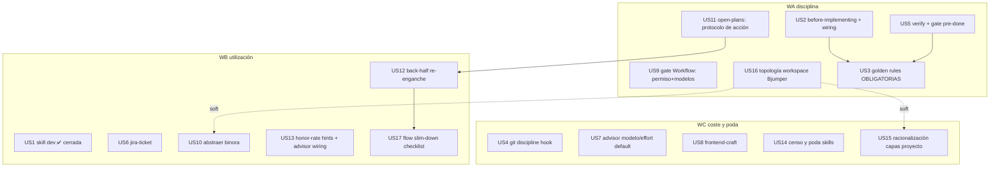

# Tasks index — Workflow uplift v2: forma de trabajar

Level: Standard — multi-dominio (global + proyecto + hooks), research hecha (2 agentes web + 3 de transcripts + verificación de artefactos primarios).
TDD-mode: optional — test-policy `auxiliary`; HUs de hooks llevan `tdd: forced` (red→green).

> **Desviaciones declaradas**: (1) sin spec.md (decisión del usuario, mini-spec abajo); (2) `tdd-design` (fase 2.5) **deferred visiblemente** hasta el APPROVE de este draft; (3) las HUs de Wave C se especifican a nivel de tabla y quick-prompt — se expanden a fichero completo al cerrar Wave B (iteración declarada, no olvido).

## Erratas v1 corregidas (log de fiabilidad)

| Errata | Corrección (artefacto) |
|---|---|
| "flow 3× en la historia" | 12 tecleos `/flow` + **14 lifecycles state.json** en repos de trabajo |
| "drillme/fases 0 usos" | Censo de lanzamientos de skill: tech-plan 11, scope 9, **drillme 8**, tdd-design 7, build 7, critic 6, retro 5, prompt-engineer 7, skill-advisor 2. Confundí "comando tecleado" con "skill lanzada" |
| US4 creaba /commit-text de cero | binora-backend ya tiene `commit-message.md` (111 l.) y `pr-description.md` (144 l.) → US10 los abstrae |
| — (verificado, NO errata) | 025+027 aterrizaron 2026-07-07 (git log); los 4 abandonos 17-29 jul son post-gate |

## Mini-spec (embebida)

**Problema**: "el sistema no aporta lo suficiente". Causas medidas: (a) **el back-half del pipeline muere** — 10/14 lifecycles abiertos (3 en critic, 7 tras verdict sin retro), el gate 025 es conductual-dentro-del-turno y nada re-engancha al morir la sesión; (b) **el turno ad-hoc no tiene disciplina** (la otra mitad del trabajo); (c) **infrautilización de skills** (máx. 11 lanzamientos; 10 skills con 0; skill-advisor 2); (d) **capas de proyecto caras y divergentes** (frontend ~17k tokens/turno; forks de protocolos cortados); (e) fricciones mecánicas medidas (verificación manual 20+, git 10, jira 13 pastes, modelo/effort 60 toggles).

**Objetivo**: disciplina estricta y verificable en el turno default (golden rules OBLIGATORIAS), cierre fiable del ciclo /flow, control de coste en delegación (permiso + modelo por tarea), utilización real de skills (cableo determinista + poda), y capas de proyecto racionalizadas.

**Out of scope**: telemetría continua (Cmd VII reactivo) · re-diseño del pipeline (funciona en su primera mitad) · edición de repos Binora desde aquí (se preparan piezas; despliegue = run posterior de project-onboard).

## Directrices del usuario integradas (2026-08-05)

U1 gate Workflows (permiso+modelo) → US9 · U2 abstraer skills binora → US10 · U3 activación de skills → US13 · U4 golden rules obligatorias → US3 · U5 coste capas proyecto → US15 · U6 más drillme/skill-advisor → cableados en US2 (y ya existen en /flow, verificado en flow.md §SIEMPRE) · U7 filtrar skills → US14.

## Estimación de esfuerzo

| Wave | HUs | Esfuerzo | Naturaleza |
|---|---|---|---|
| WA disciplina + cierres rápidos | US2, US5, US9, US11, US16 → US3 | ~1.5-2 sesiones | rules + CLAUDE.md + settings + hook text + topología (todo esfuerzo ≤2) |
| WB utilización + abstracción | US1, US6, US10, US12, US13, US17 | ~2.5-3 sesiones | skills nuevas/promovidas + hook edits con test + reescritura flow |
| WC coste + poda + resto | US4, US7, US8, US14, US15 | ~2-3 sesiones | hook forced-TDD, skills, auditorías ratificables |

**Critical path**: WA (US2+US5 → US3) ≈ 1 sesión; el resto paraleliza. Parallel Efficiency Score: **13/15 ≈ 87%**.

## DAG

## Tabla resumen

| # | HU | Wave | Est. | TDD | Origen | Nota clave (verificada) |
|---|---|---|---|---|---|---|
| US2 | ✅ CERRADA 2026-08-05 — absorbida en US-dev (etapa PLAN del bucle) | WA | S | optional | usuario+U6 | Fusión ratificada: sin rule aparte, un solo dueño |
| US5 | Skill `verify` + gate pre-done en plantilla proyecto | WA | M | optional | US5 v1 | `Skill(verify)` citado en CLAUDE.md e inexistente (Glob vacío) |
| US9 | Gate Workflow: `permissions.ask` explícito + tabla tarea→modelo | WA | S | optional | U1 | Workflow YA pregunta (no allowlisteado); `Agent` está en allow global — decisión en ask-first |
| US11 | Open-plans: protocolo de acción 1er turno + ruta script `$HOME` | WA | S | forced | v1 #2+#3 | Hook emite (probado en vivo); `~/.claude/scripts/flow-state.ts` existe — fix de ruta trivial |
| US16 | Topología workspace Bjumper: mapa + navegación orgánica (extensión worktrees-bjumper) | WA | S | optional | usuario (requisito) | Layout verificado: `<root>/worktrees/<env>/<repo>`, envs jrv-1031/1077/1081, `_shared`/`_proxy`; `git worktree list` funciona como primitiva |
| US3 | ✅ CERRADA 2026-08-05 — absorbida en US-dev (bloque "The dev loop" en CLAUDE.md) | WA | M | optional | usuario+U4 | Deferred visible: 2 casos eval (grader nuevo + live fuera de sandbox) |
| US1 | ✅ CERRADA 2026-08-05 — skill `dev` entregada (bucle two-tier, fusión US1+US2+US3) | WB | M | optional | usuario | Hook la descubre de disco (3 smokes ✅); suite 141 green; harness la registra |
| US6 | Skill `jira-ticket` (Atlassian MCP) | WB | S | optional | v1 | 13 pastes vs 6 llamadas MCP |
| US10 | Abstraer binora: pr-conventional-comments→global, review-pr núcleo, commit/pr-text | WB | M | optional | U2 | Ficheros verificados; re-canonizar schema viejo (`for_agents`, `context: fork`) |
| US12 | Back-half re-enganche (con hipótesis verificada) | WB | M | forced | v1 #6 | Gate 025 = conductual intra-turno; re-enganche = US11 accionable + cierre corto |
| US13 | Honor-rate de hints + skill-advisor fuera de /flow + hint "feature→/flow" | WB | M | forced | U3+U6 | Medir con instructions-loaded.log ANTES de endurecer más |
| US17 | Flow slim-down: prosa→checklist por frontera, mandatos 98→≤25, ≤1.200 palabras | WB | M | optional | usuario (audit prompt-engineer) | Medido: cadena 23.138 palabras ≈ 31k tokens; skill-advisor cumplimiento ~2% (2 vs ~98 mandatados); score 56/100 como prompt |
| US4 | Git discipline: rule + gate warn en security-gate (sin /commit-text — movido a US10) | WC | M | forced | v1 | 10 instancias; warn, no block (open question resuelta: propuesta warn) |
| US7 | Advisor modelo/effort al turno default | WC | M | forced | v1 | 60 toggles; advisor 027 solo en fronteras /flow |
| US8 | Skill `frontend-craft` (consistency-first) | WC | M | optional | usuario | 0 quejas estéticas; 4 barridos de consistencia manuales |
| US14 | Censo y poda de skills (instructions-loaded.log; keep/merge/cut ratificable) | WC | M | optional | U7 | 10 skills 0-lanzamientos; caveat: referencias se consumen vía Read |
| US15 | Racionalización capas proyecto (abstraer/dejar/borrar; retomar 003-claude-layer-audit) | WC | L | optional | U5 | frontend ~17k tokens/turno; planner.md fork; agent-memory pre-inline-first |
| US18 | Portabilidad multi-modelo/multi-harness: sync-claude genera AGENTS.md (Windows sin symlink), inventario portable-vs-bound (doctrina md = gratis; hooks/skills/commands = adapter CC), homes globales por tool (~/.codex etc.) | WC | M | optional | usuario (directiva 2026-08-05) | v1 hecho: CLAUDE.md genérico ("the AI agent"), modelos como ejemplo-entre-paréntesis, symlink AGENTS.md→CLAUDE.md en repo raíz |

## Cross-cutting decisions

| Decisión | Dónde | Afecta | Criterio |
|---|---|---|---|
| Enforcement determinista > conductual donde exista canal (permissions, hooks, bloques de evidencia) | US9, US11, US3 | WA | Undertrigger verificado (research 06-09 + JetBrains 0-fires + gate 025 conductual fallando) |
| Golden rules del usuario = UNA secuencia (funde premisa + escalera + verify) | US3 | US1, US2, US5 | Cmd IX: un solo dueño del ground |
| Medir antes de endurecer (honor-rate, censo) | US13, US14 | WB/WC | Cmd VII reactivo; no tocar a ciegas lo no medido |
| Todo cambio conductual pasa golden-prompt evals (`bun .claude/evals/run.ts`) | US3, US2, US9 | global | Mandato cookbook; memoria behavioral-AC |
| Piezas para repos de trabajo se preparan aquí, despliegue vía project-onboard | US5, US10, US15 | WB/WC | sync-trap conocido; poneglyph no edita repos ajenos |

## Open questions

1. `Agent` está en allow global (5 fan-outs hoy sin prompt): ¿moverlo a ask como Workflow, o dejarlo (read-only fan-out barato)? → decidir en US9.
2. Nombres finales de skills nuevas pendientes (frontend-craft, jira-ticket) → APPROVE. (Resuelto para la primera: `dev`, decidido 2026-08-05.)
3. ~~Retro-ligera para back-half~~ → RESUELTO en US12 (decisión usuario 2026-08-05): NO hay modos — /flow siempre full, --minimal/--standard/--full eliminados; lo que no aplica se salta con justificación explícita + aviso previo (retro: `retro-status "skipped — <justificación>"`; close-feature lo exige mecánicamente). US17 consolida las tablas legacy de modos en la reescritura.

## Backlog ratificable (no HUs)

Refutador constraint-fidelity en research delegado (3 instancias) · project-onboard a binora-mcp · consumidor del learning-inbox (se revive si US12 hace correr retro; re-evaluar tras WB) · copia vieja `Poneglyph/`+`.rar` en REPOSITORIOS/PYTHON (borrado = decisión usuario) · brevedad capa proyecto (dentro de US15) · review-pr hardening (dentro de US10).

## Drillme — Phase 2 v2 (cerrado)

1. `[approach]` ¿Más simple? Sí: US9 y US11 son casi-config (la infraestructura ya existía: permission dialog nativo, script sincado); 6 de 15 HUs extienden componentes existentes.
2. `[context]` ¿Rueda reinventada? Corregido activamente: US10 abstrae comandos existentes que v1 iba a recrear; verify/jira/ladder confirmados inexistentes por Glob.
3. `[approach]` ¿Atómicas? ≤5 ficheros por HU; WC declarada compacta hasta expandirse.
4. `[context]` ¿Deps reales? US3←US2+US5 (referencia artefactos por nombre); US12←US11 (usa el protocolo accionable). Resto independiente.
5. `[failure]` ¿DAG sobrevive fallos? Sí; única cadena es WA→US3 y US11→US12.
6. `[location]` ¿Ubicación correcta? rules/ para lo always-loaded justificado (pre-trabajo de cada sesión), skills/ on-demand, settings para lo determinista — según canon cookbook/meta-create.

## Próximo paso

**FASE 3 COMPLETA (2026-08-05)** — las 18 HUs cerradas en un día (Waves A+B+C),
suite unificada `bun test ./.claude/` en verde (conteo final post-critic-fixes:
ver review.md). **Registro cross-cutting**: los 10 Commandments fueron
RENUMERADOS por prioridad (decisión usuario, mid-US3/refactor) — mapping
viejo→nuevo y regla para docs históricos en la memoria
`project-commandments-renumbered-2026-08-05`; sweep de 177 citas en 67 ficheros
(el critic cazó 3 residuos, arreglados en la re-entrada). Pendiente: **hard gate
3→4** — `/critic` sobre el feature completo, y tras su verdict, `retro` (que
consumirá los deferred conductuales: validación en frío del CLAUDE.md nuevo +
dev loop, gate Workflow, oferta open-plans en binora, datos de honor-rate,
evals live fuera de sandbox, re-sync Windows). Las propuestas ratificables de
US14 (censo skills) y US15 (racionalización capas) esperan tu fila-a-fila.
