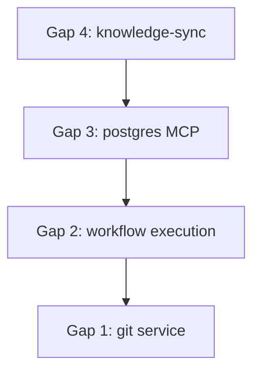

# Plan: Fix Critical Gaps

## Objetivo
Resolver los 4 gaps críticos que bloquean funcionalidad core.

---

## Gap 1: Git Service Vacío

### Estado Actual
- Directorio existe: `server/src/services/git/`
- Tipos definidos en `shared/types.ts`: `WorktreeInfo`, `WorktreeConfig`, `MergeResult`, `MergeConflict`, `MergeResolution`
- Implementación: **NINGUNA**

### Plan de Implementación

```
server/src/services/git/
├── index.ts           # Re-exports
├── worktree.ts        # WorktreeManager class
├── merge-resolver.ts  # MergeResolver class
└── git-utils.ts       # Helpers (exec git commands)
```

#### Archivos a Crear

**1. git-utils.ts**
```typescript
// Wrapper para ejecutar comandos git via Bun.spawn
export async function execGit(args: string[], cwd: string): Promise<string>
export function parseGitStatus(output: string): GitStatus
```

**2. worktree.ts**
```typescript
export class WorktreeManager {
  constructor(private repoPath: string) {}
  
  async create(config: WorktreeConfig): Promise<WorktreeInfo>
  async list(): Promise<WorktreeInfo[]>
  async remove(path: string): Promise<void>
  async getInfo(path: string): Promise<WorktreeInfo | null>
}
```

**3. merge-resolver.ts**
```typescript
export class MergeResolver {
  async detectConflicts(worktreePath: string): Promise<MergeConflict[]>
  async resolveConflict(resolution: MergeResolution): Promise<MergeResult>
  async abortMerge(worktreePath: string): Promise<void>
}
```

**4. index.ts**
```typescript
export { WorktreeManager } from './worktree'
export { MergeResolver } from './merge-resolver'
export * from './git-utils'
```

### Verificación
- [ ] `bun test server/src/services/git/` pasa
- [ ] Crear worktree manualmente y verificar con `git worktree list`

---

## Gap 2: Workflow Execution es STUB

### Estado Actual
- Ubicación: `server/src/services/workflow-executor.ts:244-249`
- Problema: Usa `setTimeout(100)` en lugar de ejecutar agentes

```typescript
// ACTUAL (stub)
await new Promise(resolve => setTimeout(resolve, 100))
```

### Plan de Implementación

**Modificar workflow-executor.ts**

```typescript
// NUEVO - conectar con agent-spawner
import { spawnAgent } from './agent-spawner'

private async executeStep(step: WorkflowStep): Promise<StepResult> {
  const config: SpawnConfig = {
    prompt: step.prompt,
    workDir: this.workDir,
    sessionId: this.sessionId,
    model: step.agent || 'claude-sonnet-4-20250514'
  }
  
  const result = await spawnAgent(config)
  
  return {
    stepId: step.id,
    status: result.exitCode === 0 ? 'completed' : 'failed',
    output: result.output,
    error: result.error
  }
}
```

### Archivos a Modificar
1. `server/src/services/workflow-executor.ts` - Conectar con agent-spawner

### Verificación
- [ ] Ejecutar workflow simple y verificar que agent-spawner se invoca
- [ ] Verificar streaming de output durante ejecución
- [ ] Test: workflow con 2 steps ejecuta ambos secuencialmente

---

## Gap 3: MCP Postgres No Configurado

### Estado Actual
- `settings.local.json` lista `"postgres"` en `enabledMcpjsonServers`
- `.mcp.json` NO tiene configuración de postgres

### Opciones

| Opción | Pros | Contras |
|--------|------|---------|
| A) Configurar postgres MCP | Habilita DB features | Requiere postgres running |
| B) Remover referencia | Limpia config | Pierde feature |
| C) Agregar como opcional | Flexible | Más complejo |

### Plan Recomendado: Opción C (Opcional)

**1. Agregar a .mcp.json**
```json
{
  "mcpServers": {
    "postgres": {
      "command": "npx",
      "args": ["-y", "@modelcontextprotocol/server-postgres"],
      "env": {
        "POSTGRES_CONNECTION_STRING": "${POSTGRES_URL}"
      },
      "disabled": true
    }
  }
}
```

**2. Documentar en README**
```markdown
### Postgres MCP (Opcional)
1. Set `POSTGRES_URL` en `.env`
2. En `.mcp.json`, cambiar `"disabled": true` a `false`
```

### Verificación
- [ ] Sin POSTGRES_URL: servidor inicia sin error
- [ ] Con POSTGRES_URL + disabled=false: postgres MCP disponible

---

## Gap 4: Comando /knowledge-sync Faltante

### Estado Actual
- `README.md` en knowledge/ documenta: push, pull, status
- `.claude/commands/knowledge-sync.md` NO EXISTE

### Plan de Implementación

**Crear .claude/commands/knowledge-sync.md**

```markdown
# Knowledge Sync

Sincroniza el knowledge base entre local y repositorio.

## Uso

/knowledge-sync <action>

## Acciones

| Acción | Descripción |
|--------|-------------|
| `status` | Muestra cambios pendientes |
| `pull` | Descarga cambios del repo |
| `push` | Sube cambios locales |

## Implementación

### Status
1. Comparar `.claude/knowledge/` local vs commit HEAD
2. Listar archivos: added, modified, deleted

### Pull
1. `git fetch origin`
2. `git checkout origin/main -- .claude/knowledge/`
3. Reportar archivos actualizados

### Push
1. `git add .claude/knowledge/`
2. `git commit -m "sync: knowledge base update"`
3. `git push origin HEAD`
```

### Verificación
- [ ] `/knowledge-sync status` muestra diff
- [ ] `/knowledge-sync pull` actualiza archivos
- [ ] `/knowledge-sync push` crea commit

---

## Orden de Ejecución



| Orden | Gap | Razón | Esfuerzo |
|-------|-----|-------|----------|
| 1 | /knowledge-sync | Más simple, sin deps | Bajo |
| 2 | postgres MCP | Config only | Bajo |
| 3 | workflow execution | Requiere agent-spawner | Medio |
| 4 | git service | Más complejo, nuevo código | Alto |

---

## Verificación Final

1. [ ] Servidor inicia sin errores: `bun dev:server`
2. [ ] `/knowledge-sync status` funciona
3. [ ] Workflow ejecuta pasos realmente
4. [ ] Git worktree se puede crear/listar
5. [ ] Tests pasan: `bun test`
