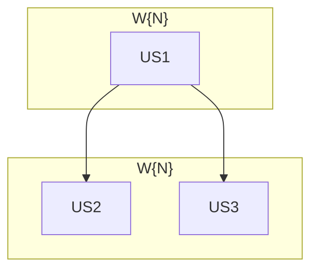

# Tasks index — <título corto del feature>

## Resumen ejecutivo

<2-3 párrafos. Cuántas HUs, organización en waves, decisiones clave absorbidas.>

## Estimación de esfuerzo

| Wave | HUs | Esfuerzo | Naturaleza |
|---|---|---|---|
| W{N} <nombre> | US{ids} | <X sesiones> | <naturaleza del trabajo> |

**Critical path**: <suma de waves no paralelizables — ej. "~4 sesiones standard">.

## DAG

## Tabla resumen

| # | HU | Fase del workflow | Wave | Estimate | TDD-mode | Decisión absorbida |
|---|---|---|---|---|---|---|
| US1 | <título> | <Fase N> | W{N} | S\|M\|L | optional | — |

## Cross-cutting decisions

> Solo si hay decisiones que afectan a >1 HU pero viven en una HU concreta. Omitir en caso contrario.

| Decisión | Dónde se toma | HUs afectadas | Criterio |
|---|---|---|---|
| <decisión> | US{N} | US{ids} | <criterio de decisión> |

## Open questions (deferidas a Fase 3)

1. <gap que no puede resolverse hasta implementar>

## Anti-patterns mitigation

> Solo si hay anti-patterns detectados en el diseño. Omitir en caso contrario.

| Anti-pattern | Cómo se evita |
|---|---|
| <anti-pattern> | <mitigación> |

## Próximo paso

<1-2 líneas: estado actual del index, qué se requiere para abrir Fase 3.>
