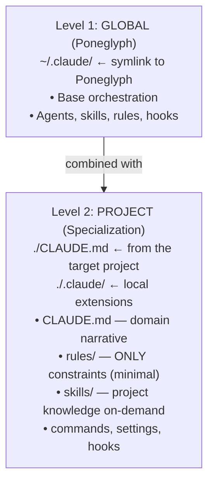

# Context Management

Rules for loading skills and context into agents. Avoid overloading agents with irrelevant context.

## Architecture Levels

Two-level config model: global (Poneglyph) + project (specialization). Claude Code combines both at spawn.

| Context | Modify | Where |
|---------|--------|-------|
| Base orchestration | Poneglyph | `D:\PYTHON\claude-code-poneglyph\` |
| Specialization | Target project | `./.claude/` of the project |

- **Poneglyph** = source of the orchestration (versioned in git)
- **~/.claude/** = symlink that propagates the base
- **Each project** = can have its own `CLAUDE.md` + `.claude/`
- **Claude Code** = loads and combines BOTH levels

### Project-level: Rules vs Skills

| Use a rule when | Use a skill when |
|---|---|
| Violation is blocking (constraint) | Content is guidance, not constraint |
| Must be in context every prompt | Only useful for specific tasks |
| Short (<500 tokens) | Any size (loads on-demand via Arch H) |
| e.g., module-boundaries, contract-first | e.g., naming-standards, function-design |

Project skills live at `./.claude/skills/` and use the same Arch H Read mechanism as global skills. The project's `skill-matching.md` rule provides the discovery layer.

## Skill Loading Limits

| Agent | Base Skills (free) | Max Additional | Total Max | Notes |
|-------|--------------------|----------------|-----------|-------|
| builder | anti-hallucination | 5 | 6 | Base is free, does not count against max |
| reviewer | code-quality, security-review, performance-review, anti-hallucination | 2 | 6 | Base skills are free |
| error-analyzer | diagnostic-patterns | 2 | 3 | + matched skills |
| architect | — | 4 | 4 | |
| planner | — | 2 | 2 | High-level only |
| scout | — | 1 | 1 | Minimal context |

## Precedence Rules

1. **Domain-specific skills > generic skills** — always prioritize specific ones
2. **Base skills do not count** against the agent's max limit
3. **If keyword matches > agent max**: prioritize by keyword frequency in the prompt
4. **If tied**: prefer skills from the task's primary domain

## Composition Rules

When multiple skills apply, respect synergies and conflicts:

1. **Synergy**: If two matched skills are a synergic pair (see `skill-matching.md`), both receive +1 priority
2. **Conflict**: If two skills are a conflicting pair, discard the one with the lower score
3. **Budget overflow**: If matches > agent max, sort by score and truncate
4. **Base skills**: do NOT count against the max limit (they are free)
5. **Frontmatter skills**: DO count against the agent's max limit

## Context Loading Methods

| Method | When | Example |
|--------|------|---------|
| Skill (via Skill tool) | Domain patterns, best practices | `security-review` |
| Scout agent | Codebase exploration, finding files | "Find all auth-related files" |
| Explore agent | Deep codebase analysis | "How does the auth system work?" |

## Agent Memory (Does Not Count Against Skill Limits)

Each agent has a persistent memory file at `.claude/agent-memory/{agent}/MEMORY.md`.

| Aspect | Detail |
|--------|--------|
| Loading | Lead injects when delegating (last ~3K tokens) |
| Cost against limits | **Does NOT count** against the agent's skill limits |
| Updates | Automatic via SubagentStop hook |
| Max size | 5K tokens (~20K chars) with FIFO pruning |

### Memory vs Skills vs Patterns

| Type | Maintained by | Content | Persistence |
|------|---------------|---------|-------------|
| Skills | Developer (manual) | Generic patterns and best practices | Static |
| Memory | Automatic hook + user | Agent insights about the codebase, user preferences, project context | Grows per session |
| Patterns | Automatic hook | Successful agent→agent sequences | Grows per session |

## Skill Propagation Model (Empirically Verified)

Ground-truth rules for how skill and context content reach subagents. Verified via direct testing over 2026-04-10 (including Test 7, which validated Arch H — Lead-Directed Skill Reads). **Do not confuse what the Lead loads with what a subagent sees — they are different contexts.**

### What reaches a subagent automatically at spawn

| Mechanism | Reaches subagent? | Notes |
|---|---|---|
| Rules from `.claude/rules/` (project + global) | **YES** | Auto-injected into the subagent's system prompt. This is the heaviest-lifting propagation mechanism — put routing, conventions, and stable domain patterns here. |
| `CLAUDE.md` (project + global) | **YES** | Both levels auto-propagate. |
| Frontmatter `skills:` in the agent definition | **YES** | Full `SKILL.md` bodies are pre-injected at spawn via `<command-message>` wrappers, unconditionally. All-or-nothing pre-load — cannot be varied per-task. |
| Baseline skills pre-declared per agent role (e.g., reviewer always gets `code-quality` + `anti-hallucination`) | **YES** | Arrive at spawn regardless of task. |
| Content pasted verbatim by the Lead into the delegation prompt (including `MEMORY.md` injection) | **YES** | Behaves like any other prompt content. |
| Subagent `Read`s `.claude/skills/<name>/SKILL.md` when instructed by the Lead in the delegation prompt (**Arch H**) | **YES** | **Validated via Test 7 on 2026-04-10** — subagent cites skill content verbatim in its work. This is the recommended task-specific loading mechanism. |
| Project skills Read via Arch H (`./.claude/skills/<name>/SKILL.md`) | **YES** | Same mechanism as global skills — the subagent Reads the file when the Lead includes Read instructions in the delegation prompt. Project's `skill-matching.md` rule provides the discovery layer. |

### What does NOT reach a subagent

| Mechanism | Why not |
|---|---|
| Lead invokes `Skill()` before delegating | Loaded content stays in the Lead's context. Subagents spawn fresh. |
| Subagent tries to call `Skill()` when `Skill` is not in its `tools:` allowlist | **The tool does not exist in the subagent's environment.** Default agents (`reviewer`, `builder`, `scout`, `error-analyzer`, etc.) do NOT have `Skill` in their tools list. A prompt that says *"First action: invoke `Skill('X')`"* is ceremonial and has no effect. Use Arch H (`Read .claude/skills/<name>/SKILL.md`) instead. |

### Consequences for orchestration

- **Rules + CLAUDE.md are the real context carriers.** Invest in them. A well-written project rule reaches every subagent automatically.
- **Prefer Lead-directed `Read`s (Arch H) over frontmatter `skills:` pre-injection** for task-specific skill loading. Arch H is flexible (choose skills per task), avoids the all-or-nothing pre-load problem, and works with every default agent because `Read` is always in the allowlist.
- **Frontmatter `skills:` is still useful** as a baseline for agents whose role always needs the same skills (e.g., reviewer's `code-quality`). For anything variable per task, use Arch H.
- **Project skills are a valid on-demand knowledge layer.** Use them for project-specific knowledge that doesn't need to be always-loaded. They work identically to global skills via Arch H Read — the subagent doesn't distinguish between global and project skills at Read time.
- **Rule of thumb at project level: constraint = rule, knowledge = skill.** If the content is guidance that's useful when relevant but doesn't need to be in every prompt, make it a skill. If violation would block merge, make it a rule.
- **Path-scoped loader quirk**: in `.claude/rules/paths/*.md`, globs starting with `**` require at least one leading path segment to match. A raw `apps/...` pattern will NOT match `apps/foo.py`; use `src/apps/...`, `backend/apps/...`, or prefix with `**/` explicitly.

### Content Map pattern (canonical for skills with subdirectories)

Any skill that has a subdirectory (`references/`, `examples/`, `templates/`, `scripts/`, `checklists/`, `integrations/`) **MUST** include a canonical "Content Map" table in its main `SKILL.md`. This is the single source of truth that tells subagents what each supporting file contains and when to read it.

**Canonical format — 3 columns**:

| Topic | File | Contents |
|---|---|---|
| <short topic name> | `${CLAUDE_SKILL_DIR}/<subdir>/<file>.md` | Semantic description of what the file contains + when it is useful. Phrase as a trigger: *"Read when…"* rather than *"contains…"* so the subagent can make a load decision based on task relevance. |

**Rules**:

1. **Use `${CLAUDE_SKILL_DIR}/` prefix** for all file paths — it is the Anthropic-official variable that resolves to the skill's own directory, making paths portable across machines and invocations.
2. **Contents column is load-bearing** — the subagent decides whether to Read each supporting file based on the semantic description here. A weak Contents cell leads to lazy reference-following and missed context. Rich Contents cells describing both *what* and *when* let subagents decide with criterion.
3. **3 columns, not 4** — keyword triggers (when useful) fold into the Contents prose naturally (*"Read when working with GenericForeignKey, ContentType hierarchy, or parent_type/parent_id fields"*). A separate Triggers column creates redundancy.
4. **Reference file frontmatter is minimal** (`parent`, `name`, `description`) — reference files are not loaded as standalone skills, so `type`, `version`, `activation`, `for_agents` are noise.
5. **Main SKILL.md stays ≤ 500 lines** per Anthropic official guidance. Content that doesn't fit belongs in references.
6. **Critical gotchas stay inline** in the main SKILL.md, not in references. Footguns with silent-failure semantics (e.g., `select_related('parent')` no-op on GenericFK) must be surfaced in the entry file because reviewers may not open references under generic task phrasings.

This pattern aligns with Anthropic's official guidance:

> *"Reference supporting files from SKILL.md so Claude knows what each file contains and when to load it."*
> — [code.claude.com/docs/en/skills](https://code.claude.com/docs/en/skills)

**Subagent behavior** (auto-loaded via this rule): when you Read a main SKILL.md that has a Content Map, consult the Contents column to judge which supporting files apply to your current task. Read the relevant ones. Do NOT read all blindly (defeats on-demand). Do NOT skip them when the Contents description matches your task even if task phrasing didn't explicitly mention the domain — semantic match is a valid trigger.

The Content Map pattern applies to project skills as well. A project skill at `./.claude/skills/naming-standards/SKILL.md` can have `references/` with project-specific examples, following the same 3-column canonical format.

The canonical template for this pattern lives in `.claude/skills/meta-create-skill/SKILL.md` (the split produced in Phase P7.8a). Reference it when creating new skills with subdirectories.

### Anti-claims (do not repeat)

1. *"Skill loaded by the Lead is automatically available to subagents."* — False. Lead context does not transit.
2. *"Subagents can invoke `Skill()` dynamically."* — False for default agents. True only if the agent has `Skill` explicitly in its `tools:` allowlist.
3. *"A prompt preamble instructing the subagent to invoke `Skill()` works."* — False. Use `Read .claude/skills/<name>/SKILL.md` instead (Arch H).

## Anti-Patterns

| Anti-Pattern | Problem | Alternative |
|--------------|---------|-------------|
| Loading >5 skills for a builder | Context overload, diluted responses | Prioritize top 5 by relevance |
| Loading generic skills when specific ones exist | Unnecessary noise | Domain-specific first |
| Using scout when you already know the paths | Waste of tokens/time | Direct Read or delegate to builder |
| Loading skills without a keyword match | Irrelevant context | Only load if keywords match |
| Counting base skills in the limit | Limits useful skills | Base skills are free |
