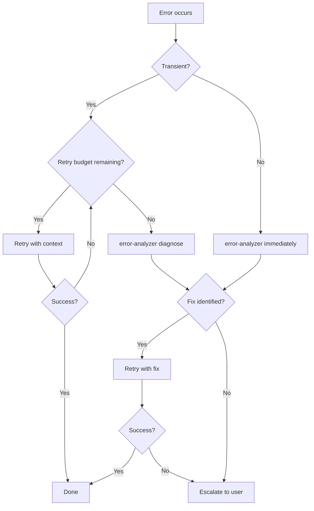

# Error Recovery

Guia de recuperacion cuando agentes fallan. Define retry budgets, escalacion y deteccion de bloqueo.

## Retry Budget

| Error Type | Max Retries | Backoff | Then |
|------------|-------------|---------|------|
| Builder test failure | 2 | None | error-analyzer → re-plan |
| Builder Edit conflict | 1 | Re-read file | error-analyzer |
| Agent timeout | 1 | Double timeout | Escalate to user |
| Reviewer BLOCKED | 0 | - | Re-plan with planner |
| Reviewer NEEDS_CHANGES | 2 | Apply feedback | Escalate to user |
| Worktree merge conflict | 1 | builder | Escalate to user |
| Teammate failure | 1 | Re-prompt with context | Extract domain → run as builder subagent |
| Teammate stuck (no progress) | 0 | - | Extract domain → run as builder subagent |
| Teammate file conflict | 0 | - | Lead resolves boundaries, re-assign |

## Escalation Decision Tree



## SendMessage Recovery (Preferred)

Desde v2.1.77, usar `SendMessage({to: agentId})` para continuar un agente fallido en vez de spawnar uno nuevo. Esto preserva todo el contexto del agente (archivos leídos, edits hechos) y ahorra ~2K-5K tokens de re-setup.

### Cuándo usar SendMessage vs Re-spawn

| Situación | Método | Razón |
|-----------|--------|-------|
| Builder falló test | SendMessage | El builder ya tiene contexto del código, solo necesita el error |
| Builder falló por stale edit | SendMessage | Re-leer el archivo y reintentar en el mismo contexto |
| Error-analyzer diagnosticó fix | SendMessage al builder original | Evita re-explorar el codebase |
| Builder falló 2+ veces | Re-spawn con diagnosis completa | Contexto original puede estar contaminado |
| Error en agente diferente al original | Re-spawn nuevo agente | SendMessage no cruza agentes |

### Ejemplo SendMessage Recovery

```
// Builder falló en test
SendMessage({
  to: "builder-a3f8c2",
  message: "Test failed: TypeError at auth.ts:23. Diagnosis: null check missing on user object. Fix: add guard clause before user.id access. Do NOT remove existing tests."
})
```

> **Nota**: SendMessage auto-resumes agentes detenidos en background.

## Recovery Prompt Template

Al reintentar (con re-spawn), incluir SIEMPRE en el prompt del builder:

| Campo | Contenido |
|-------|-----------|
| **Original error** | Mensaje de error completo |
| **Diagnosis** | Output de error-analyzer (si disponible) |
| **Do NOT repeat** | Accion especifica que causo el fallo |
| **Changed constraints** | Nuevos limites o contexto adicional |

Ejemplo:

```
Previous attempt failed: "TypeError: Cannot read property 'id' of undefined"
Diagnosis: Variable `user` is null when session expires.
Do NOT repeat: Do not access user.id without null check.
Changed constraints: Add guard clause before accessing user properties.
```

## Pattern-Based Recovery

Antes de reintentar, consultar la base de patrones de error (`~/.claude/error-patterns.jsonl`).

### Flujo con Patrones

| Paso | Accion |
|------|--------|
| 1 | Error ocurre → normalizar mensaje |
| 2 | Buscar match en patterns (exact > regex > fuzzy) |
| 3a | Match con >70% success rate → aplicar fix directo (skip error-analyzer) |
| 3b | Match con <70% success rate → error-analyzer + historial de fixes |
| 3c | Sin match → error-analyzer standard + registrar nuevo pattern |
| 4 | Registrar outcome (exito/fallo) para actualizar success rate |

### Recovery Prompt con Pattern

Cuando hay un match, incluir en el prompt del builder:

| Campo | Contenido |
|-------|-----------|
| **Known pattern** | Mensaje normalizado del pattern |
| **Category** | Clasificacion del error |
| **Best fix** | Fix con mayor success rate |
| **Success rate** | Porcentaje de exito historico |
| **Previous attempts** | Fixes que fallaron (para NO repetir) |

## Stuck Detection

| Condicion | Accion |
|-----------|--------|
| 3+ retries en misma tarea | STOP → AskUserQuestion |
| 2+ error-analyzer sin fix | STOP → AskUserQuestion |
| Mismo error exacto 2 veces | STOP → AskUserQuestion |

Cuando se detecta bloqueo, preguntar al usuario:

1. Contexto que puede faltar
2. Si el approach debe cambiar
3. Si la tarea debe dividirse

## Worktree Cleanup on Failure

| Condicion | Accion |
|-----------|--------|
| Builder en worktree falla | Preservar worktree, delegar a error-analyzer |
| Error-analyzer diagnostica fix | Reintentar builder en MISMO worktree |
| Retry falla | Eliminar worktree + branch, escalar al usuario |
| Merge conflict en worktree | Delegar a builder |
| builder falla en merge | Preservar worktree, escalar al usuario con diff |

## Team Mode Recovery

Recuperacion cuando teammates fallan en team mode. Ver `team-routing.md` para protocolo completo.

| Escenario | Accion |
|-----------|--------|
| Single teammate falla | Otros teammates continuan. Dominio fallido se reintenta como builder subagent. |
| Multiples teammates fallan | Abortar team mode. Fallback a ejecucion completa con subagents. |
| Conflicto de archivos entre teammates | Lead arbitra via reviewer. Dominio perdedor re-ejecuta con boundaries corregidos. |
| Env var ausente pero planner recomendo team | Fallback silencioso a subagents. Log warning al usuario. |
| Teammate sin progreso en task list | Considerar stuck despues de inactividad prolongada. Extraer dominio → builder subagent. |

## Proceso

1. Error ocurre en agente
2. Clasificar: transient vs structural
3. Consultar retry budget
4. Si budget disponible: reintentar con recovery prompt
5. Si budget agotado: error-analyzer → diagnosticar
6. Si fix identificado: reintentar con fix
7. Si no: escalar al usuario via AskUserQuestion
