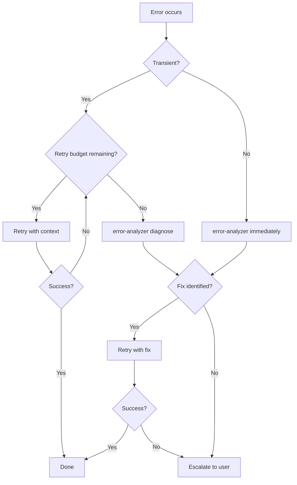

# Error Recovery

Recovery guide for when agents fail. Defines retry budgets, escalation, and stuck detection.

## Retry Budget

| Error Type | Max Retries | Backoff | Then |
|------------|-------------|---------|------|
| Builder test failure | 2 | None | error-analyzer → re-plan |
| Builder Edit conflict | 1 | Re-read file | error-analyzer |
| Agent timeout | 1 | Double timeout | Escalate to user |
| Reviewer BLOCKED | 0 | - | Re-plan with planner |
| Reviewer NEEDS_CHANGES | 2 | Apply feedback | Escalate to user |
| Worktree merge conflict | 1 | builder | Escalate to user |
| Teammate failure | 1 | Re-prompt with context | Extract domain → run as builder subagent |
| Teammate stuck (no progress) | 0 | - | Extract domain → run as builder subagent |
| Teammate file conflict | 0 | - | Lead resolves boundaries, re-assign |

## Escalation Decision Tree



## SendMessage Recovery (Preferred)

Since v2.1.77, use `SendMessage({to: agentId})` to continue a failed agent instead of spawning a new one. This preserves all agent context (files read, edits made) and saves ~2K-5K tokens of re-setup.

### When to use SendMessage vs Re-spawn

| Situation | Method | Reason |
|-----------|--------|--------|
| Builder failed test | SendMessage | Builder already has code context, only needs the error |
| Builder failed due to stale edit | SendMessage | Re-read the file and retry in the same context |
| Error-analyzer diagnosed a fix | SendMessage to original builder | Avoids re-exploring the codebase |
| Builder failed 2+ times | Re-spawn with full diagnosis | Original context may be contaminated |
| Error in a different agent than the original | Re-spawn new agent | SendMessage does not cross agents |

### SendMessage Recovery Example

```
// Builder failed on test
SendMessage({
  to: "builder-a3f8c2",
  message: "Test failed: TypeError at auth.ts:23. Diagnosis: null check missing on user object. Fix: add guard clause before user.id access. Do NOT remove existing tests."
})
```

> **Note**: SendMessage auto-resumes agents stopped in background.

## Recovery Prompt Template

When retrying (with re-spawn), ALWAYS include in the builder prompt:

| Field | Content |
|-------|---------|
| **Original error** | Full error message |
| **Diagnosis** | error-analyzer output (if available) |
| **Do NOT repeat** | Specific action that caused the failure |
| **Changed constraints** | New limits or additional context |

Example:

```
Previous attempt failed: "TypeError: Cannot read property 'id' of undefined"
Diagnosis: Variable `user` is null when session expires.
Do NOT repeat: Do not access user.id without null check.
Changed constraints: Add guard clause before accessing user properties.
```

## Pattern-Based Recovery

Before retrying, consult the error pattern database (`~/.claude/error-patterns.jsonl`).

### Flow with Patterns

| Step | Action |
|------|--------|
| 1 | Error occurs → normalize message |
| 2 | Search for match in patterns (exact > regex > fuzzy) |
| 3a | Match with >70% success rate → apply fix directly (skip error-analyzer) |
| 3b | Match with <70% success rate → error-analyzer + fix history |
| 3c | No match → standard error-analyzer + register new pattern |
| 4 | Record outcome (success/failure) to update success rate |

### Recovery Prompt with Pattern

When there is a match, include in the builder prompt:

| Field | Content |
|-------|---------|
| **Known pattern** | Normalized pattern message |
| **Category** | Error classification |
| **Best fix** | Fix with the highest success rate |
| **Success rate** | Historical success percentage |
| **Previous attempts** | Fixes that failed (do NOT repeat) |

## Stuck Detection

| Condition | Action |
|-----------|--------|
| 3+ retries on the same task | STOP → AskUserQuestion |
| 2+ error-analyzer runs without a fix | STOP → AskUserQuestion |
| Same exact error 2 times | STOP → AskUserQuestion |

When a block is detected, ask the user:

1. Context that may be missing
2. Whether the approach should change
3. Whether the task should be split

## Worktree Cleanup on Failure

| Condition | Action |
|-----------|--------|
| Builder in worktree fails | Preserve worktree, delegate to error-analyzer |
| Error-analyzer diagnoses a fix | Retry builder in the SAME worktree |
| Retry fails | Delete worktree + branch, escalate to user |
| Merge conflict in worktree | Delegate to builder |
| Builder fails on merge | Preserve worktree, escalate to user with diff |

## Team Mode Recovery

Recovery when teammates fail in team mode. See `team-routing.md` for the full protocol.

| Scenario | Action |
|----------|--------|
| Single teammate fails | Other teammates continue. Failed domain is retried as a builder subagent. |
| Multiple teammates fail | Abort team mode. Fallback to full subagent execution. |
| File conflict between teammates | Lead arbitrates via reviewer. Losing domain re-executes with corrected boundaries. |
| Env var missing but planner recommended team | Silent fallback to subagents. Log warning to user. |
| Teammate with no progress in task list | Consider stuck after prolonged inactivity. Extract domain → builder subagent. |

## Process

1. Error occurs in agent
2. Classify: transient vs structural
3. Check retry budget
4. If budget available: retry with recovery prompt
5. If budget exhausted: error-analyzer → diagnose
6. If fix identified: retry with fix
7. If not: escalate to user via AskUserQuestion
