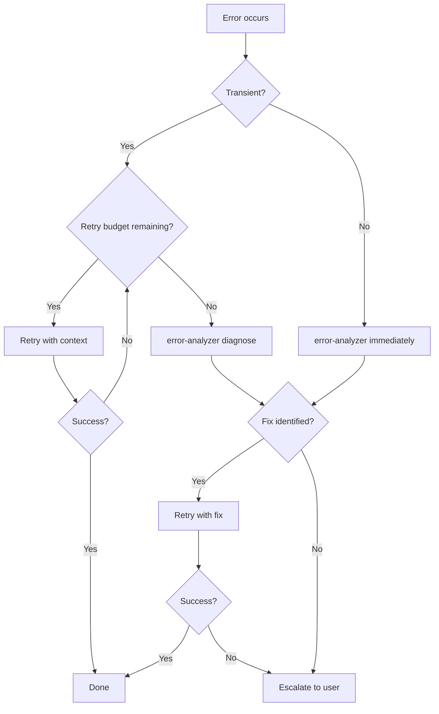

# Error Recovery

Guia de recuperacion cuando agentes fallan. Define retry budgets, escalacion y deteccion de bloqueo.

## Retry Budget

| Error Type | Max Retries | Backoff | Then |
|------------|-------------|---------|------|
| Builder test failure | 2 | None | error-analyzer → re-plan |
| Builder Edit conflict | 1 | Re-read file | error-analyzer |
| Agent timeout | 1 | Double timeout | Escalate to user |
| Reviewer BLOCKED | 0 | - | Re-plan with planner |
| Reviewer NEEDS_CHANGES | 2 | Apply feedback | Escalate to user |

## Escalation Decision Tree



## Recovery Prompt Template

Al reintentar, incluir SIEMPRE en el prompt del builder:

| Campo | Contenido |
|-------|-----------|
| **Original error** | Mensaje de error completo |
| **Diagnosis** | Output de error-analyzer (si disponible) |
| **Do NOT repeat** | Accion especifica que causo el fallo |
| **Changed constraints** | Nuevos limites o contexto adicional |

Ejemplo:

```
Previous attempt failed: "TypeError: Cannot read property 'id' of undefined"
Diagnosis: Variable `user` is null when session expires.
Do NOT repeat: Do not access user.id without null check.
Changed constraints: Add guard clause before accessing user properties.
```

## Stuck Detection

| Condicion | Accion |
|-----------|--------|
| 3+ retries en misma tarea | STOP → AskUserQuestion |
| 2+ error-analyzer sin fix | STOP → AskUserQuestion |
| Mismo error exacto 2 veces | STOP → AskUserQuestion |

Cuando se detecta bloqueo, preguntar al usuario:

1. Contexto que puede faltar
2. Si el approach debe cambiar
3. Si la tarea debe dividirse

## Proceso

1. Error ocurre en agente
2. Clasificar: transient vs structural
3. Consultar retry budget
4. Si budget disponible: reintentar con recovery prompt
5. Si budget agotado: error-analyzer → diagnosticar
6. Si fix identificado: reintentar con fix
7. Si no: escalar al usuario via AskUserQuestion
