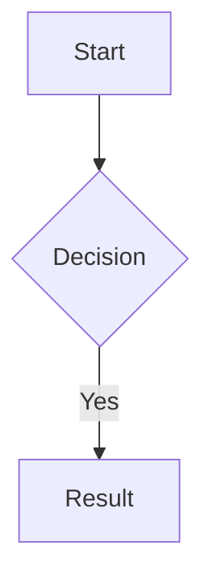
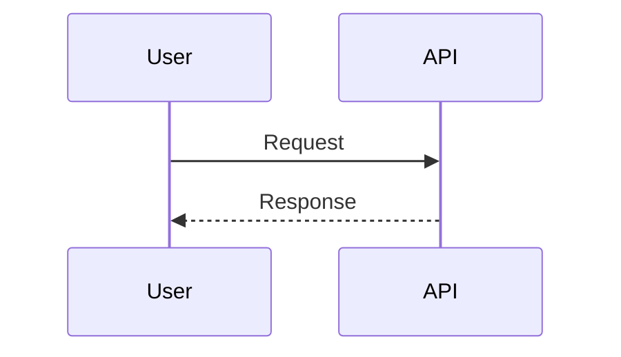

# Formatting

## Usar siempre

| Formato | Cuando |
|---------|--------|
| Tables | Comparaciones, datos estructurados, listas >3 |
| Headers | Secciones `##`, subsecciones `###` |
| Code blocks | Con syntax highlight (`typescript`, `bash`) |
| Bold | Terminos clave, archivos |
| Mermaid | Arquitectura, flujos, deps, secuencias |

## NO usar

| Evitar | Alternativa |
|--------|-------------|
| ASCII boxes `┌─┐│└┘` | Mermaid o tables |
| Espacios para alinear | Tables |
| Emoji excesivo | Solo status indicators |

## Mermaid ejemplos

## Code blocks

Siempre especificar lenguaje. Inline code para: paths, funciones, variables, comandos.
