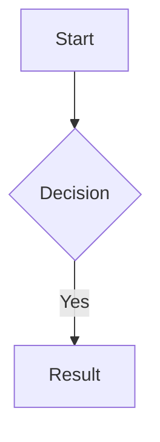
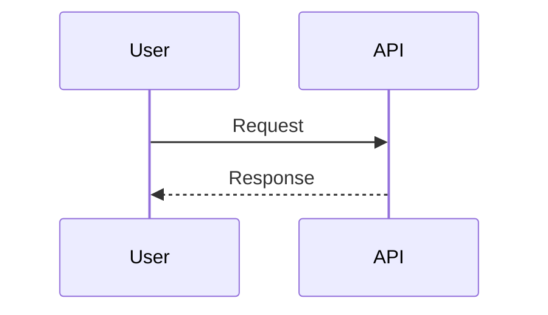

<!-- Last verified: 2026-04-25 -->

# Formatting

## Always use

| Format | When |
|--------|------|
| Tables | Comparisons, structured data, lists >3 |
| Headers | Sections `##`, subsections `###` |
| Code blocks | With syntax highlight (`typescript`, `bash`) |
| Bold | Key terms, files |
| Mermaid | Architecture, flows, deps, sequences |

## Do NOT use

| Avoid | Alternative |
|-------|-------------|
| ASCII boxes `┌─┐│└┘` | Mermaid or tables |
| Spaces for alignment | Tables |
| Excessive emoji | Status indicators only (see Status Icons below) |

## Status Icons

Use these icons when reporting state of tasks, agents, waves, pipelines or background work. Status only — never decoration. One icon per item; do not stack.

| Icon | Meaning | When to use |
|---|---|---|
| ⏳ | `in_progress` — running | Agent/task is actively executing |
| ⏸️ | `pending` / waiting on dependency | Queued or blocked waiting for prior step |
| ✅ | `completed` / success | Finished and validated |
| 🚫 | `blocked` — external constraint | Permissions, missing input, env limitation |
| ❌ | `failed` / error | Finished but did not succeed |
| ⚠️ | `warning` / partial success | Done with caveats, needs attention |
| 🔄 | `retrying` / iterating | Re-running after failure or refinement |

**Where to use**:
- TaskList / TaskUpdate status summaries in prose
- Wave / batch delegation outcomes
- End-of-turn status reports with multiple parallel agents

**Where NOT to use**:
- Regular prose answers, headings, code comments
- As replacement for verbs in normal sentences
- Decorative emphasis (use **bold** instead)

## Mermaid examples

```mermaid
graph TD
  A[Start] --> B{Decision}
  B -->|Yes| C[Result]
```

```mermaid
sequenceDiagram
  User->>API: Request
  API-->>User: Response
```

## Code blocks

Always specify language. Inline code for: paths, functions, variables, commands.
