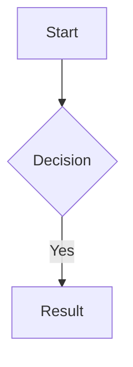
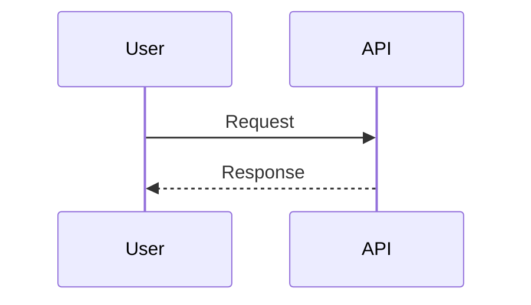

<!-- Last verified: 2026-04-25 -->

# Formatting

## Always use

| Format | When |
|--------|------|
| Tables | Comparisons, structured data, lists >3 |
| Headers | Sections `##`, subsections `###` |
| Code blocks | With syntax highlight (`typescript`, `bash`) |
| Bold | Key terms, files |
| Mermaid | Architecture, flows, deps, sequences |

## Do NOT use

| Avoid | Alternative |
|-------|-------------|
| ASCII boxes `┌─┐│└┘` | Mermaid or tables |
| Spaces for alignment | Tables |
| Excessive emoji | Status indicators only |

## Mermaid examples

```mermaid
graph TD
  A[Start] --> B{Decision}
  B -->|Yes| C[Result]
```

```mermaid
sequenceDiagram
  User->>API: Request
  API-->>User: Response
```

## Code blocks

Always specify language. Inline code for: paths, functions, variables, commands.
