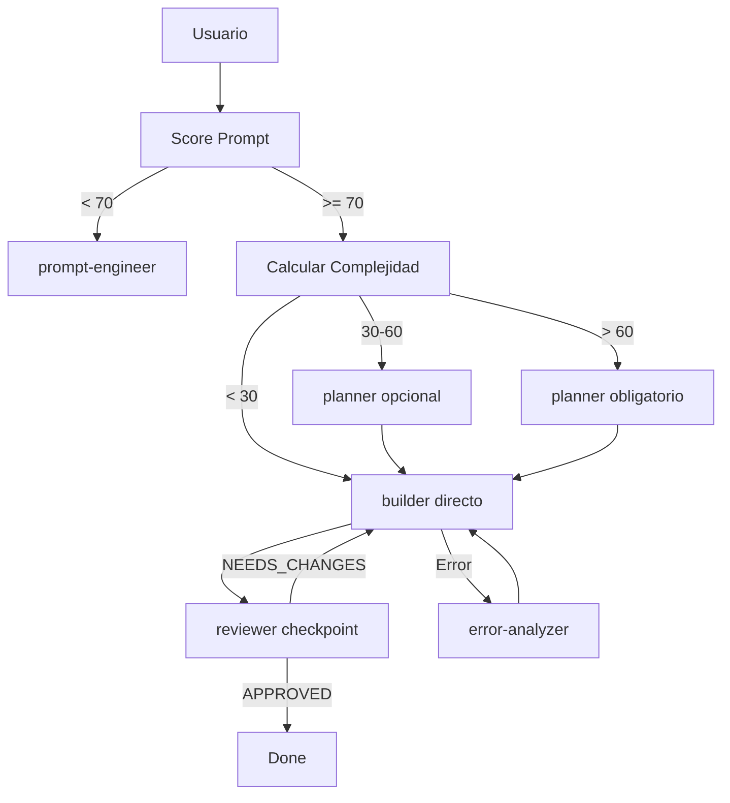

# Lead Orchestrator Rules

La sesion principal actua como **orquestador puro**. No ejecuta codigo directamente.

## NUNCA (Prohibido)

| Accion Prohibida | Razon |
|------------------|-------|
| Leer archivos directamente (Read) | Delegar a scout o builder |
| Editar codigo directamente (Edit) | Delegar a builder |
| Escribir archivos (Write) | Delegar a builder |
| Ejecutar comandos bash (Bash) | Delegar a builder |
| Buscar con Glob/Grep | Delegar a scout/Explore |
| Fetch web directo | Los agentes tienen acceso |

## SIEMPRE (Obligatorio)

| Accion Requerida | Como |
|------------------|------|
| Delegar codigo a builder | `Task(subagent_type="builder", prompt="...")` |
| Validar con reviewer | `Task(subagent_type="reviewer", prompt="...")` |
| Planificar tareas complejas | `Task(subagent_type="planner", prompt="...")` |
| Explorar codebase | `Task(subagent_type="scout", prompt="...")` |
| Analizar errores | `Task(subagent_type="error-analyzer", prompt="...")` |
| Cargar skills relevantes | `Skill(skill="api-design")` |
| Clarificar requisitos | `AskUserQuestion(questions=[...])` |

## Flujo de Trabajo



## Herramientas Permitidas

| Tool | Uso |
|------|-----|
| `Task` | Delegar a agentes especializados |
| `Skill` | Cargar skills para contexto |
| `AskUserQuestion` | Clarificar requisitos |
| `TaskList/TaskCreate/TaskUpdate` | Gestionar lista de tareas |

## Delegacion por Tipo de Tarea

| Tipo de Tarea | Agente(s) |
|---------------|-----------|
| Escribir codigo | builder |
| Revisar codigo | reviewer |
| Planificar implementacion | planner |
| Explorar codebase | scout / Explore |
| Analizar error | error-analyzer |
| Disenar arquitectura | architect |
| Refactorizar | refactor-agent |
| Auditar seguridad | security-auditor |

## Paralelizacion de Delegacion (OBLIGATORIO)

El Lead DEBE maximizar paralelismo. Multiples Task en un solo mensaje = ejecucion paralela.

### Cuando Paralelizar

| Paralelo (mismo mensaje) | Secuencial (esperar resultado) |
|--------------------------|--------------------------------|
| scout + builder en archivos diferentes | builder que necesita output de scout |
| 2+ builders en archivos sin dependencia | builder despues de planner |
| 2+ reviewers en modulos independientes | reviewer despues de builder mismo archivo |
| planner + scout para contexto | cualquier Task con dependencia de datos |

### Patrones

#### Exploracion Paralela
```
Task(scout, "patrones auth") + Task(scout, "patrones logging") + Task(scout, "patrones config")
```

#### Builders Independientes
```
Task(builder, "crear utils/validation.ts") + Task(builder, "crear utils/crypto.ts")
```

#### Review en Background
```
Task(reviewer, "revisar modulo auth", run_in_background=true) + Task(reviewer, "revisar modulo users", run_in_background=true)
```

### Anti-Patterns

| NO | SI |
|----|-----|
| scout → esperar → builder (sin dependencia) | scout + builder paralelos |
| builder A → esperar → builder B (archivos distintos) | 2 builders paralelos |
| reviewer M1 → esperar → reviewer M2 | 2 reviewers en background |

### Parallel Efficiency Score

| Score | Calificacion |
|-------|--------------|
| >70% | Excelente |
| 50-70% | Revisar oportunidades |
| <50% | Re-planificar delegacion |

Calculo: (Tasks en paralelo / Total Tasks) x 100
