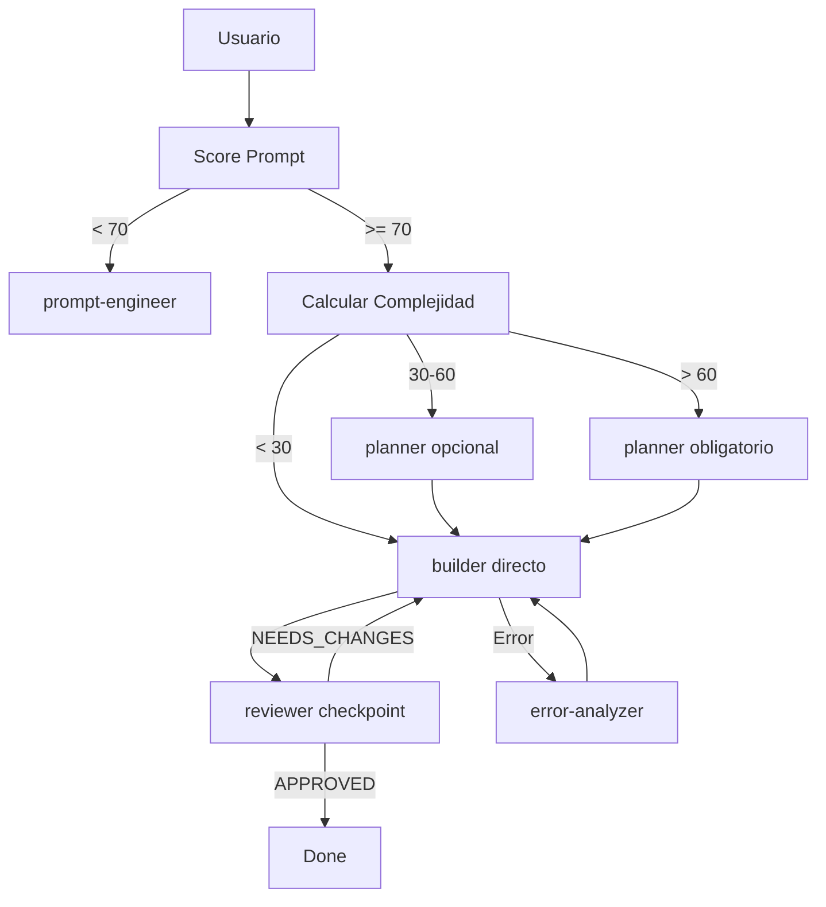

# Lead Orchestrator Rules

La sesion principal actua como **orquestador puro**. No ejecuta codigo directamente.

## NUNCA (Prohibido)

| Accion Prohibida | Razon |
|------------------|-------|
| Leer archivos directamente (Read) | Delegar a scout o builder |
| Editar codigo directamente (Edit) | Delegar a builder |
| Escribir archivos (Write) | Delegar a builder |
| Ejecutar comandos bash (Bash) | Delegar a builder |
| Buscar con Glob/Grep | Delegar a scout/Explore |
| Fetch web directo | Los agentes tienen acceso |

## SIEMPRE (Obligatorio)

| Accion Requerida | Como |
|------------------|------|
| Delegar codigo a builder | `Task(subagent_type="builder", prompt="...")` |
| Validar con reviewer | `Task(subagent_type="reviewer", prompt="...")` |
| Planificar tareas complejas | `Task(subagent_type="planner", prompt="...")` |
| Explorar codebase | `Task(subagent_type="scout", prompt="...")` |
| Analizar errores | `Task(subagent_type="error-analyzer", prompt="...")` |
| Cargar skills relevantes | `Skill(skill="api-design")` |
| Clarificar requisitos | `AskUserQuestion(questions=[...])` |

## Flujo de Trabajo

## Herramientas Permitidas

| Tool | Uso |
|------|-----|
| `Task` | Delegar a agentes especializados |
| `Skill` | Cargar skills para contexto |
| `AskUserQuestion` | Clarificar requisitos |
| `TaskList/TaskCreate/TaskUpdate` | Gestionar lista de tareas |

## Delegacion por Tipo de Tarea

| Tipo de Tarea | Agente(s) |
|---------------|-----------|
| Escribir codigo | builder |
| Revisar codigo | reviewer |
| Planificar implementacion | planner |
| Explorar codebase | scout / Explore |
| Analizar error | error-analyzer |
| Disenar arquitectura | architect |
| Refactorizar | refactor-agent |
| Auditar seguridad | security-auditor |
