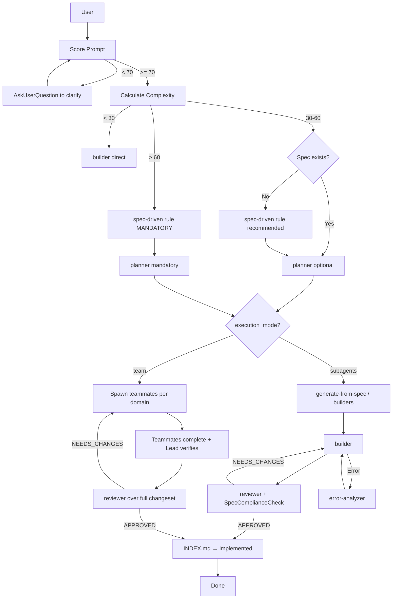
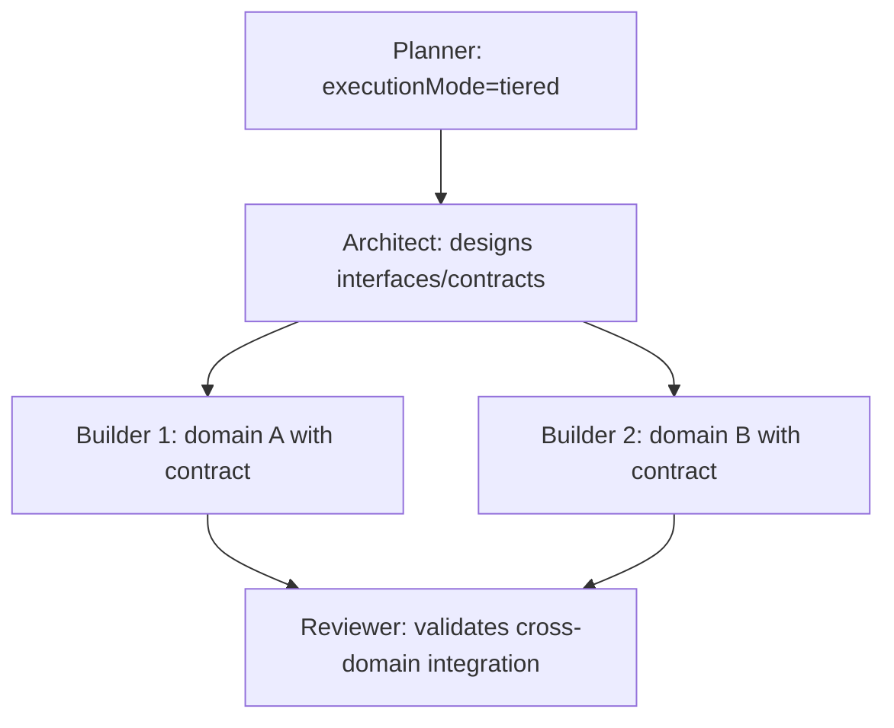
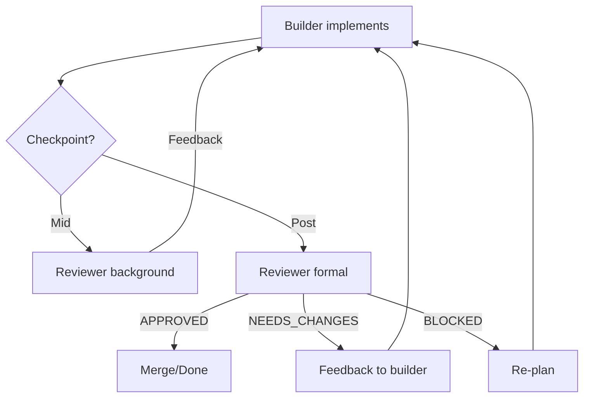

# Lead Orchestrator Rules

The main session acts as a **pure orchestrator**. It does not execute code directly.

## NEVER (Prohibited)

| Prohibited Action | Reason |
|------------------|-------|
| Read files directly (Read) | Delegate to scout or builder |
| Edit code directly (Edit) | Delegate to builder |
| Write files (Write) | Delegate to builder |
| Execute bash commands (Bash) | Delegate to builder |
| Search with Glob/Grep | Delegate to scout/Explore |
| Direct web fetch | Agents have access |

## ALWAYS (Required)

| Required Action | How |
|------------------|------|
| Delegate code to builder | `Task(subagent_type="builder", prompt="...")` |
| Validate with reviewer | `Task(subagent_type="reviewer", prompt="...")` |
| Plan complex tasks | `Task(subagent_type="planner", prompt="...")` |
| Explore codebase | `Task(subagent_type="scout", prompt="...")` |
| Analyze errors | `Task(subagent_type="error-analyzer", prompt="...")` |
| Load relevant skills | `Skill(skill="...")` (only global skills available) |
| Clarify requirements | `AskUserQuestion(questions=[...])` |
| Trigger spec workflow | If complexity >= 30 and no spec exists: follow spec-driven rule (auto-loaded at `.claude/rules/spec-driven.md`) |

## Workflow


```mermaid
graph TD
    U[User] --> S[Score Prompt]
    S -->|< 70| AUQ[AskUserQuestion to clarify]
    AUQ --> S
    S -->|>= 70| C[Calculate Complexity]
    C -->|< 30| B[builder direct]
    C -->|30-60| SP1{Spec exists?}
    C -->|> 60| SP2[spec-driven rule MANDATORY]
    SP1 -->|Yes| P1[planner optional]
    SP1 -->|No| SG1[spec-driven rule recommended]
    SG1 --> P1
    SP2 --> P2[planner mandatory]
    P1 & P2 --> MD{execution_mode?}
    MD -->|subagents| IS[generate-from-spec / builders]
    MD -->|team| TM[Spawn teammates per domain]
    IS --> B2[builder]
    TM --> TV[Teammates complete + Lead verifies]
    TV --> R2[reviewer over full changeset]
    B2 --> R[reviewer + SpecComplianceCheck]
    R -->|APPROVED| IX[INDEX.md → implemented]
    R2 -->|APPROVED| IX
    IX --> D[Done]
    R -->|NEEDS_CHANGES| B2
    R2 -->|NEEDS_CHANGES| TM
    B2 -->|Error| EA[error-analyzer]
    EA --> B2
```

## Allowed Tools

| Tool | Usage |
|------|-----|
| `Task` | Delegate to specialized agents |
| `Skill` | Load skills for context |
| `AskUserQuestion` | Clarify requirements |
| `TaskList/TaskCreate/TaskUpdate` | Manage task list |

## Expertise Injection When Delegating

When delegating to any agent, the Lead MUST include the agent's accumulated expertise in the prompt:

| Step | Action |
|------|--------|
| 1 | Read `.claude/agent-memory/{agent}/EXPERTISE.md` |
| 2 | Include last ~3K tokens in the agent's prompt |
| 3 | Prefix: `[ACCUMULATED EXPERTISE]\n{content}` |
| 4 | If the file does not exist or is empty, omit |

### Delegation Template with Expertise

```
[ACCUMULATED EXPERTISE - {agent}]
{content of EXPERTISE.md, last 3K tokens}

[TASK]
{task instructions}

[EXPERTISE OUTPUT]
When finished, include "### Expertise Insights" with 1-5 reusable insights discovered during this task.
```

> **Note**: The reminder in the delegation prompt is NECESSARY. The instruction in the agent's system prompt (section "Expertise Persistence") is at line 400+ and agents do not follow it consistently. The explicit reminder in the delegation prompt guarantees that insights are produced.

> Expertise is read-only context. The agent uses it to inform decisions but does NOT repeat it in its output.
> Expertise is updated automatically via the SubagentStop hook — the Lead does not need to manage it.

## Worktree Isolation

Activate `isolation: "worktree"` in the Agent tool to isolate parallel work.

### Routing Rules

| Condition | Use Worktree | Priority |
|-----------|--------------|-----------|
| 2+ builders delegated in parallel | Yes (each gets its own worktree) | High |
| Experimental/risk task flagged by planner | Yes | High |
| Reviewer needs a clean diff | Yes (builder in worktree) | Medium |
| Single builder, known files, no overlap | No | Low |
| Unknown target files (no planner output) | Yes (safe default) | Medium |

### Merge Strategy

| Scenario | Strategy | Agent |
|-----------|-----------|--------|
| Clean fast-forward | Auto-merge via builder | builder |
| Merge without conflicts | `git merge --no-ff` via builder | builder |
| Conflicts detected | Delegate to builder | builder |
| builder fails on merge (confidence <50%) | Escalate to user | AskUserQuestion |
| Builder with no changes | Skip merge, cleanup | Automatic |

### Cleanup Policy

| Condition | Action | Timing |
|-----------|--------|--------|
| Worktree merged OK | Delete worktree + branch | Immediate |
| Builder with no changes | Delete worktree + branch | Immediate |
| Builder failed | Preserve for 1 retry | Post error-analyzer |
| Retry also failed | Delete + escalate | Post escalation |
| Session ends with unmerged worktrees | Log warning, preserve | End of session |

### Naming Convention

| Component | Format | Example |
|-----------|---------|---------|
| Branch | `wt/<agent>/<task-hash>` | `wt/builder/a3f8c2` |
| Directory | `.worktrees/<agent>-<task-hash>` | `.worktrees/builder-a3f8c2` |

## Team Agent Execution (Experimental)

When the planner recommends `executionMode: team`, the Lead spawns independent teammates per domain. See `team-routing.md` for the full protocol.

### Prerequisites

| Requirement | Verification |
|-----------|-------------|
| Env var active | `CLAUDE_CODE_EXPERIMENTAL_AGENT_TEAMS=1` in settings.json |
| Planner recommends team | `executionMode: team` in roadmap output |
| If env var absent | Silent fallback to subagents, log warning |

### Teammate Prompt Template

Each teammate receives:

| Field | Content |
|-------|-----------|
| **Domain** | "Your domain is [X]. You only touch files in [paths]." |
| **Tasks** | Roadmap subtasks assigned to this domain |
| **Interfaces** | Contracts to expose/consume with other domains |
| **Constraint** | "DO NOT modify files outside your domain" |
| **Coordination** | "Use task list to coordinate with other teammates" |

### Monitoring

- Lead reviews task list for teammate progress
- Do not intervene unless a teammate is stuck (no progress in task list)
- After all teammates complete: Lead runs reviewer over the full changeset

### Fallback

| Condition | Action |
|-----------|--------|
| Teammate fails 2x | Extract domain tasks → run as builder subagent |
| Multiple teammates fail | Abort team mode → full fallback to subagents |
| File conflict between teammates | Lead arbitrates via reviewer, losing domain re-executes |

## Tiered Execution Mode

Intermediate execution mode between subagents and team. Uses architect as intermediary to design interfaces before parallel builders start.

### When to Use

| Criterion | Threshold |
|----------|-----------|
| Complexity | 45-60 |
| Domains | 2-3 with shared interfaces |
| Independence | Domains are NOT independent (share types/APIs/contracts) |
| Planner output | `executionMode: "tiered"` |

### Difference vs Other Modes

| Aspect | subagents | tiered | team |
|---------|-----------|--------|------|
| When | Default | 2-3 domains with interfaces | 3+ independent domains |
| Intermediary | None | architect (mandatory) | None (peer-to-peer) |
| Cost | 1x | ~2x | 3-7x |
| Contracts | Implicit in roadmap | Explicit by architect | Negotiated between teammates |

### Tiered Workflow


```mermaid
graph TD
    P[Planner: executionMode=tiered] --> A[Architect: designs interfaces/contracts]
    A --> B1[Builder 1: domain A with contract]
    A --> B2[Builder 2: domain B with contract]
    B1 & B2 --> R[Reviewer: validates cross-domain integration]
```

1. Planner generates roadmap with `executionMode: "tiered"`
2. Lead delegates to **architect**: "Design the interface contracts between domains X and Y"
3. Architect returns: shared types, API signatures, data contracts
4. Lead delegates to **builders in parallel**: each receives its domain + architect's contracts
5. Lead delegates to **reviewer**: validates that cross-domain integration meets the contracts

### When NOT to Use

- Complexity < 45 → subagents (architect overhead not worth it)
- Independent domains without interfaces → subagents or team
- Complexity > 60 with 3+ independent domains → team mode

## Continuous Validation Pipeline

Continuous validation during implementation. The Lead supervises quality checkpoints.

### Validation Checkpoints

| Checkpoint | Trigger | Agent | Action if Fails |
|-----------|---------|--------|-----------------|
| Pre-implementation | Before delegating to builder | planner | Re-plan with constraints |
| Mid-implementation | Builder reports partial progress | reviewer (background) | Early feedback to builder |
| Post-implementation | Builder completes task | reviewer | NEEDS_CHANGES → re-delegate |
| Pre-merge | Worktree ready to merge | reviewer | Block merge if fails |
| Post-merge | After successful merge | reviewer (background) | Rollback if tests fail |

### Validation Feedback Loop


```mermaid
graph TD
    B[Builder implements] --> V1{Checkpoint?}
    V1 -->|Mid| R1[Reviewer background]
    R1 -->|Feedback| B
    V1 -->|Post| R2[Reviewer formal]
    R2 -->|APPROVED| M[Merge/Done]
    R2 -->|NEEDS_CHANGES| FB[Feedback to builder]
    FB --> B
    R2 -->|BLOCKED| P[Re-plan]
    P --> B
```

### Validation by Change Type

| Change Type | Required Validations |
|----------------|------------------------|
| Single file, low complexity | Post-implementation reviewer |
| Multi-file, same domain | Post-implementation reviewer |
| Multi-file, cross-domain | Mid-checkpoint + Post reviewer |
| Security-related | Pre + Post reviewer (security-review skill, model: opus) |
| Infrastructure/config | Pre + Post reviewer + manual approval |

### Feedback Template

When sending reviewer feedback to builder, include:

| Field | Content |
|-------|-----------|
| **Status** | APPROVED / NEEDS_CHANGES / BLOCKED |
| **Issues found** | List of specific problems |
| **Suggested fixes** | Concrete actions to resolve |
| **Files affected** | Files that need changes |
| **Priority** | Critical / Major / Minor |

## Model Selection

Optimize costs by selecting the appropriate model per agent and task.

### Selection Rules

| Rule | Condition | Model |
|-------|-----------|--------|
| Default | Any agent without a specific rule | sonnet |
| High-stakes | Architecture, complex planning | opus |
| Read-only | Scout exploring codebase | haiku/sonnet |
| Budget mode | User requests cost optimization | Downgrade one level |

### Application

The Lead does NOT control the model directly (Claude Code manages it), but CAN:

1. Indicate the expected complexity in the Task prompt
2. Suggest the user change the model with `/model` if budget requires it
3. Parallelize with cheaper agents (scout with haiku) for read tasks

## Delegation by Task Type

| Task Type | Agent(s) |
|---------------|-----------|
| Write code | builder |
| Refactor code | builder + code-quality skill |
| Review code | reviewer |
| Security audit | reviewer + security-review skill |
| Plan implementation | planner |
| Explore codebase | scout / Explore |
| Analyze error | error-analyzer |
| Design architecture | architect |
| Resolve merge conflicts | builder |
| Document bugs | builder + diagnostic-patterns |
| Sync docs | builder |
| Multi-domain parallel implementation | teammates (team mode) or parallel builders (subagents) |

## Delegation Parallelization (MANDATORY)

The Lead MUST maximize parallelism. Multiple Tasks in a single message = parallel execution.

### When to Parallelize

| Parallel (same message) | Sequential (wait for result) |
|--------------------------|--------------------------------|
| scout + builder on different files | builder that needs scout output |
| 2+ builders on files without dependency | builder after planner |
| 2+ reviewers on independent modules | reviewer after builder on same file |
| planner + scout for context | any Task with data dependency |

### Patterns

#### Parallel Exploration
```
Task(scout, "auth patterns") + Task(scout, "logging patterns") + Task(scout, "config patterns")
```

#### Independent Builders
```
Task(builder, "create utils/validation.ts") + Task(builder, "create utils/crypto.ts")
```

#### Review in Background
```
Task(reviewer, "review auth module", run_in_background=true) + Task(reviewer, "review users module", run_in_background=true)
```

### Anti-Patterns

| NO | YES |
|----|-----|
| scout → wait → builder (no dependency) | scout + builder in parallel |
| builder A → wait → builder B (different files) | 2 builders in parallel |
| reviewer M1 → wait → reviewer M2 | 2 reviewers in background |

### When to use `run_in_background=true`

| Use | Do not use |
|------|---------|
| reviewer that does not block next step | builder that produces files needed for next Task |
| exploratory scout when builder can start with known files | planner whose roadmap is needed before delegating |
| audit reviewer in parallel with next feature | error-analyzer whose diagnosis determines next action |

> For tool batching (Read, Glob, Grep) and Parallel Efficiency Score, see `performance.md`.
