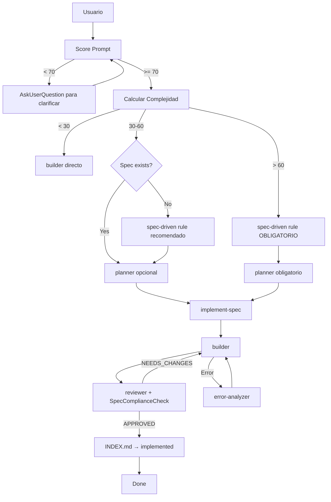
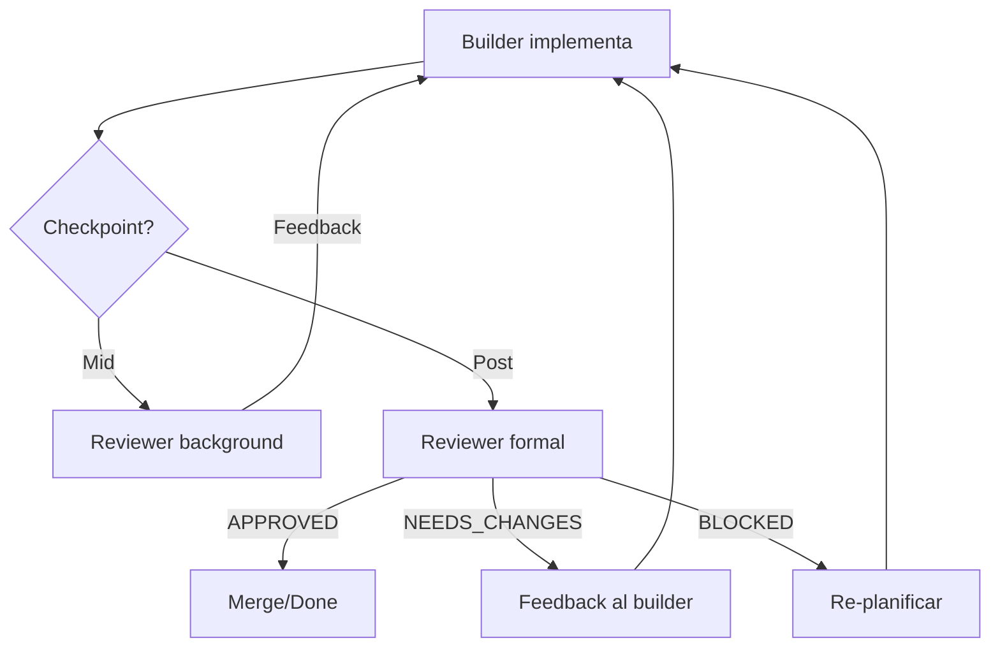

# Lead Orchestrator Rules

La sesion principal actua como **orquestador puro**. No ejecuta codigo directamente.

## NUNCA (Prohibido)

| Accion Prohibida | Razon |
|------------------|-------|
| Leer archivos directamente (Read) | Delegar a scout o builder |
| Editar codigo directamente (Edit) | Delegar a builder |
| Escribir archivos (Write) | Delegar a builder |
| Ejecutar comandos bash (Bash) | Delegar a builder |
| Buscar con Glob/Grep | Delegar a scout/Explore |
| Fetch web directo | Los agentes tienen acceso |

## SIEMPRE (Obligatorio)

| Accion Requerida | Como |
|------------------|------|
| Delegar codigo a builder | `Task(subagent_type="builder", prompt="...")` |
| Validar con reviewer | `Task(subagent_type="reviewer", prompt="...")` |
| Planificar tareas complejas | `Task(subagent_type="planner", prompt="...")` |
| Explorar codebase | `Task(subagent_type="scout", prompt="...")` |
| Analizar errores | `Task(subagent_type="error-analyzer", prompt="...")` |
| Cargar skills relevantes | `Skill(skill="...")` (solo skills globales disponibles) |
| Clarificar requisitos | `AskUserQuestion(questions=[...])` |
| Trigger spec workflow | Si complexity >= 30 y no hay spec: seguir regla spec-driven (auto-loaded en `.claude/rules/spec-driven.md`) |

## Flujo de Trabajo


```mermaid
graph TD
    U[Usuario] --> S[Score Prompt]
    S -->|< 70| AUQ[AskUserQuestion para clarificar]
    AUQ --> S
    S -->|>= 70| C[Calcular Complejidad]
    C -->|< 30| B[builder directo]
    C -->|30-60| SP1{Spec exists?}
    C -->|> 60| SP2[spec-driven rule OBLIGATORIO]
    SP1 -->|Yes| P1[planner opcional]
    SP1 -->|No| SG1[spec-driven rule recomendado]
    SG1 --> P1
    SP2 --> P2[planner obligatorio]
    P1 & P2 --> IS[implement-spec]
    IS --> B2[builder]
    B2 --> R[reviewer + SpecComplianceCheck]
    R -->|APPROVED| IX[INDEX.md → implemented]
    IX --> D[Done]
    R -->|NEEDS_CHANGES| B2
    B2 -->|Error| EA[error-analyzer]
    EA --> B2
```

## Herramientas Permitidas

| Tool | Uso |
|------|-----|
| `Task` | Delegar a agentes especializados |
| `Skill` | Cargar skills para contexto |
| `AskUserQuestion` | Clarificar requisitos |
| `TaskList/TaskCreate/TaskUpdate` | Gestionar lista de tareas |

## Worktree Isolation

Activar `isolation: "worktree"` en el Agent tool para aislar trabajo paralelo.

### Routing Rules

| Condicion | Usar Worktree | Prioridad |
|-----------|--------------|-----------|
| 2+ builders delegados en paralelo | Si (cada uno su worktree) | Alta |
| Tarea experimental/riesgo marcada por planner | Si | Alta |
| Reviewer necesita diff limpio | Si (builder en worktree) | Media |
| Single builder, archivos conocidos, sin overlap | No | Baja |
| Archivos target desconocidos (sin planner output) | Si (default seguro) | Media |

### Merge Strategy

| Escenario | Estrategia | Agente |
|-----------|-----------|--------|
| Fast-forward limpio | Auto-merge via builder | builder |
| Merge sin conflictos | `git merge --no-ff` via builder | builder |
| Conflictos detectados | Delegar a builder | builder |
| builder falla en merge (confidence <50%) | Escalar al usuario | AskUserQuestion |
| Builder sin cambios | Skip merge, cleanup | Automatico |

### Cleanup Policy

| Condicion | Accion | Timing |
|-----------|--------|--------|
| Worktree merged OK | Eliminar worktree + branch | Inmediato |
| Builder sin cambios | Eliminar worktree + branch | Inmediato |
| Builder fallo | Preservar para 1 retry | Post error-analyzer |
| Retry tambien fallo | Eliminar + escalar | Post escalacion |
| Session termina con worktrees no-merged | Log warning, preservar | Fin de session |

### Naming Convention

| Componente | Formato | Ejemplo |
|-----------|---------|---------|
| Branch | `wt/<agent>/<task-hash>` | `wt/builder/a3f8c2` |
| Directorio | `.worktrees/<agent>-<task-hash>` | `.worktrees/builder-a3f8c2` |

## Continuous Validation Pipeline

Validacion continua durante implementacion. El Lead supervisa checkpoints de calidad.

### Validation Checkpoints

| Checkpoint | Trigger | Agente | Accion si Falla |
|-----------|---------|--------|-----------------|
| Pre-implementation | Antes de delegar a builder | planner | Re-planificar con restricciones |
| Mid-implementation | Builder reporta progreso parcial | reviewer (background) | Feedback temprano al builder |
| Post-implementation | Builder completa tarea | reviewer | NEEDS_CHANGES → re-delegar |
| Pre-merge | Worktree listo para merge | reviewer | Bloquear merge si falla |
| Post-merge | Despues de merge exitoso | reviewer (background) | Rollback si tests fallan |

### Validation Feedback Loop


```mermaid
graph TD
    B[Builder implementa] --> V1{Checkpoint?}
    V1 -->|Mid| R1[Reviewer background]
    R1 -->|Feedback| B
    V1 -->|Post| R2[Reviewer formal]
    R2 -->|APPROVED| M[Merge/Done]
    R2 -->|NEEDS_CHANGES| FB[Feedback al builder]
    FB --> B
    R2 -->|BLOCKED| P[Re-planificar]
    P --> B
```

### Validacion por Tipo de Cambio

| Tipo de Cambio | Validaciones Requeridas |
|----------------|------------------------|
| Single file, low complexity | Post-implementation reviewer |
| Multi-file, same domain | Post-implementation reviewer |
| Multi-file, cross-domain | Mid-checkpoint + Post reviewer |
| Security-related | Pre + Post reviewer (security-review skill, model: opus) |
| Infrastructure/config | Pre + Post reviewer + manual approval |

### Feedback Template

Al enviar feedback de reviewer a builder, incluir:

| Campo | Contenido |
|-------|-----------|
| **Status** | APPROVED / NEEDS_CHANGES / BLOCKED |
| **Issues found** | Lista de problemas especificos |
| **Suggested fixes** | Acciones concretas para resolver |
| **Files affected** | Archivos que necesitan cambios |
| **Priority** | Critical / Major / Minor |

## Model Selection

Optimizar costos seleccionando modelo apropiado por agente y tarea.

### Reglas de Seleccion

| Regla | Condicion | Modelo |
|-------|-----------|--------|
| Default | Cualquier agente sin regla especifica | sonnet |
| High-stakes | Arquitectura, planificacion compleja | opus |
| Read-only | Scout explorando codebase | haiku/sonnet |
| Budget mode | Usuario solicita optimizar costos | Downgrade un nivel |

### Aplicacion

El Lead NO controla el modelo directamente (Claude Code lo gestiona), pero SI puede:

1. Indicar en el prompt del Task la complejidad esperada
2. Sugerir al usuario cambiar modelo con `/model` si el budget lo requiere
3. Paralelizar con agents mas baratos (scout con haiku) para tareas de lectura

## Delegacion por Tipo de Tarea

| Tipo de Tarea | Agente(s) |
|---------------|-----------|
| Escribir codigo | builder |
| Refactorizar codigo | builder + code-quality skill |
| Revisar codigo | reviewer |
| Auditar seguridad | reviewer + security-review skill |
| Planificar implementacion | planner |
| Explorar codebase | scout / Explore |
| Analizar error | error-analyzer |
| Disenar arquitectura | architect |
| Resolver merge conflicts | builder |
| Documentar bugs | builder + diagnostic-patterns |
| Sincronizar docs | builder |

## Paralelizacion de Delegacion (OBLIGATORIO)

El Lead DEBE maximizar paralelismo. Multiples Task en un solo mensaje = ejecucion paralela.

### Cuando Paralelizar

| Paralelo (mismo mensaje) | Secuencial (esperar resultado) |
|--------------------------|--------------------------------|
| scout + builder en archivos diferentes | builder que necesita output de scout |
| 2+ builders en archivos sin dependencia | builder despues de planner |
| 2+ reviewers en modulos independientes | reviewer despues de builder mismo archivo |
| planner + scout para contexto | cualquier Task con dependencia de datos |

### Patrones

#### Exploracion Paralela
```
Task(scout, "patrones auth") + Task(scout, "patrones logging") + Task(scout, "patrones config")
```

#### Builders Independientes
```
Task(builder, "crear utils/validation.ts") + Task(builder, "crear utils/crypto.ts")
```

#### Review en Background
```
Task(reviewer, "revisar modulo auth", run_in_background=true) + Task(reviewer, "revisar modulo users", run_in_background=true)
```

### Anti-Patterns

| NO | SI |
|----|-----|
| scout → esperar → builder (sin dependencia) | scout + builder paralelos |
| builder A → esperar → builder B (archivos distintos) | 2 builders paralelos |
| reviewer M1 → esperar → reviewer M2 | 2 reviewers en background |

### Cuando usar `run_in_background=true`

| Usar | No usar |
|------|---------|
| reviewer que no bloquea siguiente paso | builder que produce archivos necesarios para siguiente Task |
| scout exploratorio cuando builder puede empezar con archivos conocidos | planner cuyo roadmap se necesita antes de delegar |
| reviewer audit en paralelo con siguiente feature | error-analyzer cuyo diagnostico determina siguiente accion |

> Para batching de herramientas (Read, Glob, Grep) y Parallel Efficiency Score, ver `performance.md`.
