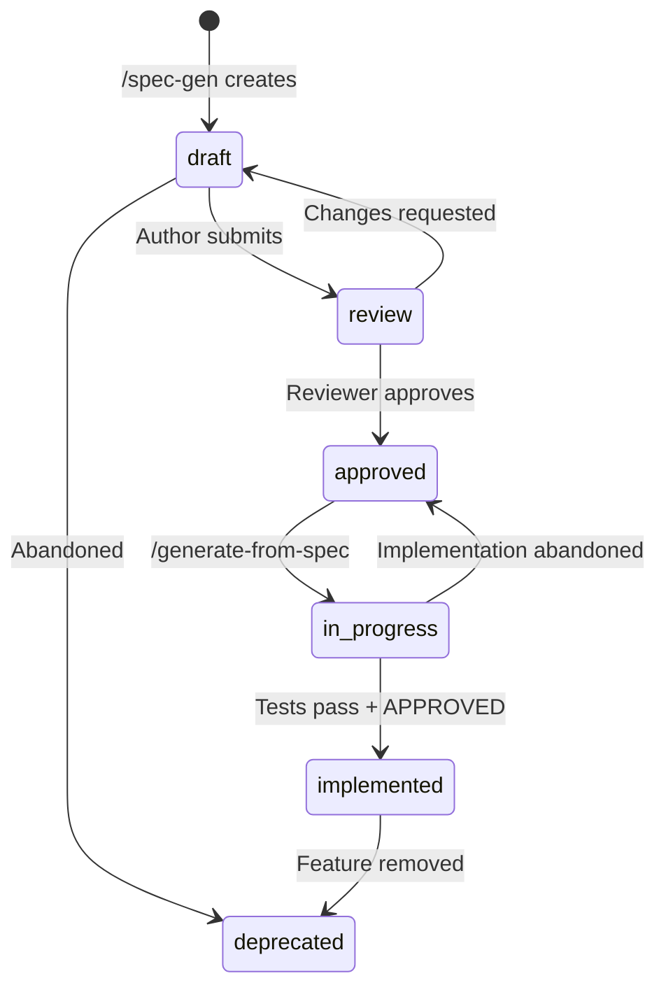
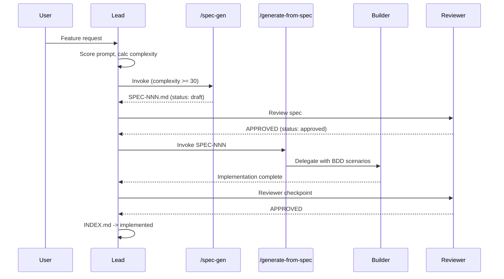

# Spec-Driven Development

Rule for the canonical SDD cycle: Intent -> Spec -> Plan -> Execute -> Validate. Every non-trivial feature (complexity >= 30) must be backed by a formal specification with BDD acceptance criteria.

## SDD Cycle

```mermaid
graph TD
    U[User Request] --> S[Score Prompt]
    S --> C[Calculate Complexity]
    C -->|< 30| B[Builder directo]
    C -->|>= 30| SP{Spec exists?}
    SP -->|Yes approved| IS[/generate-from-spec]
    SP -->|Yes draft| RV[Review spec first]
    SP -->|No| SG[/spec-gen]
    SG --> RV
    RV --> IS
    IS --> BLD[Builder implements with BDD]
    BLD --> CV[SpecComplianceCheck]
    CV -->|>= 70| R[Reviewer checkpoint]
    CV -->|< 70| FB[Feedback -> builder]
    R -->|APPROVED| IX[INDEX.md -> implemented]
    R -->|NEEDS_CHANGES| FB
    FB --> BLD
    IX --> Done
```

## When to Trigger

| Condition | Action |
|-----------|--------|
| Complexity < 30 | Skip SDD, builder directo |
| Complexity >= 30, no spec exists | Invoke `/spec-gen` before implementation |
| Complexity >= 30, spec exists and approved | Invoke `/generate-from-spec` |
| Complexity >= 30, spec exists but draft/review | Review spec first, do NOT implement |
| Complexity >= 30, spec deprecated | Create new spec with `/spec-gen` |
| Complexity borderline (25-35) | Lead decides; if uncertain, create spec |

## Spec Lifecycle State Machine

### States

| State | Description |
|-------|-------------|
| draft | Spec created, not yet reviewed |
| review | Submitted for review |
| approved | Reviewed and approved, ready for implementation |
| in_progress | Implementation started |
| implemented | All BDD tests pass + reviewer APPROVED |
| deprecated | Feature removed or spec obsolete |

### Valid Transitions

| From | To | Who Triggers | Condition |
|------|----|-------------|-----------|
| draft | review | Lead / User | All 10 sections present |
| draft | deprecated | User | Spec abandoned |
| review | approved | Reviewer | overallCompliance >= 70, BDD >= 5 scenarios |
| review | draft | Reviewer | Requests changes |
| review | deprecated | User | Spec abandoned |
| approved | in_progress | Lead | `/generate-from-spec` invoked |
| approved | deprecated | User | Feature removed |
| in_progress | implemented | Lead | All BDD tests pass + reviewer APPROVED |
| in_progress | approved | Lead | Implementation abandoned, spec still valid |
| in_progress | deprecated | User | Feature removed |
| implemented | deprecated | User | Feature removed |

### State Diagram



## Quality Gates

| Phase | Gate | Threshold | Blocking |
|-------|------|-----------|----------|
| Draft | All 10 sections present | Required | Yes |
| Draft | Research confidence not "low" | Required | Yes |
| Review -> Approved | overallCompliance >= 70 | Required | Yes |
| Review -> Approved | BDD scenarios >= 5 | Required | Yes |
| In Progress | SpecComplianceCheck advisory | Informational | No |
| In Progress -> Implemented | All BDD tests pass | Required | Yes |
| In Progress -> Implemented | Reviewer APPROVED | Required | Yes |

## SpecComplianceCheck Scoring

### Component Weights

| Component | Weight | What It Measures |
|-----------|--------|-----------------|
| Section presence | 40% | All 10 sections (0-9) exist and are non-empty |
| Section quality | 20% | Sections have substantive content (not placeholder) |
| BDD completeness | 20% | Scenarios have Given/When/Then, >= 5 scenarios |
| Sources present | 10% | Section 8 has >= 3 sources with URLs |
| Research confidence | 10% | Frontmatter confidence is "high" or "medium" |

### Score Interpretation

| Score | Meaning | Action |
|-------|---------|--------|
| 90-100 | Excellent | Auto-approve, proceed to implementation |
| 70-89 | Acceptable | Reviewer approves with minor feedback |
| 50-69 | Needs work | Reviewer requests changes, return to draft |
| < 50 | Incomplete | Block: significant sections missing |

### Per-Section Scoring

| Section | Name | Presence (4pts) | Quality (2pts) |
|---------|------|-----------------|----------------|
| 0 | Research Summary | Sources listed | >= 5 sources, confidence stated |
| 1 | Vision | Press release exists | Background + metrics defined |
| 2 | Goals & Non-Goals | Both subsections | >= 3 goals, >= 2 non-goals |
| 3 | Alternatives Considered | Table exists | >= 2 alternatives with pros/cons |
| 4 | Design | Architecture diagram | Interfaces + edge cases |
| 5 | FAQ | Q&A pairs | >= 3 questions with sourced answers |
| 6 | Acceptance Criteria | BDD scenarios | >= 5 scenarios, all with Given/When/Then |
| 7 | Open Questions | Table exists | Questions have proposed resolutions |
| 8 | Sources | Source table | >= 3 sources with URLs |
| 9 | Next Steps | Task table | Tasks have complexity estimates |

## Integration with Commands

| Command | Role in SDD | When |
|---------|------------|------|
| `/spec-gen` | Creates spec with 10 sections + research | Complexity >= 30, no spec exists |
| `/generate-from-spec` | Implements from spec with BDD | Spec status = approved |

### Command Flow



## Spec File Conventions

| Aspect | Convention |
|--------|-----------|
| Location | `.specs/vX.Y/SPEC-NNN-slug.md` |
| Frontmatter | HTML comment with status, priority, confidence, depends_on, enables |
| Section numbering | 0-9, matching SpecComplianceCheck |
| BDD format | Gherkin: Feature / Scenario / Given / When / Then |
| INDEX.md | Central registry with status, links, dependency graph |

## Lead Checklist

1. Calculate complexity score for user request
2. If >= 30: check if spec exists in `.specs/`
3. If no spec: invoke `/spec-gen` to create one
4. Review spec: ensure overallCompliance >= 70
5. Invoke `/generate-from-spec SPEC-NNN`
6. After builder completes: reviewer validates (incl. SpecComplianceCheck)
7. If APPROVED: update INDEX.md status -> implemented
8. If NEEDS_CHANGES: feedback loop to builder

## Edge Cases

| Edge Case | Handling |
|-----------|---------|
| Spec modified during implementation | Invalidate SpecComplianceCheck, notify builder |
| Feature requires changes to existing spec | Create new version, do not edit implemented specs |
| Complexity borderline (25-35) | Lead decides; if uncertain, create spec |
| Spec without BDD scenarios | SpecComplianceCheck fails section 6 |
| Implementation diverges from spec | Reviewer flags spec_drift issue |
| Spec has "low" research confidence | Block: cannot move to review until confidence raised |
