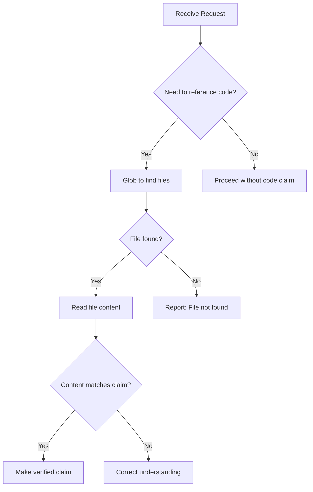

# Anti-Hallucination Patterns

Validation patterns to ensure claims are based on verified facts.

## When to Use

- Before claiming a file exists
- Before claiming a function exists
- Before making assertions about code behavior
- When confidence is uncertain
- Before suggesting code modifications

## Core Principle

> **Never assume. Always verify.**

Every claim about the codebase must be backed by tool output.

## File Existence Validation

### Before Claiming File Exists

```
❌ NEVER: "The file src/utils/helper.ts contains..."
✅ ALWAYS: Use Glob first, then Read
```

**Validation Pattern:**

```typescript
// Step 1: Verify existence
const files = await Glob({ pattern: "src/utils/helper.ts" })

// Step 2: Only if found, read content
if (files.length > 0) {
  const content = await Read({ file_path: files[0] })
  // Now safe to make claims about content
}
```

### Before Creating New File

```typescript
// Step 1: Check if already exists
const existing = await Glob({ pattern: "src/services/newService.ts" })

if (existing.length > 0) {
  // File exists - read and modify
} else {
  // Safe to create new file
}
```

## Function/Symbol Validation

### Before Claiming Function Exists

```
❌ NEVER: "The calculateTotal function in order.ts..."
✅ ALWAYS: Use Grep or Read first
```

**Validation Pattern:**

```typescript
// Option 1: Grep for function definition
const results = await Grep({
  pattern: "function calculateTotal|const calculateTotal",
  path: "src/",
  output_mode: "content"
})

// Option 2: Read file and verify
const content = await Read({ file_path: "src/order.ts" })
if (content.includes("calculateTotal")) {
  // Safe to reference function
}
```

### Before Suggesting Import

```typescript
// Step 1: Verify export exists
const exported = await Grep({
  pattern: "export (function|const|class) targetSymbol",
  path: "src/utils/"
})

// Only suggest import if export found
if (exported.matches > 0) {
  // "You can import targetSymbol from utils"
}
```

## Confidence Levels

### When to Ask vs Assert

| Confidence | Action | Phrasing |
|------------|--------|----------|
| **High** (Tool verified) | Assert | "The file contains..." |
| **Medium** (Partial info) | Hedge | "Based on X, it appears..." |
| **Low** (Uncertain) | Ask | "Could you confirm if..." |
| **None** (No data) | Investigate | "Let me check..." |

### Confidence Assessment

```typescript
interface ClaimValidation {
  claim: string
  confidence: 'high' | 'medium' | 'low' | 'none'
  evidence: string[]
  verification_needed: boolean
}

function assessConfidence(claim: string): ClaimValidation {
  // High: Direct tool output supports claim
  // Medium: Related data but not exact match
  // Low: Inference from context
  // None: No supporting data
}
```

## Validation Checklist

### Before Any Code Claim

- [ ] Used Glob to verify file exists
- [ ] Used Read to verify content
- [ ] Used Grep to find specific patterns
- [ ] Confidence level is HIGH before asserting

### Before Suggesting Changes

- [ ] Read the current file content
- [ ] Identified exact line numbers
- [ ] Verified surrounding context
- [ ] Checked for dependencies

### Before Referencing External Resources

- [ ] Used WebSearch to verify existence
- [ ] Checked documentation is current (2024-2025)
- [ ] Verified API/syntax hasn't changed

## Common Hallucination Patterns

### File Path Guessing

```
❌ "Edit src/components/Button/index.tsx"
   (Assuming path structure)

✅ First: Glob("**/Button*.tsx")
   Then: Reference actual found path
```

### Function Signature Guessing

```
❌ "The function takes (name: string, age: number)"
   (Assuming parameters)

✅ First: Read the file
   Then: Quote actual signature
```

### Import Path Guessing

```
❌ "Import from '@/utils/helpers'"
   (Assuming alias exists)

✅ First: Check tsconfig.json for paths
   Then: Verify file exists at resolved path
```

### API Endpoint Guessing

```
❌ "Call POST /api/users/create"
   (Assuming endpoint)

✅ First: Grep for route definitions
   Then: Reference actual endpoint
```

## Verification Tools Priority

| Need | Primary Tool | Fallback |
|------|--------------|----------|
| File exists? | Glob | Bash ls |
| File content? | Read | - |
| Symbol exists? | Grep | Read + search |
| Pattern location? | Grep | Read |
| Type definition? | Grep | Read |

## Output Format for Uncertain Claims

When confidence is not HIGH:

```markdown
## Observation (Unverified)

⚠️ **Confidence: Medium**

Based on the project structure, I believe X might be in Y.

**To verify:**
1. Check if file exists: `Glob("pattern")`
2. Read content: `Read("path")`

Would you like me to verify this?
```

## Anti-Hallucination Rules

### DO

- ✅ Verify file existence before referencing
- ✅ Read file content before claiming
- ✅ Quote exact code from Read output
- ✅ Use line numbers from actual output
- ✅ Say "Let me check" when uncertain
- ✅ Ask for clarification if needed

### DON'T

- ❌ Assume file paths or structure
- ❌ Guess function signatures
- ❌ Invent import paths
- ❌ Fabricate API endpoints
- ❌ Make up package names
- ❌ Claim existence without verification

## Integration with Workflow



---

**Version**: 1.0.0
**Spec**: SPEC-018
**For**: builder, reviewer, error-analyzer agents
