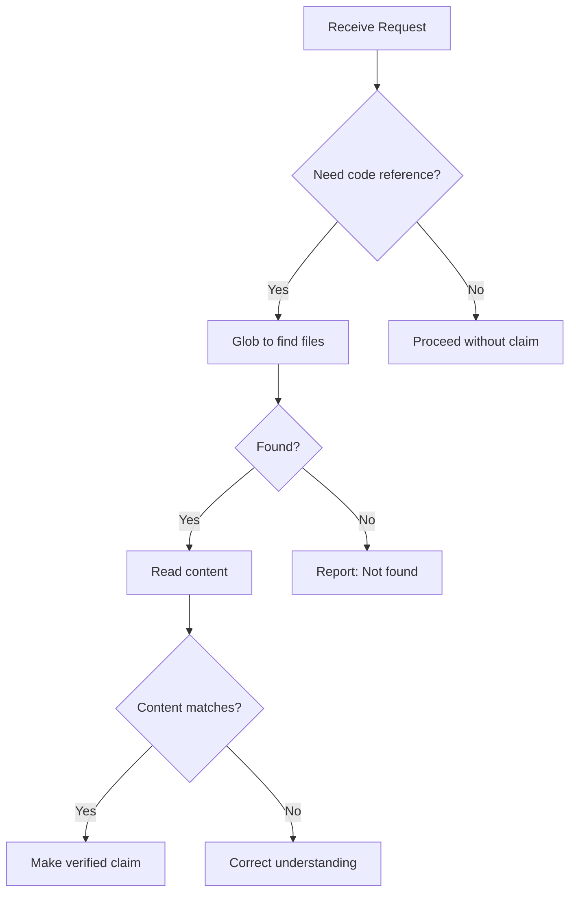

# Anti-Hallucination Patterns

Validation patterns to ensure claims are based on verified facts, not assumptions.

## When to Use

| Situation | Action Required |
|-----------|-----------------|
| Claiming a file exists | Glob first |
| Claiming a function exists | Grep or Read first |
| Suggesting code changes | Read file first |
| Referencing API endpoints | Grep route definitions |
| Suggesting imports | Verify export exists |
| Confidence < 70% | Ask, don't assert |

## Core Rules

> **Never assume. Always verify.**

| Rule | Tool | Example |
|------|------|---------|
| File exists? | `Glob` | `Glob("**/helper.ts")` |
| Symbol exists? | `Grep` | `Grep("function calculateTotal")` |
| Content matches? | `Read` | Read then quote |
| Type signature? | `LSP hover` | Get exact params |

## Quick Reference

### Confidence Levels

| Level | Evidence | Phrasing |
|-------|----------|----------|
| **High** | Tool output verified | "The file contains..." |
| **Medium** | Partial/related data | "Based on X, it appears..." |
| **Low** | Inference only | "Could you confirm if..." |
| **None** | No data | "Let me check..." |

### Verification Tools Priority

| Need | Primary | Fallback |
|------|---------|----------|
| File exists? | Glob | Bash ls |
| Symbol exists? | LSP/Grep | Read + search |
| Content? | Read | - |
| Type info? | LSP hover | Grep |

## Validation Patterns

### Before Claiming File Exists

```typescript
// Step 1: Verify existence
const files = await Glob({ pattern: "src/utils/helper.ts" })

// Step 2: Only if found, read content
if (files.length > 0) {
  const content = await Read({ file_path: files[0] })
  // Now safe to make claims
}
```

### Before Claiming Function Exists

```typescript
// Option 1: Grep for definition
const results = await Grep({
  pattern: "function calculateTotal|const calculateTotal",
  path: "src/",
  output_mode: "content"
})

// Option 2: Read and verify
const content = await Read({ file_path: "src/order.ts" })
if (content.includes("calculateTotal")) {
  // Safe to reference
}
```

### Before Suggesting Import

```typescript
// Verify export exists
const exported = await Grep({
  pattern: "export (function|const|class) targetSymbol",
  path: "src/utils/"
})

// Only suggest if found
if (exported.matches > 0) {
  // "You can import targetSymbol from utils"
}
```

## Common Hallucination Patterns

| Pattern | Problem | Solution |
|---------|---------|----------|
| Path guessing | `src/components/Button/index.tsx` | `Glob("**/Button*.tsx")` first |
| Signature guessing | Assuming `(name: string, age: number)` | Read file, quote actual |
| Import guessing | `@/utils/helpers` | Check tsconfig.json paths |
| Endpoint guessing | `POST /api/users/create` | Grep route definitions |

## Examples

### Bad (Hallucination Risk)

```
"The file src/utils/helper.ts contains a function called formatDate..."
```

### Good (Verified)

```
Let me verify that file exists.
[Glob("src/utils/helper.ts")]
Found: src/utils/helper.ts
[Read("src/utils/helper.ts")]
The file contains formatDate at line 45: `export function formatDate(date: Date): string`
```

## Checklist

### Before Any Code Claim

- [ ] Used Glob to verify file exists
- [ ] Used Read to verify content
- [ ] Used Grep/LSP to find specific patterns
- [ ] Confidence level is HIGH before asserting

### Before Suggesting Changes

- [ ] Read the current file content
- [ ] Identified exact line numbers
- [ ] Verified surrounding context
- [ ] Checked for dependencies

### Before Referencing External

- [ ] Used WebSearch to verify existence
- [ ] Checked documentation is current (2024-2025)
- [ ] Verified API/syntax hasn't changed

## Integration Flow



---

**Version**: 1.0.0
**Spec**: SPEC-018
