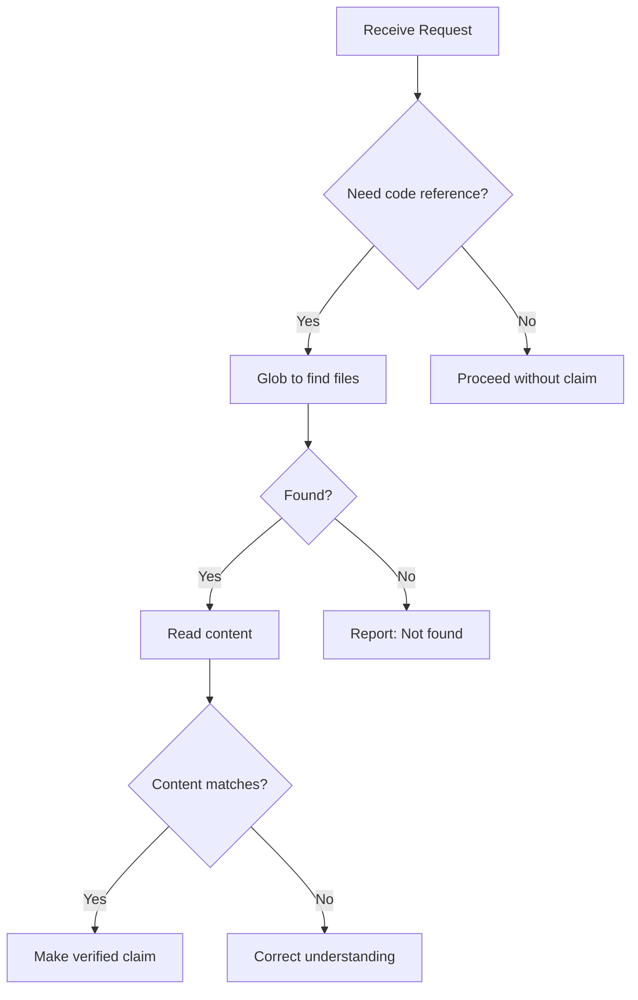

# Anti-Hallucination Patterns

Validation patterns to ensure claims are based on verified facts, not assumptions.

## When to Use

| Situation | Action Required |
|-----------|-----------------|
| Claiming a file exists | Glob first |
| Claiming a function exists | Grep or Read first |
| Suggesting code changes | Read file first |
| Referencing API endpoints | Grep route definitions |
| Suggesting imports | Verify export exists |
| Confidence < 70% | Ask, don't assert |

## Core Rules

> **Never assume. Always verify.**

| Rule | Tool | Example |
|------|------|---------|
| File exists? | `Glob` | `Glob("**/helper.ts")` |
| Symbol exists? | `Grep` | `Grep("function calculateTotal")` |
| Content matches? | `Read` | Read then quote |
| Type signature? | `LSP hover` | Get exact params |

## Quick Reference

### Confidence Levels

| Level | Evidence | Phrasing |
|-------|----------|----------|
| **High** | Tool output verified | "The file contains..." |
| **Medium** | Partial/related data | "Based on X, it appears..." |
| **Low** | Inference only | "Could you confirm if..." |
| **None** | No data | "Let me check..." |

### Verification Tools Priority

| Need | Primary | Fallback |
|------|---------|----------|
| File exists? | Glob | Bash ls |
| Symbol exists? | LSP/Grep | Read + search |
| Content? | Read | - |
| Type info? | LSP hover | Grep |

## Validation Patterns

### Before Claiming File Exists

```typescript
// Step 1: Verify existence
const files = await Glob({ pattern: "src/utils/helper.ts" })

// Step 2: Only if found, read content
if (files.length > 0) {
  const content = await Read({ file_path: files[0] })
  // Now safe to make claims
}
```

### Before Claiming Function Exists

```typescript
// Option 1: Grep for definition
const results = await Grep({
  pattern: "function calculateTotal|const calculateTotal",
  path: "src/",
  output_mode: "content"
})

// Option 2: Read and verify
const content = await Read({ file_path: "src/order.ts" })
if (content.includes("calculateTotal")) {
  // Safe to reference
}
```

### Before Suggesting Import

```typescript
// Verify export exists
const exported = await Grep({
  pattern: "export (function|const|class) targetSymbol",
  path: "src/utils/"
})

// Only suggest if found
if (exported.matches > 0) {
  // "You can import targetSymbol from utils"
}
```

## Common Hallucination Patterns

| Pattern | Problem | Solution |
|---------|---------|----------|
| Path guessing | `src/components/Button/index.tsx` | `Glob("**/Button*.tsx")` first |
| Signature guessing | Assuming `(name: string, age: number)` | Read file, quote actual |
| Import guessing | `@/utils/helpers` | Check tsconfig.json paths |
| Endpoint guessing | `POST /api/users/create` | Grep route definitions |

## Examples

### Bad (Hallucination Risk)

```
"The file src/utils/helper.ts contains a function called formatDate..."
```

### Good (Verified)

```
Let me verify that file exists.
[Glob("src/utils/helper.ts")]
Found: src/utils/helper.ts
[Read("src/utils/helper.ts")]
The file contains formatDate at line 45: `export function formatDate(date: Date): string`
```

## Checklist

### Before Any Code Claim

- [ ] Used Glob to verify file exists
- [ ] Used Read to verify content
- [ ] Used Grep/LSP to find specific patterns
- [ ] Confidence level is HIGH before asserting

### Before Suggesting Changes

- [ ] Read the current file content
- [ ] Identified exact line numbers
- [ ] Verified surrounding context
- [ ] Checked for dependencies

### Before Referencing External

- [ ] Used WebSearch to verify existence
- [ ] Checked documentation is current (2024-2025)
- [ ] Verified API/syntax hasn't changed

## Integration Flow


```mermaid
graph TD
    A[Receive Request] --> B{Need code reference?}
    B -->|Yes| C[Glob to find files]
    C --> D{Found?}
    D -->|Yes| E[Read content]
    D -->|No| F[Report: Not found]
    E --> G{Content matches?}
    G -->|Yes| H[Make verified claim]
    G -->|No| I[Correct understanding]
    B -->|No| J[Proceed without claim]
```

## Gotchas

| Gotcha | Why | Workaround |
|--------|-----|------------|
| Glob may not find recently created file (filesystem cache or timing) | File system events may not be flushed immediately after Write | After Write, wait before Glob; prefer Read with exact path if known |
| LSP results stale after Write (language server hasn't reindexed) | Language servers reindex asynchronously after file changes | Re-run LSP query after file modifications, don't reuse previous results |
| `Read` of non-existent file returns error, not empty content | Tool returns error object, not empty string | Check Glob first or handle error gracefully, don't assume empty = not found |
| Grep finds text in comments/strings, not just code (false positives) | Grep is text-based, has no semantic understanding | Use LSP for semantic queries; Grep is text-only fallback |
| Assuming function exists because it's imported (import might be hallucinated) | Import statement doesn't prove the target module exports that symbol | Verify with `goToDefinition` or `Grep` in the source module |

---

## Domain-Adaptive Confidence Thresholds

| Domain | Ask threshold | Verify threshold | Auto-proceed |
|--------|-------------|-----------------|-------------|
| Frontend (UI/CSS) | < 65% | 65-85% | > 85% |
| Backend (logic) | < 70% | 70-90% | > 90% |
| Database (schema/migrations) | < 75% | 75-95% | > 95% |
| Security (auth/crypto) | < 75% | 75-95% | > 95% |

**Confidence formula**: File verified (+30%) + Function verified (+25%) + Past success (+25%) + Clear requirements (+20%).

Between "ask" and "auto-proceed" thresholds: hedge with "Let me check..." / "This appears to be...". Below "ask" threshold: use `AskUserQuestion`.

## Critical Keywords — Always Verify

When the prompt contains these keywords, force verification regardless of confidence:
`delete`, `drop`, `remove`, `production`, `migration`, `deploy`, `secret`, `credential`, `rollback`

Ask user even if confidence is high when multiple valid approaches exist (JWT vs OAuth vs Sessions) or requirements are ambiguous (vague verbs like "optimize", "fix", "improve" with no metrics).

## Validation Pipeline

| Stage | Method | Fallback |
|-------|--------|----------|
| 1. Exact match | Glob for exact path | → Stage 2 |
| 2. Wildcard | Glob with `**/*name*` | → Stage 3 |
| 3. Fuzzy | Grep for filename stem | → Ask user |

If Stage 2 returns multiple matches, ask user which one. If Stage 3 also fails, ask user to provide the path — never assume.

## Commandments cubiertos

| # | Cómo |
|---|---|
| I | Below the confidence threshold → ask, never assume (the whole skill is "ask when in doubt") |
| II | Verify a file/function/import/endpoint exists (LSP > Grep > Glob) before asserting it does |
| V | Forces context-gathering (Read before Edit) before acting on code |
| VI | Destructive-keyword triggers force verification regardless of confidence |

## Related

- `lsp-operations` — the semantic verification layer this skill prefers over text search.
- `diagnostic-patterns` — when a verified assertion still produces wrong behavior, diagnose there.

---

**Version**: 1.0.0
