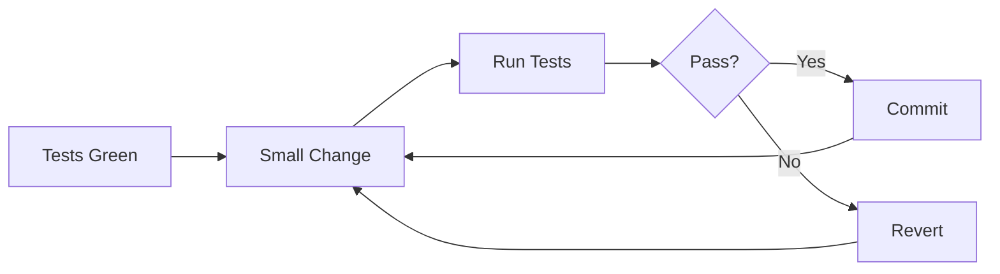

# Code Quality Review

Code quality analysis patterns. Ejemplos adaptables a cualquier stack. Patterns son language-agnostic.

## When to Use

- General code review before merge
- Identifying code smells and anti-patterns
- Checking SOLID principle violations
- Measuring code complexity
- Finding duplicated code
- Refactoring planning / technical debt assessment
- Extracting functions or classes from large code blocks
- Applying SOLID principles to improve architecture
- Reducing cyclomatic complexity via safe refactoring
- Preparing code for testing

## Severity Levels

| Level | Definition | Examples |
|-------|------------|----------|
| Critical | Code is broken or will fail | Unreachable code, infinite loops, null dereference |
| High | Significant maintainability issue | God class, complexity > 15, duplicate code blocks |
| Medium | Noticeable code smell | Long methods, magic numbers, deep nesting |
| Low | Minor improvement opportunity | Naming, comments, organization |

## Review Process

1. **Scan** - Read through changed files, note structure and size
2. **Checklist** - Run through review checklist items (see reference)
3. **Red Flags** - Check for high-severity patterns
4. **Complexity** - Measure cyclomatic/cognitive complexity of key functions
5. **SOLID** - Check for principle violations
6. **Anti-Patterns** - Identify known anti-patterns
7. **Report** - Output findings using review template

## Reference Files

Load these on-demand for detailed guidance.

| Topic | File | Contents |
|-------|------|----------|
| Checklist | `${CLAUDE_SKILL_DIR}/references/review-checklist.md` | Naming, functions, classes, files, error handling, types |
| Red Flags | `${CLAUDE_SKILL_DIR}/references/red-flags.md` | Detection patterns table with severity |
| Common Issues | `${CLAUDE_SKILL_DIR}/references/common-issues.md` | 9 code smell patterns with before/after + fix patterns |
| SOLID | `${CLAUDE_SKILL_DIR}/references/solid-violations.md` | 5 SOLID violations with fixes |
| Complexity | `${CLAUDE_SKILL_DIR}/references/complexity-metrics.md` | Cyclomatic + cognitive complexity |
| Anti-Patterns | `${CLAUDE_SKILL_DIR}/references/anti-patterns-reference.md` | Anti-patterns table with detection |
| Extract Function | `${CLAUDE_SKILL_DIR}/references/extract-function.md` | Extract Calculation + Extract Conditional patterns |
| Extract Class | `${CLAUDE_SKILL_DIR}/references/extract-class.md` | Data cohesion + Extract Service patterns |
| Refactoring Process | `${CLAUDE_SKILL_DIR}/references/refactoring-process.md` | Safety-first flow, characterization tests, anti-patterns |
| Output Template | `${CLAUDE_SKILL_DIR}/templates/review-template.md` | Review output format |

## Quick Thresholds

| Metric | OK | Warning | Fail |
|--------|-----|---------|------|
| Function lines | < 20 | 20-30 | > 30 |
| Class lines | < 150 | 150-200 | > 200 |
| File lines | < 300 | 300-400 | > 400 |
| Cyclomatic | < 6 | 6-10 | > 10 |
| Parameters | < 4 | 4-5 | > 5 |
| Nesting depth | < 3 | 3-4 | > 4 |

## Output Format (Summary)

```markdown
## Code Quality Review: [Component]

### Code Smells
- **[Smell]**: `function()` — Location, severity, fix

### SOLID Violations
- **[Principle]**: Description — Location, fix

### Complexity Analysis
| Function | Cyclomatic | Cognitive | Lines | Status |

### Metrics Summary
| Metric | Value | Threshold | Status |

### Passed Checks
- [x] / [ ] checklist items
```

For the full template with all sections, load `${CLAUDE_SKILL_DIR}/templates/review-template.md`.

## Refactoring Patterns

Safe refactoring techniques absorbed from the refactoring-patterns skill.

### Safety-First Process



| Principle | Rule |
|-----------|------|
| Atomic | One change at a time |
| Reversible | Can undo immediately |
| Tested | All tests pass after each change |
| Behavioral | Same inputs, same outputs |

### When to Refactor (Decision Criteria)

| Trigger | Pattern | Reference |
|---------|---------|-----------|
| Function > 20 lines | Extract Function | `${CLAUDE_SKILL_DIR}/references/extract-function.md` |
| Comment explains "what it does" | Extract Function | `${CLAUDE_SKILL_DIR}/references/extract-function.md` |
| Complex nested conditionals | Extract Conditional | `${CLAUDE_SKILL_DIR}/references/extract-function.md` |
| Functions share same data | Extract Class | `${CLAUDE_SKILL_DIR}/references/extract-class.md` |
| Handler > 30 lines | Extract Service | `${CLAUDE_SKILL_DIR}/references/extract-class.md` |
| SRP violation | Apply SOLID | `${CLAUDE_SKILL_DIR}/references/solid-violations.md` |
| > 4 parameters | Parameter Object | `${CLAUDE_SKILL_DIR}/references/common-issues.md` |
| Primitives for domain concepts | Value Object | `${CLAUDE_SKILL_DIR}/references/common-issues.md` |

### Refactoring Anti-Patterns

| WRONG | CORRECT |
|-------|---------|
| Big bang refactor | Small incremental changes |
| Refactor + feature in same commit | Separate commits |
| Refactor without tests | Add characterization tests first |
| Over-abstract first occurrence | Rule of 3: abstract on repetition |
| Premature optimization | Clarity first, optimize if needed |

### Checklists

| Phase | File |
|-------|------|
| Before starting | `${CLAUDE_SKILL_DIR}/checklists/pre-refactoring.md` |
| After completing | `${CLAUDE_SKILL_DIR}/checklists/post-refactoring.md` |

---

**Version**: 3.0
**Spec**: SPEC-020
**For**: reviewer, builder agents
**Patterns**: Language-agnostic
