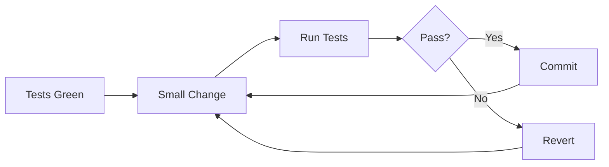

# Refactoring Process

## Safety-First Flow



## Before Starting

1. Ensure tests exist and pass
2. Commit current state to version control
3. Create a feature branch for the refactoring work

## During Refactoring

| Step | Action | Verify |
|------|--------|--------|
| 1 | Identify target code smell | Document the smell |
| 2 | Write test if missing | Test passes |
| 3 | Make ONE small change | Code compiles |
| 4 | Run tests | All green |
| 5 | Commit with message | Version controlled |
| 6 | Repeat 2-5 | Until complete |

## After Completion

1. Run full test suite
2. Review changes (diff against main branch)
3. Squash if many small commits
4. Create PR for review

## Characterization Tests

Write before refactoring to capture existing behavior:

```pseudocode
// Write before refactoring to capture existing behavior
test "processOrder returns same result with same input":
    input = createTestOrder()
    result = processOrder(input)
    // Snapshot the behavior
    expect(result).toMatchSnapshot()

// After refactoring, same test should pass
test "OrderService.createOrder returns same result with same input":
    input = createTestOrder()
    result = orderService.createOrder(input)
    // Same snapshot should match
    expect(result).toMatchSnapshot()
```

## Anti-Patterns

| WRONG | CORRECT |
|-------|---------|
| Big bang refactor (change everything at once) | Small incremental changes with tests between |
| Refactor + add features in same commit | Separate commits: refactor, then feature |
| Refactor without existing tests | Add characterization tests first |
| Over-abstract on first occurrence | Rule of 3: abstract when pattern repeats |
| Premature optimization | Refactor for clarity first, optimize if needed |
| Rename without search/replace all | Use IDE rename refactoring tool |
| Delete "unused" code without checking | Search for dynamic usage, tests first |
| Change function signature without updating callers | Update all call sites atomically |
